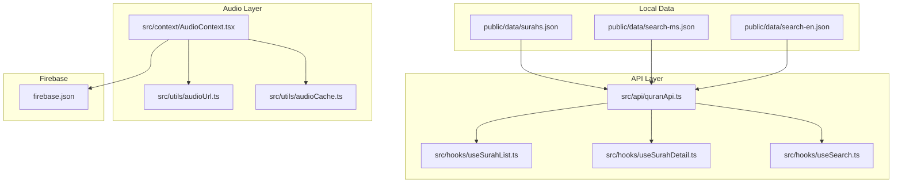
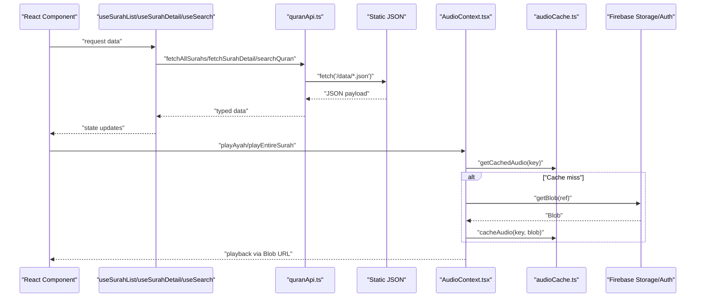
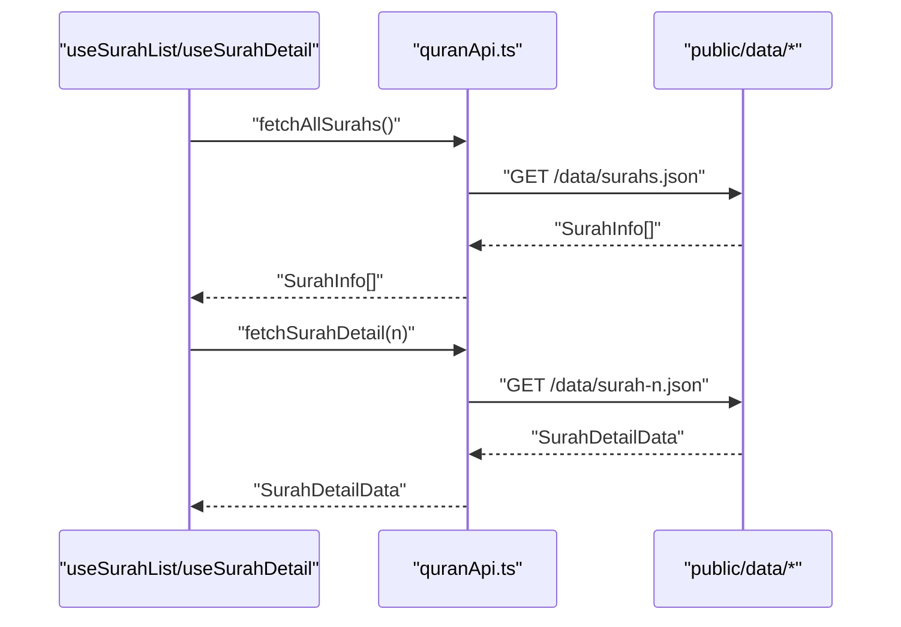
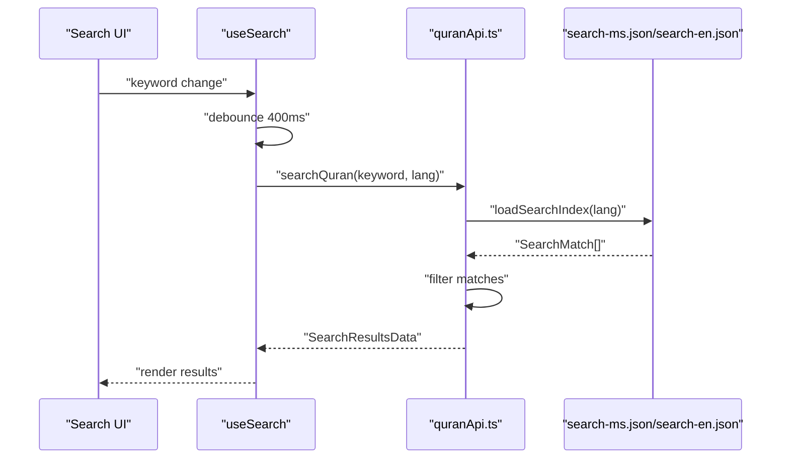
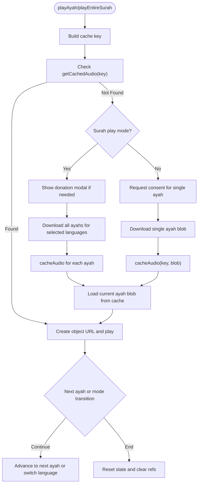
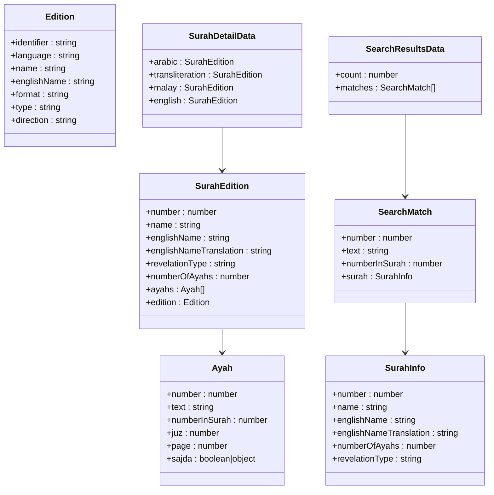
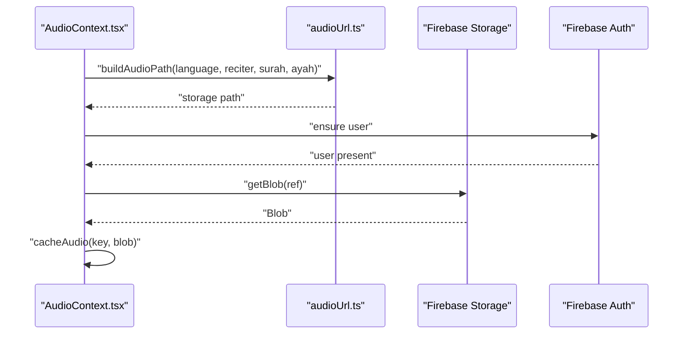
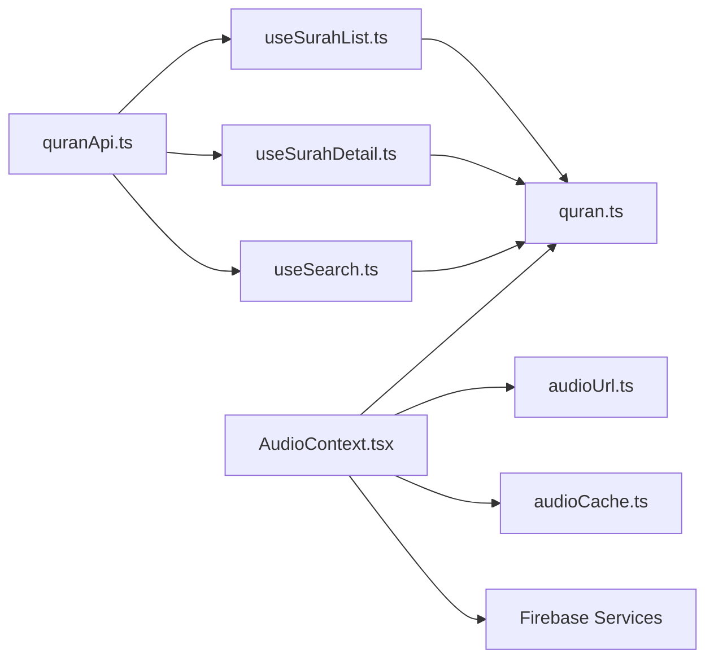

# API Integration & Data Layer

<cite>
**Referenced Files in This Document**
- [quranApi.ts](file://src/api/quranApi.ts)
- [audioCache.ts](file://src/utils/audioCache.ts)
- [audioUrl.ts](file://src/utils/audioUrl.ts)
- [AudioContext.tsx](file://src/context/AudioContext.tsx)
- [useSearch.ts](file://src/hooks/useSearch.ts)
- [useSurahList.ts](file://src/hooks/useSurahList.ts)
- [useSurahDetail.ts](file://src/hooks/useSurahDetail.ts)
- [quran.ts](file://src/types/quran.ts)
- [firebase.ts](file://src/types/firebase.ts)
- [surahs.json](file://public/data/surahs.json)
- [firebase.json](file://firebase.json)
</cite>

## Table of Contents
1. [Introduction](#introduction)
2. [Project Structure](#project-structure)
3. [Core Components](#core-components)
4. [Architecture Overview](#architecture-overview)
5. [Detailed Component Analysis](#detailed-component-analysis)
6. [Dependency Analysis](#dependency-analysis)
7. [Performance Considerations](#performance-considerations)
8. [Troubleshooting Guide](#troubleshooting-guide)
9. [Conclusion](#conclusion)
10. [Appendices](#appendices)

## Introduction
This document describes the Quran Reader’s API integration and data layer, focusing on local data fetching, client-side search, offline-first audio caching, and progressive enhancement strategies. It explains how the application loads Surah metadata and details from static JSON resources, performs client-side search against prebuilt indices, and integrates Firebase Storage for audio delivery with IndexedDB-backed caching. It also documents the audio playback orchestration, consent flows, and offline-first behavior, along with error handling, retry considerations, and practical integration patterns with Firebase services.

## Project Structure
The data layer is organized around:
- API module for local data and client-side search
- Hooks for surfacing data to React components
- Utilities for audio caching and URL building
- Context for audio playback orchestration and offline-first behavior
- Static JSON datasets under public/data
- Firebase configuration and rules for Firestore and Storage

**Diagram sources**
- [quranApi.ts:1-51](file://src/api/quranApi.ts#L1-L51)
- [useSurahList.ts:1-47](file://src/hooks/useSurahList.ts#L1-L47)
- [useSurahDetail.ts:1-37](file://src/hooks/useSurahDetail.ts#L1-L37)
- [useSearch.ts:1-37](file://src/hooks/useSearch.ts#L1-L37)
- [AudioContext.tsx:1-396](file://src/context/AudioContext.tsx#L1-L396)
- [audioUrl.ts:1-37](file://src/utils/audioUrl.ts#L1-L37)
- [audioCache.ts:1-153](file://src/utils/audioCache.ts#L1-L153)
- [surahs.json:1-1](file://public/data/surahs.json#L1-L1)
- [firebase.json:1-10](file://firebase.json#L1-L10)

**Section sources**
- [quranApi.ts:1-51](file://src/api/quranApi.ts#L1-L51)
- [useSurahList.ts:1-47](file://src/hooks/useSurahList.ts#L1-L47)
- [useSurahDetail.ts:1-37](file://src/hooks/useSurahDetail.ts#L1-L37)
- [useSearch.ts:1-37](file://src/hooks/useSearch.ts#L1-L37)
- [AudioContext.tsx:1-396](file://src/context/AudioContext.tsx#L1-L396)
- [audioUrl.ts:1-37](file://src/utils/audioUrl.ts#L1-L37)
- [audioCache.ts:1-153](file://src/utils/audioCache.ts#L1-L153)
- [surahs.json:1-1](file://public/data/surahs.json#L1-L1)
- [firebase.json:1-10](file://firebase.json#L1-L10)

## Core Components
- Local data APIs: fetch Surah lists and details from static JSON
- Client-side search: load prebuilt indices and filter matches
- Audio playback context: orchestrate Firebase Storage retrieval, IndexedDB caching, and playback
- React hooks: encapsulate data loading, caching, filtering, and search debouncing
- Types: define data contracts for Surahs, Ayahs, Editions, Search results, and Firebase entities

Key responsibilities:
- quranApi.ts: fetchAllSurahs, fetchSurahDetail, searchQuran
- AudioContext.tsx: playAyah, playEntireSurah, pause/resume/stop, state transitions, consent and download flows
- audioCache.ts: IndexedDB-backed cache for audio blobs
- audioUrl.ts: build Firebase Storage paths and legacy URLs
- useSurahList.ts, useSurahDetail.ts, useSearch.ts: surface data to components with loading/error states

**Section sources**
- [quranApi.ts:1-51](file://src/api/quranApi.ts#L1-L51)
- [AudioContext.tsx:1-396](file://src/context/AudioContext.tsx#L1-L396)
- [audioCache.ts:1-153](file://src/utils/audioCache.ts#L1-L153)
- [audioUrl.ts:1-37](file://src/utils/audioUrl.ts#L1-L37)
- [useSurahList.ts:1-47](file://src/hooks/useSurahList.ts#L1-L47)
- [useSurahDetail.ts:1-37](file://src/hooks/useSurahDetail.ts#L1-L37)
- [useSearch.ts:1-37](file://src/hooks/useSearch.ts#L1-L37)
- [quran.ts:1-64](file://src/types/quran.ts#L1-L64)
- [firebase.ts:1-20](file://src/types/firebase.ts#L1-L20)

## Architecture Overview
The system follows an offline-first, progressive enhancement pattern:
- Local-first data: Surah metadata and search indices are served from static JSON via fetch
- Client-side search: prebuilt indices enable fast, responsive queries without server round-trips
- Audio-first caching: IndexedDB stores downloaded audio blobs; playback prefers cache, falls back to Firebase Storage
- Consent-driven downloads: user consent governs surah-wide or single-ayah downloads; donations prompt optional
- Firebase integration: Storage for audio blobs, Auth for user gating, Firestore for bookmarks/notes

**Diagram sources**
- [quranApi.ts:1-51](file://src/api/quranApi.ts#L1-L51)
- [useSurahList.ts:1-47](file://src/hooks/useSurahList.ts#L1-L47)
- [useSurahDetail.ts:1-37](file://src/hooks/useSurahDetail.ts#L1-L37)
- [useSearch.ts:1-37](file://src/hooks/useSearch.ts#L1-L37)
- [AudioContext.tsx:1-396](file://src/context/AudioContext.tsx#L1-L396)
- [audioCache.ts:1-153](file://src/utils/audioCache.ts#L1-L153)
- [audioUrl.ts:1-37](file://src/utils/audioUrl.ts#L1-L37)

## Detailed Component Analysis

### Local Data Fetching (Surah List and Details)
- fetchAllSurahs: retrieves the complete Surah catalog from a static JSON resource and validates response readiness
- fetchSurahDetail: retrieves a specific Surah’s details by number from a static JSON resource
- Both functions throw on non-OK responses, enabling downstream error handling in hooks

**Diagram sources**
- [quranApi.ts:4-14](file://src/api/quranApi.ts#L4-L14)
- [surahs.json:1-1](file://public/data/surahs.json#L1-L1)

**Section sources**
- [quranApi.ts:4-14](file://src/api/quranApi.ts#L4-L14)
- [useSurahList.ts:8-31](file://src/hooks/useSurahList.ts#L8-L31)
- [useSurahDetail.ts:5-33](file://src/hooks/useSurahDetail.ts#L5-L33)
- [surahs.json:1-1](file://public/data/surahs.json#L1-L1)

### Client-Side Search API
- Preloaded indices: ms and en indices are loaded once and memoized
- Debounced search: useSearch introduces a delay to reduce network churn
- Filtering: case-insensitive substring match over indexed text
- Results: typed SearchResultsData with count and matches

**Diagram sources**
- [useSearch.ts:6-33](file://src/hooks/useSearch.ts#L6-L33)
- [quranApi.ts:16-50](file://src/api/quranApi.ts#L16-L50)

**Section sources**
- [quranApi.ts:16-50](file://src/api/quranApi.ts#L16-L50)
- [useSearch.ts:1-37](file://src/hooks/useSearch.ts#L1-L37)

### Audio Playback Orchestration and Offline-First Caching
- Cache-first playback: build cache key from language/reciter/Surah/ayah; fetch blob from IndexedDB
- Consent and download: request consent for single ayah; for surah play mode, optionally show donation modal and download entire surah
- Firebase Storage: construct path and fetch blob; cache immediately
- Playback: create object URL from blob; handle events for end/pause/error; support Arabic-to-Malay alternation modes
- State management: track status, current ayah, reciter, recitation mode, and active language

**Diagram sources**
- [AudioContext.tsx:68-305](file://src/context/AudioContext.tsx#L68-L305)
- [audioCache.ts:30-68](file://src/utils/audioCache.ts#L30-L68)
- [audioUrl.ts:13-36](file://src/utils/audioUrl.ts#L13-L36)

**Section sources**
- [AudioContext.tsx:68-305](file://src/context/AudioContext.tsx#L68-L305)
- [audioCache.ts:1-153](file://src/utils/audioCache.ts#L1-L153)
- [audioUrl.ts:1-37](file://src/utils/audioUrl.ts#L1-L37)

### Data Models and Contracts
- SurahInfo: minimal Surah metadata for listing
- Ayah: per-Ayah details including number, text, page, and Sajda info
- Edition and SurahEdition: edition metadata plus Ayah array
- SurahDetailData: container for multiple editions of a Surah
- SearchMatch and SearchResultsData: client-side search results
- ApiResponse: generic envelope for API responses

**Diagram sources**
- [quran.ts:1-64](file://src/types/quran.ts#L1-L64)

**Section sources**
- [quran.ts:1-64](file://src/types/quran.ts#L1-L64)

### Firebase Integration Patterns
- Storage path construction: buildAudioPath composes language/reciter/Surah/ayah into a Firebase Storage path
- Legacy URL builder: buildAudioUrl creates public media URLs (retained for compatibility)
- Auth gating: audio downloads require signed-in users in multiple flows
- Firestore entities: BookmarkData and NoteData define document shapes and ID conventions

**Diagram sources**
- [AudioContext.tsx:108-122](file://src/context/AudioContext.tsx#L108-L122)
- [audioUrl.ts:13-22](file://src/utils/audioUrl.ts#L13-L22)

**Section sources**
- [audioUrl.ts:1-37](file://src/utils/audioUrl.ts#L1-L37)
- [firebase.json:6-9](file://firebase.json#L6-L9)
- [firebase.ts:1-20](file://src/types/firebase.ts#L1-L20)

## Dependency Analysis
- quranApi.ts depends on static JSON resources and exposes typed fetchers
- useSurahList.ts and useSurahDetail.ts depend on quranApi.ts and manage caching and filtering
- useSearch.ts depends on quranApi.ts and applies debouncing
- AudioContext.tsx orchestrates audioUrl.ts, audioCache.ts, and Firebase Storage/Auth
- Types define contracts consumed across the app

**Diagram sources**
- [quranApi.ts:1-51](file://src/api/quranApi.ts#L1-L51)
- [useSurahList.ts:1-47](file://src/hooks/useSurahList.ts#L1-L47)
- [useSurahDetail.ts:1-37](file://src/hooks/useSurahDetail.ts#L1-L37)
- [useSearch.ts:1-37](file://src/hooks/useSearch.ts#L1-L37)
- [AudioContext.tsx:1-396](file://src/context/AudioContext.tsx#L1-L396)
- [audioUrl.ts:1-37](file://src/utils/audioUrl.ts#L1-L37)
- [audioCache.ts:1-153](file://src/utils/audioCache.ts#L1-L153)
- [quran.ts:1-64](file://src/types/quran.ts#L1-L64)

**Section sources**
- [quranApi.ts:1-51](file://src/api/quranApi.ts#L1-L51)
- [AudioContext.tsx:1-396](file://src/context/AudioContext.tsx#L1-L396)
- [audioCache.ts:1-153](file://src/utils/audioCache.ts#L1-L153)
- [audioUrl.ts:1-37](file://src/utils/audioUrl.ts#L1-L37)
- [useSurahList.ts:1-47](file://src/hooks/useSurahList.ts#L1-L47)
- [useSurahDetail.ts:1-37](file://src/hooks/useSurahDetail.ts#L1-L37)
- [useSearch.ts:1-37](file://src/hooks/useSearch.ts#L1-L37)
- [quran.ts:1-64](file://src/types/quran.ts#L1-L64)

## Performance Considerations
- Static JSON: eliminates server latency for Surah catalogs and search indices; ensure gzip compression at CDN/proxy level
- Client-side search: preloading indices reduces repeated fetches; consider lazy-loading indices by language on demand
- Debounced search: 400ms debounce balances responsiveness with reduced work
- IndexedDB caching: minimize cache misses by prefetching surahs during donation modal flow; batch downloads for surah play mode
- Blob URL lifecycle: revoke object URLs on unmount or when replacing to prevent memory leaks
- Event handler cleanup: clear audio event handlers before reassigning to avoid stale closures
- Progressive enhancement: UI remains usable without audio; fallbacks for unsupported features

[No sources needed since this section provides general guidance]

## Troubleshooting Guide
Common issues and remedies:
- Surah list fails to load
  - Verify static JSON availability and CORS/no-cache headers
  - Inspect thrown errors from fetchAllSurahs
- Surah detail missing
  - Confirm filename pattern for per-Surah JSON
  - Validate response readiness and JSON shape
- Search returns no results
  - Ensure indices are loaded for requested language
  - Check case-insensitive matching and query normalization
- Audio fails to play
  - Confirm user is signed in for downloads
  - Check cache presence and IndexedDB health
  - Review error messages for “failed to play” or “network unavailable”
- Cache size and cleanup
  - Use cache inspection utilities to monitor growth
  - Provide manual cache clearing when needed

**Section sources**
- [quranApi.ts:4-14](file://src/api/quranApi.ts#L4-L14)
- [useSurahList.ts:18-30](file://src/hooks/useSurahList.ts#L18-L30)
- [useSurahDetail.ts:16-28](file://src/hooks/useSurahDetail.ts#L16-L28)
- [useSearch.ts:18-29](file://src/hooks/useSearch.ts#L18-L29)
- [AudioContext.tsx:216-229](file://src/context/AudioContext.tsx#L216-L229)
- [audioCache.ts:73-103](file://src/utils/audioCache.ts#L73-L103)

## Conclusion
The Quran Reader’s data layer emphasizes local-first loading, client-side search, and offline-first audio playback. By combining static JSON resources, IndexedDB caching, and Firebase Storage with thoughtful consent flows, the system achieves responsiveness, reliability, and progressive enhancement. The typed contracts and modular hooks simplify integration and maintenance across components.

[No sources needed since this section summarizes without analyzing specific files]

## Appendices

### API Surface Summary
- Surah Catalog
  - Method: fetchAllSurahs
  - Endpoint: GET /data/surahs.json
  - Returns: SurahInfo[]
  - Errors: throws on non-OK response
- Surah Detail
  - Method: fetchSurahDetail(surahNumber)
  - Endpoint: GET /data/surah-{number}.json
  - Returns: SurahDetailData
  - Errors: throws on non-OK response
- Client-Side Search
  - Method: searchQuran(keyword, lang)
  - Indices: /data/search-ms.json, /data/search-en.json
  - Returns: SearchResultsData
  - Behavior: memoized index loading, debounced invocation via useSearch

**Section sources**
- [quranApi.ts:4-50](file://src/api/quranApi.ts#L4-L50)
- [useSearch.ts:6-33](file://src/hooks/useSearch.ts#L6-L33)

### Audio Caching and Playback Flow
- Cache key: {language}/{reciterId}/{surah}/{ayah}
- Operations: cacheAudio, getCachedAudio, isAudioCached, getCacheSize, clearCache, deleteCachedAudio, getCachedKeys
- Playback: prefer cache; otherwise fetch from Firebase Storage; create object URL; handle events; support surah-wide downloads and language alternation

**Section sources**
- [audioCache.ts:1-153](file://src/utils/audioCache.ts#L1-L153)
- [AudioContext.tsx:68-305](file://src/context/AudioContext.tsx#L68-L305)
- [audioUrl.ts:13-36](file://src/utils/audioUrl.ts#L13-L36)