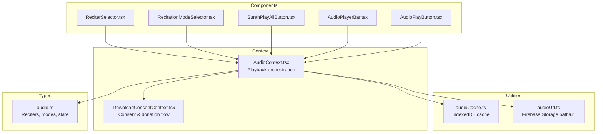
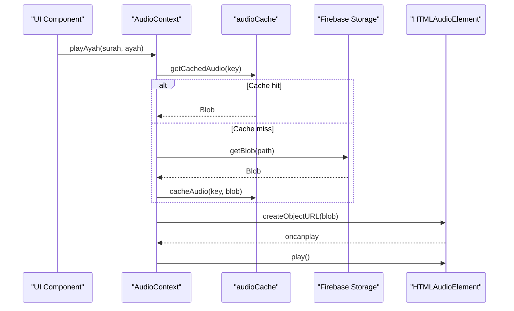
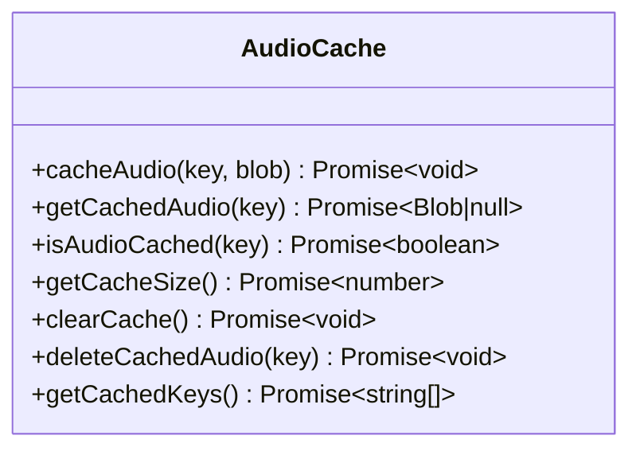
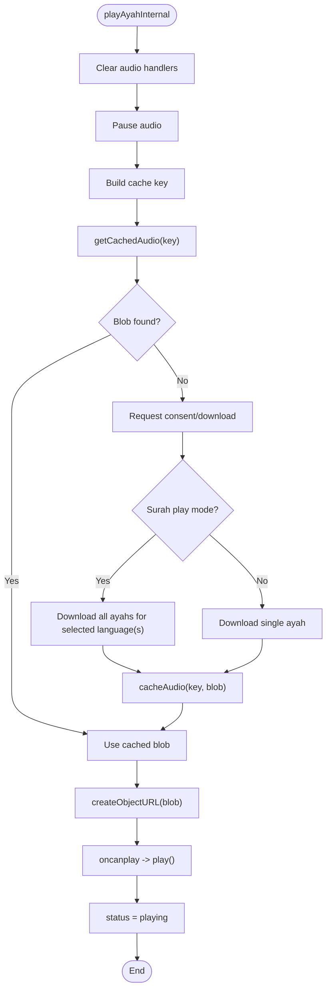
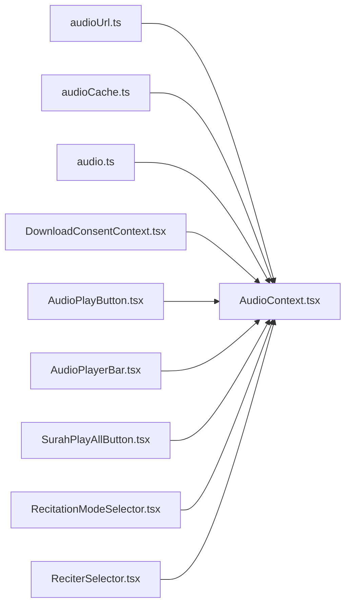

# Audio Caching System

<cite>
**Referenced Files in This Document**
- [audioCache.ts](file://src/utils/audioCache.ts)
- [audioUrl.ts](file://src/utils/audioUrl.ts)
- [AudioContext.tsx](file://src/context/AudioContext.tsx)
- [audio.ts](file://src/types/audio.ts)
- [AudioPlayButton.tsx](file://src/components/AudioPlayButton.tsx)
- [AudioPlayerBar.tsx](file://src/components/AudioPlayerBar.tsx)
- [SurahPlayAllButton.tsx](file://src/components/SurahPlayAllButton.tsx)
- [DownloadConsentContext.tsx](file://src/context/DownloadConsentContext.tsx)
- [RecitationModeSelector.tsx](file://src/components/RecitationModeSelector.tsx)
- [ReciterSelector.tsx](file://src/components/ReciterSelector.tsx)
</cite>

## Table of Contents
1. [Introduction](#introduction)
2. [Project Structure](#project-structure)
3. [Core Components](#core-components)
4. [Architecture Overview](#architecture-overview)
5. [Detailed Component Analysis](#detailed-component-analysis)
6. [Dependency Analysis](#dependency-analysis)
7. [Performance Considerations](#performance-considerations)
8. [Troubleshooting Guide](#troubleshooting-guide)
9. [Conclusion](#conclusion)

## Introduction
This document explains the audio caching and URL management system used by the Quran application. It covers how audio files are stored locally using IndexedDB, how Firebase Storage URLs are generated, and how the system integrates with the browser's AudioContext for seamless playback. It also documents caching strategies for different audio qualities and reciters, cache hit/miss scenarios, storage quota management, cleanup procedures, and offline fallback mechanisms.

## Project Structure
The audio system is organized around three primary areas:
- Utility modules for caching and URL construction
- A React context provider that orchestrates playback and caching
- UI components that trigger playback and manage user interactions

**Diagram sources**
- [audioCache.ts:1-153](file://src/utils/audioCache.ts#L1-L153)
- [audioUrl.ts:1-37](file://src/utils/audioUrl.ts#L1-L37)
- [AudioContext.tsx:1-396](file://src/context/AudioContext.tsx#L1-L396)
- [DownloadConsentContext.tsx:1-256](file://src/context/DownloadConsentContext.tsx#L1-L256)
- [AudioPlayButton.tsx:1-69](file://src/components/AudioPlayButton.tsx#L1-L69)
- [AudioPlayerBar.tsx:1-86](file://src/components/AudioPlayerBar.tsx#L1-L86)
- [SurahPlayAllButton.tsx:1-84](file://src/components/SurahPlayAllButton.tsx#L1-L84)
- [RecitationModeSelector.tsx:1-76](file://src/components/RecitationModeSelector.tsx#L1-L76)
- [ReciterSelector.tsx:1-32](file://src/components/ReciterSelector.tsx#L1-L32)
- [audio.ts:1-41](file://src/types/audio.ts#L1-L41)

**Section sources**
- [audioCache.ts:1-153](file://src/utils/audioCache.ts#L1-L153)
- [audioUrl.ts:1-37](file://src/utils/audioUrl.ts#L1-L37)
- [AudioContext.tsx:1-396](file://src/context/AudioContext.tsx#L1-L396)
- [audio.ts:1-41](file://src/types/audio.ts#L1-L41)

## Core Components
- audioCache utility: Provides IndexedDB-backed caching for audio blobs with operations for saving, retrieving, checking, clearing, deleting, and enumerating cached entries.
- audioUrl utility: Generates Firebase Storage paths and legacy public URLs for audio resources.
- AudioContext provider: Manages playback lifecycle, cache checks, consent flows, surah-wide downloads, and transitions between reciters and languages.
- UI components: Trigger playback actions and reflect playback state.
- Types: Define reciters, recitation modes, and audio state.

**Section sources**
- [audioCache.ts:1-153](file://src/utils/audioCache.ts#L1-L153)
- [audioUrl.ts:1-37](file://src/utils/audioUrl.ts#L1-L37)
- [AudioContext.tsx:1-396](file://src/context/AudioContext.tsx#L1-L396)
- [audio.ts:1-41](file://src/types/audio.ts#L1-L41)

## Architecture Overview
The system follows a layered architecture:
- UI triggers playback actions
- AudioContext coordinates cache checks and downloads
- Firebase Storage supplies audio blobs when needed
- IndexedDB stores blobs for offline reuse
- AudioContext creates object URLs and plays via HTMLAudioElement
- Consent and donation flows gate downloads for surah-wide playback

**Diagram sources**
- [AudioContext.tsx:68-305](file://src/context/AudioContext.tsx#L68-L305)
- [audioCache.ts:30-60](file://src/utils/audioCache.ts#L30-L60)
- [audioUrl.ts:13-36](file://src/utils/audioUrl.ts#L13-L36)

## Detailed Component Analysis

### Audio Cache Utility (IndexedDB)
The cache utility encapsulates IndexedDB operations for storing audio blobs keyed by a composite identifier. It exposes:
- cacheAudio(key, blob): Store a blob under a key
- getCachedAudio(key): Retrieve a blob or null if missing
- isAudioCached(key): Boolean presence check
- getCacheSize(): Compute total cache size in bytes
- clearCache(): Remove all cached entries
- deleteCachedAudio(key): Remove a specific entry
- getCachedKeys(): Enumerate all cached keys

Key design characteristics:
- Uses a single object store named "audio-files"
- Keys are strings derived from language, reciter id, surah, and ayah
- Asynchronous IndexedDB transactions with explicit error handling
- Size calculation iterates over keys and sums blob sizes

**Diagram sources**
- [audioCache.ts:30-152](file://src/utils/audioCache.ts#L30-L152)

**Section sources**
- [audioCache.ts:1-153](file://src/utils/audioCache.ts#L1-L153)

### Audio URL Utility (Firebase Storage)
The URL utility constructs Firebase Storage paths for audio files and legacy public URLs. It defines:
- buildAudioPath(language, reciterId, surahNumber, ayahNumberInSurah): Builds the storage path
- buildAudioUrl(language, reciterId, surahNumber, ayahNumberInSurah): Legacy public URL builder

Storage structure:
- audio/arabic/{reciterId}/{surahPad}{ayahPad}.mp3
- audio/malay/{reciterId}/{surahPad}{ayahPad}.mp3

These paths are used to reference audio files in Firebase Storage.

**Section sources**
- [audioUrl.ts:1-37](file://src/utils/audioUrl.ts#L1-L37)

### AudioContext Provider (Playback Orchestration)
The AudioContext provider manages the entire playback lifecycle:
- State management: status, current ayah, reciter, surah mode, total ayahs, error messages, recitation mode, active language
- Playback functions: playAyah, playAyahWithReciter, pause, resume, stop, playEntireSurah, setReciter, isPlayingAyah
- Cache integration: checks cache before downloading, caches downloaded blobs
- Consent and donation flow: prompts for consent and optionally shows a donation modal before downloading
- Surah-wide playback: supports sequential Arabic-to-Malay transitions and single-language modes

Key behaviors:
- Cache key composition: language/reciterId/surah/ayah
- Cache-first strategy: attempts to load from cache; falls back to Firebase Storage
- Surah mode: pre-downloads all ayahs for the chosen language(s) and then plays sequentially
- Mode switching: Arabic-first, Malay-first, or Arabic-then-Malay transitions
- Offline-friendly: uses object URLs from cached blobs

**Diagram sources**
- [AudioContext.tsx:68-305](file://src/context/AudioContext.tsx#L68-L305)
- [audioCache.ts:30-60](file://src/utils/audioCache.ts#L30-L60)

**Section sources**
- [AudioContext.tsx:1-396](file://src/context/AudioContext.tsx#L1-L396)

### UI Components Integration
- AudioPlayButton: Triggers play/pause/resume for a specific ayah; requires user authentication
- AudioPlayerBar: Displays current ayah, status, controls, and reciter selector; shows language badge in Arabic-then-Malay mode
- SurahPlayAllButton: Initiates surah-wide playback with recitation mode selection
- RecitationModeSelector: Allows choosing Arabic-only, Malay-only, or Arabic-then-Malay modes
- ReciterSelector: Switches between available reciters

These components rely on the AudioContext for playback state and actions.

**Section sources**
- [AudioPlayButton.tsx:1-69](file://src/components/AudioPlayButton.tsx#L1-L69)
- [AudioPlayerBar.tsx:1-86](file://src/components/AudioPlayerBar.tsx#L1-L86)
- [SurahPlayAllButton.tsx:1-84](file://src/components/SurahPlayAllButton.tsx#L1-L84)
- [RecitationModeSelector.tsx:1-76](file://src/components/RecitationModeSelector.tsx#L1-L76)
- [ReciterSelector.tsx:1-32](file://src/components/ReciterSelector.tsx#L1-L32)

### Consent and Donation Flow
The DownloadConsentContext manages user consent for downloading audio:
- hasConsented(surahNumber): Checks local storage for prior consent
- requestConsent(surahNumber, options): Opens a modal to accept or decline; supports "entire surah" option
- showDonationModal(onClose): Displays a donation modal before proceeding with surah downloads

Behavior:
- Surah mode bypasses the consent modal and immediately shows the donation modal
- Consent is persisted in local storage for the surah
- Donation modal appears when downloading entire surahs or in surah mode

**Section sources**
- [DownloadConsentContext.tsx:1-256](file://src/context/DownloadConsentContext.tsx#L1-L256)

### Types and Configuration
The audio types define:
- Reciters: available reciters with id, name, bitrate, and language
- RecitationMode: 'arabic', 'malay', or 'arabic-then-malay'
- AudioState: playback state and metadata
- PlayingAyah: identifies the currently playing ayah

These types inform the UI and context about available reciters and playback modes.

**Section sources**
- [audio.ts:1-41](file://src/types/audio.ts#L1-L41)

## Dependency Analysis
The system exhibits clear separation of concerns:
- Utilities depend on browser APIs (IndexedDB, Firebase Storage)
- Context depends on utilities and types
- Components depend on the context and types
- Consent context is injected alongside the audio context

**Diagram sources**
- [AudioContext.tsx:11-14](file://src/context/AudioContext.tsx#L11-L14)
- [audioCache.ts:1-10](file://src/utils/audioCache.ts#L1-L10)
- [audioUrl.ts:1-1](file://src/utils/audioUrl.ts#L1-L1)
- [audio.ts:9-41](file://src/types/audio.ts#L9-L41)
- [DownloadConsentContext.tsx:1-14](file://src/context/DownloadConsentContext.tsx#L1-L14)

**Section sources**
- [AudioContext.tsx:1-396](file://src/context/AudioContext.tsx#L1-L396)
- [audioCache.ts:1-153](file://src/utils/audioCache.ts#L1-L153)
- [audioUrl.ts:1-37](file://src/utils/audioUrl.ts#L1-L37)
- [audio.ts:1-41](file://src/types/audio.ts#L1-L41)
- [DownloadConsentContext.tsx:1-256](file://src/context/DownloadConsentContext.tsx#L1-L256)

## Performance Considerations
- Cache-first strategy minimizes network usage after the first playthrough
- Surah-wide downloads pre-fetch all ayahs for the chosen language(s), enabling smooth sequential playback
- Object URL creation avoids repeated network requests during playback
- Size estimation helps users understand storage impact; typical per-ayah size is small
- IndexedDB operations are asynchronous; ensure UI remains responsive by avoiding long synchronous tasks

[No sources needed since this section provides general guidance]

## Troubleshooting Guide
Common issues and resolutions:
- Cache misses: Verify cache key composition and that the blob was successfully cached
- Permission errors: Ensure user is authenticated before downloading; surah mode requires authentication
- Network failures: AudioContext sets an error status and displays a message; retry after connectivity improves
- Surah mode not starting: Confirm that consent was granted and that the donation modal was acknowledged
- Language transitions: In Arabic-then-Malay mode, ensure the next ayah is available in the target language

Operational checks:
- Use getCachedKeys() to enumerate stored entries
- Use getCacheSize() to monitor total cache usage
- Use clearCache() to reset the cache when needed
- Use deleteCachedAudio(key) to remove a specific entry

**Section sources**
- [AudioContext.tsx:104-199](file://src/context/AudioContext.tsx#L104-L199)
- [audioCache.ts:73-133](file://src/utils/audioCache.ts#L73-L133)

## Conclusion
The audio caching and URL management system provides a robust, offline-friendly playback experience. By combining IndexedDB caching, Firebase Storage integration, and thoughtful consent flows, it enables zero-bandwidth playback after the first download while respecting user preferences and resource constraints. The modular design allows for easy extension to additional reciters, qualities, and languages.