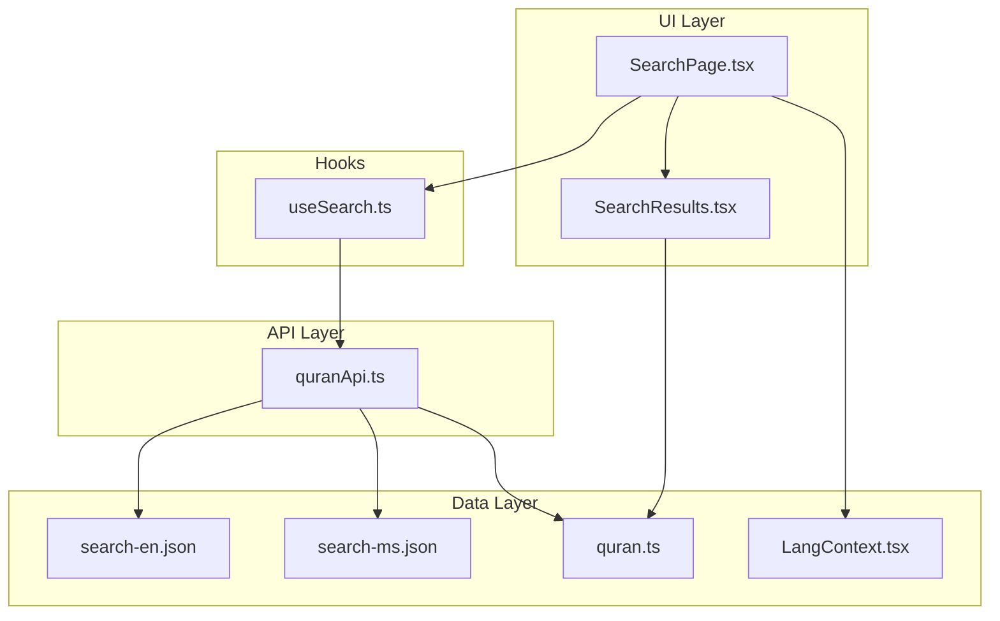
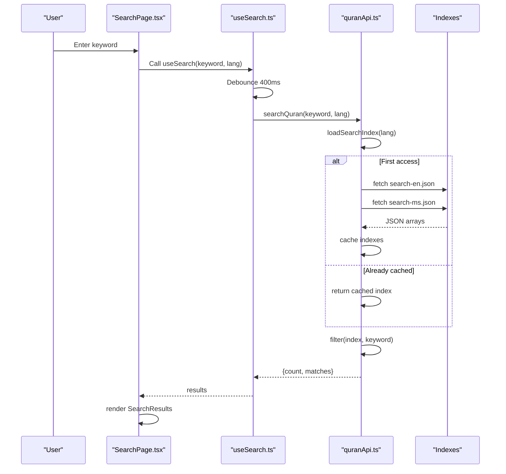
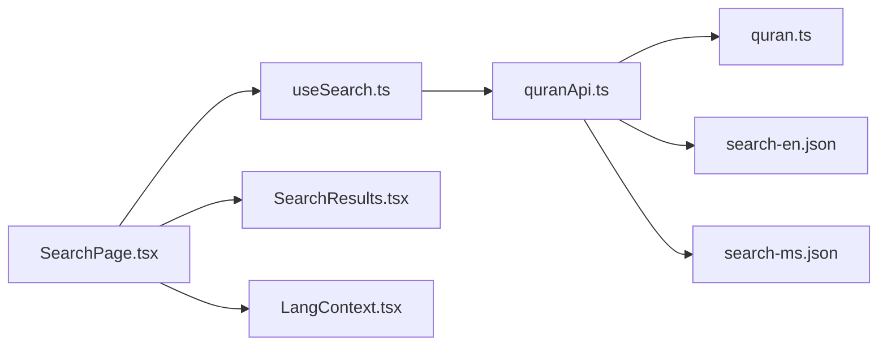

# Client-Side Search API

<cite>
**Referenced Files in This Document**
- [useSearch.ts](file://src/hooks/useSearch.ts)
- [quranApi.ts](file://src/api/quranApi.ts)
- [SearchResults.tsx](file://src/components/SearchResults.tsx)
- [SearchPage.tsx](file://src/pages/SearchPage.tsx)
- [LangContext.tsx](file://src/context/LangContext.tsx)
- [quran.ts](file://src/types/quran.ts)
- [search-en.json](file://dist/data/search-en.json)
- [search-ms.json](file://dist/data/search-ms.json)
- [package.json](file://package.json)
</cite>

## Table of Contents
1. [Introduction](#introduction)
2. [Project Structure](#project-structure)
3. [Core Components](#core-components)
4. [Architecture Overview](#architecture-overview)
5. [Detailed Component Analysis](#detailed-component-analysis)
6. [Dependency Analysis](#dependency-analysis)
7. [Performance Considerations](#performance-considerations)
8. [Troubleshooting Guide](#troubleshooting-guide)
9. [Conclusion](#conclusion)

## Introduction
This document provides comprehensive technical documentation for the client-side search functionality of the Quran application. It explains how search indexes are loaded and cached, how the search algorithm works, how results are structured, and how the UI renders matches. It also covers memory management strategies, concurrent loading for multi-language support, and practical guidance for extending or optimizing the search experience.

## Project Structure
The search feature spans several layers:
- UI pages and components handle user input and render results
- Hooks orchestrate asynchronous search requests with debouncing
- API module manages index loading, caching, and search execution
- Types define the shape of search results and matches
- Prebuilt JSON indexes provide the searchable corpus

**Diagram sources**
- [SearchPage.tsx:1-47](file://src/pages/SearchPage.tsx#L1-L47)
- [useSearch.ts:1-37](file://src/hooks/useSearch.ts#L1-L37)
- [quranApi.ts:16-50](file://src/api/quranApi.ts#L16-L50)
- [LangContext.tsx:1-32](file://src/context/LangContext.tsx#L1-L32)
- [quran.ts:47-57](file://src/types/quran.ts#L47-L57)

**Section sources**
- [SearchPage.tsx:1-47](file://src/pages/SearchPage.tsx#L1-L47)
- [useSearch.ts:1-37](file://src/hooks/useSearch.ts#L1-L37)
- [quranApi.ts:16-50](file://src/api/quranApi.ts#L16-L50)
- [LangContext.tsx:1-32](file://src/context/LangContext.tsx#L1-L32)
- [quran.ts:47-57](file://src/types/quran.ts#L47-L57)

## Core Components
- Search hook: Debounces user input, triggers search, and manages loading/error states
- Search API: Loads and caches language-specific indexes, executes filter-based search
- Results renderer: Highlights matches and navigates to relevant Quran verses
- Types: Defines SearchMatch and SearchResultsData structures

Key responsibilities:
- Debounce user input to avoid excessive network calls
- Concurrently load both Malay and English indexes on first access
- Cache indexes in memory for subsequent searches
- Perform case-insensitive substring matching on text content
- Render highlighted matches with navigation to specific verses

**Section sources**
- [useSearch.ts:6-36](file://src/hooks/useSearch.ts#L6-L36)
- [quranApi.ts:17-41](file://src/api/quranApi.ts#L17-L41)
- [SearchResults.tsx:4-17](file://src/components/SearchResults.tsx#L4-L17)
- [quran.ts:47-57](file://src/types/quran.ts#L47-L57)

## Architecture Overview
The search architecture follows a client-side indexing pattern:
- Indexes are prebuilt JSON files containing searchable entries
- On first search, both indexes are fetched concurrently and cached
- Subsequent searches reuse cached indexes
- Search runs locally using array filtering and string matching

**Diagram sources**
- [useSearch.ts:11-33](file://src/hooks/useSearch.ts#L11-L33)
- [quranApi.ts:21-41](file://src/api/quranApi.ts#L21-L41)
- [quranApi.ts:43-49](file://src/api/quranApi.ts#L43-L49)

## Detailed Component Analysis

### Hook: useSearch
Responsibilities:
- Debounces search input for 400ms to reduce unnecessary requests
- Clears results when input is empty
- Calls the API to execute search
- Manages loading and error states

Behavior highlights:
- Triggers search only when keyword is non-empty
- Uses a timeout to delay execution until user pauses typing
- Catches errors and surfaces user-friendly messages

**Section sources**
- [useSearch.ts:6-36](file://src/hooks/useSearch.ts#L6-L36)

### API: quranApi
Responsibilities:
- Load and cache search indexes for Malay and English
- Execute search by filtering the appropriate index
- Provide type-safe search results

Index loading strategy:
- Maintains separate caches for Malay and English indexes
- Tracks a single in-progress loading promise to avoid duplicate fetches
- Concurrently loads both indexes on first access using Promise.all
- Returns cached indexes on subsequent accesses

Search algorithm:
- Converts keyword to lowercase
- Filters index entries where text contains the keyword (case-insensitive)
- Returns structured results with count and matches

Memory management:
- Stores indexes in module-level variables
- Reuses cached indexes across searches
- No explicit eviction policy; relies on browser memory limits

**Section sources**
- [quranApi.ts:17-41](file://src/api/quranApi.ts#L17-L41)
- [quranApi.ts:43-49](file://src/api/quranApi.ts#L43-L49)

### Results Renderer: SearchResults
Responsibilities:
- Renders a list of matches with highlighting
- Provides navigation to the specific verse
- Handles empty-state messaging

Highlighting logic:
- Builds a regex from the keyword (escaped special characters)
- Splits text by the regex and wraps matches in highlight markup
- Preserves original text for non-matching segments

Rendering details:
- Each match links to the corresponding surah and verse
- Displays surah name and verse number
- Shows highlighted text excerpt

**Section sources**
- [SearchResults.tsx:4-17](file://src/components/SearchResults.tsx#L4-L17)
- [SearchResults.tsx:19-54](file://src/components/SearchResults.tsx#L19-L54)

### Page: SearchPage
Responsibilities:
- Reads the query parameter from the URL
- Determines current language from context
- Renders loading spinner, error messages, or results
- Displays result count and empty state messaging

Integration points:
- Uses useSearch hook to manage state
- Uses LangContext to determine language
- Uses SearchResults component for rendering

**Section sources**
- [SearchPage.tsx:7-46](file://src/pages/SearchPage.tsx#L7-L46)

### Types: SearchMatch and SearchResultsData
Structure definitions:
- SearchMatch: identifies a matched text with metadata (number, text, numberInSurah, surah)
- SearchResultsData: aggregates count and matches for rendering

Usage:
- Returned by searchQuran
- Consumed by SearchResults component

**Section sources**
- [quran.ts:47-57](file://src/types/quran.ts#L47-L57)

### Language Context: LangContext
Responsibilities:
- Manages current language state (Malay or English)
- Persists language preference to local storage
- Provides language-aware components

Integration:
- Used by SearchPage to pass language to search hook
- Enables multi-language search support

**Section sources**
- [LangContext.tsx:3-31](file://src/context/LangContext.tsx#L3-L31)

## Dependency Analysis
The search feature exhibits low coupling and clear separation of concerns:
- UI depends on hooks for state management
- Hooks depend on API for search execution
- API depends on data files and types
- Types are shared across API and components

**Diagram sources**
- [SearchPage.tsx:1-47](file://src/pages/SearchPage.tsx#L1-L47)
- [useSearch.ts:1-37](file://src/hooks/useSearch.ts#L1-L37)
- [quranApi.ts:16-50](file://src/api/quranApi.ts#L16-L50)
- [quran.ts:47-57](file://src/types/quran.ts#L47-L57)
- [LangContext.tsx:1-32](file://src/context/LangContext.tsx#L1-L32)

**Section sources**
- [SearchPage.tsx:1-47](file://src/pages/SearchPage.tsx#L1-L47)
- [useSearch.ts:1-37](file://src/hooks/useSearch.ts#L1-L37)
- [quranApi.ts:16-50](file://src/api/quranApi.ts#L16-L50)
- [quran.ts:47-57](file://src/types/quran.ts#L47-L57)
- [LangContext.tsx:1-32](file://src/context/LangContext.tsx#L1-L32)

## Performance Considerations
Current implementation characteristics:
- Client-side filtering: O(n) per search where n is the number of entries in the index
- Memory footprint: Two full JSON arrays in memory (Malay and English)
- Network efficiency: Single fetch per language on first access, then zero network calls
- Responsiveness: Debounce reduces redundant searches during typing

Optimization opportunities:
- Index preloading: Load indexes during app initialization to eliminate first-query latency
- Incremental search: Implement incremental filtering with virtualization for large lists
- Trie-based search: Replace substring matching with prefix/Trie-based search for better performance
- Pagination: Introduce pagination to limit DOM nodes and improve responsiveness
- Lazy components: Defer rendering of result items until they are visible
- Compression: Serve compressed JSON to reduce payload size

[No sources needed since this section provides general guidance]

## Troubleshooting Guide
Common issues and resolutions:
- Empty results: Verify keyword length and language selection; ensure indexes are loaded
- Slow search: Confirm debounce is functioning; check for large DOM updates
- Mixed language results: Ensure correct language context is selected
- Memory pressure: Monitor browser memory usage; consider implementing eviction or pagination

Debugging tips:
- Inspect network tab for index fetches and caching behavior
- Log search results count to validate filtering logic
- Verify types align with index structure

**Section sources**
- [useSearch.ts:11-33](file://src/hooks/useSearch.ts#L11-L33)
- [quranApi.ts:21-41](file://src/api/quranApi.ts#L21-L41)

## Conclusion
The client-side search implementation leverages prebuilt JSON indexes, concurrent loading, and simple substring matching to deliver responsive search across Malay and English translations. The modular architecture separates UI, state management, and data access, enabling straightforward extension. For production-scale usage, consider adding pagination, trie-based search, and preloading to further enhance performance and user experience.