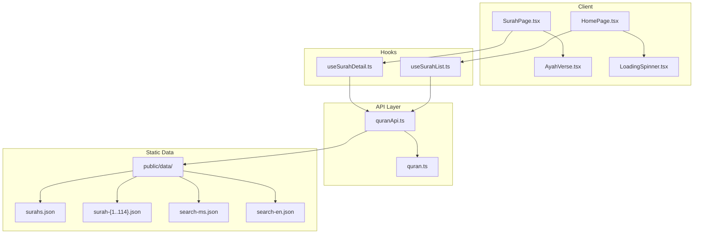
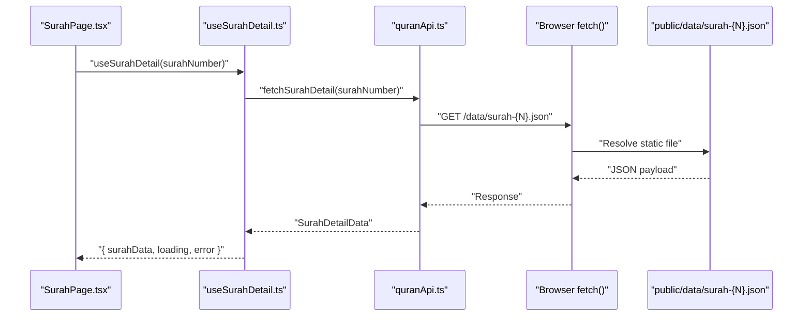
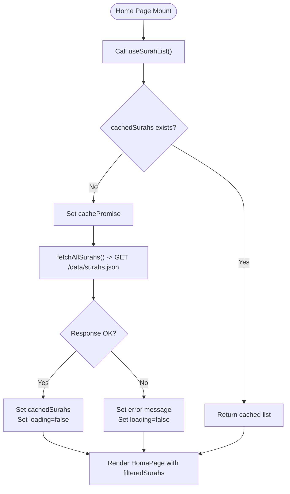
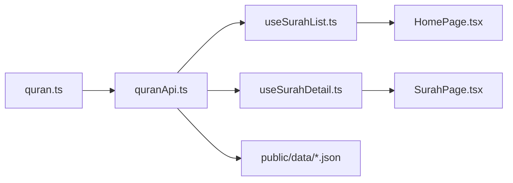

# Local Data API

<cite>
**Referenced Files in This Document**
- [quranApi.ts](file://src/api/quranApi.ts)
- [quran.ts](file://src/types/quran.ts)
- [useSurahList.ts](file://src/hooks/useSurahList.ts)
- [useSurahDetail.ts](file://src/hooks/useSurahDetail.ts)
- [HomePage.tsx](file://src/pages/HomePage.tsx)
- [SurahPage.tsx](file://src/pages/SurahPage.tsx)
- [AyahVerse.tsx](file://src/components/AyahVerse.tsx)
- [LoadingSpinner.tsx](file://src/components/LoadingSpinner.tsx)
- [vite.config.ts](file://vite.config.ts)
- [package.json](file://package.json)
- [README.md](file://README.md)
</cite>

## Table of Contents
1. [Introduction](#introduction)
2. [Project Structure](#project-structure)
3. [Core Components](#core-components)
4. [Architecture Overview](#architecture-overview)
5. [Detailed Component Analysis](#detailed-component-analysis)
6. [Dependency Analysis](#dependency-analysis)
7. [Performance Considerations](#performance-considerations)
8. [Troubleshooting Guide](#troubleshooting-guide)
9. [Conclusion](#conclusion)

## Introduction
This document explains the local data API implementation responsible for loading static JSON data from the public/data directory. It focuses on two primary functions:
- fetchAllSurahs(): loads the complete list of surah metadata
- fetchSurahDetail(surahNumber): loads detailed surah data for a given surah number

It also documents the data contracts defined in the quran types, including SurahInfo and SurahDetailData, the file naming conventions for surah data files, fallback error handling strategies, and practical examples of how components consume these APIs while handling loading states. Finally, it covers the performance implications of static data loading and browser caching strategies.

## Project Structure
The local data API resides under src/api with supporting type definitions in src/types. React hooks in src/hooks encapsulate data fetching and caching logic. Pages in src/pages consume these hooks to render UI and manage loading/error states. The public/data directory stores the static JSON files consumed by the API.

**Diagram sources**
- [quranApi.ts:1-51](file://src/api/quranApi.ts#L1-L51)
- [quran.ts:1-64](file://src/types/quran.ts#L1-L64)
- [useSurahList.ts:1-47](file://src/hooks/useSurahList.ts#L1-L47)
- [useSurahDetail.ts:1-37](file://src/hooks/useSurahDetail.ts#L1-L37)
- [HomePage.tsx:1-44](file://src/pages/HomePage.tsx#L1-L44)
- [SurahPage.tsx:1-120](file://src/pages/SurahPage.tsx#L1-L120)
- [AyahVerse.tsx:1-63](file://src/components/AyahVerse.tsx#L1-L63)
- [LoadingSpinner.tsx:1-8](file://src/components/LoadingSpinner.tsx#L1-L8)

**Section sources**
- [README.md:38-66](file://README.md#L38-L66)
- [vite.config.ts:1-8](file://vite.config.ts#L1-L8)

## Core Components
- quranApi.ts
  - Provides fetchAllSurahs() and fetchSurahDetail() functions that perform HTTP requests against /data/* endpoints.
  - Implements a client-side search index loader with lazy initialization and caching.
- quran.ts
  - Defines SurahInfo for surah metadata and SurahDetailData for per-surah editions (Arabic, transliteration, Malay, English).
  - Includes supporting types for Ayah, Edition, SearchMatch, SearchResultsData, and ApiResponse.
- useSurahList.ts
  - Returns a cached list of SurahInfo with loading and error states, and supports filtering.
- useSurahDetail.ts
  - Loads SurahDetailData for a specific surah number with loading and error states.
- HomePage.tsx and SurahPage.tsx
  - Consume the hooks and render LoadingSpinner during loading, display errors, and render lists or details respectively.

**Section sources**
- [quranApi.ts:1-51](file://src/api/quranApi.ts#L1-L51)
- [quran.ts:1-64](file://src/types/quran.ts#L1-L64)
- [useSurahList.ts:1-47](file://src/hooks/useSurahList.ts#L1-L47)
- [useSurahDetail.ts:1-37](file://src/hooks/useSurahDetail.ts#L1-L37)
- [HomePage.tsx:1-44](file://src/pages/HomePage.tsx#L1-L44)
- [SurahPage.tsx:1-120](file://src/pages/SurahPage.tsx#L1-L120)

## Architecture Overview
The local data API follows a straightforward fetch-from-static-data pattern:
- fetchAllSurahs() retrieves surahs.json from /data/surahs.json.
- fetchSurahDetail(surahNumber) retrieves surah-{number}.json from /data/surah-{number}.json.
- The hooks manage caching, loading, and error states for consumers.
- Static data is served from the public/data directory via the Vite dev server and included in the production build.

**Diagram sources**
- [quranApi.ts:10-14](file://src/api/quranApi.ts#L10-L14)
- [useSurahDetail.ts:5-36](file://src/hooks/useSurahDetail.ts#L5-L36)
- [SurahPage.tsx:11-36](file://src/pages/SurahPage.tsx#L11-L36)

## Detailed Component Analysis

### Data Contracts (Types)
Surah metadata and detail contracts are defined as follows:
- SurahInfo: number, name, englishName, englishNameTranslation, numberOfAyahs, revelationType
- Ayah: number, text, numberInSurah, juz, page, sajda
- Edition: identifier, language, name, englishName, format, type, direction
- SurahEdition: number, name, englishName, englishNameTranslation, revelationType, numberOfAyahs, ayahs[], edition
- SurahDetailData: arabic, transliteration, malay, english (each is a SurahEdition)

These contracts ensure consistent data shapes across the application and enable predictable rendering in components.

**Section sources**
- [quran.ts:1-64](file://src/types/quran.ts#L1-L64)

### fetchAllSurahs() Function
Responsibilities:
- Fetches the complete list of surahs from /data/surahs.json.
- Throws an error if the response is not OK.
- Returns a promise resolving to SurahInfo[].

Caching and concurrency:
- The hook useSurahList.ts caches the list globally and prevents duplicate fetches via a cachePromise guard.

Error handling:
- Errors are caught and surfaced to the consumer via the error state.

**Section sources**
- [quranApi.ts:4-8](file://src/api/quranApi.ts#L4-L8)
- [useSurahList.ts:5-31](file://src/hooks/useSurahList.ts#L5-L31)

### fetchSurahDetail(surahNumber) Function
Responsibilities:
- Fetches detailed data for a specific surah from /data/surah-{surahNumber}.json.
- Throws an error if the response is not OK.
- Returns a promise resolving to SurahDetailData.

Caching and cancellation:
- The hook useSurahDetail.ts manages loading and error states and cancels in-flight requests on component unmount to avoid state updates on unmounted components.

**Section sources**
- [quranApi.ts:10-14](file://src/api/quranApi.ts#L10-L14)
- [useSurahDetail.ts:10-33](file://src/hooks/useSurahDetail.ts#L10-L33)

### File Naming Conventions
- surahs.json: list of all surahs (metadata)
- surah-{1..114}.json: per-surah detail files
- search-ms.json and search-en.json: client-side search indexes

These filenames are resolved by the API functions and must exist in the public/data directory.

**Section sources**
- [README.md:61-66](file://README.md#L61-L66)
- [quranApi.ts:5-13](file://src/api/quranApi.ts#L5-L13)

### Consumer Hooks and Components
- useSurahList.ts
  - Initializes cachedSurahs and cachePromise to prevent redundant fetches.
  - Exposes loading, error, and filteredSurahs derived from searchQuery.
- useSurahDetail.ts
  - Resets state on surahNumber change, sets loading, and handles errors.
- HomePage.tsx
  - Renders LoadingSpinner while loading, displays an error message if present, and renders a searchable grid of Surah cards.
- SurahPage.tsx
  - Uses LangContext to select translation (Malay or English), conditionally shows Bismillah, and renders AyahVerse entries.

**Diagram sources**
- [useSurahList.ts:8-31](file://src/hooks/useSurahList.ts#L8-L31)
- [quranApi.ts:4-8](file://src/api/quranApi.ts#L4-L8)
- [HomePage.tsx:5-44](file://src/pages/HomePage.tsx#L5-L44)

**Section sources**
- [useSurahList.ts:1-47](file://src/hooks/useSurahList.ts#L1-L47)
- [useSurahDetail.ts:1-37](file://src/hooks/useSurahDetail.ts#L1-L37)
- [HomePage.tsx:1-44](file://src/pages/HomePage.tsx#L1-L44)
- [SurahPage.tsx:1-120](file://src/pages/SurahPage.tsx#L1-L120)
- [AyahVerse.tsx:1-63](file://src/components/AyahVerse.tsx#L1-L63)
- [LoadingSpinner.tsx:1-8](file://src/components/LoadingSpinner.tsx#L1-L8)

## Dependency Analysis
- API depends on types for compile-time safety and runtime shape validation.
- Hooks depend on API functions to fetch data and maintain internal state.
- Pages depend on hooks for data and UI state.
- Static data is served from public/data and accessed via absolute paths (/data/*).

**Diagram sources**
- [quran.ts:1-64](file://src/types/quran.ts#L1-L64)
- [quranApi.ts:1-51](file://src/api/quranApi.ts#L1-L51)
- [useSurahList.ts:1-47](file://src/hooks/useSurahList.ts#L1-L47)
- [useSurahDetail.ts:1-37](file://src/hooks/useSurahDetail.ts#L1-L37)
- [HomePage.tsx:1-44](file://src/pages/HomePage.tsx#L1-L44)
- [SurahPage.tsx:1-120](file://src/pages/SurahPage.tsx#L1-L120)

**Section sources**
- [quranApi.ts:1-51](file://src/api/quranApi.ts#L1-L51)
- [quran.ts:1-64](file://src/types/quran.ts#L1-L64)

## Performance Considerations
- Static data loading
  - All data is served as static JSON files from public/data, minimizing network overhead and latency compared to dynamic APIs.
  - The browser can leverage built-in caching mechanisms for these files.
- Browser caching strategies
  - The Vite dev server serves static assets with sensible caching headers by default.
  - Production builds include asset hashing and cache-friendly URLs; subsequent visits benefit from HTTP caching.
- Client-side caching in hooks
  - useSurahList.ts caches the surah list globally and avoids duplicate fetches using cachePromise guards.
  - useSurahDetail.ts resets state on surahNumber changes and cancels in-flight requests on unmount to reduce wasted work.
- Rendering efficiency
  - Filtering in useSurahList.ts is performed in-memory on the cached list.
  - SurahPage.tsx renders AyahVerse components efficiently by iterating over ayah arrays aligned by index.

Practical tips:
- Keep JSON files gzipped in production builds for smaller payloads.
- Prefer lazy-loading non-critical routes to reduce initial data consumption.
- Monitor network tab to confirm static files are served from cache after the first load.

**Section sources**
- [useSurahList.ts:5-31](file://src/hooks/useSurahList.ts#L5-L31)
- [useSurahDetail.ts:10-33](file://src/hooks/useSurahDetail.ts#L10-L33)
- [vite.config.ts:1-8](file://vite.config.ts#L1-L8)
- [package.json:6-11](file://package.json#L6-L11)

## Troubleshooting Guide
Common issues and resolutions:
- Data files missing
  - Symptom: fetchAllSurahs() or fetchSurahDetail() throws an error indicating failure to load data.
  - Cause: public/data directory does not contain surahs.json or surah-{N}.json.
  - Resolution: Run the data update script to regenerate files in public/data.
- Incorrect file naming
  - Symptom: 404 errors for /data/surah-{N}.json.
  - Cause: Files named incorrectly or missing expected numbers.
  - Resolution: Ensure files follow the naming convention surah-{1..114}.json.
- CORS or path issues
  - Symptom: Network errors when fetching /data/*.
  - Cause: Misconfiguration of static asset serving.
  - Resolution: Confirm Vite serves public/* correctly; verify absolute paths in API functions.
- Stale or corrupted data
  - Symptom: Unexpected UI behavior or parsing errors.
  - Resolution: Re-run the data update script to refresh public/data files.

Operational commands:
- npm run download-data: downloads fresh data and rebuilds search indexes into public/data.

**Section sources**
- [quranApi.ts:4-14](file://src/api/quranApi.ts#L4-L14)
- [README.md:68-77](file://README.md#L68-L77)
- [package.json:10](file://package.json#L10)

## Conclusion
The local data API provides a robust, offline-first mechanism for loading Quran data from static JSON files. The quranApi.ts functions encapsulate data retrieval with clear error handling, while useSurahList.ts and useSurahDetail.ts manage caching, loading, and error states for consumers. The quran.ts types define strict contracts ensuring reliable rendering across components. By leveraging browser caching and client-side caching in hooks, the application achieves fast, responsive data access suitable for offline usage.