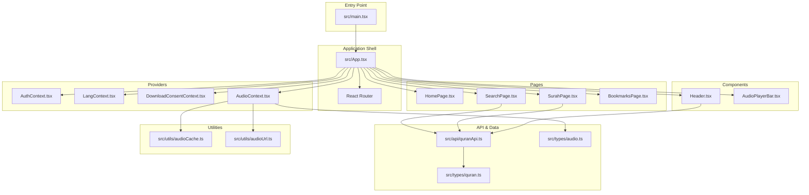
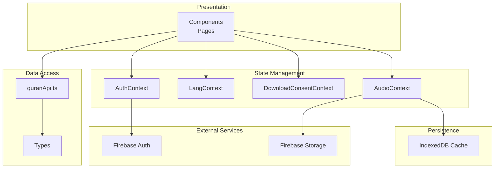
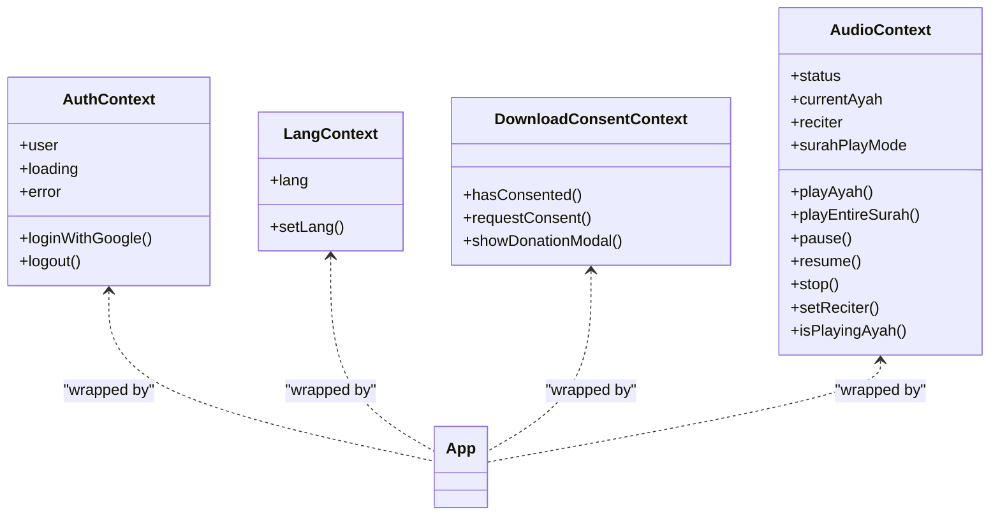
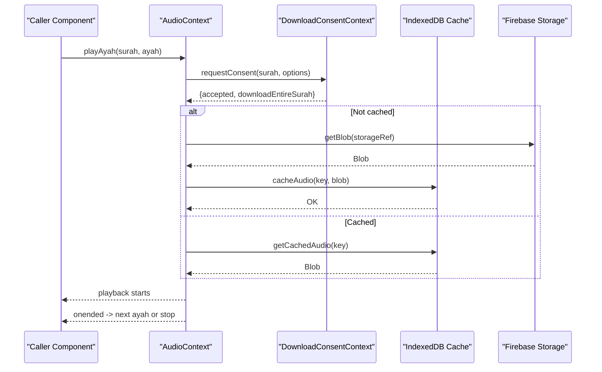
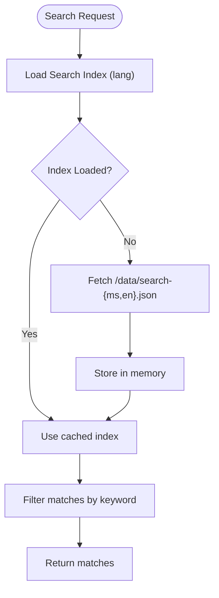
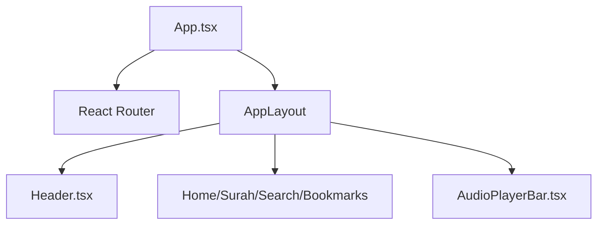
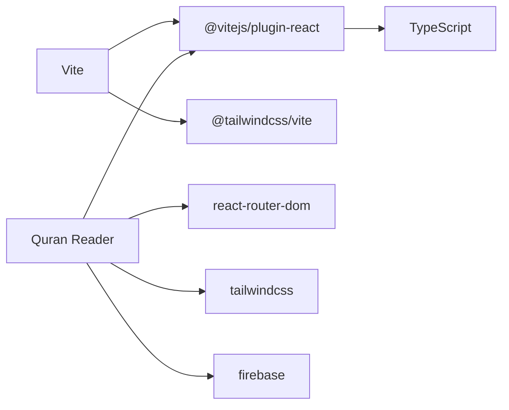

# Architecture & Technology Stack

<cite>
**Referenced Files in This Document**
- [main.tsx](file://src/main.tsx)
- [App.tsx](file://src/App.tsx)
- [vite.config.ts](file://vite.config.ts)
- [package.json](file://package.json)
- [tsconfig.json](file://tsconfig.json)
- [AuthContext.tsx](file://src/context/AuthContext.tsx)
- [AudioContext.tsx](file://src/context/AudioContext.tsx)
- [LangContext.tsx](file://src/context/LangContext.tsx)
- [DownloadConsentContext.tsx](file://src/context/DownloadConsentContext.tsx)
- [Header.tsx](file://src/components/Header.tsx)
- [quranApi.ts](file://src/api/quranApi.ts)
- [audio.ts](file://src/types/audio.ts)
- [quran.ts](file://src/types/quran.ts)
- [audioCache.ts](file://src/utils/audioCache.ts)
- [audioUrl.ts](file://src/utils/audioUrl.ts)
</cite>

## Table of Contents
1. [Introduction](#introduction)
2. [Project Structure](#project-structure)
3. [Core Components](#core-components)
4. [Architecture Overview](#architecture-overview)
5. [Detailed Component Analysis](#detailed-component-analysis)
6. [Dependency Analysis](#dependency-analysis)
7. [Performance Considerations](#performance-considerations)
8. [Troubleshooting Guide](#troubleshooting-guide)
9. [Conclusion](#conclusion)
10. [Appendices](#appendices)

## Introduction
This document describes the architecture and technology stack of the Quran Reader application. It focuses on the high-level design built with React 19 and TypeScript, the Vite build system, and Tailwind CSS styling. The application follows a provider pattern for state management via React Context APIs, organizes components by feature, and integrates Firebase for authentication, storage, and Firestore rules. Cross-cutting concerns include offline-first audio caching using IndexedDB, client-side search with prebuilt indices, and a PWA-capable service worker configuration present in the repository. The document also outlines system boundaries, data flow, performance optimizations, and deployment topology.

## Project Structure
The project is organized around a feature-based layout with clear separation of concerns:
- Entry point initializes providers and renders the root app.
- App composes routing, global providers, and shared UI.
- Feature-specific contexts encapsulate state and side effects.
- Components are grouped by domain (UI, pages, shared).
- Utilities provide reusable logic for audio caching and URLs.
- Types define contracts for data and state.
- API module abstracts data fetching from static JSON and Firebase.

**Diagram sources**
- [main.tsx:1-14](file://src/main.tsx#L1-L14)
- [App.tsx:1-56](file://src/App.tsx#L1-L56)
- [AuthContext.tsx:1-63](file://src/context/AuthContext.tsx#L1-L63)
- [LangContext.tsx:1-32](file://src/context/LangContext.tsx#L1-L32)
- [DownloadConsentContext.tsx:1-256](file://src/context/DownloadConsentContext.tsx#L1-L256)
- [AudioContext.tsx:1-396](file://src/context/AudioContext.tsx#L1-L396)
- [Header.tsx:1-68](file://src/components/Header.tsx#L1-L68)
- [quranApi.ts:1-51](file://src/api/quranApi.ts#L1-L51)
- [audioCache.ts:1-153](file://src/utils/audioCache.ts#L1-L153)
- [audioUrl.ts:1-37](file://src/utils/audioUrl.ts#L1-L37)
- [quran.ts:1-64](file://src/types/quran.ts#L1-L64)
- [audio.ts:1-41](file://src/types/audio.ts#L1-L41)

**Section sources**
- [main.tsx:1-14](file://src/main.tsx#L1-L14)
- [App.tsx:1-56](file://src/App.tsx#L1-L56)

## Core Components
- Provider Pattern: Authentication, language, download consent, and audio state are centralized via dedicated Context providers. Consumers use typed hooks to access state and actions.
- Routing: React Router manages navigation among Home, Surah detail, Search, and Bookmarks pages.
- Shared UI: Header provides language switching, search form submission, and user menu integration.
- Offline Audio Playback: IndexedDB-backed caching stores audio blobs locally after first retrieval, enabling zero-bandwidth playback afterward.
- Client-Side Search: Prebuilt JSON indices enable fast search without backend queries.
- Firebase Integration: Authentication via Google OAuth, storage for audio assets, and Firestore rules for data security.

**Section sources**
- [AuthContext.tsx:1-63](file://src/context/AuthContext.tsx#L1-L63)
- [LangContext.tsx:1-32](file://src/context/LangContext.tsx#L1-L32)
- [DownloadConsentContext.tsx:1-256](file://src/context/DownloadConsentContext.tsx#L1-L256)
- [AudioContext.tsx:1-396](file://src/context/AudioContext.tsx#L1-L396)
- [Header.tsx:1-68](file://src/components/Header.tsx#L1-L68)
- [quranApi.ts:1-51](file://src/api/quranApi.ts#L1-L51)
- [audioCache.ts:1-153](file://src/utils/audioCache.ts#L1-L153)

## Architecture Overview
The system follows a layered architecture:
- Presentation Layer: React components and pages.
- State Management Layer: Context providers manage global state and side effects.
- Data Access Layer: API module handles static JSON data and search; Firebase SDK handles authentication and storage.
- Persistence Layer: IndexedDB caches audio for offline playback.

**Diagram sources**
- [App.tsx:1-56](file://src/App.tsx#L1-L56)
- [AuthContext.tsx:1-63](file://src/context/AuthContext.tsx#L1-L63)
- [LangContext.tsx:1-32](file://src/context/LangContext.tsx#L1-L32)
- [DownloadConsentContext.tsx:1-256](file://src/context/DownloadConsentContext.tsx#L1-L256)
- [AudioContext.tsx:1-396](file://src/context/AudioContext.tsx#L1-L396)
- [quranApi.ts:1-51](file://src/api/quranApi.ts#L1-L51)
- [audioCache.ts:1-153](file://src/utils/audioCache.ts#L1-L153)

## Detailed Component Analysis

### Provider Layer
The provider layer centralizes cross-cutting concerns:
- Authentication: Manages user session state, login/logout, and error propagation.
- Language: Persists language preference and exposes setter.
- Download Consent: Handles user consent for downloading audio and optionally triggers a donation modal.
- Audio: Orchestrates playback lifecycle, surah-mode sequencing, reciter selection, and caching.

**Diagram sources**
- [AuthContext.tsx:1-63](file://src/context/AuthContext.tsx#L1-L63)
- [LangContext.tsx:1-32](file://src/context/LangContext.tsx#L1-L32)
- [DownloadConsentContext.tsx:1-256](file://src/context/DownloadConsentContext.tsx#L1-L256)
- [AudioContext.tsx:1-396](file://src/context/AudioContext.tsx#L1-L396)
- [App.tsx:42-54](file://src/App.tsx#L42-L54)

**Section sources**
- [AuthContext.tsx:1-63](file://src/context/AuthContext.tsx#L1-L63)
- [LangContext.tsx:1-32](file://src/context/LangContext.tsx#L1-L32)
- [DownloadConsentContext.tsx:1-256](file://src/context/DownloadConsentContext.tsx#L1-L256)
- [AudioContext.tsx:1-396](file://src/context/AudioContext.tsx#L1-L396)

### Audio Playback Workflow
The audio playback flow integrates consent, caching, and Firebase storage. It supports single ayah playback, entire surah playback, and recitation mode transitions.

**Diagram sources**
- [AudioContext.tsx:68-305](file://src/context/AudioContext.tsx#L68-L305)
- [DownloadConsentContext.tsx:28-72](file://src/context/DownloadConsentContext.tsx#L28-L72)
- [audioCache.ts:30-60](file://src/utils/audioCache.ts#L30-L60)
- [audioUrl.ts:13-22](file://src/utils/audioUrl.ts#L13-L22)

**Section sources**
- [AudioContext.tsx:68-305](file://src/context/AudioContext.tsx#L68-L305)
- [DownloadConsentContext.tsx:28-72](file://src/context/DownloadConsentContext.tsx#L28-L72)
- [audioCache.ts:30-60](file://src/utils/audioCache.ts#L30-L60)
- [audioUrl.ts:13-22](file://src/utils/audioUrl.ts#L13-L22)

### Search and Data Flow
Client-side search uses prebuilt indices loaded on demand. Surah lists and details are fetched from static JSON resources.

**Diagram sources**
- [quranApi.ts:21-41](file://src/api/quranApi.ts#L21-L41)

**Section sources**
- [quranApi.ts:1-51](file://src/api/quranApi.ts#L1-L51)

### Component Hierarchy and Routing
The application composes providers and routes pages. The header participates in navigation and language switching.

**Diagram sources**
- [App.tsx:22-40](file://src/App.tsx#L22-L40)
- [Header.tsx:1-68](file://src/components/Header.tsx#L1-L68)

**Section sources**
- [App.tsx:1-56](file://src/App.tsx#L1-L56)
- [Header.tsx:1-68](file://src/components/Header.tsx#L1-L68)

## Dependency Analysis
The application relies on modern web technologies and external services:
- React 19 with TypeScript for type-safe UI development.
- Vite for fast builds and dev server with React plugin and Tailwind integration.
- Tailwind CSS for utility-first styling.
- Firebase for authentication and storage.
- React Router for declarative routing.

**Diagram sources**
- [vite.config.ts:1-8](file://vite.config.ts#L1-L8)
- [package.json:12-27](file://package.json#L12-L27)
- [tsconfig.json:1-25](file://tsconfig.json#L1-L25)

**Section sources**
- [vite.config.ts:1-8](file://vite.config.ts#L1-L8)
- [package.json:1-29](file://package.json#L1-L29)
- [tsconfig.json:1-25](file://tsconfig.json#L1-L25)

## Performance Considerations
- IndexedDB caching eliminates repeated downloads and enables offline playback after initial load.
- Lazy index loading reduces initial payload size for search.
- Surah-mode playback sequences ayahs automatically, reducing user interaction overhead.
- Tailwind CSS utility classes minimize CSS bundle size and improve maintainability.
- React 19’s concurrent features and Vite bundling optimize build and runtime performance.

[No sources needed since this section provides general guidance]

## Troubleshooting Guide
Common issues and resolutions:
- Authentication errors: Verify Firebase Auth initialization and network connectivity.
- Audio playback failures: Check IndexedDB availability and quota; ensure consent was granted for downloads.
- Search not returning results: Confirm search indices are present in the public/data directory and accessible at runtime.
- Build-time errors: Ensure TypeScript bundler mode and JSX configuration match Vite’s expectations.

**Section sources**
- [AuthContext.tsx:33-49](file://src/context/AuthContext.tsx#L33-L49)
- [AudioContext.tsx:223-229](file://src/context/AudioContext.tsx#L223-L229)
- [quranApi.ts:21-41](file://src/api/quranApi.ts#L21-L41)

## Conclusion
The Quran Reader application employs a clean, provider-driven architecture with React 19 and TypeScript, supported by Vite and Tailwind CSS. The design emphasizes modularity, offline-first capabilities, and user-centric features like surah-mode playback and consent-based downloads. Firebase integrates seamlessly for authentication and storage, while client-side search and caching deliver responsive experiences. The documented structure and patterns facilitate maintainability and scalability.

[No sources needed since this section summarizes without analyzing specific files]

## Appendices

### Technology Stack Decisions
- React 19 and TypeScript: Strong typing and modern React features for reliable UI development.
- Vite: Fast dev server and optimized builds with minimal configuration.
- Tailwind CSS: Utility-first styling for rapid UI iteration and consistent design.
- Firebase: Integrated authentication and storage for scalable media delivery.
- IndexedDB: Persistent caching for offline audio playback.

**Section sources**
- [package.json:12-27](file://package.json#L12-L27)
- [vite.config.ts:1-8](file://vite.config.ts#L1-L8)
- [tsconfig.json:1-25](file://tsconfig.json#L1-L25)

### System Boundaries and Deployment Topology
- Static assets and data: Hosted under public/data and served by the Vite dev server/build output.
- Service Worker: Present in the repository, enabling PWA capabilities and offline caching strategies.
- Hosting: Deployable to static hosting platforms; Vercel configuration exists for deployment.
- Infrastructure: Firebase Authentication and Storage provide backend services; Firestore rules enforce access control.

**Section sources**
- [quranApi.ts:4-14](file://src/api/quranApi.ts#L4-L14)
- [audioCache.ts:1-25](file://src/utils/audioCache.ts#L1-L25)
- [package.json:6-11](file://package.json#L6-L11)