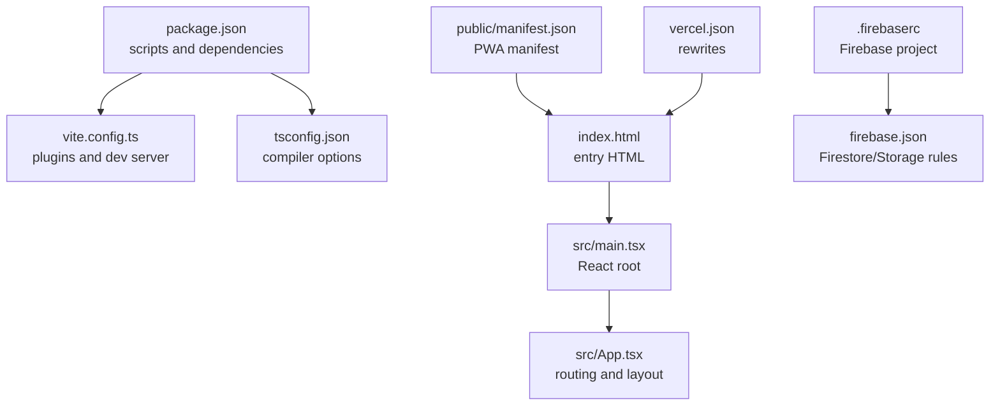
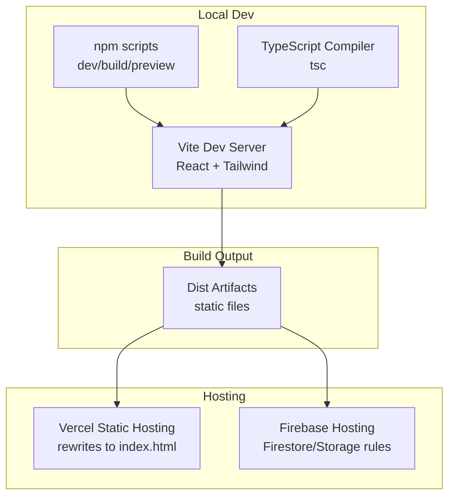
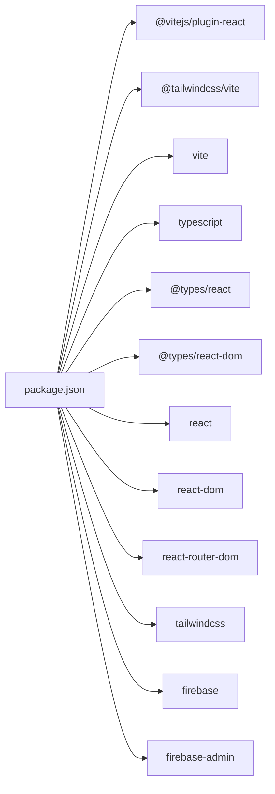

# Build System & Configuration

<cite>
**Referenced Files in This Document**
- [package.json](file://package.json)
- [vite.config.ts](file://vite.config.ts)
- [tsconfig.json](file://tsconfig.json)
- [vercel.json](file://vercel.json)
- [.firebaserc](file://.firebaserc)
- [firebase.json](file://firebase.json)
- [index.html](file://index.html)
- [public/manifest.json](file://public/manifest.json)
- [src/main.tsx](file://src/main.tsx)
- [src/App.tsx](file://src/App.tsx)
- [src/types/firebase.ts](file://src/types/firebase.ts)
- [src/types/quran.ts](file://src/types/quran.ts)
</cite>

## Table of Contents
1. [Introduction](#introduction)
2. [Project Structure](#project-structure)
3. [Core Components](#core-components)
4. [Architecture Overview](#architecture-overview)
5. [Detailed Component Analysis](#detailed-component-analysis)
6. [Dependency Analysis](#dependency-analysis)
7. [Performance Considerations](#performance-considerations)
8. [Troubleshooting Guide](#troubleshooting-guide)
9. [Conclusion](#conclusion)
10. [Appendices](#appendices)

## Introduction
This document explains the build system and configuration for the Quran Reader application. It covers the Vite build setup, TypeScript configuration, development and production workflows, Firebase and Vercel integration, and deployment pipeline. It also includes guidance for optimizing builds, analyzing bundles, and troubleshooting common issues.

## Project Structure
The project follows a conventional React + TypeScript + Vite setup with Tailwind CSS and Firebase integration. Key configuration files and entry points are organized as follows:
- Build and tooling: Vite configuration, TypeScript configuration, package scripts
- Application bootstrap: HTML entry, React root, routing and providers
- Progressive Web App metadata: Web app manifest
- Firebase and Vercel configuration for hosting and rewrites

**Diagram sources**
- [package.json:1-29](file://package.json#L1-L29)
- [vite.config.ts:1-8](file://vite.config.ts#L1-L8)
- [tsconfig.json:1-25](file://tsconfig.json#L1-L25)
- [index.html:1-16](file://index.html#L1-L16)
- [src/main.tsx:1-14](file://src/main.tsx#L1-L14)
- [src/App.tsx:1-56](file://src/App.tsx#L1-L56)
- [public/manifest.json:1-27](file://public/manifest.json#L1-L27)
- [.firebaserc:1-6](file://.firebaserc#L1-L6)
- [firebase.json:1-10](file://firebase.json#L1-L10)
- [vercel.json:1-9](file://vercel.json#L1-L9)

**Section sources**
- [package.json:1-29](file://package.json#L1-L29)
- [vite.config.ts:1-8](file://vite.config.ts#L1-L8)
- [tsconfig.json:1-25](file://tsconfig.json#L1-L25)
- [index.html:1-16](file://index.html#L1-L16)
- [src/main.tsx:1-14](file://src/main.tsx#L1-L14)
- [src/App.tsx:1-56](file://src/App.tsx#L1-L56)
- [public/manifest.json:1-27](file://public/manifest.json#L1-L27)
- [.firebaserc:1-6](file://.firebaserc#L1-L6)
- [firebase.json:1-10](file://firebase.json#L1-L10)
- [vercel.json:1-9](file://vercel.json#L1-L9)

## Core Components
- Vite configuration defines plugins for React Fast Refresh and Tailwind CSS integration. No explicit build or dev server overrides are configured, so defaults apply.
- TypeScript configuration targets modern JavaScript environments, uses bundler module resolution, and enables strict diagnostics suitable for Vite’s dev server and build pipeline.
- Package scripts orchestrate development, type-checking, building, previewing, and data preparation tasks.
- PWA support is enabled via the Web app manifest linked from the HTML entry.

Key implementation references:
- Vite plugins and defaults: [vite.config.ts:5-7](file://vite.config.ts#L5-L7)
- TypeScript compiler options and inclusions: [tsconfig.json:2-24](file://tsconfig.json#L2-L24)
- Scripts and dependencies: [package.json:6-11](file://package.json#L6-L11), [package.json:20-27](file://package.json#L20-L27)

**Section sources**
- [vite.config.ts:1-8](file://vite.config.ts#L1-L8)
- [tsconfig.json:1-25](file://tsconfig.json#L1-L25)
- [package.json:1-29](file://package.json#L1-L29)

## Architecture Overview
The build and deployment pipeline integrates local development, type checking, asset bundling, and static hosting with Vercel and Firebase.

**Diagram sources**
- [package.json:6-11](file://package.json#L6-L11)
- [vite.config.ts:5-7](file://vite.config.ts#L5-L7)
- [tsconfig.json:2-24](file://tsconfig.json#L2-L24)
- [vercel.json:2-7](file://vercel.json#L2-L7)
- [firebase.json:1-10](file://firebase.json#L1-L10)

## Detailed Component Analysis

### Vite Build Configuration
- Plugins: React plugin for component DX and Tailwind CSS integration for utility-first styling.
- Defaults: No explicit build.rollupOptions or server configuration; relies on Vite defaults for dev server and build optimization.
- Asset pipeline: Vite resolves modules per bundler mode and emits no JS during type-check runs.

Recommended additions for production:
- Define explicit build.rollupOptions to customize chunking and external libraries.
- Enable esbuild minification and define process.env.NODE_ENV behavior.
- Configure publicDir and assets strategy for optimal caching.

**Section sources**
- [vite.config.ts:1-8](file://vite.config.ts#L1-L8)

### TypeScript Configuration
- Targets modern JS runtime and module system.
- Uses bundler module resolution and bundler-aware module detection.
- Disables emit and focuses on type-checking in CI or pre-build steps.
- Enforces strict diagnostics for unused locals/parameters and switch coverage.

Best practices:
- Keep noEmit true for dev; ensure build script runs tsc before vite build for dual safety.
- Add path mapping and baseUrl for scalable project growth.

**Section sources**
- [tsconfig.json:1-25](file://tsconfig.json#L1-L25)

### Package Scripts and Workflow
- Development: Runs Vite dev server for fast refresh.
- Type checking: Executes tsc prior to building to catch type errors early.
- Preview: Serves built assets locally to simulate production.
- Data preparation: Downloads data and builds search index via Node scripts.

Operational notes:
- The build script ensures type-safe compilation before bundling.
- The data download script is intended to populate local data and indices; ensure Node runtime compatibility and network access.

**Section sources**
- [package.json:6-11](file://package.json#L6-L11)

### Application Entry and Routing
- index.html links the Web app manifest and loads the module entry.
- src/main.tsx renders the React root inside AuthProvider and mounts App.
- src/App.tsx sets up routing with React Router, layout wrappers, and scroll-to-top behavior.

PWA implications:
- The manifest enables installability and theme color configuration.
- Ensure service worker and caching strategies are considered for offline behavior.

**Section sources**
- [index.html:1-16](file://index.html#L1-L16)
- [src/main.tsx:1-14](file://src/main.tsx#L1-L14)
- [src/App.tsx:1-56](file://src/App.tsx#L1-L56)
- [public/manifest.json:1-27](file://public/manifest.json#L1-L27)

### Firebase Configuration
- Project selection: Default project configured in .firebaserc.
- Firestore and Storage rules and indexes are declared in firebase.json.
- Types for Firestore documents are modeled in src/types/firebase.ts.

Integration pointers:
- Authentication and storage usage should be initialized in the app using the Firebase SDK.
- Ensure environment variables align with Firebase project settings for secure client initialization.

**Section sources**
- [.firebaserc:1-6](file://.firebaserc#L1-L6)
- [firebase.json:1-10](file://firebase.json#L1-L10)
- [src/types/firebase.ts:1-20](file://src/types/firebase.ts#L1-L20)

### Vercel Deployment Configuration
- Rewrites all routes to index.html to support client-side routing.
- Ideal for single-page applications using React Router.

Deployment notes:
- Ensure the build output directory matches Vercel’s expectations.
- Set environment variables for Firebase and any API keys in Vercel’s project settings.

**Section sources**
- [vercel.json:1-9](file://vercel.json#L1-L9)

### Data Types and API Contracts
- Types for Quran data and search results are defined in src/types/quran.ts.
- These types inform API consumption and UI rendering consistency.

Usage guidance:
- Align API responses with these interfaces to maintain type safety.
- Extend interfaces incrementally as new features are introduced.

**Section sources**
- [src/types/quran.ts:1-64](file://src/types/quran.ts#L1-L64)

## Dependency Analysis
The project’s build-time and runtime dependencies are scoped to React, Vite, TypeScript, Tailwind CSS, and Firebase. The dependency graph emphasizes minimal coupling and clear separation of concerns.

**Diagram sources**
- [package.json:12-27](file://package.json#L12-L27)

**Section sources**
- [package.json:1-29](file://package.json#L1-L29)

## Performance Considerations
- Bundle size: Prefer dynamic imports for route-based code splitting and lazy-load heavy components.
- Assets: Place static assets under Vite’s public directory to avoid bundling overhead; leverage Tailwind utilities to minimize custom CSS.
- Minification: Enable esbuild minification in production builds and configure Rollup options for optimal chunking.
- Caching: Use long-term caching for immutable assets; invalidate cache on version bumps.
- Monitoring: Integrate a bundle analyzer to visualize dependencies and optimize tree-shaking.

[No sources needed since this section provides general guidance]

## Troubleshooting Guide
Common build and configuration issues:

- TypeScript errors during build:
  - Cause: Type mismatches or missing types.
  - Fix: Run type checks locally and resolve reported issues; ensure tsc runs before vite build.

- Vite dev server hot reload not working:
  - Cause: Plugin misconfiguration or incorrect module exports.
  - Fix: Verify React and Tailwind plugins are enabled; check component export correctness.

- Client-side routing failures after deploy:
  - Cause: Missing rewrites for SPA.
  - Fix: Confirm Vercel rewrites to index.html are present.

- Firebase initialization errors:
  - Cause: Missing or incorrect environment variables.
  - Fix: Set Firebase config in Vercel environment variables and initialize SDK accordingly.

- PWA manifest issues:
  - Cause: Incorrect paths or missing fields.
  - Fix: Validate manifest.json and ensure index.html references it correctly.

**Section sources**
- [package.json:6-11](file://package.json#L6-L11)
- [vercel.json:2-7](file://vercel.json#L2-L7)
- [index.html:6](file://index.html#L6)
- [public/manifest.json:1-27](file://public/manifest.json#L1-L27)

## Conclusion
The Quran Reader application employs a streamlined build system centered on Vite, TypeScript, and React with Tailwind CSS. The configuration is intentionally minimal, relying on sensible defaults while enabling clear extensibility for production optimization, Firebase integration, and Vercel hosting. Following the recommendations herein will help maintain a robust, performant, and maintainable build pipeline.

## Appendices

### Development vs Production Differences
- Development:
  - Fast refresh via Vite; no minification; source maps enabled.
  - React and Tailwind plugins active in dev.
- Production:
  - TypeScript checked prior to build; esbuild minification; optimized chunking.
  - Environment-specific variables and Firebase SDK initialization.

[No sources needed since this section summarizes differences conceptually]