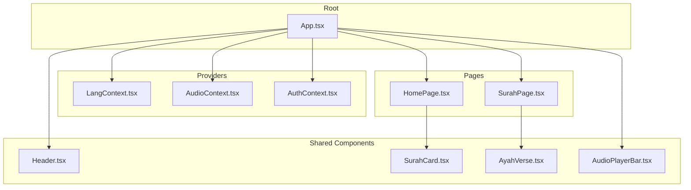
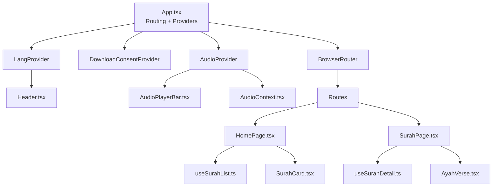
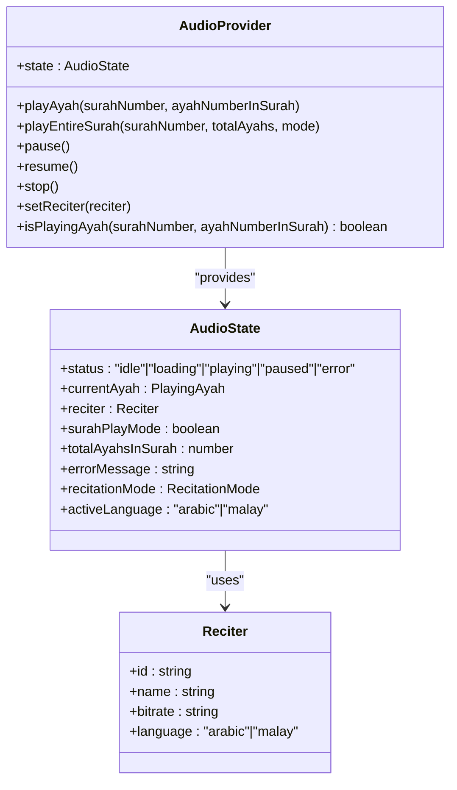
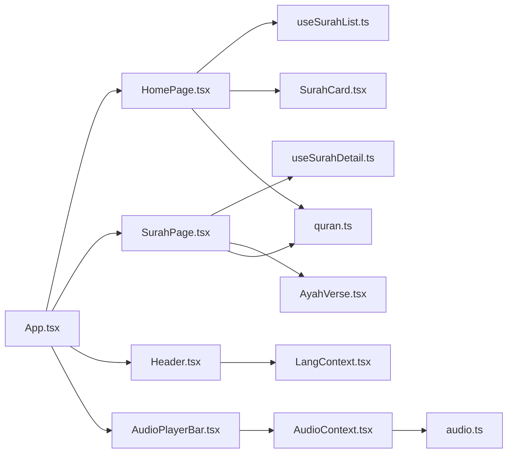

# Component Architecture

<cite>
**Referenced Files in This Document**
- [App.tsx](file://src/App.tsx)
- [Header.tsx](file://src/components/Header.tsx)
- [SurahCard.tsx](file://src/components/SurahCard.tsx)
- [AyahVerse.tsx](file://src/components/AyahVerse.tsx)
- [AudioPlayerBar.tsx](file://src/components/AudioPlayerBar.tsx)
- [HomePage.tsx](file://src/pages/HomePage.tsx)
- [SurahPage.tsx](file://src/pages/SurahPage.tsx)
- [AudioContext.tsx](file://src/context/AudioContext.tsx)
- [AuthContext.tsx](file://src/context/AuthContext.tsx)
- [LangContext.tsx](file://src/context/LangContext.tsx)
- [useSurahList.ts](file://src/hooks/useSurahList.ts)
- [useSurahDetail.ts](file://src/hooks/useSurahDetail.ts)
- [quran.ts](file://src/types/quran.ts)
- [audio.ts](file://src/types/audio.ts)
</cite>

## Table of Contents
1. [Introduction](#introduction)
2. [Project Structure](#project-structure)
3. [Core Components](#core-components)
4. [Architecture Overview](#architecture-overview)
5. [Detailed Component Analysis](#detailed-component-analysis)
6. [Dependency Analysis](#dependency-analysis)
7. [Performance Considerations](#performance-considerations)
8. [Troubleshooting Guide](#troubleshooting-guide)
9. [Conclusion](#conclusion)

## Introduction
This document describes the component architecture of the Quran Reader application. It explains how the React component hierarchy is structured around App.tsx as the root component, how pages, shared components, and contexts organize functionality, and how data and behavior flow across the app. It focuses on composition strategies, avoiding prop drilling, reusability patterns, lifecycle management, event handling, rendering optimization, communication via props and context, and maintainability considerations.

## Project Structure
The project follows a feature-based layout:
- Root routing and global providers are defined in App.tsx.
- Pages live under src/pages and render route-specific views.
- Shared UI components live under src/components and are reusable across pages.
- Global state is managed via React Context providers under src/context.
- Hooks encapsulate data fetching and derived state under src/hooks.
- Types define shared data contracts under src/types.

**Diagram sources**
- [App.tsx:42-55](file://src/App.tsx#L42-L55)
- [LangContext.tsx:12-26](file://src/context/LangContext.tsx#L12-L26)
- [AudioContext.tsx:40-389](file://src/context/AudioContext.tsx#L40-L389)
- [AuthContext.tsx:20-55](file://src/context/AuthContext.tsx#L20-L55)
- [HomePage.tsx:5-43](file://src/pages/HomePage.tsx#L5-L43)
- [SurahPage.tsx:11-119](file://src/pages/SurahPage.tsx#L11-L119)
- [Header.tsx:6-67](file://src/components/Header.tsx#L6-L67)
- [SurahCard.tsx:4-41](file://src/components/SurahCard.tsx#L4-L41)
- [AyahVerse.tsx:14-62](file://src/components/AyahVerse.tsx#L14-L62)
- [AudioPlayerBar.tsx:4-85](file://src/components/AudioPlayerBar.tsx#L4-L85)

**Section sources**
- [App.tsx:1-56](file://src/App.tsx#L1-L56)

## Core Components
This section highlights the primary building blocks and their roles:
- App.tsx orchestrates routing, global providers, and the layout wrapper AppLayout. It also handles scroll-to-top behavior on navigation.
- Header.tsx renders the sticky header with search, user menu, and language toggle.
- SurahCard.tsx displays a single surah item with metadata and links to the SurahPage.
- AyahVerse.tsx renders a single verse with Arabic text, transliteration, translation, and interactive controls (play, bookmark, note).
- AudioPlayerBar.tsx shows the persistent player bar with playback controls and reciter selector.
- HomePage.tsx and SurahPage.tsx are page-level components that compose lists and detail views respectively.
- LangContext.tsx, AudioContext.tsx, and AuthContext.tsx provide global state and actions.

Key composition patterns:
- Provider nesting ensures global state is available to all components.
- Page components delegate data fetching to hooks and present lists or details.
- Reusable components accept typed props and remain presentation-focused.

**Section sources**
- [App.tsx:22-40](file://src/App.tsx#L22-L40)
- [Header.tsx:6-67](file://src/components/Header.tsx#L6-L67)
- [SurahCard.tsx:4-41](file://src/components/SurahCard.tsx#L4-L41)
- [AyahVerse.tsx:14-62](file://src/components/AyahVerse.tsx#L14-L62)
- [AudioPlayerBar.tsx:4-85](file://src/components/AudioPlayerBar.tsx#L4-L85)
- [HomePage.tsx:5-43](file://src/pages/HomePage.tsx#L5-L43)
- [SurahPage.tsx:11-119](file://src/pages/SurahPage.tsx#L11-L119)
- [LangContext.tsx:12-26](file://src/context/LangContext.tsx#L12-L26)
- [AudioContext.tsx:40-389](file://src/context/AudioContext.tsx#L40-L389)
- [AuthContext.tsx:20-55](file://src/context/AuthContext.tsx#L20-L55)

## Architecture Overview
The app uses React Router for navigation and React Context for cross-cutting concerns. Providers wrap the application to supply language, audio playback, and authentication state. Pages render lists or details, while shared components encapsulate UI and interactions.

**Diagram sources**
- [App.tsx:42-55](file://src/App.tsx#L42-L55)
- [App.tsx:30-35](file://src/App.tsx#L30-L35)
- [LangContext.tsx:12-26](file://src/context/LangContext.tsx#L12-L26)
- [AudioContext.tsx:40-389](file://src/context/AudioContext.tsx#L40-L389)
- [AudioPlayerBar.tsx:4-85](file://src/components/AudioPlayerBar.tsx#L4-L85)
- [HomePage.tsx:5-43](file://src/pages/HomePage.tsx#L5-L43)
- [SurahPage.tsx:11-119](file://src/pages/SurahPage.tsx#L11-L119)
- [useSurahList.ts:8-46](file://src/hooks/useSurahList.ts#L8-L46)
- [useSurahDetail.ts:5-36](file://src/hooks/useSurahDetail.ts#L5-L36)
- [SurahCard.tsx:4-41](file://src/components/SurahCard.tsx#L4-L41)
- [AyahVerse.tsx:14-62](file://src/components/AyahVerse.tsx#L14-L62)

## Detailed Component Analysis

### App.tsx and AppLayout
- App.tsx sets up provider hierarchy and wraps routes with BrowserRouter and ScrollToTop.
- AppLayout renders Header, main content area, and AudioPlayerBar, adjusting padding based on audio activity.

Composition strategy:
- Provider nesting centralizes global state.
- Route rendering is declarative and isolated.

Lifecycle and rendering:
- ScrollToTop resets scroll position on pathname change.
- Conditional padding prevents overlap with the fixed player bar.

**Section sources**
- [App.tsx:14-20](file://src/App.tsx#L14-L20)
- [App.tsx:22-40](file://src/App.tsx#L22-L40)
- [App.tsx:42-55](file://src/App.tsx#L42-L55)

### Header.tsx
- Manages local search input state and navigates to search results.
- Integrates language toggle via LangContext.
- Renders UserMenu for authentication-related actions.

Communication:
- Uses useLang for language state.
- Navigates programmatically with useNavigate.

**Section sources**
- [Header.tsx:6-67](file://src/components/Header.tsx#L6-L67)
- [LangContext.tsx:29-31](file://src/context/LangContext.tsx#L29-L31)

### HomePage.tsx
- Uses useSurahList hook to fetch and filter surahs.
- Renders a grid of SurahCard components.
- Handles loading and error states.

Composition:
- Delegates data fetching to useSurahList.
- Filters data client-side using useMemo.

**Section sources**
- [HomePage.tsx:5-43](file://src/pages/HomePage.tsx#L5-L43)
- [useSurahList.ts:8-46](file://src/hooks/useSurahList.ts#L8-L46)
- [SurahCard.tsx:4-41](file://src/components/SurahCard.tsx#L4-L41)

### SurahPage.tsx
- Uses useParams to derive surah number and useSurahDetail to load surah data.
- Switches translation based on LangContext.
- Renders AyahVerse entries and navigation controls.

Composition:
- Composes AyahVerse with three editions (Arabic, transliteration, translation).
- Conditionally renders Bismillah for specific surahs.

**Section sources**
- [SurahPage.tsx:11-119](file://src/pages/SurahPage.tsx#L11-L119)
- [useSurahDetail.ts:5-36](file://src/hooks/useSurahDetail.ts#L5-L36)
- [LangContext.tsx:29-31](file://src/context/LangContext.tsx#L29-L31)
- [AyahVerse.tsx:14-62](file://src/components/AyahVerse.tsx#L14-L62)

### AyahVerse.tsx
- Accepts three Ayah objects (Arabic, transliteration, translation) plus surah number.
- Renders Arabic text (RTL), transliteration, and translation.
- Composes interactive controls: AudioPlayButton, MalayAudioPlaceholder, BookmarkButton, NoteButton.

Communication:
- Passes surah and ayah numbers to child components for context-sensitive actions.

**Section sources**
- [AyahVerse.tsx:14-62](file://src/components/AyahVerse.tsx#L14-L62)

### AudioPlayerBar.tsx
- Consumes AudioContext to display current ayah, status, and recitation mode.
- Provides play/pause/resume/stop controls and integrates ReciterSelector.

Rendering:
- Conditionally renders based on audio status.
- Shows language badge in arabic-then-malay mode.

**Section sources**
- [AudioPlayerBar.tsx:4-85](file://src/components/AudioPlayerBar.tsx#L4-L85)
- [AudioContext.tsx:391-395](file://src/context/AudioContext.tsx#L391-L395)

### Contexts and Hooks

#### AudioContext.tsx
- Manages audio playback state, caching, downloads, and multi-language recitation modes.
- Exposes actions like playAyah, playEntireSurah, pause, resume, stop, and isPlayingAyah.
- Uses refs to avoid stale closures in event handlers.

Patterns:
- Provider pattern with typed context value.
- Memoized callbacks for event-driven logic.
- Integration with Firebase Storage and local caching.

**Diagram sources**
- [AudioContext.tsx:16-395](file://src/context/AudioContext.tsx#L16-L395)
- [audio.ts:23-41](file://src/types/audio.ts#L23-L41)

**Section sources**
- [AudioContext.tsx:40-389](file://src/context/AudioContext.tsx#L40-L389)
- [audio.ts:1-41](file://src/types/audio.ts#L1-L41)

#### LangContext.tsx
- Stores selected language in localStorage and exposes setLang.
- Ensures persistence across sessions.

**Section sources**
- [LangContext.tsx:12-26](file://src/context/LangContext.tsx#L12-L26)

#### AuthContext.tsx
- Manages Firebase authentication state and exposes login/logout actions.
- Provides loading and error states.

**Section sources**
- [AuthContext.tsx:20-55](file://src/context/AuthContext.tsx#L20-L55)

#### Hooks
- useSurahList: Fetches and caches surah list, supports filtering, and manages loading/error states.
- useSurahDetail: Loads surah detail data for a given surah number with cancellation safety.

**Section sources**
- [useSurahList.ts:8-46](file://src/hooks/useSurahList.ts#L8-L46)
- [useSurahDetail.ts:5-36](file://src/hooks/useSurahDetail.ts#L5-L36)

### Types
- quran.ts defines SurahInfo, Ayah, SurahDetailData, and related structures used across pages and components.
- audio.ts defines AudioState, Reciter, RecitationMode, and related audio types.

**Section sources**
- [quran.ts:1-64](file://src/types/quran.ts#L1-L64)
- [audio.ts:1-41](file://src/types/audio.ts#L1-L41)

## Dependency Analysis
The component graph shows clear separation of concerns:
- App.tsx depends on providers and pages.
- Pages depend on hooks and shared components.
- Shared components depend on types and context consumers.
- Contexts encapsulate cross-cutting logic and expose typed APIs.

**Diagram sources**
- [App.tsx:42-55](file://src/App.tsx#L42-L55)
- [HomePage.tsx:5-43](file://src/pages/HomePage.tsx#L5-L43)
- [SurahPage.tsx:11-119](file://src/pages/SurahPage.tsx#L11-L119)
- [useSurahList.ts:8-46](file://src/hooks/useSurahList.ts#L8-L46)
- [useSurahDetail.ts:5-36](file://src/hooks/useSurahDetail.ts#L5-L36)
- [SurahCard.tsx:4-41](file://src/components/SurahCard.tsx#L4-L41)
- [AyahVerse.tsx:14-62](file://src/components/AyahVerse.tsx#L14-L62)
- [Header.tsx:6-67](file://src/components/Header.tsx#L6-L67)
- [AudioPlayerBar.tsx:4-85](file://src/components/AudioPlayerBar.tsx#L4-L85)
- [LangContext.tsx:12-26](file://src/context/LangContext.tsx#L12-L26)
- [AudioContext.tsx:40-389](file://src/context/AudioContext.tsx#L40-L389)
- [audio.ts:1-41](file://src/types/audio.ts#L1-L41)
- [quran.ts:1-64](file://src/types/quran.ts#L1-L64)

**Section sources**
- [App.tsx:42-55](file://src/App.tsx#L42-L55)
- [AudioContext.tsx:40-389](file://src/context/AudioContext.tsx#L40-L389)

## Performance Considerations
- Memoization: useSurahList uses useMemo to prevent unnecessary recomputation during filtering.
- Lazy initialization: AudioContext initializes audio element lazily and clears handlers to avoid leaks.
- Conditional rendering: AudioPlayerBar hides itself when idle; SurahPage conditionally renders Bismillah.
- Refs for stability: AudioContext uses refs to capture current state inside event handlers, preventing stale closure issues.
- Caching: AudioContext integrates local caching and Firebase Storage to reduce network usage and improve responsiveness.

[No sources needed since this section provides general guidance]

## Troubleshooting Guide
Common areas to inspect:
- Audio playback errors: Check AudioContext state transitions and error messages; verify user authentication for downloads.
- Language switching: Confirm LangContext persists selection and updates translations accordingly.
- Navigation: Verify ScrollToTop resets position and that routes match defined paths.
- Authentication: Ensure AuthContext subscriptions are active and login/logout flows are handled.

**Section sources**
- [AudioContext.tsx:223-229](file://src/context/AudioContext.tsx#L223-L229)
- [AudioContext.tsx:294-300](file://src/context/AudioContext.tsx#L294-L300)
- [LangContext.tsx:18-20](file://src/context/LangContext.tsx#L18-L20)
- [App.tsx:14-20](file://src/App.tsx#L14-L20)
- [AuthContext.tsx:25-31](file://src/context/AuthContext.tsx#L25-L31)

## Conclusion
The Quran Reader application employs a clean, layered architecture:
- App.tsx orchestrates routing and providers.
- Pages compose reusable components and rely on hooks for data.
- Contexts encapsulate global concerns (audio, language, auth).
- Strong typing via TypeScript ensures predictable contracts.
This design minimizes prop drilling, improves testability, and supports scalable enhancements.