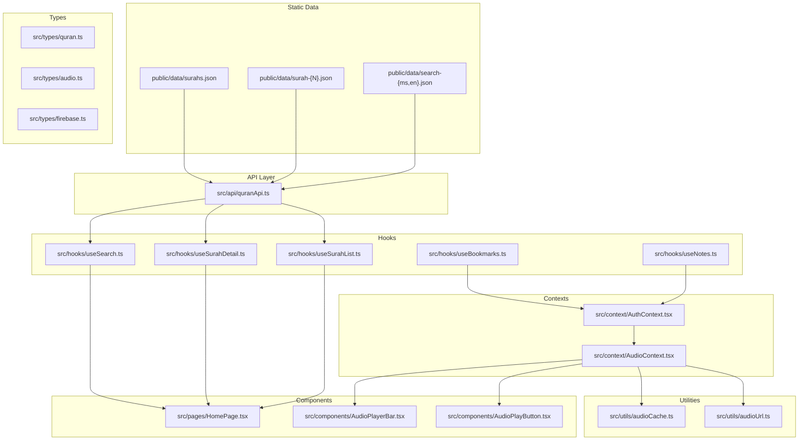
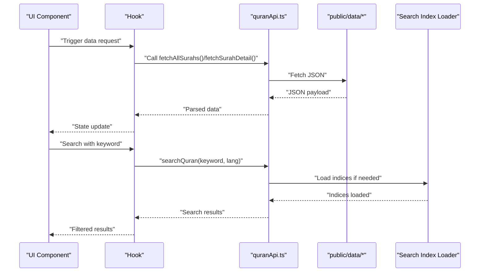
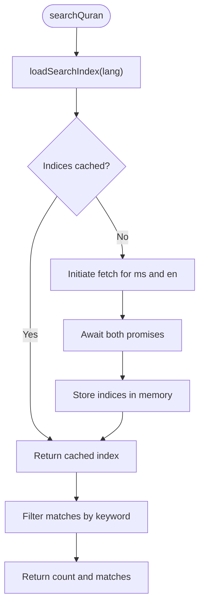
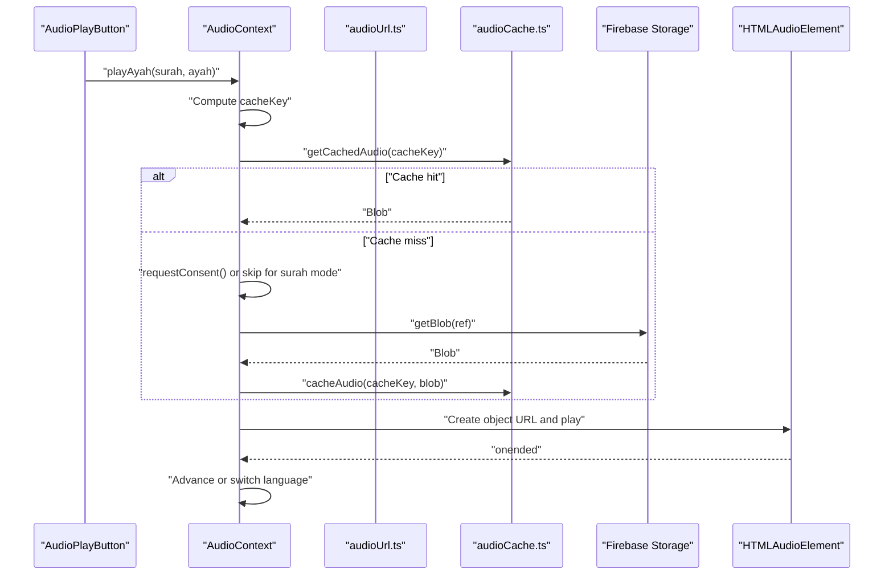
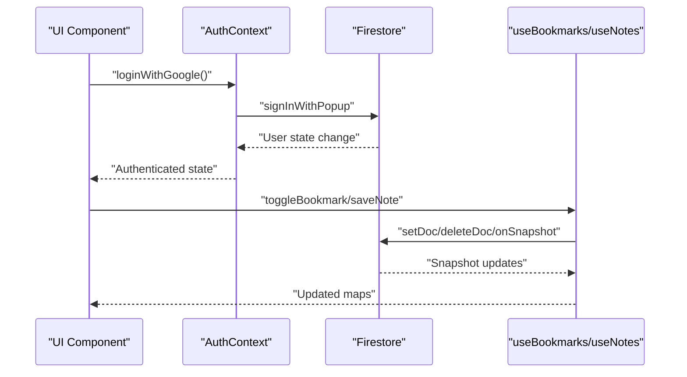
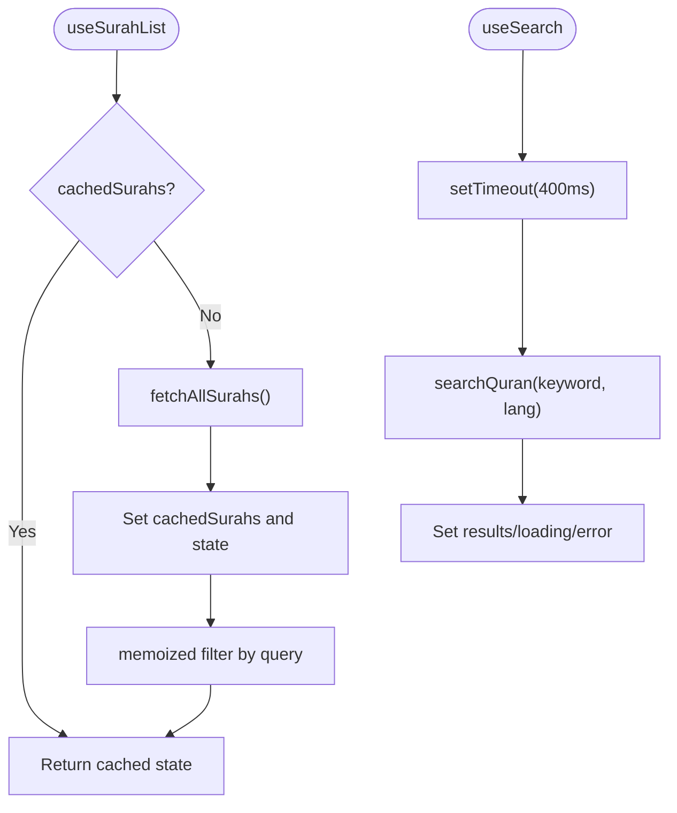
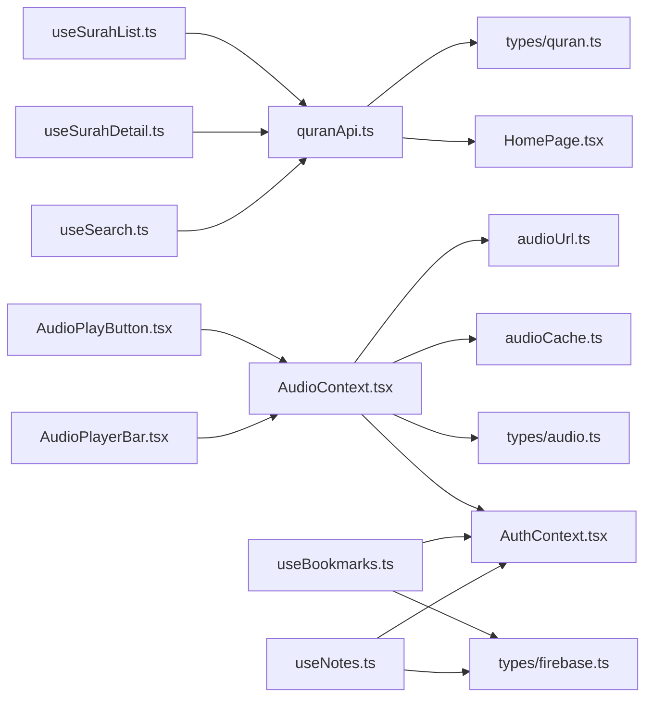
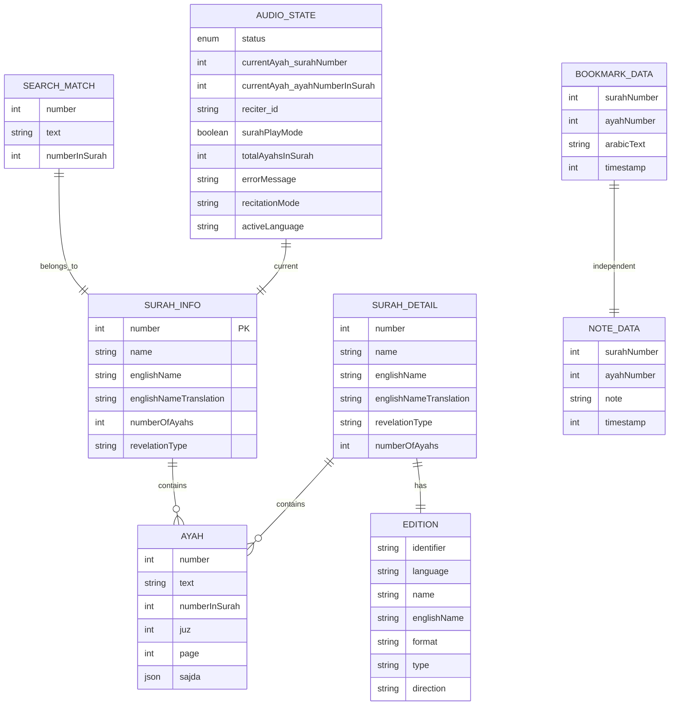

# Data Flow Design

<cite>
**Referenced Files in This Document**
- [quranApi.ts](file://src/api/quranApi.ts)
- [audio.ts](file://src/types/audio.ts)
- [quran.ts](file://src/types/quran.ts)
- [audioCache.ts](file://src/utils/audioCache.ts)
- [audioUrl.ts](file://src/utils/audioUrl.ts)
- [AudioContext.tsx](file://src/context/AudioContext.tsx)
- [AuthContext.tsx](file://src/context/AuthContext.tsx)
- [useSurahList.ts](file://src/hooks/useSurahList.ts)
- [useSurahDetail.ts](file://src/hooks/useSurahDetail.ts)
- [useSearch.ts](file://src/hooks/useSearch.ts)
- [useBookmarks.ts](file://src/hooks/useBookmarks.ts)
- [useNotes.ts](file://src/hooks/useNotes.ts)
- [AudioPlayButton.tsx](file://src/components/AudioPlayButton.tsx)
- [AudioPlayerBar.tsx](file://src/components/AudioPlayerBar.tsx)
- [HomePage.tsx](file://src/pages/HomePage.tsx)
- [firebase.ts](file://src/types/firebase.ts)
</cite>

## Table of Contents
1. [Introduction](#introduction)
2. [Project Structure](#project-structure)
3. [Core Components](#core-components)
4. [Architecture Overview](#architecture-overview)
5. [Detailed Component Analysis](#detailed-component-analysis)
6. [Dependency Analysis](#dependency-analysis)
7. [Performance Considerations](#performance-considerations)
8. [Troubleshooting Guide](#troubleshooting-guide)
9. [Conclusion](#conclusion)
10. [Appendices](#appendices)

## Introduction
This document describes the complete data flow in the Quran Reader application, from static JSON sources through the API layer to UI components. It documents data transformations, caching strategies, state synchronization patterns, and the integration between Firebase authentication, Firestore, and local caching. It also explains the roles of quranApi.ts, audio utilities, and type definitions, and provides examples of fetching, processing, and caching mechanisms, along with error handling, retry logic, and fallback strategies. Performance considerations such as lazy loading, memoization, and data normalization are addressed, alongside debugging techniques and optimization strategies for large datasets.

## Project Structure
The application follows a clear separation of concerns:
- Static JSON data resides under public/data and is consumed via client-side APIs.
- API layer encapsulates data retrieval and lightweight processing.
- Type definitions unify data contracts across modules.
- Utilities provide audio path building and IndexedDB-based caching.
- Contexts manage global state for audio playback and authentication.
- Hooks orchestrate data fetching, caching, filtering, and debounced search.
- Components render UI and trigger actions that update state and drive data flow.

**Diagram sources**
- [quranApi.ts:1-51](file://src/api/quranApi.ts#L1-L51)
- [audio.ts:1-41](file://src/types/audio.ts#L1-L41)
- [quran.ts:1-64](file://src/types/quran.ts#L1-L64)
- [audioCache.ts:1-153](file://src/utils/audioCache.ts#L1-L153)
- [audioUrl.ts:1-37](file://src/utils/audioUrl.ts#L1-L37)
- [AudioContext.tsx:1-396](file://src/context/AudioContext.tsx#L1-L396)
- [AuthContext.tsx:1-63](file://src/context/AuthContext.tsx#L1-L63)
- [useSurahList.ts:1-47](file://src/hooks/useSurahList.ts#L1-L47)
- [useSurahDetail.ts:1-37](file://src/hooks/useSurahDetail.ts#L1-L37)
- [useSearch.ts:1-37](file://src/hooks/useSearch.ts#L1-L37)
- [useBookmarks.ts:1-88](file://src/hooks/useBookmarks.ts#L1-L88)
- [useNotes.ts:1-92](file://src/hooks/useNotes.ts#L1-L92)
- [AudioPlayButton.tsx:1-69](file://src/components/AudioPlayButton.tsx#L1-L69)
- [AudioPlayerBar.tsx:1-86](file://src/components/AudioPlayerBar.tsx#L1-L86)
- [HomePage.tsx:1-44](file://src/pages/HomePage.tsx#L1-L44)

**Section sources**
- [quranApi.ts:1-51](file://src/api/quranApi.ts#L1-L51)
- [AudioContext.tsx:1-396](file://src/context/AudioContext.tsx#L1-L396)
- [useSurahList.ts:1-47](file://src/hooks/useSurahList.ts#L1-L47)
- [useSurahDetail.ts:1-37](file://src/hooks/useSurahDetail.ts#L1-L37)
- [useSearch.ts:1-37](file://src/hooks/useSearch.ts#L1-L37)
- [useBookmarks.ts:1-88](file://src/hooks/useBookmarks.ts#L1-L88)
- [useNotes.ts:1-92](file://src/hooks/useNotes.ts#L1-L92)
- [AudioPlayButton.tsx:1-69](file://src/components/AudioPlayButton.tsx#L1-L69)
- [AudioPlayerBar.tsx:1-86](file://src/components/AudioPlayerBar.tsx#L1-L86)
- [HomePage.tsx:1-44](file://src/pages/HomePage.tsx#L1-L44)

## Core Components
- quranApi.ts: Provides functions to fetch Surah metadata, Surah details, and perform client-side search using prebuilt indices. Implements lazy loading and caching of search indices.
- Types: Define SurahInfo, SurahDetailData, SearchMatch/SearchResultsData, and audio state/reciter types. They ensure strong typing across API, hooks, contexts, and components.
- Audio utilities: audioUrl.ts builds Firebase Storage paths; audioCache.ts manages IndexedDB-based caching for audio blobs.
- AudioContext: Centralizes audio playback state, handles downloads, caching, consent flows, and cross-language transitions.
- AuthContext: Manages Firebase authentication state and exposes login/logout actions.
- Hooks: useSurahList, useSurahDetail, useSearch implement data fetching, caching, filtering, and debounced search. useBookmarks and useNotes integrate Firestore for user data.
- Components: UI components consume context/state and trigger actions.

**Section sources**
- [quranApi.ts:1-51](file://src/api/quranApi.ts#L1-L51)
- [quran.ts:1-64](file://src/types/quran.ts#L1-L64)
- [audio.ts:1-41](file://src/types/audio.ts#L1-L41)
- [audioUrl.ts:1-37](file://src/utils/audioUrl.ts#L1-L37)
- [audioCache.ts:1-153](file://src/utils/audioCache.ts#L1-L153)
- [AudioContext.tsx:1-396](file://src/context/AudioContext.tsx#L1-L396)
- [AuthContext.tsx:1-63](file://src/context/AuthContext.tsx#L1-L63)
- [useSurahList.ts:1-47](file://src/hooks/useSurahList.ts#L1-L47)
- [useSurahDetail.ts:1-37](file://src/hooks/useSurahDetail.ts#L1-L37)
- [useSearch.ts:1-37](file://src/hooks/useSearch.ts#L1-L37)
- [useBookmarks.ts:1-88](file://src/hooks/useBookmarks.ts#L1-L88)
- [useNotes.ts:1-92](file://src/hooks/useNotes.ts#L1-L92)

## Architecture Overview
The data flow architecture consists of:
- Static JSON sources feeding Surah metadata and Surah details.
- Client-side search powered by prebuilt indices.
- Authentication state gating audio downloads.
- IndexedDB caching reducing bandwidth and enabling offline playback.
- React hooks orchestrating data fetching and UI updates.
- Contexts managing shared state and side effects.

**Diagram sources**
- [quranApi.ts:1-51](file://src/api/quranApi.ts#L1-L51)
- [useSurahList.ts:1-47](file://src/hooks/useSurahList.ts#L1-L47)
- [useSurahDetail.ts:1-37](file://src/hooks/useSurahDetail.ts#L1-L37)
- [useSearch.ts:1-37](file://src/hooks/useSearch.ts#L1-L37)

## Detailed Component Analysis

### API Layer: quranApi.ts
Responsibilities:
- Fetch Surah metadata and Surah details from static JSON.
- Provide client-side search using prebuilt indices with lazy loading and caching.

Key behaviors:
- Surah list and detail fetching with error propagation.
- Search index loader initializes ms and en indices once, then caches them.
- Search filters matches by lowercase inclusion.

**Diagram sources**
- [quranApi.ts:16-50](file://src/api/quranApi.ts#L16-L50)

**Section sources**
- [quranApi.ts:1-51](file://src/api/quranApi.ts#L1-L51)

### Audio Playback Pipeline: AudioContext, audioUrl.ts, audioCache.ts
Responsibilities:
- Resolve audio paths, fetch blobs from Firebase Storage, cache to IndexedDB, and stream playback.
- Manage recitation modes, surah-wide playback, and language transitions.
- Enforce user consent and authentication for downloads.

Processing logic:
- Build cache key from language, reciter, surah, and ayah.
- Attempt cache lookup; if missing, request consent (except surah-download mode).
- In surah-download mode, iterate all ayahs and languages, cache, then play current ayah.
- On playback completion, advance to next ayah or switch language depending on mode.
- Handle errors and update status accordingly.

**Diagram sources**
- [AudioContext.tsx:68-305](file://src/context/AudioContext.tsx#L68-L305)
- [audioUrl.ts:13-36](file://src/utils/audioUrl.ts#L13-L36)
- [audioCache.ts:30-60](file://src/utils/audioCache.ts#L30-L60)

**Section sources**
- [AudioContext.tsx:1-396](file://src/context/AudioContext.tsx#L1-L396)
- [audioUrl.ts:1-37](file://src/utils/audioUrl.ts#L1-L37)
- [audioCache.ts:1-153](file://src/utils/audioCache.ts#L1-L153)
- [audio.ts:1-41](file://src/types/audio.ts#L1-L41)

### Authentication and Firestore Integration
Responsibilities:
- Manage authentication state and expose login/logout.
- Provide real-time sync of bookmarks and notes via Firestore snapshots.

Patterns:
- AuthContext listens to onAuthStateChanged and exposes user state.
- useBookmarks and useNotes subscribe to user-specific collections and maintain local maps for fast access.

**Diagram sources**
- [AuthContext.tsx:20-55](file://src/context/AuthContext.tsx#L20-L55)
- [useBookmarks.ts:23-55](file://src/hooks/useBookmarks.ts#L23-L55)
- [useNotes.ts:24-56](file://src/hooks/useNotes.ts#L24-L56)
- [firebase.ts:1-20](file://src/types/firebase.ts#L1-L20)

**Section sources**
- [AuthContext.tsx:1-63](file://src/context/AuthContext.tsx#L1-L63)
- [useBookmarks.ts:1-88](file://src/hooks/useBookmarks.ts#L1-L88)
- [useNotes.ts:1-92](file://src/hooks/useNotes.ts#L1-L92)
- [firebase.ts:1-20](file://src/types/firebase.ts#L1-L20)

### Hooks: Data Fetching, Filtering, and Debounced Search
Responsibilities:
- useSurahList: Fetches Surah list once, caches in memory, and provides filtered results.
- useSurahDetail: Loads Surah detail for a given number with cancellation safety.
- useSearch: Debounces search input and performs client-side filtering against indices.

Patterns:
- Memoized filtering to avoid re-computation.
- Debounced search to reduce network calls.
- Cancellation flag to prevent state updates after unmount.

**Diagram sources**
- [useSurahList.ts:8-46](file://src/hooks/useSurahList.ts#L8-L46)
- [useSearch.ts:6-36](file://src/hooks/useSearch.ts#L6-L36)

**Section sources**
- [useSurahList.ts:1-47](file://src/hooks/useSurahList.ts#L1-L47)
- [useSurahDetail.ts:1-37](file://src/hooks/useSurahDetail.ts#L1-L37)
- [useSearch.ts:1-37](file://src/hooks/useSearch.ts#L1-L37)

### UI Components: Rendering and Actions
Responsibilities:
- AudioPlayButton renders play/pause controls and delegates to AudioContext.
- AudioPlayerBar displays current playback state and controls.
- HomePage renders Surah list with live filtering.

Patterns:
- Components read state from contexts and call action methods.
- Conditional rendering based on status and mode.

**Section sources**
- [AudioPlayButton.tsx:1-69](file://src/components/AudioPlayButton.tsx#L1-L69)
- [AudioPlayerBar.tsx:1-86](file://src/components/AudioPlayerBar.tsx#L1-L86)
- [HomePage.tsx:1-44](file://src/pages/HomePage.tsx#L1-L44)

## Dependency Analysis
High-level dependencies:
- quranApi.ts depends on static JSON files and types.
- AudioContext depends on audioUrl.ts, audioCache.ts, and Firebase SDK.
- Hooks depend on quranApi.ts and types.
- Components depend on contexts and hooks.
- useBookmarks/useNotes depend on AuthContext and Firestore.

**Diagram sources**
- [quranApi.ts:1-51](file://src/api/quranApi.ts#L1-L51)
- [quran.ts:1-64](file://src/types/quran.ts#L1-L64)
- [audio.ts:1-41](file://src/types/audio.ts#L1-L41)
- [audioUrl.ts:1-37](file://src/utils/audioUrl.ts#L1-L37)
- [audioCache.ts:1-153](file://src/utils/audioCache.ts#L1-L153)
- [AudioContext.tsx:1-396](file://src/context/AudioContext.tsx#L1-L396)
- [AuthContext.tsx:1-63](file://src/context/AuthContext.tsx#L1-L63)
- [useSurahList.ts:1-47](file://src/hooks/useSurahList.ts#L1-L47)
- [useSurahDetail.ts:1-37](file://src/hooks/useSurahDetail.ts#L1-L37)
- [useSearch.ts:1-37](file://src/hooks/useSearch.ts#L1-L37)
- [useBookmarks.ts:1-88](file://src/hooks/useBookmarks.ts#L1-L88)
- [useNotes.ts:1-92](file://src/hooks/useNotes.ts#L1-L92)
- [AudioPlayButton.tsx:1-69](file://src/components/AudioPlayButton.tsx#L1-L69)
- [AudioPlayerBar.tsx:1-86](file://src/components/AudioPlayerBar.tsx#L1-L86)
- [HomePage.tsx:1-44](file://src/pages/HomePage.tsx#L1-L44)
- [firebase.ts:1-20](file://src/types/firebase.ts#L1-L20)

**Section sources**
- [quranApi.ts:1-51](file://src/api/quranApi.ts#L1-L51)
- [AudioContext.tsx:1-396](file://src/context/AudioContext.tsx#L1-L396)
- [useSurahList.ts:1-47](file://src/hooks/useSurahList.ts#L1-L47)
- [useSurahDetail.ts:1-37](file://src/hooks/useSurahDetail.ts#L1-L37)
- [useSearch.ts:1-37](file://src/hooks/useSearch.ts#L1-L37)
- [useBookmarks.ts:1-88](file://src/hooks/useBookmarks.ts#L1-L88)
- [useNotes.ts:1-92](file://src/hooks/useNotes.ts#L1-L92)
- [AudioPlayButton.tsx:1-69](file://src/components/AudioPlayButton.tsx#L1-L69)
- [AudioPlayerBar.tsx:1-86](file://src/components/AudioPlayerBar.tsx#L1-L86)
- [HomePage.tsx:1-44](file://src/pages/HomePage.tsx#L1-L44)

## Performance Considerations
- Lazy loading and caching:
  - Surah list is fetched once and cached in memory; subsequent loads return cached data immediately.
  - Search indices are loaded once per language and cached globally to avoid repeated fetches.
- Memoization:
  - Filtering in useSurahList is memoized to prevent unnecessary recomputation.
- Debounced search:
  - useSearch delays search execution to reduce redundant API calls.
- IndexedDB caching:
  - audioCache.ts stores audio blobs locally to eliminate bandwidth usage after first play.
- Normalization:
  - Data structures in types/quran.ts and types/audio.ts provide normalized shapes for predictable consumption.
- UI responsiveness:
  - Components render loading states and disable controls appropriately during async operations.

[No sources needed since this section provides general guidance]

## Troubleshooting Guide
Common issues and remedies:
- Surah list fails to load:
  - Verify static JSON availability and network connectivity. Check thrown error messages and surface them to users.
- Surah detail not found:
  - Confirm the requested surah number corresponds to an existing JSON file.
- Search returns no results:
  - Ensure indices are loaded; confirm language selection and keyword casing.
- Audio fails to play:
  - Check authentication state; ensure user is logged in for downloads.
  - Inspect cache presence and IndexedDB availability.
  - Review error messages emitted by AudioContext and displayed in the player bar.
- Consent dialog behavior:
  - Surah-play mode bypasses per-ayah consent; ensure user is aware and logged in.
- Firestore sync issues:
  - Confirm AuthContext reports a signed-in user; verify Firestore rules and collection paths.

Debugging techniques:
- Log cache keys and states in AudioContext to trace cache hits/misses.
- Use browser devtools Network panel to inspect fetches and IndexedDB operations.
- Add error boundaries around hooks to capture and display errors.
- Validate Firebase credentials and permissions.

**Section sources**
- [AudioContext.tsx:223-229](file://src/context/AudioContext.tsx#L223-L229)
- [AudioPlayerBar.tsx:34-36](file://src/components/AudioPlayerBar.tsx#L34-L36)
- [useSurahList.ts:25-30](file://src/hooks/useSurahList.ts#L25-L30)
- [useSurahDetail.ts:23-28](file://src/hooks/useSurahDetail.ts#L23-L28)
- [useSearch.ts:26-29](file://src/hooks/useSearch.ts#L26-L29)

## Conclusion
The Quran Reader application implements a robust data flow that leverages static JSON sources, client-side indexing, IndexedDB caching, and Firebase integration. The API layer remains thin and focused, while hooks and contexts coordinate state and side effects. Strong typing ensures reliability across modules. The design supports efficient user experiences through lazy loading, memoization, and debounced search, and provides clear pathways for error handling and debugging.

[No sources needed since this section summarizes without analyzing specific files]

## Appendices

### Data Model Overview

**Diagram sources**
- [quran.ts:1-64](file://src/types/quran.ts#L1-L64)
- [audio.ts:1-41](file://src/types/audio.ts#L1-L41)
- [firebase.ts:1-20](file://src/types/firebase.ts#L1-L20)