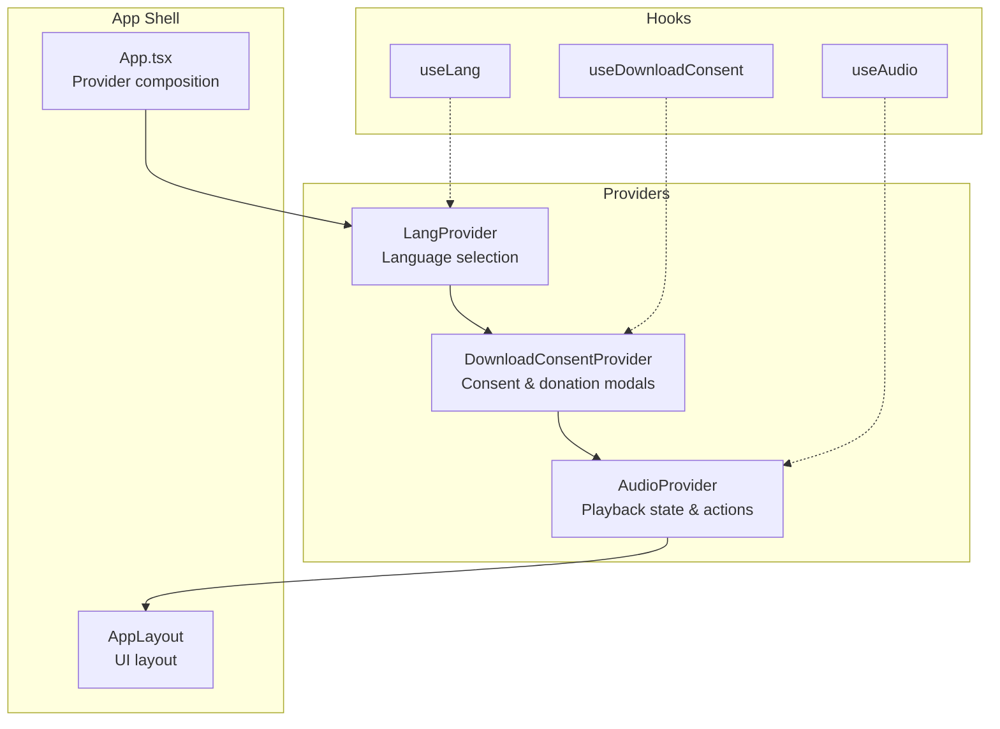
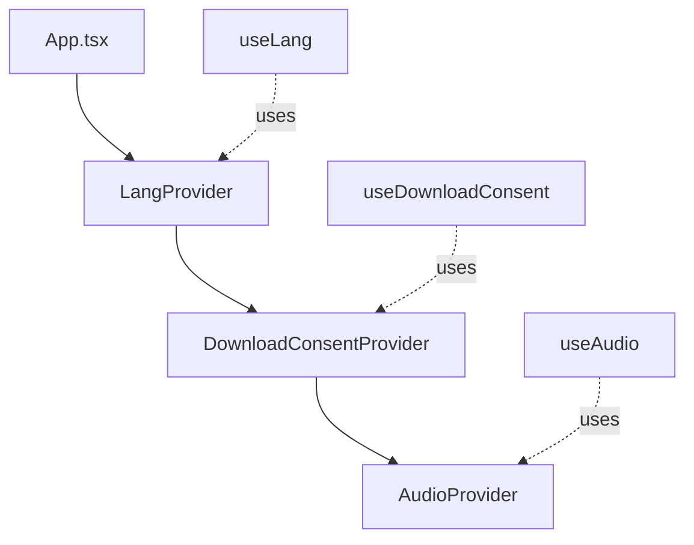
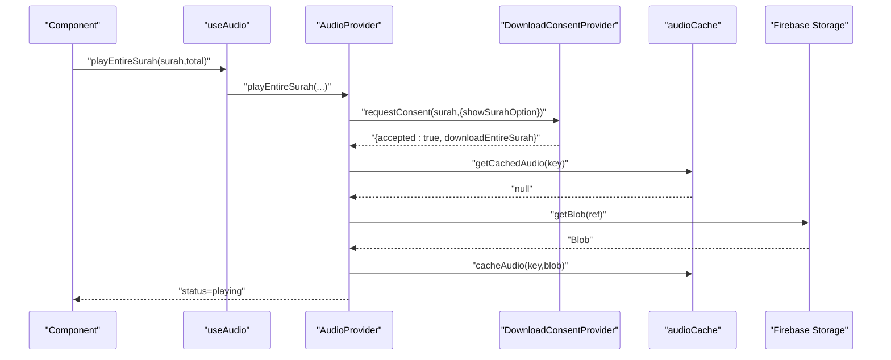
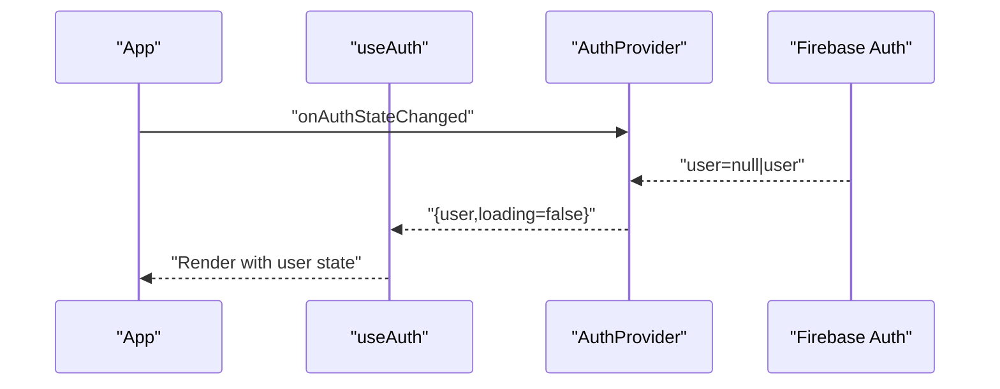
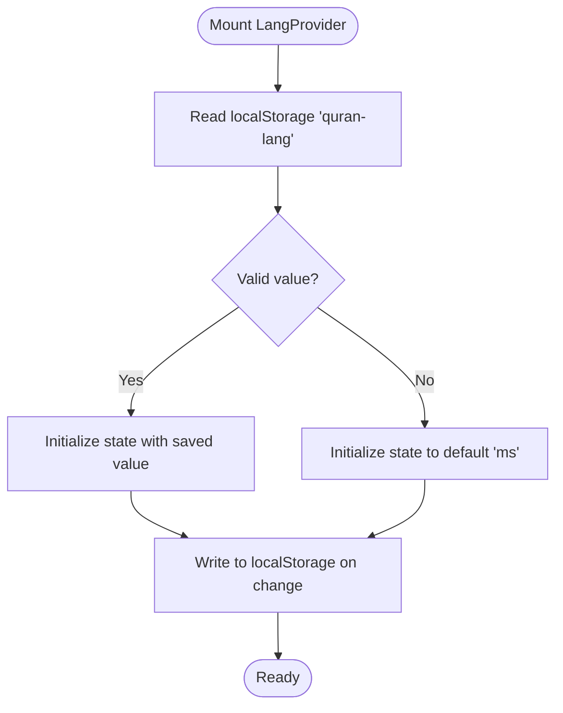
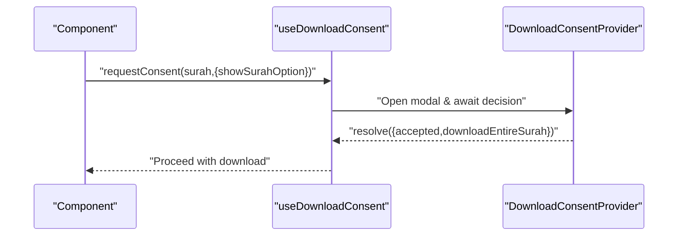
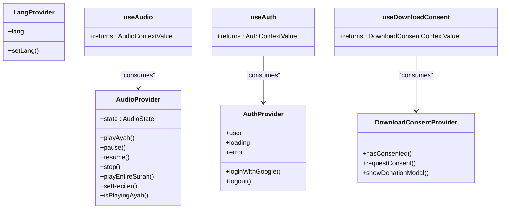
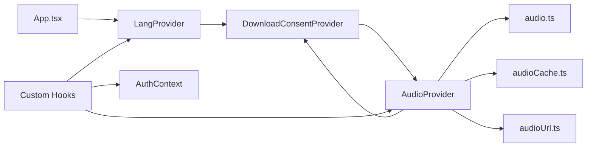

# State Management Patterns

<cite>
**Referenced Files in This Document**
- [AudioContext.tsx](file://src/context/AudioContext.tsx)
- [AuthContext.tsx](file://src/context/AuthContext.tsx)
- [LangContext.tsx](file://src/context/LangContext.tsx)
- [DownloadConsentContext.tsx](file://src/context/DownloadConsentContext.tsx)
- [useAudio.ts](file://src/hooks/useAudio.ts)
- [useAuth.ts](file://src/hooks/useAuth.ts)
- [useBookmarks.ts](file://src/hooks/useBookmarks.ts)
- [useNotes.ts](file://src/hooks/useNotes.ts)
- [useSearch.ts](file://src/hooks/useSearch.ts)
- [useSurahDetail.ts](file://src/hooks/useSurahDetail.ts)
- [useSurahList.ts](file://src/hooks/useSurahList.ts)
- [audio.ts](file://src/types/audio.ts)
- [audioCache.ts](file://src/utils/audioCache.ts)
- [audioUrl.ts](file://src/utils/audioUrl.ts)
- [App.tsx](file://src/App.tsx)
</cite>

## Table of Contents
1. [Introduction](#introduction)
2. [Project Structure](#project-structure)
3. [Core Components](#core-components)
4. [Architecture Overview](#architecture-overview)
5. [Detailed Component Analysis](#detailed-component-analysis)
6. [Dependency Analysis](#dependency-analysis)
7. [Performance Considerations](#performance-considerations)
8. [Troubleshooting Guide](#troubleshooting-guide)
9. [Conclusion](#conclusion)

## Introduction
This document explains the state management patterns used in the Quran Reader application with a focus on the provider pattern built on React’s Context API. It documents each context provider’s responsibilities, state structure, and update mechanisms, and demonstrates how custom hooks encapsulate business logic. It also covers state persistence strategies, memory management, debugging techniques, and best practices for avoiding unnecessary re-renders and managing complex state hierarchies.

## Project Structure
The app composes a layered state management architecture:
- Providers at the top level manage global concerns: language, audio playback, user authentication, and download consent.
- Custom hooks encapsulate domain-specific logic and expose a clean API to components.
- Utility modules support caching, URLs, and shared types.

**Diagram sources**
- [App.tsx:42-55](file://src/App.tsx#L42-L55)
- [LangContext.tsx:12-27](file://src/context/LangContext.tsx#L12-L27)
- [DownloadConsentContext.tsx:16-249](file://src/context/DownloadConsentContext.tsx#L16-L249)
- [AudioContext.tsx:40-389](file://src/context/AudioContext.tsx#L40-L389)

**Section sources**
- [App.tsx:42-55](file://src/App.tsx#L42-L55)

## Core Components
This section documents the four primary context providers and their roles.

- AudioContext
  - Responsibilities: Manage playback lifecycle, reciter selection, recitation modes, surah-play sequencing, error handling, and integration with consent and caching systems.
  - State structure: Defined by the AudioState interface, including status, current ayah, reciter, surah play mode, total ayahs, error message, recitation mode, and active language.
  - Exposed actions: playAyah, playAyahWithReciter, pause, resume, stop, playEntireSurah, setReciter, isPlayingAyah.
  - Persistence: Uses IndexedDB via audioCache utilities for zero-bandwidth playback post-first load.
  - Integration: Consumes DownloadConsentContext for consent and donation flows; uses Firebase Storage for audio blobs.

- AuthContext
  - Responsibilities: Track signed-in user, loading state, and errors; provide Google login and logout actions.
  - State structure: user, loading, error.
  - Exposed actions: loginWithGoogle, logout.
  - Persistence: Relies on Firebase Authentication onAuthStateChanged listener; state reflects current auth state.

- LangContext
  - Responsibilities: Manage language preference for UI text.
  - State structure: lang (ms or en).
  - Persistence: Persists to localStorage with automatic synchronization.
  - Exposed actions: setLang.

- DownloadConsentContext
  - Responsibilities: Gate downloads with user consent; optionally present donation modal for surah-wide downloads.
  - State structure: Tracks modal visibility, current surah, and resolution callbacks.
  - Exposed actions: hasConsented, requestConsent, showDonationModal.
  - Persistence: Stores consent flags in localStorage per surah.

**Section sources**
- [AudioContext.tsx:16-38](file://src/context/AudioContext.tsx#L16-L38)
- [AudioContext.tsx:206-229](file://src/context/AudioContext.tsx#L206-L229)
- [AudioContext.tsx:40-389](file://src/context/AudioContext.tsx#L40-L389)
- [AuthContext.tsx:10-56](file://src/context/AuthContext.tsx#L10-L56)
- [LangContext.tsx:3-31](file://src/context/LangContext.tsx#L3-L31)
- [DownloadConsentContext.tsx:3-80](file://src/context/DownloadConsentContext.tsx#L3-L80)

## Architecture Overview
The provider hierarchy and hook usage form a cohesive state management layer:

**Diagram sources**
- [App.tsx:42-55](file://src/App.tsx#L42-L55)
- [useAudio.ts:1](file://src/hooks/useAudio.ts#L1)
- [useAuth.ts:1](file://src/hooks/useAuth.ts#L1)

## Detailed Component Analysis

### AudioContext Provider
- State shape and responsibilities
  - Maintains playback status, current ayah, reciter, surah mode, total ayahs, error message, recitation mode, and active language.
  - Provides actions to control playback and orchestrate surah sequences across languages.
- State updates
  - Uses local state transitions for UI feedback (loading, playing, paused, error).
  - Uses refs to capture current state inside event handlers to avoid stale closures.
  - Updates active language during arabic-then-malay mode transitions.
- Subscription mechanism
  - Components consume useAudio to receive the current state and action methods.
- Integration points
  - Requests consent via DownloadConsentContext; conditionally shows donation modal.
  - Downloads audio via Firebase Storage and caches with IndexedDB.
- Error handling
  - Propagates user-friendly messages for network/storage/playback failures.
- Performance considerations
  - Caches audio to IndexedDB to minimize bandwidth and latency.
  - Avoids re-renders by memoizing internal callbacks and using refs for stable handler references.

**Diagram sources**
- [AudioContext.tsx:349-366](file://src/context/AudioContext.tsx#L349-L366)
- [DownloadConsentContext.tsx:28-48](file://src/context/DownloadConsentContext.tsx#L28-L48)
- [audioCache.ts:46-60](file://src/utils/audioCache.ts#L46-L60)
- [audioUrl.ts:13-22](file://src/utils/audioUrl.ts#L13-L22)

**Section sources**
- [AudioContext.tsx:40-389](file://src/context/AudioContext.tsx#L40-L389)
- [audio.ts:23-32](file://src/types/audio.ts#L23-L32)
- [audioCache.ts:30-60](file://src/utils/audioCache.ts#L30-L60)
- [audioUrl.ts:13-22](file://src/utils/audioUrl.ts#L13-L22)

### AuthContext Provider
- State shape and responsibilities
  - Tracks user identity, loading, and error conditions.
- State updates
  - Subscribes to Firebase onAuthStateChanged to initialize and keep state synchronized.
- Subscription mechanism
  - Components use useAuth to access user, loading, error, and auth actions.
- Error handling
  - Captures and exposes errors from login/logout operations.

**Diagram sources**
- [AuthContext.tsx:20-56](file://src/context/AuthContext.tsx#L20-L56)

**Section sources**
- [AuthContext.tsx:10-62](file://src/context/AuthContext.tsx#L10-L62)

### LangContext Provider
- State shape and responsibilities
  - Manages language preference for UI text.
- Persistence
  - Reads/writes to localStorage to persist language choice across sessions.
- Subscription mechanism
  - Components use useLang to read/write language.

**Diagram sources**
- [LangContext.tsx:12-27](file://src/context/LangContext.tsx#L12-L27)

**Section sources**
- [LangContext.tsx:3-31](file://src/context/LangContext.tsx#L3-L31)

### DownloadConsentContext Provider
- State shape and responsibilities
  - Controls consent modal visibility, whether to show surah option, and resolves promises for consent decisions.
- Behavior
  - Persists consent per surah in localStorage.
  - Optionally shows a donation modal before proceeding with downloads.
- Subscription mechanism
  - Components use useDownloadConsent to request consent and trigger donation modal.

**Diagram sources**
- [DownloadConsentContext.tsx:28-77](file://src/context/DownloadConsentContext.tsx#L28-L77)

**Section sources**
- [DownloadConsentContext.tsx:3-80](file://src/context/DownloadConsentContext.tsx#L3-L80)

### Relationship Between Providers and Custom Hooks
- useAudio
  - Re-exports the consumer hook from AudioContext, exposing playback controls and state.
- useAuth
  - Re-exports the consumer hook from AuthContext, exposing user and auth actions.
- useDownloadConsent
  - Re-exports the consumer hook from DownloadConsentContext, exposing consent and donation modal helpers.
- Domain hooks
  - useBookmarks and useNotes integrate with Firestore snapshots and Auth state to manage user data.
  - useSearch, useSurahDetail, and useSurahList encapsulate API fetching and caching strategies.

**Diagram sources**
- [AudioContext.tsx:391-395](file://src/context/AudioContext.tsx#L391-L395)
- [AuthContext.tsx:58-62](file://src/context/AuthContext.tsx#L58-L62)
- [DownloadConsentContext.tsx:251-255](file://src/context/DownloadConsentContext.tsx#L251-L255)

**Section sources**
- [useAudio.ts:1](file://src/hooks/useAudio.ts#L1)
- [useAuth.ts:1](file://src/hooks/useAuth.ts#L1)
- [useBookmarks.ts:23-87](file://src/hooks/useBookmarks.ts#L23-L87)
- [useNotes.ts:24-91](file://src/hooks/useNotes.ts#L24-L91)
- [useSearch.ts:6-36](file://src/hooks/useSearch.ts#L6-L36)
- [useSurahDetail.ts:5-36](file://src/hooks/useSurahDetail.ts#L5-L36)
- [useSurahList.ts:8-46](file://src/hooks/useSurahList.ts#L8-L46)

## Dependency Analysis
- Provider composition order matters: LangProvider wraps DownloadConsentProvider, which wraps AudioProvider. This ensures AudioProvider can consume DownloadConsentContext safely.
- AudioProvider depends on:
  - DownloadConsentContext for consent/donation flows.
  - Firebase Storage and Auth for audio retrieval and user checks.
  - audioCache and audioUrl utilities for caching and path building.
- Hooks depend on providers:
  - useAudio consumes AudioProvider.
  - useAuth consumes AuthProvider.
  - useDownloadConsent consumes DownloadConsentProvider.
  - Domain hooks (useBookmarks, useNotes) depend on AuthProvider and Firestore.

**Diagram sources**
- [App.tsx:42-55](file://src/App.tsx#L42-L55)
- [AudioContext.tsx:13-14](file://src/context/AudioContext.tsx#L13-L14)
- [audio.ts:1-41](file://src/types/audio.ts#L1-L41)
- [audioCache.ts:1-153](file://src/utils/audioCache.ts#L1-L153)
- [audioUrl.ts:1-37](file://src/utils/audioUrl.ts#L1-L37)

**Section sources**
- [App.tsx:42-55](file://src/App.tsx#L42-L55)
- [AudioContext.tsx:13-14](file://src/context/AudioContext.tsx#L13-L14)

## Performance Considerations
- Caching
  - IndexedDB caching eliminates repeated downloads and reduces bandwidth usage after the first play.
  - Cache keys are derived from language, reciter, surah, and ayah identifiers.
- Event handler stability
  - Internal callbacks are memoized to prevent unnecessary re-renders of consumers.
  - Refs capture current state inside event handlers to avoid stale closures.
- Conditional downloads
  - Surah-wide downloads are gated by consent and optionally preceded by a donation modal to improve UX and reduce unexpected data usage.
- Debounced search
  - useSearch debounces API calls to limit network requests during typing.
- Memoized filtering
  - useSurahList memoizes filtered lists to avoid recomputation on unrelated state changes.

**Section sources**
- [AudioContext.tsx:68-305](file://src/context/AudioContext.tsx#L68-L305)
- [audioCache.ts:30-60](file://src/utils/audioCache.ts#L30-L60)
- [useSearch.ts:18-33](file://src/hooks/useSearch.ts#L18-L33)
- [useSurahList.ts:33-43](file://src/hooks/useSurahList.ts#L33-L43)

## Troubleshooting Guide
- Playback fails immediately
  - Check error messages propagated from AudioProvider state; common causes include network issues, missing user authentication, or storage access problems.
- Surah mode does not continue after donation
  - Verify that the donation modal closes and the callback resumes playback flow.
- Consent not remembered
  - Confirm localStorage entries for consent flags and ensure the hasConsented method reads them correctly.
- Language preference resets
  - Ensure localStorage writes occur on lang changes and that the provider reads saved values on mount.
- Unexpected re-renders
  - Inspect whether state updates are scoped appropriately and if memoization is applied to callbacks and computed values.

**Section sources**
- [AudioContext.tsx:206-229](file://src/context/AudioContext.tsx#L206-L229)
- [DownloadConsentContext.tsx:24-26](file://src/context/DownloadConsentContext.tsx#L24-L26)
- [LangContext.tsx:18-20](file://src/context/LangContext.tsx#L18-L20)

## Conclusion
The Quran Reader employs a robust provider-based state management architecture centered on React Context. Providers encapsulate cross-cutting concerns—authentication, language, audio playback, and consent—while custom hooks deliver focused APIs to components. Persistence strategies (localStorage and IndexedDB), careful state updates, and performance-conscious patterns (memoization, caching, debouncing) combine to yield a responsive and efficient user experience. Following the outlined best practices will help maintain scalability and reliability as the application evolves.