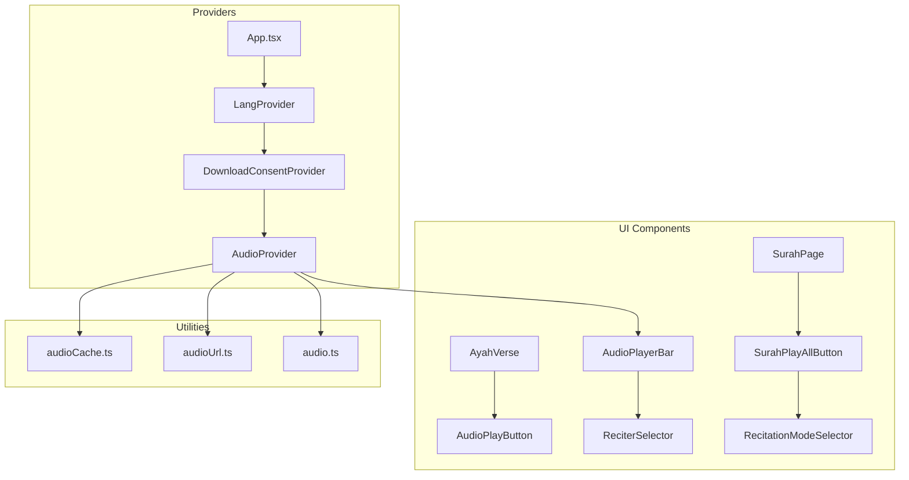
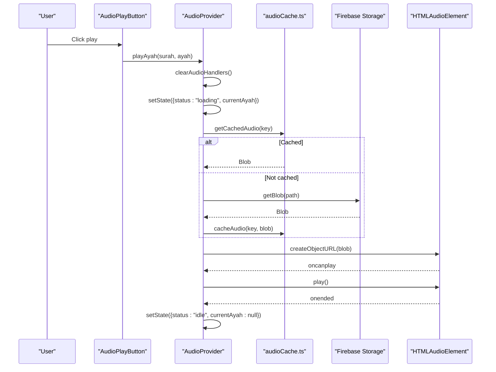
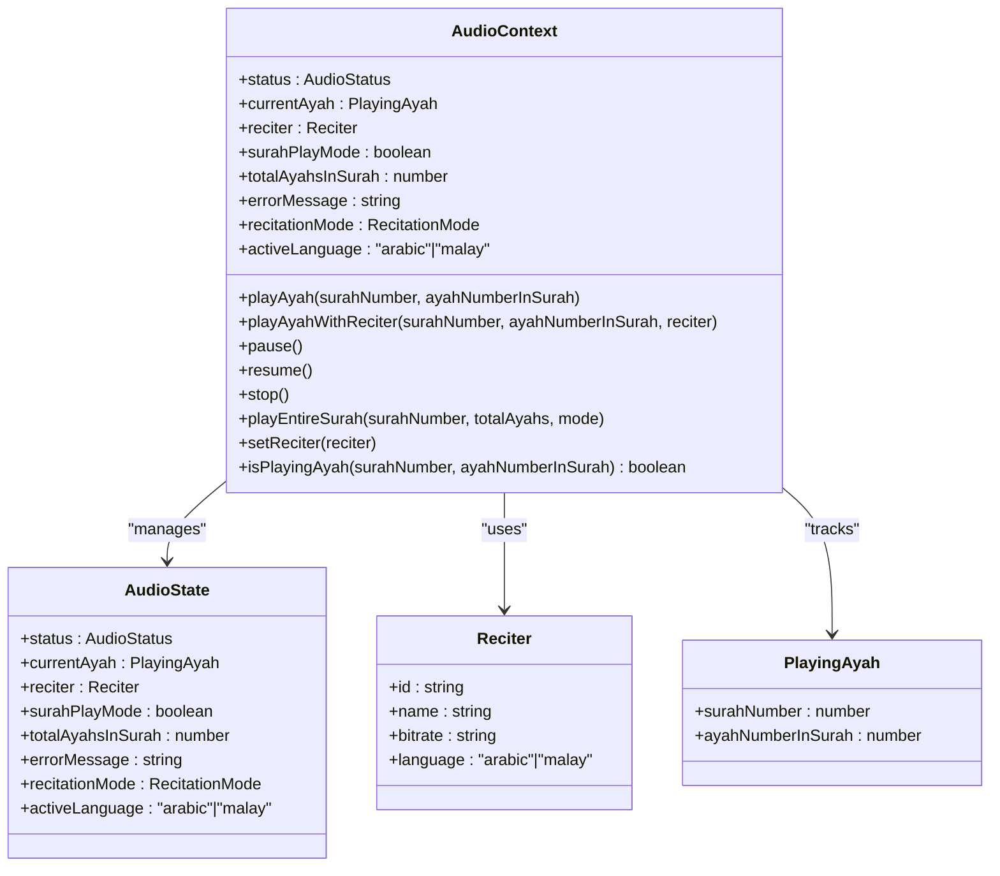
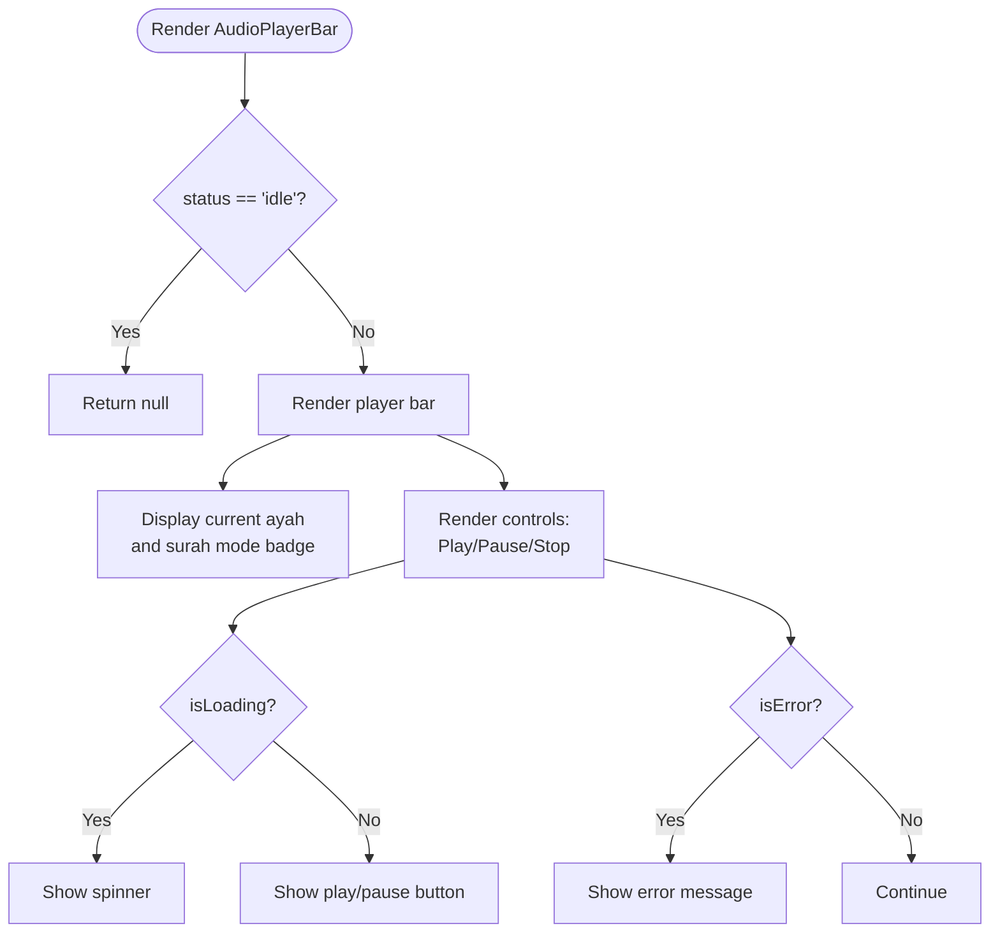
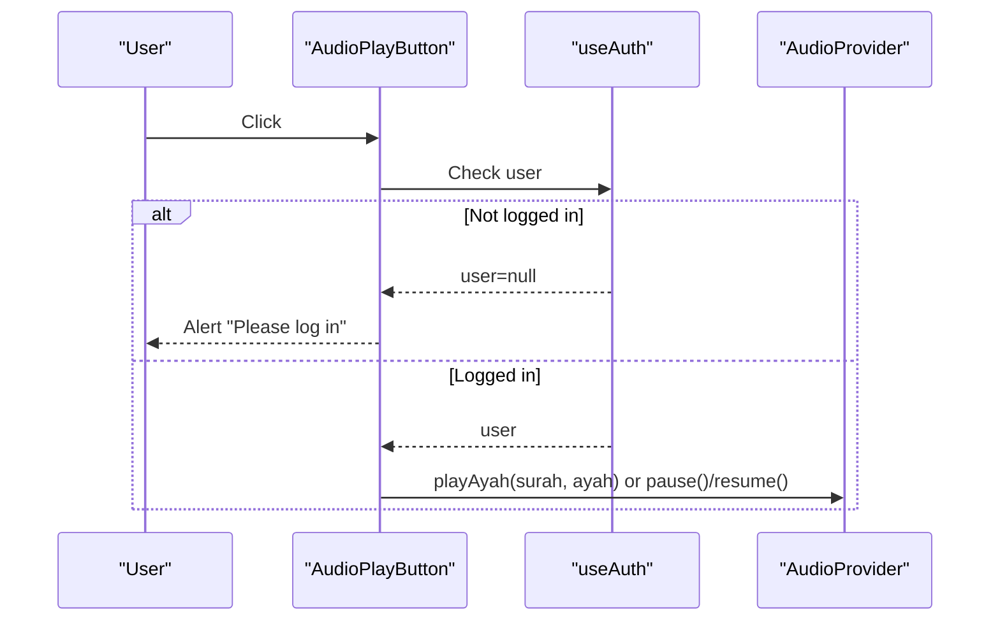
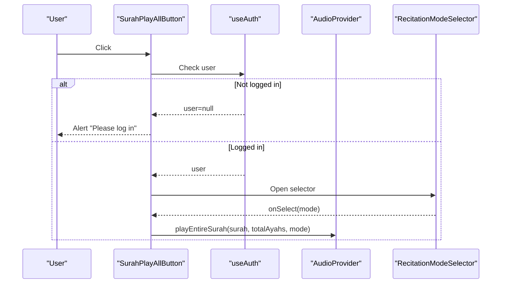
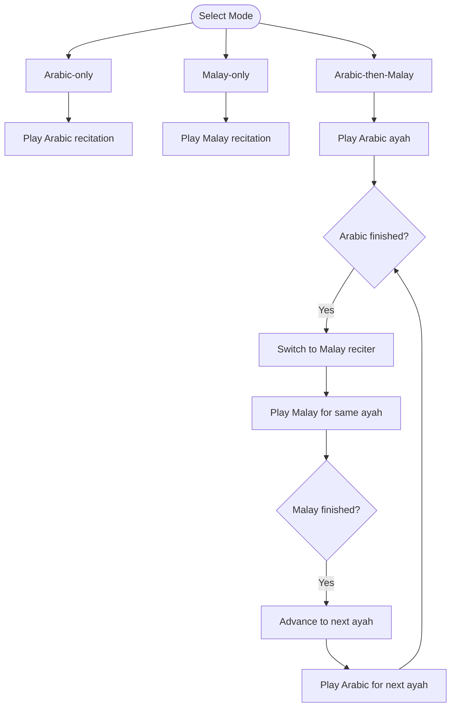
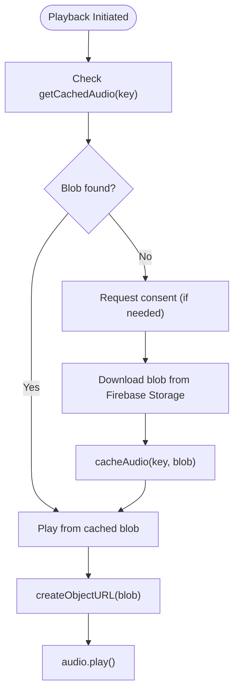
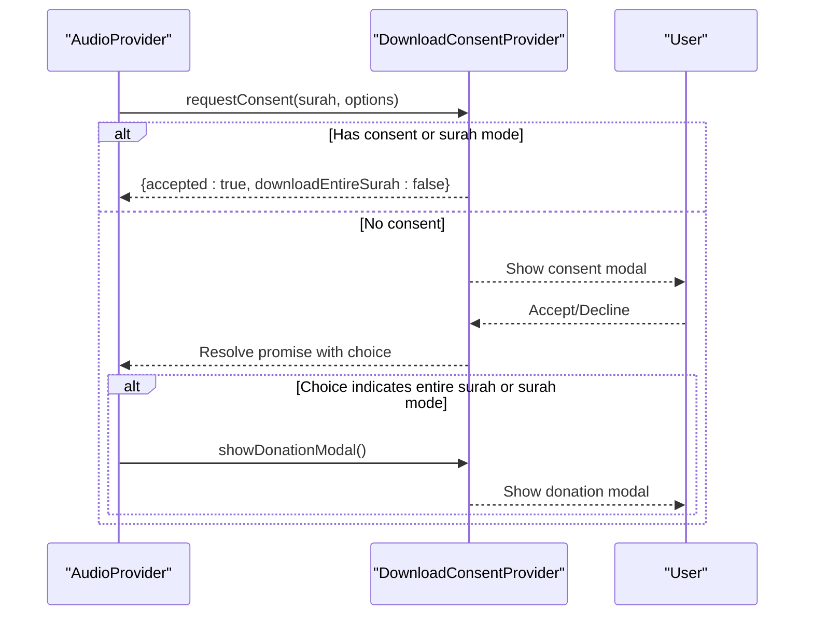
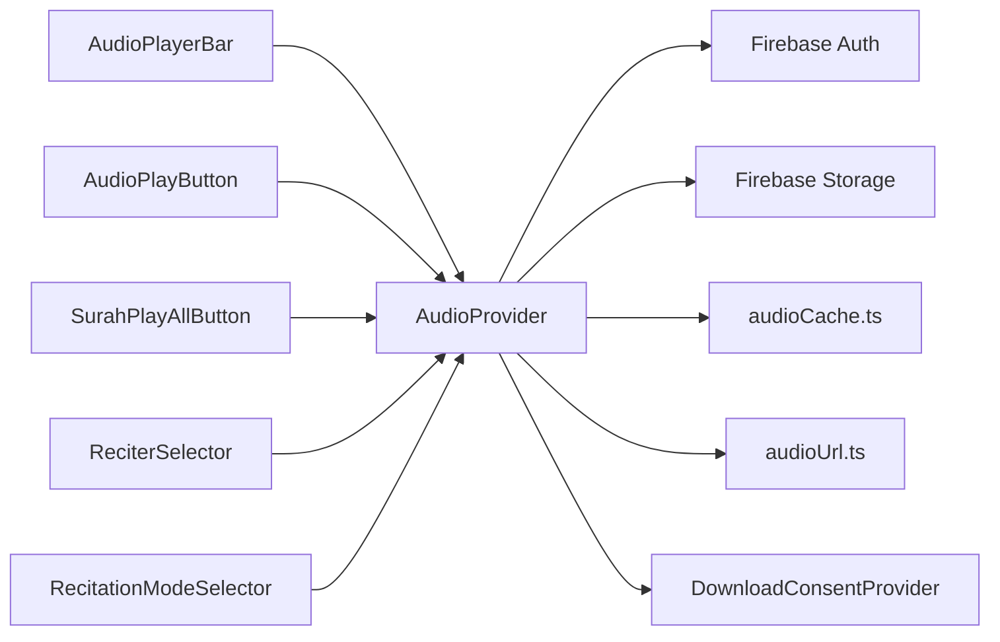

# Audio Playback Engine

<cite>
**Referenced Files in This Document**
- [AudioContext.tsx](file://src/context/AudioContext.tsx)
- [AudioPlayerBar.tsx](file://src/components/AudioPlayerBar.tsx)
- [AudioPlayButton.tsx](file://src/components/AudioPlayButton.tsx)
- [SurahPlayAllButton.tsx](file://src/components/SurahPlayAllButton.tsx)
- [useAudio.ts](file://src/hooks/useAudio.ts)
- [audioCache.ts](file://src/utils/audioCache.ts)
- [audioUrl.ts](file://src/utils/audioUrl.ts)
- [audio.ts](file://src/types/audio.ts)
- [DownloadConsentContext.tsx](file://src/context/DownloadConsentContext.tsx)
- [ReciterSelector.tsx](file://src/components/ReciterSelector.tsx)
- [RecitationModeSelector.tsx](file://src/components/RecitationModeSelector.tsx)
- [App.tsx](file://src/App.tsx)
- [AyahVerse.tsx](file://src/components/AyahVerse.tsx)
- [SurahPage.tsx](file://src/pages/SurahPage.tsx)
</cite>

## Table of Contents
1. [Introduction](#introduction)
2. [Project Structure](#project-structure)
3. [Core Components](#core-components)
4. [Architecture Overview](#architecture-overview)
5. [Detailed Component Analysis](#detailed-component-analysis)
6. [Dependency Analysis](#dependency-analysis)
7. [Performance Considerations](#performance-considerations)
8. [Troubleshooting Guide](#troubleshooting-guide)
9. [Conclusion](#conclusion)

## Introduction
This document provides comprehensive technical documentation for the audio playback engine powering the Quran app. It explains the AudioContext architecture, multi-reciter support, playback modes, and offline caching mechanism. It documents the AudioPlayerBar component, AudioPlayButton, and SurahPlayAllButton implementations, details the audio caching strategy using browser storage and blob handling, and covers progressive enhancement. Examples of Arabic/Malay sequential playback, error handling, and recovery mechanisms are included, along with performance considerations for audio loading, memory management, and battery optimization.

## Project Structure
The audio system is organized around a React context provider that manages global audio state and playback logic, complemented by UI components for user interaction and utility modules for caching and URL construction.

**Diagram sources**
- [App.tsx:42-55](file://src/App.tsx#L42-L55)
- [AudioContext.tsx:40-389](file://src/context/AudioContext.tsx#L40-L389)
- [AudioPlayerBar.tsx:4-85](file://src/components/AudioPlayerBar.tsx#L4-L85)
- [AudioPlayButton.tsx:9-68](file://src/components/AudioPlayButton.tsx#L9-L68)
- [SurahPlayAllButton.tsx:12-83](file://src/components/SurahPlayAllButton.tsx#L12-L83)
- [ReciterSelector.tsx:4-31](file://src/components/ReciterSelector.tsx#L4-L31)
- [RecitationModeSelector.tsx:16-75](file://src/components/RecitationModeSelector.tsx#L16-L75)
- [audioCache.ts:30-153](file://src/utils/audioCache.ts#L30-L153)
- [audioUrl.ts:13-37](file://src/utils/audioUrl.ts#L13-L37)
- [audio.ts:9-41](file://src/types/audio.ts#L9-L41)

**Section sources**
- [App.tsx:42-55](file://src/App.tsx#L42-L55)
- [AudioContext.tsx:40-389](file://src/context/AudioContext.tsx#L40-L389)

## Core Components
- AudioContext: Centralized audio state and playback orchestration, including multi-reciter support, surah-playback sequencing, and offline caching integration.
- AudioPlayerBar: Persistent player bar displaying current ayah, playback controls, and reciter selector.
- AudioPlayButton: Per-ayah play/pause toggle with user authentication gating.
- SurahPlayAllButton: Surah-wide playback initiation with recitation mode selection.
- DownloadConsentContext: Handles user consent for downloads and triggers donation prompts.
- Caching Utilities: IndexedDB-backed audio cache for zero-bandwidth subsequent plays.
- URL Builder: Constructs Firebase Storage paths for audio resources.

**Section sources**
- [AudioContext.tsx:16-389](file://src/context/AudioContext.tsx#L16-L389)
- [AudioPlayerBar.tsx:4-85](file://src/components/AudioPlayerBar.tsx#L4-L85)
- [AudioPlayButton.tsx:9-68](file://src/components/AudioPlayButton.tsx#L9-L68)
- [SurahPlayAllButton.tsx:12-83](file://src/components/SurahPlayAllButton.tsx#L12-L83)
- [DownloadConsentContext.tsx:16-249](file://src/context/DownloadConsentContext.tsx#L16-L249)
- [audioCache.ts:30-153](file://src/utils/audioCache.ts#L30-L153)
- [audioUrl.ts:13-37](file://src/utils/audioUrl.ts#L13-L37)

## Architecture Overview
The audio engine follows a layered architecture:
- Provider Layer: AudioProvider encapsulates state and asynchronous playback logic.
- UI Layer: Components render controls and react to state changes.
- Utility Layer: Caching and URL utilities abstract storage and resource resolution.
- Consent Layer: DownloadConsentProvider mediates user consent and donation prompts.

**Diagram sources**
- [AudioPlayButton.tsx:22-35](file://src/components/AudioPlayButton.tsx#L22-L35)
- [AudioContext.tsx:68-305](file://src/context/AudioContext.tsx#L68-L305)
- [audioCache.ts:46-60](file://src/utils/audioCache.ts#L46-L60)
- [audioUrl.ts:13-22](file://src/utils/audioUrl.ts#L13-L22)

## Detailed Component Analysis

### AudioContext Architecture
AudioContext orchestrates playback, manages state, and coordinates caching and consent flows. Key responsibilities:
- State Management: Tracks current ayah, playback status, reciter, recitation mode, and active language.
- Playback Control: Provides playAyah, playAyahWithReciter, pause, resume, stop, playEntireSurah, setReciter, and isPlayingAyah.
- Multi-Reciter Support: Selects reciters by language and persists reciter choice across sessions.
- Surah Playback Sequencing: Implements Arabic-first, Malay-following, and sequential modes with automatic language switching and next ayah progression.
- Offline Caching: Integrates IndexedDB caching for zero-bandwidth subsequent plays.
- Consent and Donation: Coordinates with DownloadConsentProvider for user consent and donation prompts during surah downloads.

**Diagram sources**
- [AudioContext.tsx:16-389](file://src/context/AudioContext.tsx#L16-L389)
- [audio.ts:23-41](file://src/types/audio.ts#L23-L41)

**Section sources**
- [AudioContext.tsx:29-389](file://src/context/AudioContext.tsx#L29-L389)
- [audio.ts:9-41](file://src/types/audio.ts#L9-L41)

### AudioPlayerBar Component
AudioPlayerBar renders a persistent player bar at the bottom of the screen, displaying:
- Current ayah information (surah and ayah number).
- Surah play mode indicator.
- Active language badge for Arabic/Malay sequential mode.
- Reciter selector.
- Play/Pause and Stop controls with loading indicators.

Behavior:
- Visibility: Hidden when status is idle.
- Loading: Spinner indicates buffering/loading.
- Error: Displays network/connection error message.
- Controls: Toggle play/pause/resume; stop clears state and handlers.

**Diagram sources**
- [AudioPlayerBar.tsx:4-85](file://src/components/AudioPlayerBar.tsx#L4-L85)

**Section sources**
- [AudioPlayerBar.tsx:4-85](file://src/components/AudioPlayerBar.tsx#L4-L85)

### AudioPlayButton Component
AudioPlayButton provides per-ayah playback control:
- Authentication Gating: Disabled when user is not logged in; alerts prompt login.
- State Awareness: Highlights active ayah during loading, playing, or paused states.
- Actions: Toggles between play and pause; resumes if previously paused.

Integration:
- Uses useAudio hook to access playAyah, pause, resume, and current state.
- Embedded within AyahVerse for each ayah.

**Diagram sources**
- [AudioPlayButton.tsx:22-35](file://src/components/AudioPlayButton.tsx#L22-L35)
- [useAudio.ts:1](file://src/hooks/useAudio.ts#L1)

**Section sources**
- [AudioPlayButton.tsx:9-68](file://src/components/AudioPlayButton.tsx#L9-L68)
- [AyahVerse.tsx:23-26](file://src/components/AyahVerse.tsx#L23-L26)

### SurahPlayAllButton Component
SurahPlayAllButton initiates surah-wide playback:
- Authentication Gating: Disabled when user is not logged in.
- Surah Play Mode: Starts entire surah playback with selected recitation mode.
- Mode Selection: Opens RecitationModeSelector to choose Arabic-only, Malay-only, or Arabic-then-Malay.

**Diagram sources**
- [SurahPlayAllButton.tsx:22-38](file://src/components/SurahPlayAllButton.tsx#L22-L38)
- [RecitationModeSelector.tsx:21-23](file://src/components/RecitationModeSelector.tsx#L21-L23)
- [useAudio.ts:1](file://src/hooks/useAudio.ts#L1)

**Section sources**
- [SurahPlayAllButton.tsx:12-83](file://src/components/SurahPlayAllButton.tsx#L12-L83)
- [SurahPage.tsx:67](file://src/pages/SurahPage.tsx#L67)

### Recitation Modes and Multi-Reciter Support
Supported modes:
- Arabic-only: Single-language Arabic recitation.
- Malay-only: Single-language Malay recitation.
- Arabic-then-Malay: Sequential playback alternating between Arabic and Malay for each ayah.

Multi-reciter support:
- Arabic reciters configured for Arabic language.
- Malay reciters configured for Malay language.
- ReciterSelector allows switching reciters while respecting surah play mode constraints.

**Diagram sources**
- [audio.ts:1-7](file://src/types/audio.ts#L1-L7)
- [AudioContext.tsx:239-284](file://src/context/AudioContext.tsx#L239-L284)
- [ReciterSelector.tsx:4-31](file://src/components/ReciterSelector.tsx#L4-L31)

**Section sources**
- [audio.ts:1-41](file://src/types/audio.ts#L1-L41)
- [AudioContext.tsx:349-366](file://src/context/AudioContext.tsx#L349-L366)
- [ReciterSelector.tsx:4-31](file://src/components/ReciterSelector.tsx#L4-L31)

### Offline Caching Mechanism
The caching strategy uses IndexedDB to store audio blobs locally:
- Cache Keys: Constructed from language, reciter id, surah number, and ayah number.
- Storage: IndexedDB object store named "audio-files".
- Operations: Put, get, getAllKeys, clear, delete, and size calculation.
- Progressive Enhancement: First play requires download; subsequent plays use cached blobs.

**Diagram sources**
- [AudioContext.tsx:100-199](file://src/context/AudioContext.tsx#L100-L199)
- [audioCache.ts:30-60](file://src/utils/audioCache.ts#L30-L60)
- [audioUrl.ts:13-22](file://src/utils/audioUrl.ts#L13-L22)

**Section sources**
- [audioCache.ts:30-153](file://src/utils/audioCache.ts#L30-L153)
- [AudioContext.tsx:100-199](file://src/context/AudioContext.tsx#L100-L199)

### Consent and Donation Flow
The DownloadConsentContext manages user consent and donation prompts:
- Consent Storage: Local storage keys prefixed with consent metadata.
- Surah Option: Allows choosing single ayah vs entire surah in non-surch mode.
- Donation Modal: Shown when downloading entire surah or in surah play mode to encourage support.

**Diagram sources**
- [DownloadConsentContext.tsx:28-77](file://src/context/DownloadConsentContext.tsx#L28-L77)
- [AudioContext.tsx:126-198](file://src/context/AudioContext.tsx#L126-L198)

**Section sources**
- [DownloadConsentContext.tsx:16-249](file://src/context/DownloadConsentContext.tsx#L16-L249)
- [AudioContext.tsx:87-198](file://src/context/AudioContext.tsx#L87-L198)

## Dependency Analysis
The audio system exhibits clear separation of concerns:
- AudioProvider depends on:
  - Firebase Storage for blob retrieval.
  - Firebase Auth for user checks.
  - audioCache for persistence.
  - audioUrl for path construction.
  - DownloadConsentContext for consent/donation flows.
- UI components depend on useAudio for state and actions.
- App composes providers in the correct order to ensure availability.

**Diagram sources**
- [AudioContext.tsx:9-14](file://src/context/AudioContext.tsx#L9-L14)
- [AudioPlayerBar.tsx:1](file://src/components/AudioPlayerBar.tsx#L1)
- [AudioPlayButton.tsx:1](file://src/components/AudioPlayButton.tsx#L1)
- [SurahPlayAllButton.tsx:2](file://src/components/SurahPlayAllButton.tsx#L2)
- [ReciterSelector.tsx:1](file://src/components/ReciterSelector.tsx#L1)
- [RecitationModeSelector.tsx:1](file://src/components/RecitationModeSelector.tsx#L1)

**Section sources**
- [AudioContext.tsx:9-14](file://src/context/AudioContext.tsx#L9-L14)
- [App.tsx:42-55](file://src/App.tsx#L42-L55)

## Performance Considerations
- Audio Loading:
  - Use oncanplay to start playback only when ready, reducing stalls.
  - Avoid repeated audio creation; reuse a single HTMLAudioElement instance.
- Memory Management:
  - Revoke object URLs after playback completion to free memory.
  - Clear audio handlers on stop/pause to prevent leaks.
- Bandwidth Optimization:
  - IndexedDB caching eliminates repeated downloads; cache keys are precise per ayah/reciter/language.
- Battery Optimization:
  - Avoid unnecessary re-renders by using refs for state in event handlers.
  - Disable controls during loading to prevent redundant operations.
- Progressive Enhancement:
  - UI remains responsive even when caches are cold; loading indicators inform users.

[No sources needed since this section provides general guidance]

## Troubleshooting Guide
Common issues and recovery mechanisms:
- Network/Connection Errors:
  - Audio onerror triggers error state with user-friendly messages.
  - Recovery: Retry after checking connectivity; stop clears handlers and resets state.
- Authentication Required:
  - Missing user triggers error state prompting login.
  - Recovery: Redirect to login flow; retry after successful authentication.
- Cache Corruption:
  - getCachedAudio returns null on errors; engine falls back to download.
  - Recovery: Re-download and re-cache; clearCache utility available for manual cleanup.
- Surah Play Mode Issues:
  - Surah mode sets download mode flag; ensure donation modal is handled.
  - Recovery: Stop and restart with correct mode selection.

**Section sources**
- [AudioContext.tsx:294-300](file://src/context/AudioContext.tsx#L294-L300)
- [AudioContext.tsx:110-116](file://src/context/AudioContext.tsx#L110-L116)
- [AudioContext.tsx:339-347](file://src/context/AudioContext.tsx#L339-L347)
- [audioCache.ts:47-60](file://src/utils/audioCache.ts#L47-L60)

## Conclusion
The audio playback engine integrates React context, IndexedDB caching, and Firebase Storage to deliver robust, offline-capable audio playback. The system supports multiple reciters and recitation modes, provides clear user feedback, and implements progressive enhancement for optimal performance. The modular design ensures maintainability and extensibility for future enhancements.