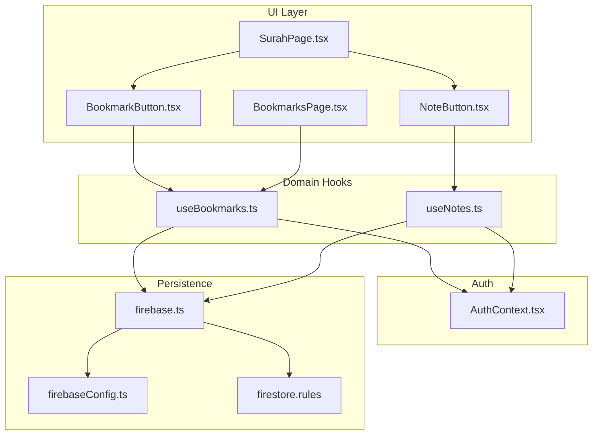
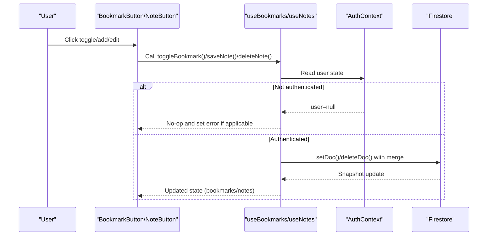
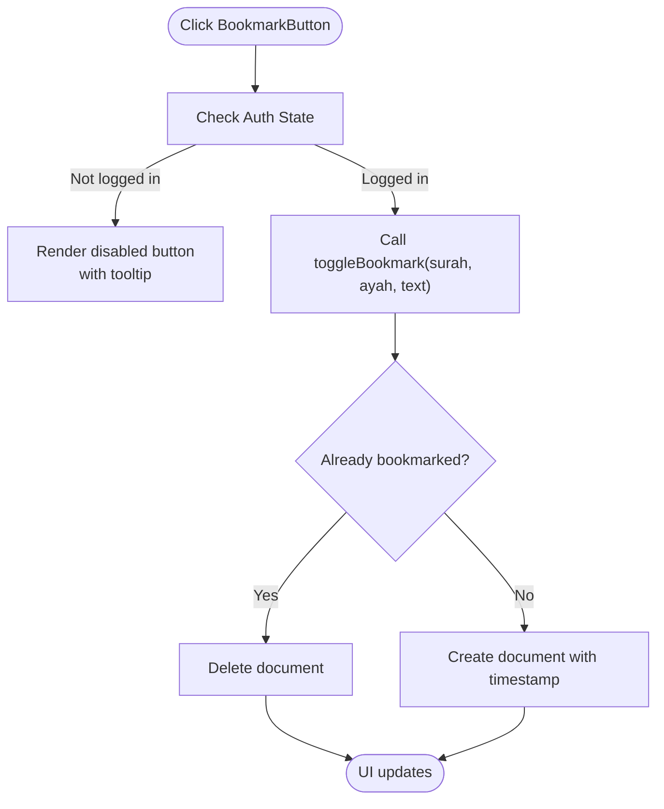
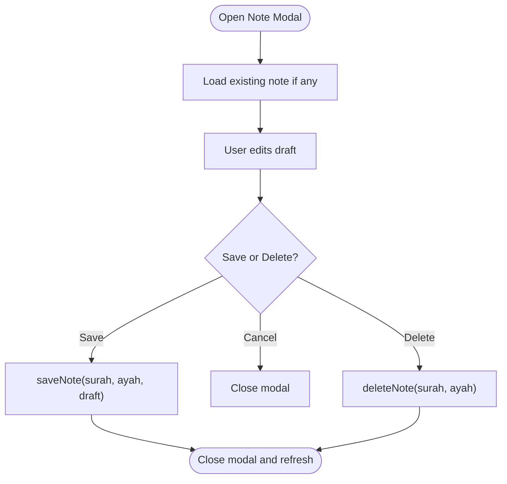
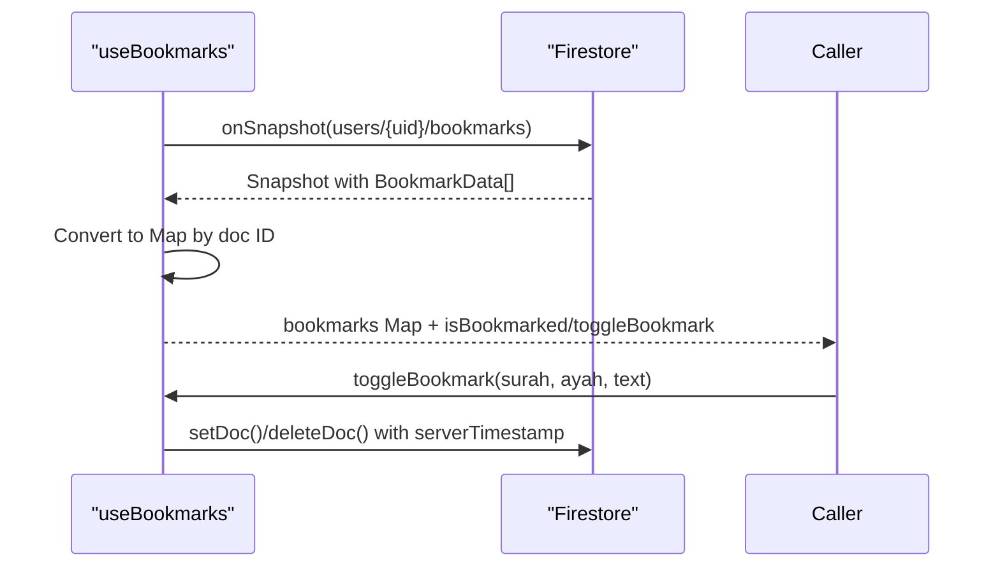
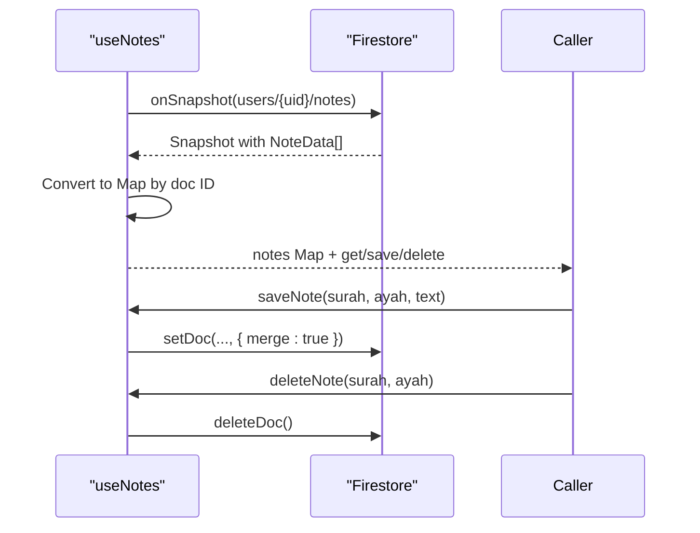
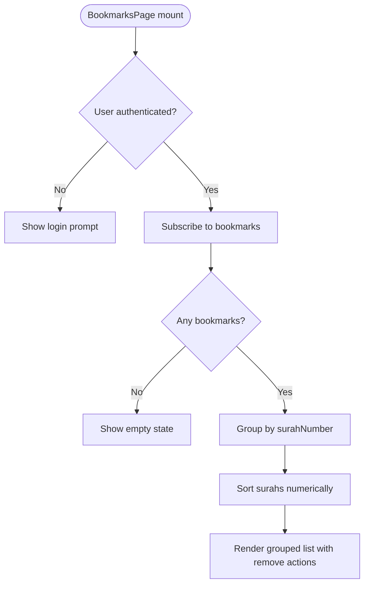
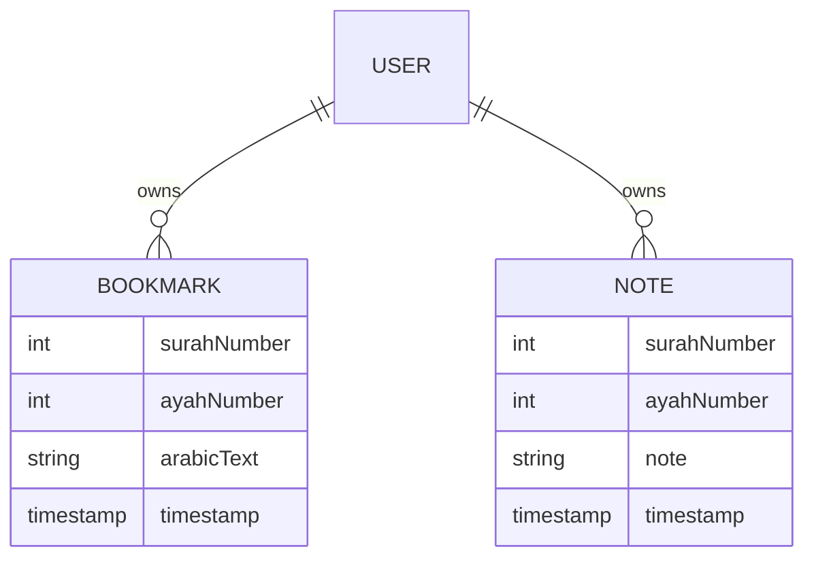
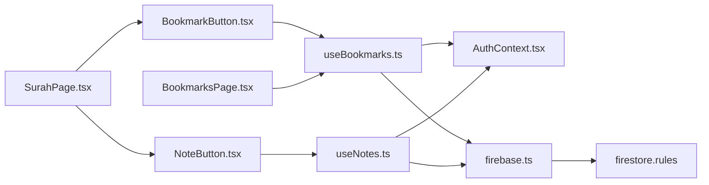

# Bookmark & Note System

<cite>
**Referenced Files in This Document**
- [BookmarkButton.tsx](file://src/components/BookmarkButton.tsx)
- [NoteButton.tsx](file://src/components/NoteButton.tsx)
- [BookmarksPage.tsx](file://src/pages/BookmarksPage.tsx)
- [useBookmarks.ts](file://src/hooks/useBookmarks.ts)
- [useNotes.ts](file://src/hooks/useNotes.ts)
- [firebase.ts](file://src/lib/firebase.ts)
- [firebaseConfig.ts](file://src/lib/firebaseConfig.ts)
- [firebase.ts (types)](file://src/types/firebase.ts)
- [AuthContext.tsx](file://src/context/AuthContext.tsx)
- [App.tsx](file://src/App.tsx)
- [SurahPage.tsx](file://src/pages/SurahPage.tsx)
- [firebase.json](file://firebase.json)
- [firestore.rules](file://firestore.rules)
</cite>

## Table of Contents
1. [Introduction](#introduction)
2. [Project Structure](#project-structure)
3. [Core Components](#core-components)
4. [Architecture Overview](#architecture-overview)
5. [Detailed Component Analysis](#detailed-component-analysis)
6. [Dependency Analysis](#dependency-analysis)
7. [Performance Considerations](#performance-considerations)
8. [Troubleshooting Guide](#troubleshooting-guide)
9. [Conclusion](#conclusion)
10. [Appendices](#appendices)

## Introduction
This document explains the bookmark and note system used for annotating and organizing personal study materials while reading the Quran. It covers:
- How bookmarks are created, toggled, and synchronized across devices
- How notes are attached to specific ayahs and persisted
- The BookmarkButton and NoteButton components and their integration
- The BookmarksPage implementation and organization of bookmarks by surah
- Data models, Firestore integration, and security rules
- Privacy, backup, and user experience patterns for content annotation

## Project Structure
The bookmark and note system spans several layers:
- UI components (BookmarkButton, NoteButton)
- Domain hooks (useBookmarks, useNotes)
- Authentication context (AuthContext)
- Firebase initialization and security rules
- Pages (SurahPage, BookmarksPage)

**Diagram sources**
- [BookmarkButton.tsx:1-49](file://src/components/BookmarkButton.tsx#L1-L49)
- [NoteButton.tsx:1-114](file://src/components/NoteButton.tsx#L1-L114)
- [BookmarksPage.tsx:1-96](file://src/pages/BookmarksPage.tsx#L1-L96)
- [SurahPage.tsx:1-120](file://src/pages/SurahPage.tsx#L1-L120)
- [useBookmarks.ts:1-88](file://src/hooks/useBookmarks.ts#L1-L88)
- [useNotes.ts:1-92](file://src/hooks/useNotes.ts#L1-L92)
- [AuthContext.tsx:1-63](file://src/context/AuthContext.tsx#L1-L63)
- [firebase.ts:1-11](file://src/lib/firebase.ts#L1-L11)
- [firebaseConfig.ts:1-9](file://src/lib/firebaseConfig.ts#L1-L9)
- [firestore.rules:1-9](file://firestore.rules#L1-L9)

**Section sources**
- [App.tsx:1-56](file://src/App.tsx#L1-L56)
- [firebase.json:1-10](file://firebase.json#L1-L10)

## Core Components
- BookmarkButton: A toggle button that adds or removes a bookmark for a given ayah. It conditionally renders based on authentication state and updates the Firestore bookmarks collection.
- NoteButton: An inline editor that saves, edits, and deletes notes associated with an ayah. It manages local state for the modal and draft content.
- useBookmarks: A hook that syncs the user’s bookmarks via Firestore snapshots and exposes functions to check and toggle bookmarks.
- useNotes: A hook that syncs notes via Firestore snapshots and exposes functions to get/save/delete notes.
- BookmarksPage: A page that lists all bookmarks grouped by surah, with links to read and remove entries.
- AuthContext: Provides authentication state and Google sign-in/sign-out to the app.
- Firebase integration: Initializes Firestore and enforces security rules.

**Section sources**
- [BookmarkButton.tsx:1-49](file://src/components/BookmarkButton.tsx#L1-L49)
- [NoteButton.tsx:1-114](file://src/components/NoteButton.tsx#L1-L114)
- [useBookmarks.ts:1-88](file://src/hooks/useBookmarks.ts#L1-L88)
- [useNotes.ts:1-92](file://src/hooks/useNotes.ts#L1-L92)
- [BookmarksPage.tsx:1-96](file://src/pages/BookmarksPage.tsx#L1-L96)
- [AuthContext.tsx:1-63](file://src/context/AuthContext.tsx#L1-L63)
- [firebase.ts:1-11](file://src/lib/firebase.ts#L1-L11)
- [firebase.ts (types):1-20](file://src/types/firebase.ts#L1-L20)

## Architecture Overview
The system uses Firestore collections under each authenticated user’s document:
- users/{uid}/bookmarks: stores bookmark documents keyed by a deterministic ID combining surah and ayah numbers
- users/{uid}/notes: stores note documents keyed similarly

Authentication is required for read/write access to user-specific documents. The hooks subscribe to real-time snapshots and expose a simple imperative API to toggle bookmarks and manage notes.

**Diagram sources**
- [BookmarkButton.tsx:10-47](file://src/components/BookmarkButton.tsx#L10-L47)
- [NoteButton.tsx:10-112](file://src/components/NoteButton.tsx#L10-L112)
- [useBookmarks.ts:23-87](file://src/hooks/useBookmarks.ts#L23-L87)
- [useNotes.ts:24-91](file://src/hooks/useNotes.ts#L24-L91)
- [AuthContext.tsx:18-62](file://src/context/AuthContext.tsx#L18-L62)
- [firebase.ts:1-11](file://src/lib/firebase.ts#L1-L11)

## Detailed Component Analysis

### BookmarkButton Component
Responsibilities:
- Renders a disabled button when unauthenticated
- Toggles bookmark state when authenticated
- Uses the current surahNumber, ayahNumber, and arabicText to compute the document ID and persist data

Behavior:
- Reads authentication state from AuthContext
- Delegates toggle logic to useBookmarks
- Reflects current bookmark state via visual styling

**Diagram sources**
- [BookmarkButton.tsx:10-47](file://src/components/BookmarkButton.tsx#L10-L47)
- [useBookmarks.ts:61-84](file://src/hooks/useBookmarks.ts#L61-L84)

**Section sources**
- [BookmarkButton.tsx:1-49](file://src/components/BookmarkButton.tsx#L1-L49)
- [useBookmarks.ts:1-88](file://src/hooks/useBookmarks.ts#L1-L88)

### NoteButton Component
Responsibilities:
- Opens a textarea to edit a note for a specific ayah
- Saves, cancels, or deletes notes
- Reflects presence of an existing note via icon color

Behavior:
- Reads authentication state from AuthContext
- Uses useNotes to get/save/delete notes
- Manages local state for modal visibility and draft content

**Diagram sources**
- [NoteButton.tsx:10-112](file://src/components/NoteButton.tsx#L10-L112)
- [useNotes.ts:58-91](file://src/hooks/useNotes.ts#L58-L91)

**Section sources**
- [NoteButton.tsx:1-114](file://src/components/NoteButton.tsx#L1-L114)
- [useNotes.ts:1-92](file://src/hooks/useNotes.ts#L1-L92)

### useBookmarks Hook
Responsibilities:
- Subscribes to the user’s bookmarks collection via onSnapshot
- Exposes isBookmarked and toggleBookmark functions
- Manages loading and error states

Data model:
- Document ID: "{surahNumber}_{ayahNumber}"
- Fields: surahNumber, ayahNumber, arabicText, timestamp

Operations:
- toggleBookmark: creates or deletes a bookmark document depending on current state

**Diagram sources**
- [useBookmarks.ts:29-55](file://src/hooks/useBookmarks.ts#L29-L55)
- [useBookmarks.ts:61-84](file://src/hooks/useBookmarks.ts#L61-L84)
- [firebase.ts (types):1-20](file://src/types/firebase.ts#L1-L20)

**Section sources**
- [useBookmarks.ts:1-88](file://src/hooks/useBookmarks.ts#L1-L88)
- [firebase.ts (types):1-20](file://src/types/firebase.ts#L1-L20)

### useNotes Hook
Responsibilities:
- Subscribes to the user’s notes collection via onSnapshot
- Exposes getNote, saveNote, deleteNote functions
- Manages loading and error states

Data model:
- Document ID: "{surahNumber}_{ayahNumber}"
- Fields: surahNumber, ayahNumber, note, timestamp

Operations:
- saveNote: writes note with merge to avoid overwriting other fields
- deleteNote: removes the note document

**Diagram sources**
- [useNotes.ts:30-56](file://src/hooks/useNotes.ts#L30-L56)
- [useNotes.ts:62-91](file://src/hooks/useNotes.ts#L62-L91)
- [firebase.ts (types):8-13](file://src/types/firebase.ts#L8-L13)

**Section sources**
- [useNotes.ts:1-92](file://src/hooks/useNotes.ts#L1-L92)
- [firebase.ts (types):8-13](file://src/types/firebase.ts#L8-L13)

### BookmarksPage Implementation
Responsibilities:
- Displays a user’s bookmarks grouped by surah number
- Provides navigation to the relevant surah and removal controls
- Handles unauthenticated users and empty states

Organization:
- Groups bookmarks by surahNumber using a Map
- Sorts surah groups numerically and ayahs within each group

**Diagram sources**
- [BookmarksPage.tsx:7-95](file://src/pages/BookmarksPage.tsx#L7-L95)
- [useBookmarks.ts:29-55](file://src/hooks/useBookmarks.ts#L29-L55)

**Section sources**
- [BookmarksPage.tsx:1-96](file://src/pages/BookmarksPage.tsx#L1-L96)
- [useBookmarks.ts:1-88](file://src/hooks/useBookmarks.ts#L1-L88)

### Data Models and Firestore Integration
Models:
- BookmarkData: surahNumber, ayahNumber, arabicText, timestamp
- NoteData: surahNumber, ayahNumber, note, timestamp
- Document ID: "{surahNumber}_{ayahNumber}"

Initialization:
- Firebase app initialized with config from environment variables
- Firestore database exported for use in hooks

Security:
- Firestore rules restrict read/write to the requesting user’s documents

**Diagram sources**
- [firebase.ts (types):1-13](file://src/types/firebase.ts#L1-L13)
- [firebase.ts:1-11](file://src/lib/firebase.ts#L1-L11)
- [firebaseConfig.ts:1-9](file://src/lib/firebaseConfig.ts#L1-L9)
- [firestore.rules:4-6](file://firestore.rules#L4-L6)

**Section sources**
- [firebase.ts (types):1-20](file://src/types/firebase.ts#L1-L20)
- [firebase.ts:1-11](file://src/lib/firebase.ts#L1-L11)
- [firebaseConfig.ts:1-9](file://src/lib/firebaseConfig.ts#L1-L9)
- [firestore.rules:1-9](file://firestore.rules#L1-L9)

## Dependency Analysis
Key relationships:
- BookmarkButton and NoteButton depend on useBookmarks and useNotes respectively
- useBookmarks and useNotes depend on AuthContext for user state and on Firestore for persistence
- BookmarksPage depends on useBookmarks for rendering
- App routes include BookmarksPage and SurahPage, where components are used

**Diagram sources**
- [BookmarkButton.tsx:1-2](file://src/components/BookmarkButton.tsx#L1-L2)
- [NoteButton.tsx:2-3](file://src/components/NoteButton.tsx#L2-L3)
- [useBookmarks.ts:12-13](file://src/hooks/useBookmarks.ts#L12-L13)
- [useNotes.ts:11-13](file://src/hooks/useNotes.ts#L11-L13)
- [BookmarksPage.tsx:2-3](file://src/pages/BookmarksPage.tsx#L2-L3)
- [SurahPage.tsx:1-4](file://src/pages/SurahPage.tsx#L1-L4)
- [firebase.ts:1-11](file://src/lib/firebase.ts#L1-L11)
- [firestore.rules:1-9](file://firestore.rules#L1-L9)

**Section sources**
- [App.tsx:1-56](file://src/App.tsx#L1-L56)

## Performance Considerations
- Real-time synchronization: onSnapshot ensures near real-time updates across devices but may incur bandwidth and CPU overhead during frequent changes. Consider debouncing UI interactions if needed.
- Document size: BookmarkData and NoteData are small; Firestore indexing and rules keep reads efficient.
- Rendering: Grouping and sorting occur client-side; for very large datasets, virtualization or pagination could improve responsiveness.
- Authentication: AuthContext initializes once and maintains state; ensure minimal re-renders by keeping dependent components memoized.

## Troubleshooting Guide
Common issues and resolutions:
- Not authenticated: Both components render disabled states and tooltips. Ensure the user is signed in via AuthContext.
- Toggle errors: useBookmarks catches and surfaces errors from Firestore operations. Check network connectivity and Firestore rules.
- Save/delete errors: useNotes catches and surfaces errors. Verify the document exists before deleting and confirm merge behavior for saving.
- Security rules: Firestore rules permit read/write only for the authenticated user. Confirm the user UID matches the path segment.

**Section sources**
- [BookmarkButton.tsx:16-33](file://src/components/BookmarkButton.tsx#L16-L33)
- [NoteButton.tsx:40-57](file://src/components/NoteButton.tsx#L40-L57)
- [useBookmarks.ts:48-51](file://src/hooks/useBookmarks.ts#L48-L51)
- [useNotes.ts:49-52](file://src/hooks/useNotes.ts#L49-L52)
- [firestore.rules:4-6](file://firestore.rules#L4-L6)

## Conclusion
The bookmark and note system provides a seamless, authenticated, and synchronized way to annotate ayahs. It leverages Firestore for persistence, React hooks for state management, and simple UI components for interaction. The deterministic document ID scheme and grouping logic enable intuitive organization and cross-device sync.

## Appendices

### Example Workflows

- Adding a bookmark
  - Navigate to a surah and click the bookmark icon
  - The hook creates a document under users/{uid}/bookmarks with the computed ID
  - The BookmarksPage automatically reflects the new entry after the snapshot update

- Removing a bookmark
  - From the BookmarksPage, click the remove action for the desired entry
  - The hook deletes the document; the UI updates immediately upon snapshot

- Creating or editing a note
  - Open the note editor on the SurahPage for a specific ayah
  - Enter text and save; the hook merges the note into the document
  - Reopen the editor to edit or delete the note

- Managing personal study materials
  - Use BookmarksPage to review and organize bookmarks by surah
  - Attach notes to ayahs for contextual insights
  - Access notes and bookmarks from any device after logging in

**Section sources**
- [SurahPage.tsx:83-91](file://src/pages/SurahPage.tsx#L83-L91)
- [BookmarkButton.tsx:35-47](file://src/components/BookmarkButton.tsx#L35-L47)
- [NoteButton.tsx:59-112](file://src/components/NoteButton.tsx#L59-L112)
- [BookmarksPage.tsx:40-95](file://src/pages/BookmarksPage.tsx#L40-L95)
- [useBookmarks.ts:61-84](file://src/hooks/useBookmarks.ts#L61-L84)
- [useNotes.ts:62-91](file://src/hooks/useNotes.ts#L62-L91)

### Data Privacy and Backup Strategies
- Privacy: Firestore rules enforce per-user isolation; only the authenticated user can read/write their own documents.
- Backup: Firestore automatically replicates data across regions. Enable backups via your Firebase Console for disaster recovery.
- Local data: While the Quran text is stored locally, bookmarks and notes are stored remotely and require authentication to access.

**Section sources**
- [firestore.rules:4-6](file://firestore.rules#L4-L6)
- [firebase.json:2-4](file://firebase.json#L2-L4)