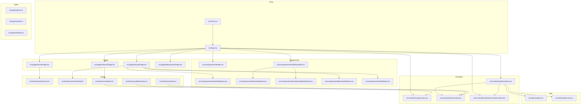
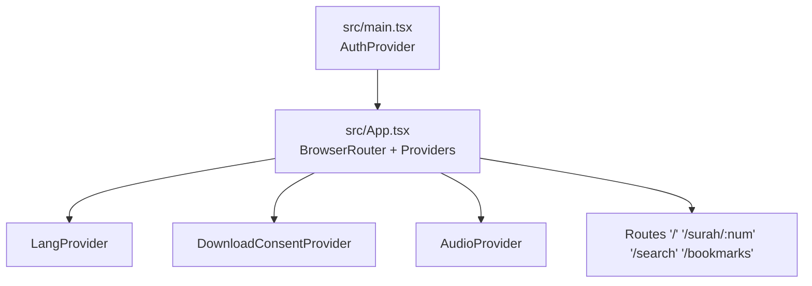
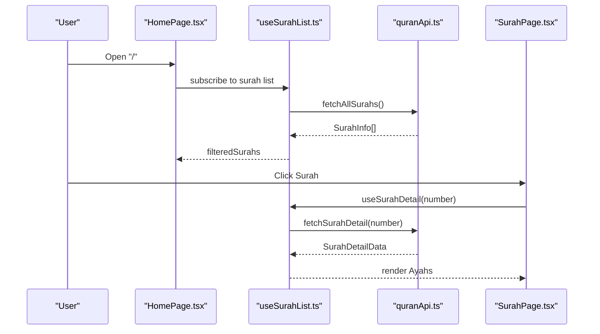
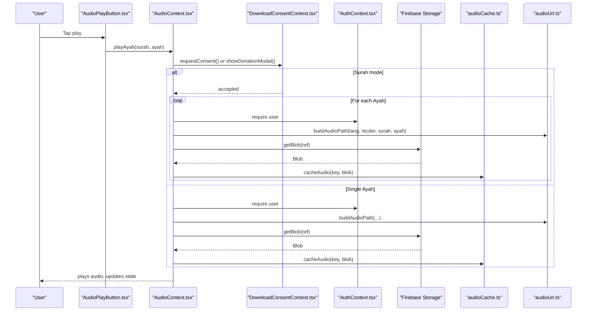
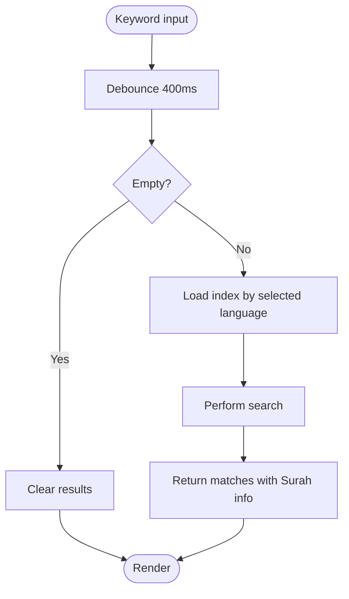
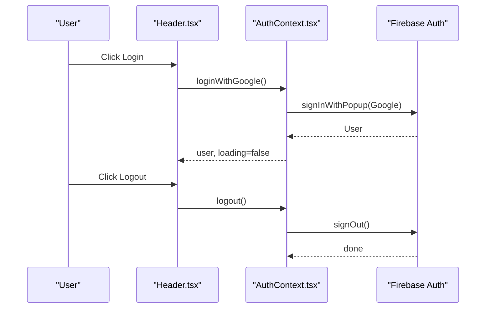
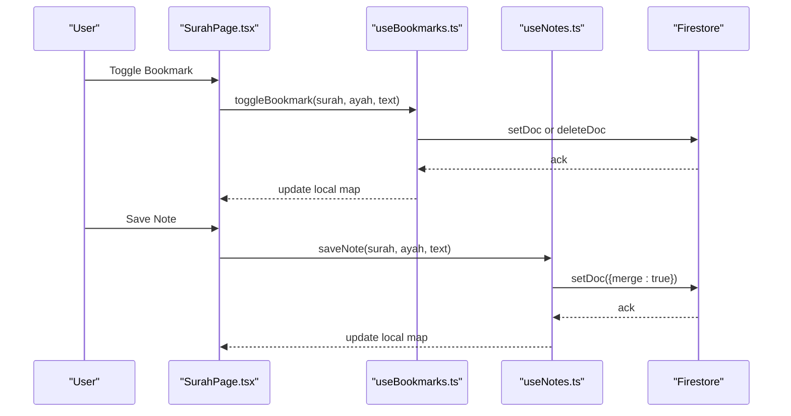
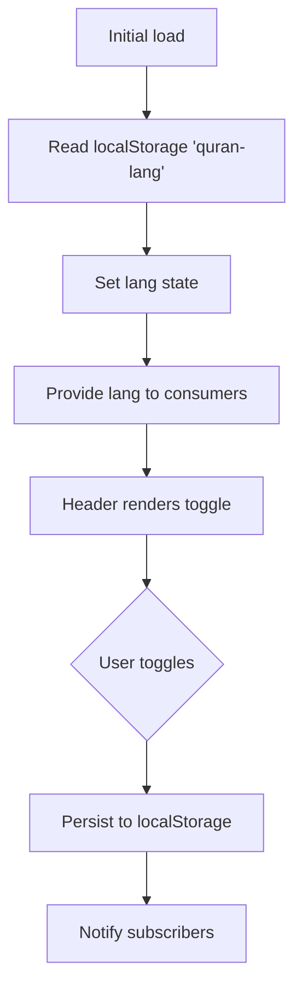
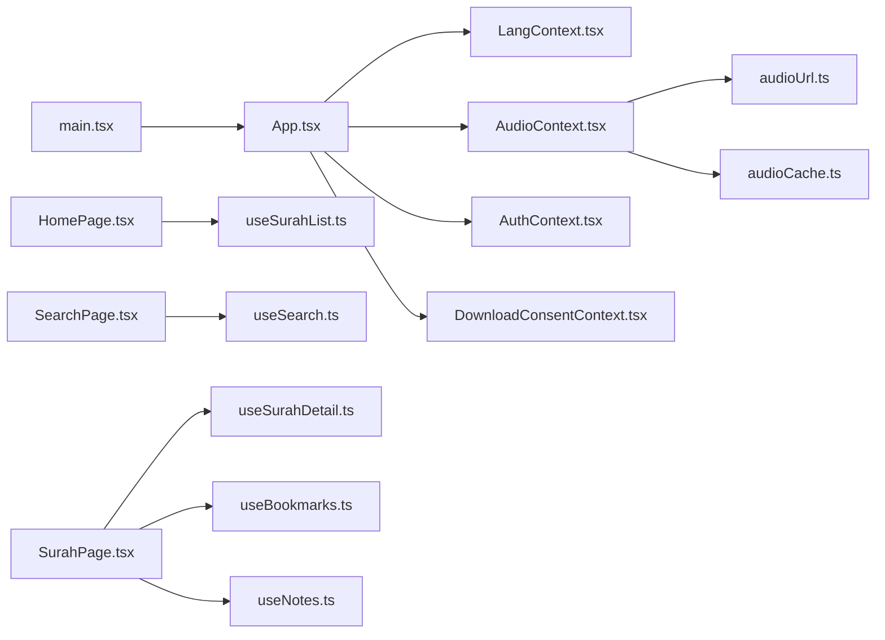

# Core Features

<cite>
**Referenced Files in This Document**
- [README.md](file://README.md)
- [package.json](file://package.json)
- [src/main.tsx](file://src/main.tsx)
- [src/App.tsx](file://src/App.tsx)
- [src/context/LangContext.tsx](file://src/context/LangContext.tsx)
- [src/context/AudioContext.tsx](file://src/context/AudioContext.tsx)
- [src/context/AuthContext.tsx](file://src/context/AuthContext.tsx)
- [src/context/DownloadConsentContext.tsx](file://src/context/DownloadConsentContext.tsx)
- [src/hooks/useSurahList.ts](file://src/hooks/useSurahList.ts)
- [src/hooks/useSurahDetail.ts](file://src/hooks/useSurahDetail.ts)
- [src/hooks/useSearch.ts](file://src/hooks/useSearch.ts)
- [src/hooks/useBookmarks.ts](file://src/hooks/useBookmarks.ts)
- [src/hooks/useNotes.ts](file://src/hooks/useNotes.ts)
- [src/types/quran.ts](file://src/types/quran.ts)
- [src/types/audio.ts](file://src/types/audio.ts)
- [src/types/firebase.ts](file://src/types/firebase.ts)
- [src/components/AudioPlayerBar.tsx](file://src/components/AudioPlayerBar.tsx)
- [src/components/AudioPlayButton.tsx](file://src/components/AudioPlayButton.tsx)
- [src/components/ReciterSelector.tsx](file://src/components/ReciterSelector.tsx)
- [src/components/RecitationModeSelector.tsx](file://src/components/RecitationModeSelector.tsx)
- [src/components/BookmarkButton.tsx](file://src/components/BookmarkButton.tsx)
- [src/components/NoteButton.tsx](file://src/components/NoteButton.tsx)
- [src/components/Header.tsx](file://src/components/Header.tsx)
- [src/pages/HomePage.tsx](file://src/pages/HomePage.tsx)
- [src/pages/SurahPage.tsx](file://src/pages/SurahPage.tsx)
- [src/pages/SearchPage.tsx](file://src/pages/SearchPage.tsx)
- [src/pages/BookmarksPage.tsx](file://src/pages/BookmarksPage.tsx)
- [src/utils/audioUrl.ts](file://src/utils/audioUrl.ts)
- [src/utils/audioCache.ts](file://src/utils/audioCache.ts)
</cite>

## Table of Contents
1. [Introduction](#introduction)
2. [Project Structure](#project-structure)
3. [Core Components](#core-components)
4. [Architecture Overview](#architecture-overview)
5. [Detailed Component Analysis](#detailed-component-analysis)
6. [Dependency Analysis](#dependency-analysis)
7. [Performance Considerations](#performance-considerations)
8. [Troubleshooting Guide](#troubleshooting-guide)
9. [Conclusion](#conclusion)
10. [Appendices](#appendices)

## Introduction
This document explains the core features of the Quran Reader application, focusing on:
- Quran navigation system
- Audio playback engine
- Search and discovery
- User management
- Bookmark and note system
- Multi-language support

It covers implementation details, user workflows, feature relationships, and performance considerations. The application is a modern web app built with React 19, TypeScript, Vite 8, Tailwind CSS 4, and Firebase. It operates fully offline for static data while integrating Firebase for user authentication, cloud storage, and Firestore documents for bookmarks and notes.

## Project Structure
The project follows a feature-oriented layout:
- src/api: local data access and client-side search
- src/components: reusable UI elements (navigation, player, buttons)
- src/context: global state providers (language, audio, auth, download consent)
- src/hooks: custom hooks for data fetching and state logic
- src/pages: route-level pages (Home, Surah, Search, Bookmarks)
- src/types: shared TypeScript interfaces
- src/utils: audio URL building and caching helpers
- public/data: local JSON datasets and prebuilt search indexes

**Diagram sources**
- [src/main.tsx:1-14](file://src/main.tsx#L1-L14)
- [src/App.tsx:1-56](file://src/App.tsx#L1-L56)
- [src/context/LangContext.tsx:1-32](file://src/context/LangContext.tsx#L1-L32)
- [src/context/AudioContext.tsx:1-396](file://src/context/AudioContext.tsx#L1-L396)
- [src/context/AuthContext.tsx:1-63](file://src/context/AuthContext.tsx#L1-L63)
- [src/context/DownloadConsentContext.tsx](file://src/context/DownloadConsentContext.tsx)
- [src/hooks/useSurahList.ts:1-47](file://src/hooks/useSurahList.ts#L1-L47)
- [src/hooks/useSurahDetail.ts:1-37](file://src/hooks/useSurahDetail.ts#L1-L37)
- [src/hooks/useSearch.ts:1-37](file://src/hooks/useSearch.ts#L1-L37)
- [src/hooks/useBookmarks.ts:1-88](file://src/hooks/useBookmarks.ts#L1-L88)
- [src/hooks/useNotes.ts:1-92](file://src/hooks/useNotes.ts#L1-L92)
- [src/types/quran.ts:1-64](file://src/types/quran.ts#L1-L64)
- [src/types/audio.ts:1-41](file://src/types/audio.ts#L1-L41)
- [src/types/firebase.ts:1-20](file://src/types/firebase.ts#L1-L20)
- [src/utils/audioUrl.ts](file://src/utils/audioUrl.ts)
- [src/utils/audioCache.ts](file://src/utils/audioCache.ts)

**Section sources**
- [README.md:1-85](file://README.md#L1-L85)
- [package.json:1-29](file://package.json#L1-L29)

## Core Components
- Language and UI text switching via LangContext with persistent preference in localStorage.
- Audio playback engine with reciter selection, recitation modes, and automatic multi-language sequencing.
- Authentication via Firebase Auth with Google provider and Firestore-backed bookmarks/notes.
- Client-side search powered by prebuilt indexes for Malay and English.
- Navigation across Surahs and Ayahs with caching and filtering.
- Persistent user data (bookmarks and notes) stored per-user collections.

**Section sources**
- [src/context/LangContext.tsx:1-32](file://src/context/LangContext.tsx#L1-L32)
- [src/context/AudioContext.tsx:1-396](file://src/context/AudioContext.tsx#L1-L396)
- [src/context/AuthContext.tsx:1-63](file://src/context/AuthContext.tsx#L1-L63)
- [src/hooks/useSearch.ts:1-37](file://src/hooks/useSearch.ts#L1-L37)
- [src/hooks/useSurahList.ts:1-47](file://src/hooks/useSurahList.ts#L1-L47)
- [src/hooks/useBookmarks.ts:1-88](file://src/hooks/useBookmarks.ts#L1-L88)
- [src/hooks/useNotes.ts:1-92](file://src/hooks/useNotes.ts#L1-L92)

## Architecture Overview
The app composes global providers around a routed layout. Providers manage cross-cutting concerns:
- LangContext: language selection and persistence
- AudioContext: audio lifecycle, caching, consent, and playback orchestration
- AuthContext: user session and Google OAuth
- DownloadConsentContext: prompts and permissions for bulk downloads

**Diagram sources**
- [src/main.tsx:1-14](file://src/main.tsx#L1-L14)
- [src/App.tsx:1-56](file://src/App.tsx#L1-L56)

## Detailed Component Analysis

### Quran Navigation System
- Surah browsing and filtering: useSurahList caches and filters Surah metadata client-side.
- Surah detail rendering: useSurahDetail loads per-Surah data files and exposes Arabic, transliteration, Malay, and English editions.
- Routing: HomePage lists Surahs; SurahPage renders Ayahs with language controls.

**Diagram sources**
- [src/pages/HomePage.tsx](file://src/pages/HomePage.tsx)
- [src/hooks/useSurahList.ts:1-47](file://src/hooks/useSurahList.ts#L1-L47)
- [src/hooks/useSurahDetail.ts:1-37](file://src/hooks/useSurahDetail.ts#L1-L37)

**Section sources**
- [src/hooks/useSurahList.ts:1-47](file://src/hooks/useSurahList.ts#L1-L47)
- [src/hooks/useSurahDetail.ts:1-37](file://src/hooks/useSurahDetail.ts#L1-L37)
- [src/types/quran.ts:1-64](file://src/types/quran.ts#L1-L64)

### Audio Playback Engine
- Playback orchestration: AudioContext manages state transitions, blob retrieval, caching, and event-driven sequencing.
- Consent and downloads: Surah-wide playback triggers a donation prompt and bulk caching; single Ayah requires explicit consent and caches per Ayah.
- Recitation modes: Arabic-only, Malay-only, and Arabic-then-Malay with seamless language switching.
- Player bar: exposes controls and reciter/mode selectors.

**Diagram sources**
- [src/context/AudioContext.tsx:1-396](file://src/context/AudioContext.tsx#L1-L396)
- [src/context/DownloadConsentContext.tsx](file://src/context/DownloadConsentContext.tsx)
- [src/context/AuthContext.tsx:1-63](file://src/context/AuthContext.tsx#L1-L63)
- [src/utils/audioUrl.ts](file://src/utils/audioUrl.ts)
- [src/utils/audioCache.ts](file://src/utils/audioCache.ts)

**Section sources**
- [src/context/AudioContext.tsx:1-396](file://src/context/AudioContext.tsx#L1-L396)
- [src/types/audio.ts:1-41](file://src/types/audio.ts#L1-L41)
- [src/components/AudioPlayerBar.tsx](file://src/components/AudioPlayerBar.tsx)
- [src/components/AudioPlayButton.tsx](file://src/components/AudioPlayButton.tsx)
- [src/components/ReciterSelector.tsx](file://src/components/ReciterSelector.tsx)
- [src/components/RecitationModeSelector.tsx](file://src/components/RecitationModeSelector.tsx)

### Search and Discovery
- Client-side search: useSearch debounces queries and searches prebuilt indexes for Malay and English.
- Language-aware highlighting: results are presented with matched Surah metadata.

**Diagram sources**
- [src/hooks/useSearch.ts:1-37](file://src/hooks/useSearch.ts#L1-L37)
- [src/context/LangContext.tsx:1-32](file://src/context/LangContext.tsx#L1-L32)

**Section sources**
- [src/hooks/useSearch.ts:1-37](file://src/hooks/useSearch.ts#L1-L37)
- [src/pages/SearchPage.tsx](file://src/pages/SearchPage.tsx)

### User Management
- Authentication: AuthContext handles onAuthStateChanged, Google login, and logout.
- UI integration: LoginButton and UserMenu components consume useAuth.

**Diagram sources**
- [src/context/AuthContext.tsx:1-63](file://src/context/AuthContext.tsx#L1-L63)
- [src/components/Header.tsx](file://src/components/Header.tsx)

**Section sources**
- [src/context/AuthContext.tsx:1-63](file://src/context/AuthContext.tsx#L1-L63)
- [src/components/LoginButton.tsx](file://src/components/LoginButton.tsx)
- [src/components/UserMenu.tsx](file://src/components/UserMenu.tsx)

### Bookmark and Note System
- Persistence: Firestore collections under users/{uid}/bookmarks and users/{uid}/notes.
- Sync: Realtime snapshots keep local maps up-to-date.
- Operations: Toggle bookmark, add/update/delete note; IDs use the documented convention.

**Diagram sources**
- [src/hooks/useBookmarks.ts:1-88](file://src/hooks/useBookmarks.ts#L1-L88)
- [src/hooks/useNotes.ts:1-92](file://src/hooks/useNotes.ts#L1-L92)
- [src/types/firebase.ts:1-20](file://src/types/firebase.ts#L1-L20)

**Section sources**
- [src/hooks/useBookmarks.ts:1-88](file://src/hooks/useBookmarks.ts#L1-L88)
- [src/hooks/useNotes.ts:1-92](file://src/hooks/useNotes.ts#L1-L92)
- [src/types/firebase.ts:1-20](file://src/types/firebase.ts#L1-L20)
- [src/components/BookmarkButton.tsx](file://src/components/BookmarkButton.tsx)
- [src/components/NoteButton.tsx](file://src/components/NoteButton.tsx)
- [src/pages/BookmarksPage.tsx](file://src/pages/BookmarksPage.tsx)

### Multi-Language Support
- Language preference: LangContext stores 'ms' (Malay) or 'en' (English) in localStorage and exposes setLang.
- UI text and search: Header component toggles language; useSearch respects the selected language for index lookup.
- Audio language: AudioContext switches activeLanguage and recitationMode accordingly.

**Diagram sources**
- [src/context/LangContext.tsx:1-32](file://src/context/LangContext.tsx#L1-L32)
- [src/components/Header.tsx](file://src/components/Header.tsx)

**Section sources**
- [src/context/LangContext.tsx:1-32](file://src/context/LangContext.tsx#L1-L32)
- [src/hooks/useSearch.ts:1-37](file://src/hooks/useSearch.ts#L1-L37)
- [src/context/AudioContext.tsx:1-396](file://src/context/AudioContext.tsx#L1-L396)

## Dependency Analysis
- Global providers are wired in main.tsx and App.tsx, ensuring all routes and components can access language, audio, auth, and consent contexts.
- Hooks depend on shared types and API utilities; AudioContext depends on Firebase Storage and Firestore indirectly via consent and auth flows.
- Pages coordinate multiple hooks and components to deliver cohesive experiences.

**Diagram sources**
- [src/main.tsx:1-14](file://src/main.tsx#L1-L14)
- [src/App.tsx:1-56](file://src/App.tsx#L1-L56)
- [src/hooks/useSurahList.ts:1-47](file://src/hooks/useSurahList.ts#L1-L47)
- [src/hooks/useSurahDetail.ts:1-37](file://src/hooks/useSurahDetail.ts#L1-L37)
- [src/hooks/useSearch.ts:1-37](file://src/hooks/useSearch.ts#L1-L37)
- [src/hooks/useBookmarks.ts:1-88](file://src/hooks/useBookmarks.ts#L1-L88)
- [src/hooks/useNotes.ts:1-92](file://src/hooks/useNotes.ts#L1-L92)
- [src/context/AudioContext.tsx:1-396](file://src/context/AudioContext.tsx#L1-L396)
- [src/utils/audioUrl.ts](file://src/utils/audioUrl.ts)
- [src/utils/audioCache.ts](file://src/utils/audioCache.ts)

**Section sources**
- [src/main.tsx:1-14](file://src/main.tsx#L1-L14)
- [src/App.tsx:1-56](file://src/App.tsx#L1-L56)

## Performance Considerations
- Caching
  - Audio caching: AudioContext caches downloaded blobs keyed by reciter and Ayah to avoid repeated network requests during playback sessions.
  - Surah-wide caching: In surah play mode, the engine pre-caches all required Ayahs for the chosen recitation mode to minimize latency.
- Debouncing
  - Search debounce reduces redundant API calls and improves responsiveness for fast typing.
- Memoization
  - Filtering Surahs avoids unnecessary re-renders by memoizing derived results.
- Offline-first
  - All Surah data and prebuilt search indexes are bundled locally, enabling instant access without network dependency.
- Lazy initialization
  - Audio element and state refs prevent stale closures and reduce re-renders in event handlers.
- Recommendations
  - Limit concurrent downloads by enforcing user consent and consolidating surah-mode caching.
  - Consider prefetching adjacent Ayahs when possible to smooth transitions.
  - Monitor cache size and implement eviction policies if storage grows large.

**Section sources**
- [src/context/AudioContext.tsx:1-396](file://src/context/AudioContext.tsx#L1-L396)
- [src/hooks/useSearch.ts:1-37](file://src/hooks/useSearch.ts#L1-L37)
- [src/hooks/useSurahList.ts:1-47](file://src/hooks/useSurahList.ts#L1-L47)

## Troubleshooting Guide
- Authentication errors
  - Symptom: Playback fails with a message indicating the need to log in.
  - Cause: Firebase Auth user is required for downloading audio.
  - Resolution: Trigger login via the header menu and retry.
- Network or storage errors
  - Symptom: Error messages indicate failure to load or play audio.
  - Cause: Network connectivity or Firebase Storage unavailability.
  - Resolution: Verify connection, retry, and ensure storage references are correct.
- Surah-mode consent not granted
  - Symptom: Surah playback does not start.
  - Cause: Consent dialog dismissed or donation modal closed without acceptance.
  - Resolution: Accept the consent or donation prompt to enable bulk caching and playback.
- Cache inconsistencies
  - Symptom: Old or missing audio segments.
  - Resolution: Clear browser cache and allow the app to re-cache required segments.
- Search yields no results
  - Symptom: Empty search results.
  - Cause: Keyword too short or mismatched language.
  - Resolution: Adjust language preference and refine the keyword.

**Section sources**
- [src/context/AudioContext.tsx:1-396](file://src/context/AudioContext.tsx#L1-L396)
- [src/context/AuthContext.tsx:1-63](file://src/context/AuthContext.tsx#L1-L63)
- [src/hooks/useSearch.ts:1-37](file://src/hooks/useSearch.ts#L1-L37)

## Conclusion
The Quran Reader integrates a robust navigation system, a flexible audio engine with multi-language support, efficient client-side search, and user-centric features like bookmarks and notes. Its architecture leverages React hooks, Firebase, and local data to deliver a responsive, offline-capable experience. By following the workflows and recommendations outlined here, users can efficiently explore, listen, and personalize their Quran reading journey.

## Appendices
- Practical examples
  - Navigate to a Surah and tap an Ayah to play it with the current reciter and mode.
  - Switch language in the header to view Malay or English translations.
  - Toggle a bookmark or add a note on any Ayah; changes sync automatically when logged in.
  - Use the search bar to find keywords across Malay or English translations.
  - Play an entire Surah in Arabic-only, Malay-only, or Arabic-then-Malay mode.

- Advanced functionality
  - Surah-wide playback preloads audio for smoother transitions.
  - Arabic-then-Malay mode alternates languages per Ayah seamlessly.
  - Real-time sync ensures bookmarks and notes persist across devices for the logged-in user.

[No sources needed since this section summarizes without analyzing specific files]