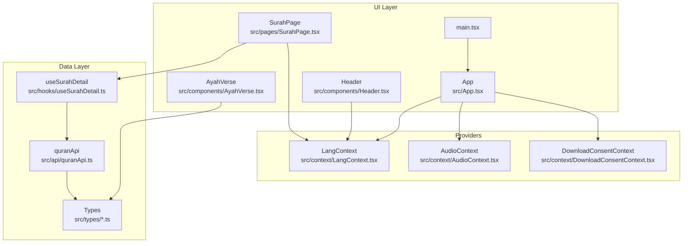
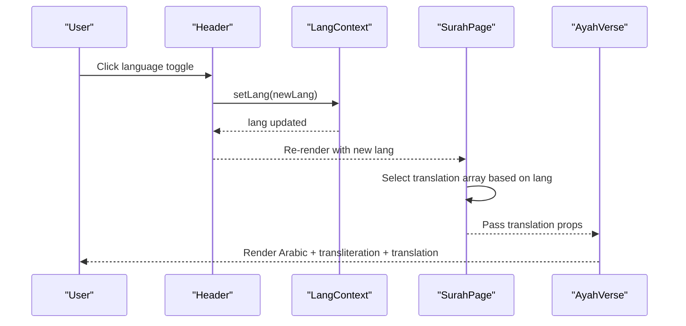
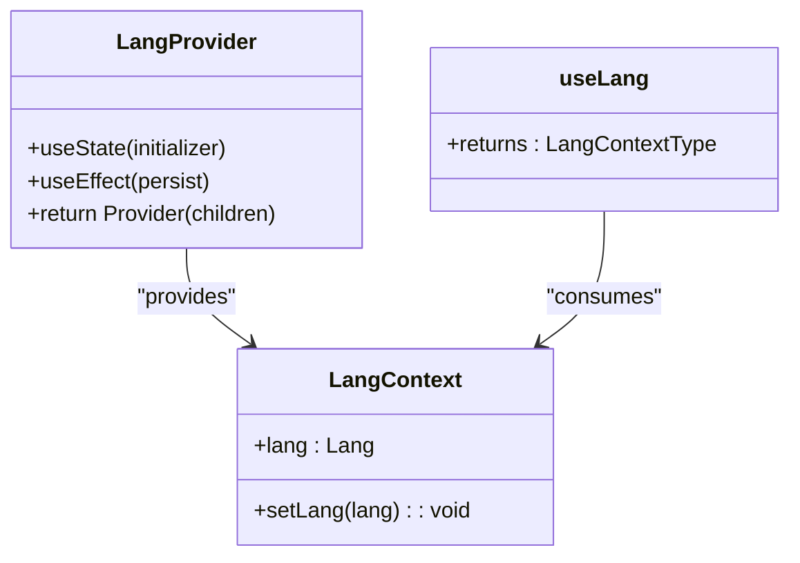
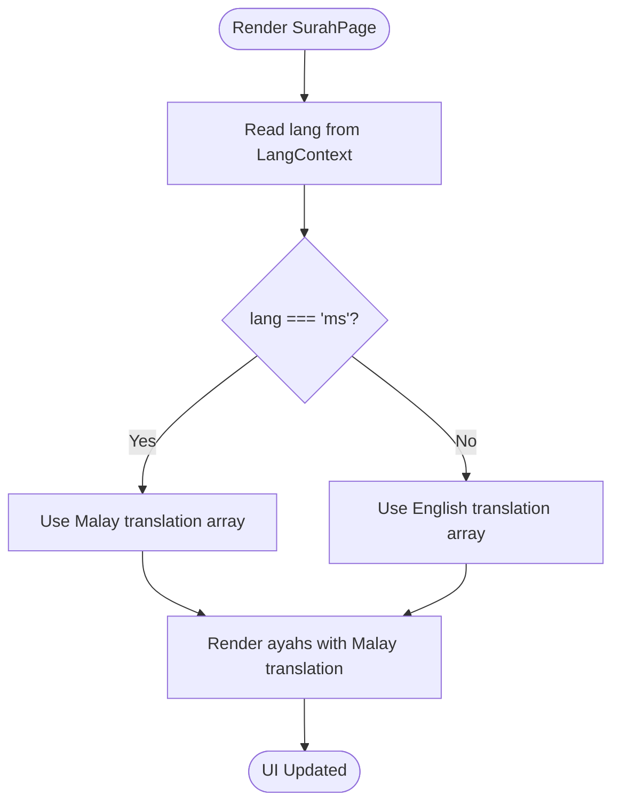
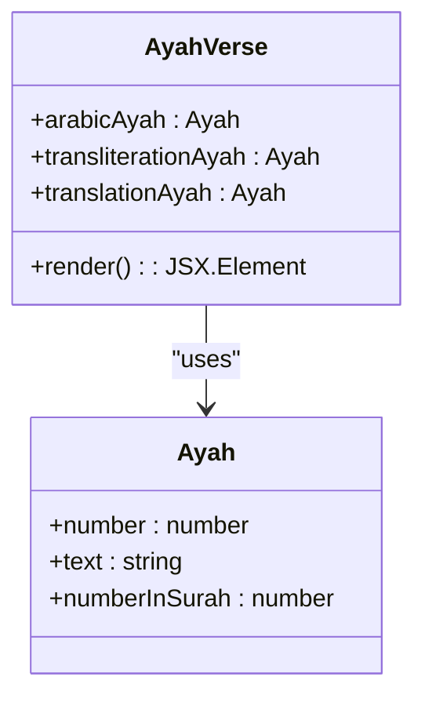
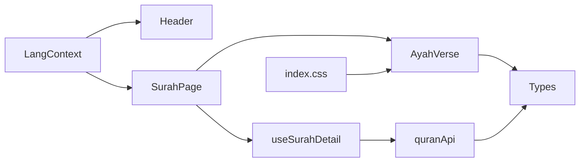

# Multi-Language & Translation System

<cite>
**Referenced Files in This Document**
- [LangContext.tsx](file://src/context/LangContext.tsx)
- [Header.tsx](file://src/components/Header.tsx)
- [SurahPage.tsx](file://src/pages/SurahPage.tsx)
- [AyahVerse.tsx](file://src/components/AyahVerse.tsx)
- [quranApi.ts](file://src/api/quranApi.ts)
- [useSurahDetail.ts](file://src/hooks/useSurahDetail.ts)
- [index.css](file://src/index.css)
- [App.tsx](file://src/App.tsx)
- [main.tsx](file://src/main.tsx)
- [AudioContext.tsx](file://src/context/AudioContext.tsx)
- [audio.ts](file://src/types/audio.ts)
- [quran.ts](file://src/types/quran.ts)
</cite>

## Table of Contents
1. [Introduction](#introduction)
2. [Project Structure](#project-structure)
3. [Core Components](#core-components)
4. [Architecture Overview](#architecture-overview)
5. [Detailed Component Analysis](#detailed-component-analysis)
6. [Dependency Analysis](#dependency-analysis)
7. [Performance Considerations](#performance-considerations)
8. [Accessibility and Internationalization](#accessibility-and-internationalization)
9. [Troubleshooting Guide](#troubleshooting-guide)
10. [Conclusion](#conclusion)

## Introduction
This document explains the multi-language and translation system of the application, focusing on language switching, translation display logic, cultural adaptation, and responsive typography for different writing systems. It documents the LangContext provider, language preference management, and dynamic content switching between Malay and English translations. It also covers the Arabic text rendering alongside Malay and English, including RTL considerations and internationalization best practices.

## Project Structure
The language system is centered around a React context provider that stores and propagates the selected language across the app. Components consume the language preference to render localized content and manage user interactions such as language toggling. Data fetching utilities support language-aware search indexing.

**Diagram sources**
- [LangContext.tsx:1-32](file://src/context/LangContext.tsx#L1-L32)
- [Header.tsx:1-68](file://src/components/Header.tsx#L1-L68)
- [SurahPage.tsx:1-120](file://src/pages/SurahPage.tsx#L1-L120)
- [AyahVerse.tsx:1-63](file://src/components/AyahVerse.tsx#L1-L63)
- [quranApi.ts:1-51](file://src/api/quranApi.ts#L1-L51)
- [useSurahDetail.ts:1-37](file://src/hooks/useSurahDetail.ts#L1-L37)
- [App.tsx:1-56](file://src/App.tsx#L1-L56)
- [main.tsx:1-14](file://src/main.tsx#L1-L14)
- [AudioContext.tsx:239-271](file://src/context/AudioContext.tsx#L239-L271)
- [audio.ts:1-40](file://src/types/audio.ts#L1-L40)
- [quran.ts:1-63](file://src/types/quran.ts#L1-L63)

**Section sources**
- [LangContext.tsx:1-32](file://src/context/LangContext.tsx#L1-L32)
- [Header.tsx:1-68](file://src/components/Header.tsx#L1-L68)
- [SurahPage.tsx:1-120](file://src/pages/SurahPage.tsx#L1-L120)
- [AyahVerse.tsx:1-63](file://src/components/AyahVerse.tsx#L1-L63)
- [quranApi.ts:1-51](file://src/api/quranApi.ts#L1-L51)
- [useSurahDetail.ts:1-37](file://src/hooks/useSurahDetail.ts#L1-L37)
- [App.tsx:1-56](file://src/App.tsx#L1-L56)
- [main.tsx:1-14](file://src/main.tsx#L1-L14)

## Core Components
- LangContext: Provides language state and setter via React Context, persists preference to localStorage, and exposes a hook for consumption.
- Header: Renders language toggle buttons and applies active state styling based on current language.
- SurahPage: Consumes language preference to select between Malay and English translations for ayah content.
- AyahVerse: Renders Arabic text with appropriate typography and directionality, plus transliteration and translation.
- quranApi: Loads prebuilt search indices per language and supports language-aware search.
- Types: Define data models for surah editions, ayahs, and recitation modes, including language-specific fields.

Key implementation highlights:
- Language selection is binary ('ms' or 'en') and persisted in localStorage under a dedicated key.
- Dynamic content switching occurs in SurahPage by selecting the appropriate translation array based on the current language.
- Arabic text is rendered with a dedicated font stack and RTL attributes for correct display.
- Search indexing is loaded lazily and cached per language.

**Section sources**
- [LangContext.tsx:1-32](file://src/context/LangContext.tsx#L1-L32)
- [Header.tsx:1-68](file://src/components/Header.tsx#L1-L68)
- [SurahPage.tsx:33-35](file://src/pages/SurahPage.tsx#L33-L35)
- [AyahVerse.tsx:43-60](file://src/components/AyahVerse.tsx#L43-L60)
- [quranApi.ts:21-41](file://src/api/quranApi.ts#L21-L41)
- [quran.ts:40-45](file://src/types/quran.ts#L40-L45)

## Architecture Overview
The language system follows a unidirectional data flow:
- LangContext initializes language from localStorage and updates it on change.
- Header triggers language changes via the context setter.
- SurahPage reads the language and selects the correct translation set.
- AyahVerse renders Arabic text with proper typography and directionality.
- quranApi loads language-specific search indices and surfaces them to search components.

**Diagram sources**
- [Header.tsx:42-63](file://src/components/Header.tsx#L42-L63)
- [LangContext.tsx:12-27](file://src/context/LangContext.tsx#L12-L27)
- [SurahPage.tsx:14-35](file://src/pages/SurahPage.tsx#L14-L35)
- [AyahVerse.tsx:43-60](file://src/components/AyahVerse.tsx#L43-L60)

## Detailed Component Analysis

### LangContext Provider
Responsibilities:
- Initialize language from localStorage with a fallback to Malay.
- Persist language changes to localStorage.
- Expose a hook for consuming components to read and update language.

Implementation patterns:
- Uses useState with a factory initializer to read persisted language.
- Uses useEffect to synchronize state to localStorage after each change.
- Exposes a typed context with a narrow interface containing only the necessary fields.

**Diagram sources**
- [LangContext.tsx:3-8](file://src/context/LangContext.tsx#L3-L8)
- [LangContext.tsx:12-27](file://src/context/LangContext.tsx#L12-L27)
- [LangContext.tsx:29-31](file://src/context/LangContext.tsx#L29-L31)

**Section sources**
- [LangContext.tsx:1-32](file://src/context/LangContext.tsx#L1-L32)

### Language Toggle in Header
Responsibilities:
- Render two language buttons (Malay and English).
- Apply active state styling based on current language.
- Invoke the context setter to switch languages.

Behavior:
- Clicking a button calls setLang with the corresponding language code.
- The component re-renders to reflect the new language state.

**Section sources**
- [Header.tsx:42-63](file://src/components/Header.tsx#L42-L63)

### Dynamic Content Switching in SurahPage
Responsibilities:
- Consume the current language from LangContext.
- Select the appropriate translation set (Malay vs English) for ayah content.
- Render Surah metadata and ayah blocks accordingly.

Logic:
- The translation array is chosen based on the current language.
- Surah metadata and ayah lists are rendered with Arabic typography and directionality.

**Diagram sources**
- [SurahPage.tsx:14-35](file://src/pages/SurahPage.tsx#L14-L35)

**Section sources**
- [SurahPage.tsx:14-35](file://src/pages/SurahPage.tsx#L14-L35)

### Arabic Text Rendering and Typography
Responsibilities:
- Render Arabic text with appropriate fonts, sizing, and spacing.
- Set directionality and language attributes for correct rendering and assistive technology support.
- Display transliteration and translation alongside Arabic.

Implementation:
- Arabic paragraphs use a dedicated font variable and RTL direction.
- Language attribute is set to Arabic for screen readers and other tools.
- Transliteration and translation are rendered below Arabic text.

**Diagram sources**
- [AyahVerse.tsx:7-12](file://src/components/AyahVerse.tsx#L7-L12)
- [quran.ts:10-17](file://src/types/quran.ts#L10-L17)

**Section sources**
- [AyahVerse.tsx:43-60](file://src/components/AyahVerse.tsx#L43-L60)
- [index.css:4-6](file://src/index.css#L4-L6)

### Language-Aware Search Indexing
Responsibilities:
- Load prebuilt search indices for Malay and English.
- Cache indices in memory after first load.
- Support language-aware search queries.

Implementation:
- Indices are fetched from static JSON files.
- A lazy initialization pattern ensures single load per language.
- Search function returns matches filtered by the current language index.

**Section sources**
- [quranApi.ts:21-41](file://src/api/quranApi.ts#L21-L41)

### Language Preference Persistence
Mechanism:
- On mount, LangContext reads a stored key from localStorage.
- On each language change, the new value is written back to localStorage.
- The provider wraps the entire app, ensuring global availability.

**Section sources**
- [LangContext.tsx:13-20](file://src/context/LangContext.tsx#L13-L20)

### Integration with Audio System (Arabic-Malay Mode)
While the primary focus here is language display, the audio system demonstrates complementary behavior for mixed-language recitations:
- Recitation modes include single-language and Arabic-followed-by-Malay sequences.
- Active language state influences which reciter is selected and how playback transitions occur.

**Section sources**
- [AudioContext.tsx:239-271](file://src/context/AudioContext.tsx#L239-L271)
- [audio.ts:1-7](file://src/types/audio.ts#L1-L7)

## Dependency Analysis
The language system exhibits low coupling and clear separation of concerns:
- LangContext is a pure state container with minimal dependencies.
- UI components depend on the context via a simple hook.
- Data fetching utilities depend on the LangContext type for search operations.
- Styles depend on CSS variables for typography customization.

**Diagram sources**
- [LangContext.tsx:1-32](file://src/context/LangContext.tsx#L1-L32)
- [Header.tsx:1-68](file://src/components/Header.tsx#L1-L68)
- [SurahPage.tsx:1-120](file://src/pages/SurahPage.tsx#L1-L120)
- [AyahVerse.tsx:1-63](file://src/components/AyahVerse.tsx#L1-L63)
- [useSurahDetail.ts:1-37](file://src/hooks/useSurahDetail.ts#L1-L37)
- [quranApi.ts:1-51](file://src/api/quranApi.ts#L1-L51)
- [index.css:1-18](file://src/index.css#L1-L18)
- [quran.ts:1-63](file://src/types/quran.ts#L1-L63)

**Section sources**
- [LangContext.tsx:1-32](file://src/context/LangContext.tsx#L1-L32)
- [Header.tsx:1-68](file://src/components/Header.tsx#L1-L68)
- [SurahPage.tsx:1-120](file://src/pages/SurahPage.tsx#L1-L120)
- [AyahVerse.tsx:1-63](file://src/components/AyahVerse.tsx#L1-L63)
- [quranApi.ts:1-51](file://src/api/quranApi.ts#L1-L51)
- [useSurahDetail.ts:1-37](file://src/hooks/useSurahDetail.ts#L1-L37)
- [index.css:1-18](file://src/index.css#L1-L18)
- [quran.ts:1-63](file://src/types/quran.ts#L1-L63)

## Performance Considerations
- Lazy loading and caching of search indices reduce initial load time and avoid redundant network requests.
- LocalStorage persistence avoids repeated server calls for language preferences.
- Minimal re-renders: language changes propagate through context, triggering only affected components.
- Font loading: Arabic typography relies on external fonts; ensure adequate fallbacks and consider preloading strategies.

## Accessibility and Internationalization
RTL and script considerations:
- Arabic text is rendered with RTL direction and language attributes for assistive technologies.
- Dedicated font variables ensure proper rendering of Arabic glyphs.
- Direction and language attributes are applied consistently in components that render Arabic content.

Internationalization best practices:
- Keep language keys minimal and consistent across the app.
- Use semantic markup with lang attributes for screen readers.
- Provide fallbacks for fonts and ensure readable line lengths for different scripts.
- Consider right-to-left layouts for components that include Arabic text.

**Section sources**
- [AyahVerse.tsx:45-48](file://src/components/AyahVerse.tsx#L45-L48)
- [SurahPage.tsx:52-54](file://src/pages/SurahPage.tsx#L52-L54)
- [SurahPage.tsx:74-75](file://src/pages/SurahPage.tsx#L74-L75)
- [index.css:4-6](file://src/index.css#L4-L6)

## Troubleshooting Guide
Common issues and resolutions:
- Language does not persist across sessions:
  - Verify localStorage key exists and contains a valid language value.
  - Ensure the provider is mounted at the root level.
  - Confirm the effect persists the language after changes.
  - References: [LangContext.tsx:13-20](file://src/context/LangContext.tsx#L13-L20), [App.tsx:44-53](file://src/App.tsx#L44-L53), [main.tsx:7-12](file://src/main.tsx#L7-L12)

- Arabic text appears incorrectly or unreadable:
  - Confirm the Arabic font variable is defined and available.
  - Ensure direction and language attributes are present on Arabic elements.
  - References: [index.css:4-6](file://src/index.css#L4-L6), [AyahVerse.tsx:45-48](file://src/components/AyahVerse.tsx#L45-L48), [SurahPage.tsx:52-54](file://src/pages/SurahPage.tsx#L52-L54)

- Search results do not match expected language:
  - Confirm the search function receives the correct language argument.
  - Verify that indices are loaded for the selected language.
  - References: [quranApi.ts:21-41](file://src/api/quranApi.ts#L21-L41)

- Mixed-language audio behavior:
  - Review recitation mode logic for Arabic-first and Malay transitions.
  - References: [AudioContext.tsx:239-271](file://src/context/AudioContext.tsx#L239-L271), [audio.ts:1-7](file://src/types/audio.ts#L1-L7)

## Conclusion
The multi-language system centers on a lightweight, persistent language context that enables seamless switching between Malay and English. SurahPage dynamically selects translation content based on the current language, while AyahVerse renders Arabic text with appropriate typography and directionality. Search functionality is indexed per language and cached for performance. Together, these components provide a robust foundation for multilingual presentation and accessibility, with room to extend support to additional languages and writing systems.