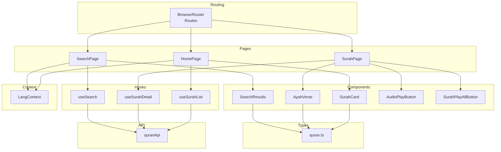
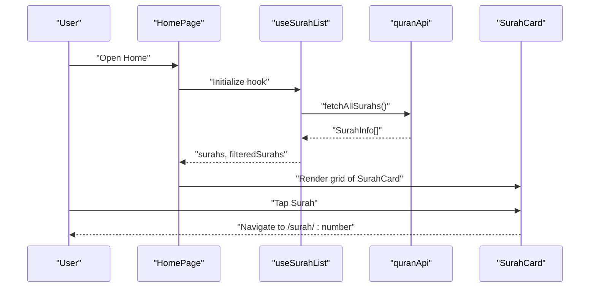
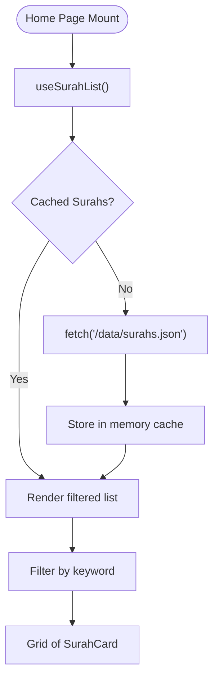
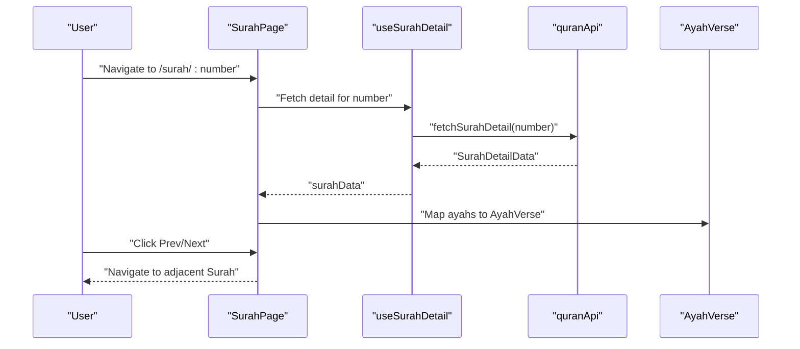
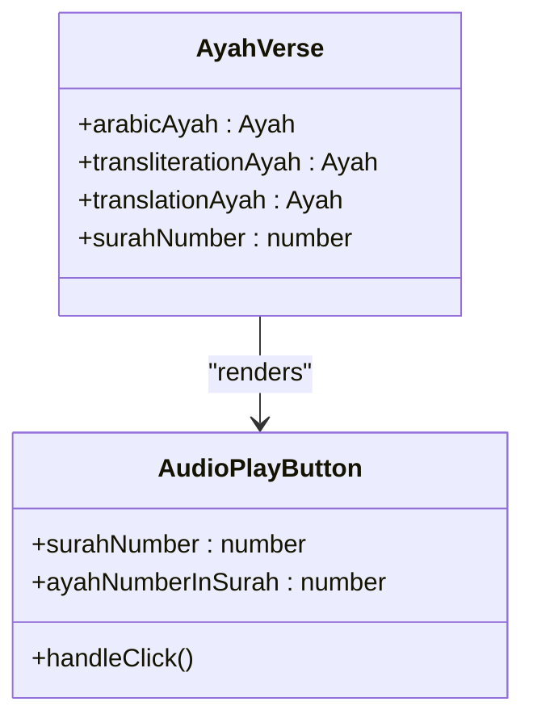
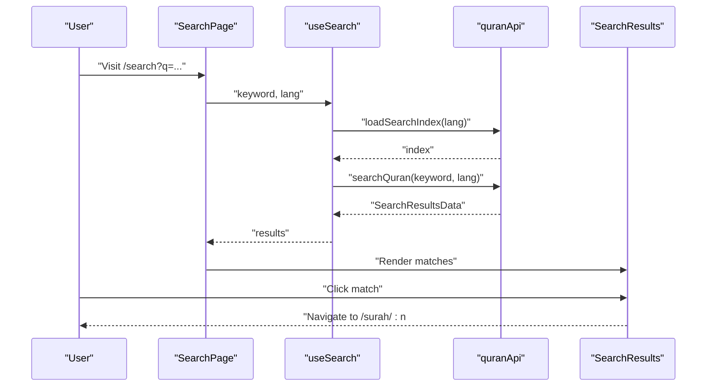
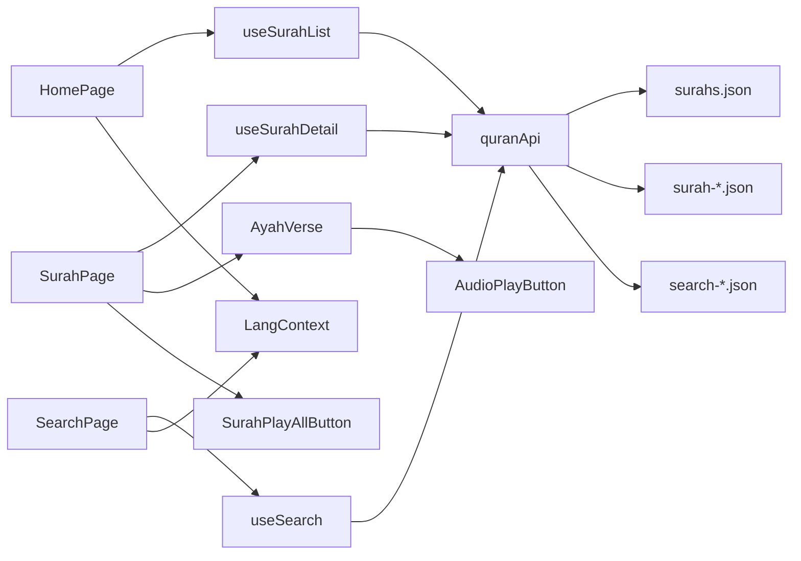

# Quran Navigation System

<cite>
**Referenced Files in This Document**
- [README.md](file://README.md)
- [src/App.tsx](file://src/App.tsx)
- [src/index.css](file://src/index.css)
- [src/types/quran.ts](file://src/types/quran.ts)
- [src/api/quranApi.ts](file://src/api/quranApi.ts)
- [src/hooks/useSurahList.ts](file://src/hooks/useSurahList.ts)
- [src/hooks/useSurahDetail.ts](file://src/hooks/useSurahDetail.ts)
- [src/hooks/useSearch.ts](file://src/hooks/useSearch.ts)
- [src/pages/HomePage.tsx](file://src/pages/HomePage.tsx)
- [src/pages/SurahPage.tsx](file://src/pages/SurahPage.tsx)
- [src/pages/SearchPage.tsx](file://src/pages/SearchPage.tsx)
- [src/components/SurahCard.tsx](file://src/components/SurahCard.tsx)
- [src/components/AyahVerse.tsx](file://src/components/AyahVerse.tsx)
- [src/components/SearchResults.tsx](file://src/components/SearchResults.tsx)
- [src/context/LangContext.tsx](file://src/context/LangContext.tsx)
- [src/utils/audioUrl.ts](file://src/utils/audioUrl.ts)
- [src/components/AudioPlayButton.tsx](file://src/components/AudioPlayButton.tsx)
- [src/components/SurahPlayAllButton.tsx](file://src/components/SurahPlayAllButton.tsx)
</cite>

## Table of Contents
1. [Introduction](#introduction)
2. [Project Structure](#project-structure)
3. [Core Components](#core-components)
4. [Architecture Overview](#architecture-overview)
5. [Detailed Component Analysis](#detailed-component-analysis)
6. [Dependency Analysis](#dependency-analysis)
7. [Performance Considerations](#performance-considerations)
8. [Troubleshooting Guide](#troubleshooting-guide)
9. [Conclusion](#conclusion)
10. [Appendices](#appendices)

## Introduction
This document describes the Quran navigation system, focusing on Surah listing, Surah detail display, Ayah-by-Ayah navigation, and responsive design. It explains the implementation of key components (SurahCard, AyahVerse) and navigation workflows, documents the data models (SurahInfo, SurahDetailData, Ayah), and covers filtering, sorting, and pagination patterns. It also addresses performance optimizations for large datasets and user experience patterns for mobile and desktop interfaces.

## Project Structure
The application is a React + TypeScript + Vite project styled with Tailwind CSS 4. Data is served locally via JSON files under public/data, enabling offline-first operation. Routing is handled by React Router 7, and language preferences are managed via a context provider.



**Diagram sources**
- [src/App.tsx:1-56](file://src/App.tsx#L1-L56)
- [src/pages/HomePage.tsx:1-44](file://src/pages/HomePage.tsx#L1-L44)
- [src/pages/SurahPage.tsx:1-120](file://src/pages/SurahPage.tsx#L1-L120)
- [src/pages/SearchPage.tsx:1-47](file://src/pages/SearchPage.tsx#L1-L47)
- [src/hooks/useSurahList.ts:1-47](file://src/hooks/useSurahList.ts#L1-L47)
- [src/hooks/useSurahDetail.ts:1-37](file://src/hooks/useSurahDetail.ts#L1-L37)
- [src/hooks/useSearch.ts:1-37](file://src/hooks/useSearch.ts#L1-L37)
- [src/components/SurahCard.tsx:1-42](file://src/components/SurahCard.tsx#L1-L42)
- [src/components/AyahVerse.tsx:1-63](file://src/components/AyahVerse.tsx#L1-L63)
- [src/components/SearchResults.tsx:1-55](file://src/components/SearchResults.tsx#L1-L55)
- [src/api/quranApi.ts:1-51](file://src/api/quranApi.ts#L1-L51)
- [src/types/quran.ts:1-64](file://src/types/quran.ts#L1-L64)
- [src/context/LangContext.tsx:1-32](file://src/context/LangContext.tsx#L1-L32)

**Section sources**
- [README.md:38-85](file://README.md#L38-L85)
- [src/App.tsx:1-56](file://src/App.tsx#L1-L56)

## Core Components
- SurahCard: Renders a single Surah entry with number badge, English name and translation, revelation type tag, Ayah count, and Arabic name. Links to the Surah detail page.
- AyahVerse: Renders one Ayah with Arabic text, transliteration, and translation, plus action buttons (play, bookmark, note). Accepts the Surah number for context.
- SurahPlayAllButton: Triggers playback of an entire Surah with mode selection and integrates with authentication gating.
- AudioPlayButton: Controls playback for a specific Ayah with authentication gating and visual feedback based on global audio state.
- SearchResults: Displays search matches with highlighted keywords and navigational links to specific Ayahs.

Key data models:
- SurahInfo: Minimal Surah metadata used in listings.
- Ayah: Per-Ayah metadata and text fields.
- SurahDetailData: Aggregated editions for a Surah (Arabic, transliteration, Malay, English).
- SearchMatch and SearchResultsData: Client-side search response model.

Filtering and sorting:
- Surah listing supports filtering by English name, English translation, Arabic name, and Surah number.
- Sorting is implicit by the order returned by the data source; no explicit sort UI is present.

Pagination:
- No pagination is implemented for Surah lists; the entire list is rendered. For Surah detail, pagination is handled by previous/next buttons at the bottom of the page.

Responsive design:
- Grid layout adapts from 1 column (mobile) to 3 columns (large screens) for Surah cards.
- Typography scales appropriately; RTL text is supported for Arabic content.
- Audio player bar adjusts spacing based on audio activity.

**Section sources**
- [src/components/SurahCard.tsx:1-42](file://src/components/SurahCard.tsx#L1-L42)
- [src/components/AyahVerse.tsx:1-63](file://src/components/AyahVerse.tsx#L1-L63)
- [src/components/SurahPlayAllButton.tsx:1-84](file://src/components/SurahPlayAllButton.tsx#L1-L84)
- [src/components/AudioPlayButton.tsx:1-69](file://src/components/AudioPlayButton.tsx#L1-L69)
- [src/components/SearchResults.tsx:1-55](file://src/components/SearchResults.tsx#L1-L55)
- [src/types/quran.ts:1-64](file://src/types/quran.ts#L1-L64)
- [src/hooks/useSurahList.ts:1-47](file://src/hooks/useSurahList.ts#L1-L47)
- [src/pages/HomePage.tsx:1-44](file://src/pages/HomePage.tsx#L1-L44)
- [src/pages/SurahPage.tsx:1-120](file://src/pages/SurahPage.tsx#L1-L120)

## Architecture Overview
The system follows a data-first, component-driven architecture:
- Pages orchestrate data fetching via custom hooks and render lists or details.
- Hooks encapsulate caching, filtering, and debounced search.
- Components are small, reusable, and focused on rendering specific UI segments.
- Types define strict contracts for data models.
- Local JSON data eliminates runtime API latency and enables offline usage.



**Diagram sources**
- [src/pages/HomePage.tsx:1-44](file://src/pages/HomePage.tsx#L1-L44)
- [src/hooks/useSurahList.ts:1-47](file://src/hooks/useSurahList.ts#L1-L47)
- [src/api/quranApi.ts:1-51](file://src/api/quranApi.ts#L1-L51)
- [src/components/SurahCard.tsx:1-42](file://src/components/SurahCard.tsx#L1-L42)

**Section sources**
- [src/App.tsx:1-56](file://src/App.tsx#L1-L56)
- [src/api/quranApi.ts:1-51](file://src/api/quranApi.ts#L1-L51)
- [src/hooks/useSurahList.ts:1-47](file://src/hooks/useSurahList.ts#L1-L47)
- [src/pages/HomePage.tsx:1-44](file://src/pages/HomePage.tsx#L1-L44)

## Detailed Component Analysis

### Surah Listing Workflow
- HomePage renders a filter input and a responsive grid of Surah cards.
- useSurahList fetches Surah metadata once, caches it, and provides filtered results based on user input.
- Filtering criteria include English name, English translation, Arabic name, and Surah number.



**Diagram sources**
- [src/pages/HomePage.tsx:1-44](file://src/pages/HomePage.tsx#L1-L44)
- [src/hooks/useSurahList.ts:1-47](file://src/hooks/useSurahList.ts#L1-L47)
- [src/api/quranApi.ts:1-51](file://src/api/quranApi.ts#L1-L51)

**Section sources**
- [src/pages/HomePage.tsx:1-44](file://src/pages/HomePage.tsx#L1-L44)
- [src/hooks/useSurahList.ts:1-47](file://src/hooks/useSurahList.ts#L1-L47)
- [src/api/quranApi.ts:1-51](file://src/api/quranApi.ts#L1-L51)

### Surah Detail Display and Navigation
- SurahPage loads SurahDetailData for the requested Surah number, displays header info, optional Bismillah, and renders AyahVerse entries.
- Previous/Next buttons enable sequential navigation between Surahs.
- Language preference selects Malay or English translation for display.



**Diagram sources**
- [src/pages/SurahPage.tsx:1-120](file://src/pages/SurahPage.tsx#L1-L120)
- [src/hooks/useSurahDetail.ts:1-37](file://src/hooks/useSurahDetail.ts#L1-L37)
- [src/api/quranApi.ts:1-51](file://src/api/quranApi.ts#L1-L51)
- [src/components/AyahVerse.tsx:1-63](file://src/components/AyahVerse.tsx#L1-L63)

**Section sources**
- [src/pages/SurahPage.tsx:1-120](file://src/pages/SurahPage.tsx#L1-L120)
- [src/hooks/useSurahDetail.ts:1-37](file://src/hooks/useSurahDetail.ts#L1-L37)
- [src/api/quranApi.ts:1-51](file://src/api/quranApi.ts#L1-L51)
- [src/context/LangContext.tsx:1-32](file://src/context/LangContext.tsx#L1-L32)

### Ayah-by-Ayah Rendering and Actions
- AyahVerse composes Arabic text, transliteration, and translation for a single Ayah.
- Action buttons include play/pause for the Ayah, Malay audio placeholder, bookmark, and note.
- Playback controls integrate with the global audio context and authentication state.



**Diagram sources**
- [src/components/AyahVerse.tsx:1-63](file://src/components/AyahVerse.tsx#L1-L63)
- [src/components/AudioPlayButton.tsx:1-69](file://src/components/AudioPlayButton.tsx#L1-L69)
- [src/types/quran.ts:10-17](file://src/types/quran.ts#L10-L17)

**Section sources**
- [src/components/AyahVerse.tsx:1-63](file://src/components/AyahVerse.tsx#L1-L63)
- [src/components/AudioPlayButton.tsx:1-69](file://src/components/AudioPlayButton.tsx#L1-L69)
- [src/types/quran.ts:10-17](file://src/types/quran.ts#L10-L17)

### Search Workflow
- SearchPage reads the query from URL params and delegates to useSearch.
- useSearch debounces input, loads the appropriate search index (Malay or English), and filters matches.
- SearchResults highlights matched terms and links to specific Ayahs with hash fragments.



**Diagram sources**
- [src/pages/SearchPage.tsx:1-47](file://src/pages/SearchPage.tsx#L1-L47)
- [src/hooks/useSearch.ts:1-37](file://src/hooks/useSearch.ts#L1-L37)
- [src/api/quranApi.ts:16-51](file://src/api/quranApi.ts#L16-L51)
- [src/components/SearchResults.tsx:1-55](file://src/components/SearchResults.tsx#L1-L55)

**Section sources**
- [src/pages/SearchPage.tsx:1-47](file://src/pages/SearchPage.tsx#L1-L47)
- [src/hooks/useSearch.ts:1-37](file://src/hooks/useSearch.ts#L1-L37)
- [src/api/quranApi.ts:16-51](file://src/api/quranApi.ts#L16-L51)
- [src/components/SearchResults.tsx:1-55](file://src/components/SearchResults.tsx#L1-L55)

### Data Models
- SurahInfo: Minimal metadata for Surah listing.
- Ayah: Per-Ayah fields including textual content and structural metadata.
- SurahDetailData: Aggregates multiple editions (Arabic, transliteration, Malay, English) for a Surah.
- SearchMatch and SearchResultsData: Client-side search results with counts and matches.

```mermaid
erDiagram
SURAH_INFO {
number int PK
name string
englishName string
englishNameTranslation string
numberOfAyahs int
revelationType enum
}
AYAH {
number int
text string
numberInSurah int
juz int
page int
sajda boolean|json
}
SURAH_EDITION {
number int
name string
englishName string
englishNameTranslation string
revelationType string
numberOfAyahs int
edition json
}
SURAH_DETAIL_DATA {
arabic json
transliteration json
malay json
english json
}
SEARCH_MATCH {
number int
text string
numberInSurah int
surah json
}
SURAH_INFO ||--o{ AYAH : "has many"
SURAH_DETAIL_DATA ||--|| SURAH_EDITION : "contains"
SURAH_EDITION ||--o{ AYAH : "ayahs"
SEARCH_MATCH ||--|| SURAH_INFO : "belongs to"
```

**Diagram sources**
- [src/types/quran.ts:1-64](file://src/types/quran.ts#L1-L64)

**Section sources**
- [src/types/quran.ts:1-64](file://src/types/quran.ts#L1-L64)

## Dependency Analysis
- Pages depend on hooks for data fetching and on components for rendering.
- Hooks depend on quranApi for network requests and on local JSON data.
- Components depend on types for shape validation and on context for language preferences.
- Audio-related components depend on the audio context and authentication hooks.



**Diagram sources**
- [src/pages/HomePage.tsx:1-44](file://src/pages/HomePage.tsx#L1-L44)
- [src/hooks/useSurahList.ts:1-47](file://src/hooks/useSurahList.ts#L1-L47)
- [src/pages/SurahPage.tsx:1-120](file://src/pages/SurahPage.tsx#L1-L120)
- [src/hooks/useSurahDetail.ts:1-37](file://src/hooks/useSurahDetail.ts#L1-L37)
- [src/pages/SearchPage.tsx:1-47](file://src/pages/SearchPage.tsx#L1-L47)
- [src/hooks/useSearch.ts:1-37](file://src/hooks/useSearch.ts#L1-L37)
- [src/api/quranApi.ts:1-51](file://src/api/quranApi.ts#L1-L51)
- [src/components/AyahVerse.tsx:1-63](file://src/components/AyahVerse.tsx#L1-L63)
- [src/components/AudioPlayButton.tsx:1-69](file://src/components/AudioPlayButton.tsx#L1-L69)
- [src/components/SurahPlayAllButton.tsx:1-84](file://src/components/SurahPlayAllButton.tsx#L1-L84)
- [src/context/LangContext.tsx:1-32](file://src/context/LangContext.tsx#L1-L32)

**Section sources**
- [src/api/quranApi.ts:1-51](file://src/api/quranApi.ts#L1-L51)
- [src/hooks/useSurahList.ts:1-47](file://src/hooks/useSurahList.ts#L1-L47)
- [src/hooks/useSurahDetail.ts:1-37](file://src/hooks/useSurahDetail.ts#L1-L37)
- [src/hooks/useSearch.ts:1-37](file://src/hooks/useSearch.ts#L1-L37)

## Performance Considerations
- Data caching: useSurahList caches the Surah list in memory and prevents duplicate fetches, reducing network overhead.
- Lazy index loading: quranApi loads search indexes on demand and memoizes them to avoid repeated IO.
- Debounced search: useSearch delays queries to minimize unnecessary work while typing.
- Minimal re-renders: Components are kept small and state is scoped to hooks, limiting expensive updates.
- Offline-first: All data is bundled locally, eliminating network latency and enabling instant loading.
- Responsive grid: Tailwind’s responsive utilities adapt layouts without heavy JavaScript logic.

[No sources needed since this section provides general guidance]

## Troubleshooting Guide
- Surah list fails to load:
  - Verify that surahs.json exists under public/data and is accessible.
  - Check console/network errors for failed fetch responses.
- Surah detail fails to load:
  - Confirm the specific surah JSON file exists for the requested number.
  - Inspect error messages returned by the detail hook.
- Search yields no results:
  - Ensure the corresponding search index file is present.
  - Confirm the language context matches the index loaded.
- Audio controls disabled:
  - Authentication gating requires a logged-in user; prompt users to sign in.
  - Audio state transitions (loading, playing, paused) update button visuals accordingly.

**Section sources**
- [src/api/quranApi.ts:1-51](file://src/api/quranApi.ts#L1-L51)
- [src/hooks/useSurahList.ts:1-47](file://src/hooks/useSurahList.ts#L1-L47)
- [src/hooks/useSurahDetail.ts:1-37](file://src/hooks/useSurahDetail.ts#L1-L37)
- [src/hooks/useSearch.ts:1-37](file://src/hooks/useSearch.ts#L1-L37)
- [src/components/AudioPlayButton.tsx:1-69](file://src/components/AudioPlayButton.tsx#L1-L69)

## Conclusion
The Quran navigation system delivers a fast, offline-capable reading experience with intuitive Surah browsing, precise Ayah rendering, and seamless navigation. Its modular architecture, strong typing, and performance-conscious design support both mobile and desktop usage effectively.

[No sources needed since this section summarizes without analyzing specific files]

## Appendices

### Responsive Design Notes
- Surah grid uses responsive breakpoints to adjust columns for optimal readability across devices.
- Arabic text is right-to-left with appropriate fonts and direction attributes.
- Audio player bar pushes content down when active to prevent overlap.

**Section sources**
- [src/pages/HomePage.tsx:35-40](file://src/pages/HomePage.tsx#L35-L40)
- [src/index.css:1-18](file://src/index.css#L1-L18)
- [src/App.tsx:27-39](file://src/App.tsx#L27-L39)

### Audio Path Construction
- Utility functions build Firebase Storage paths for audio assets based on Surah and Ayah numbers, enabling scalable media delivery.

**Section sources**
- [src/utils/audioUrl.ts:1-37](file://src/utils/audioUrl.ts#L1-L37)