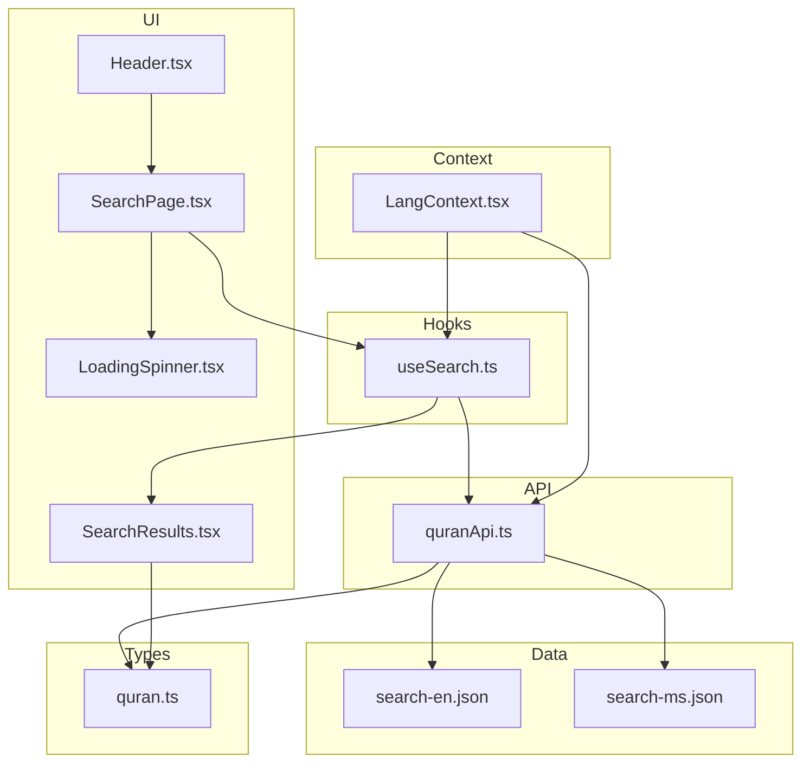
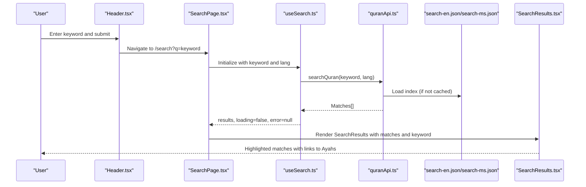
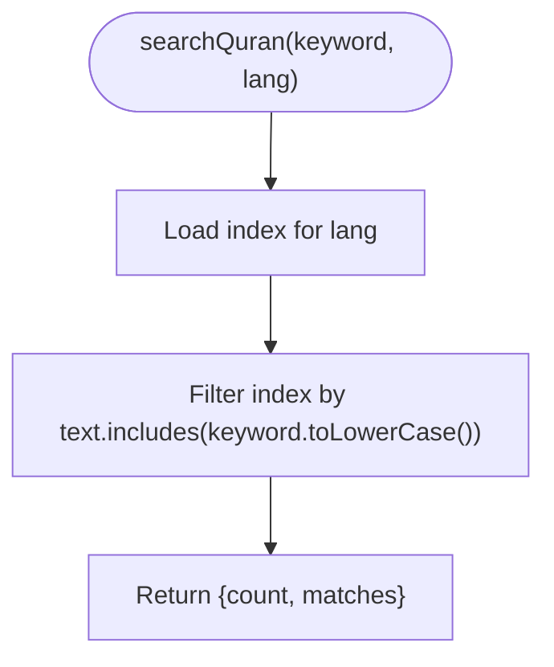
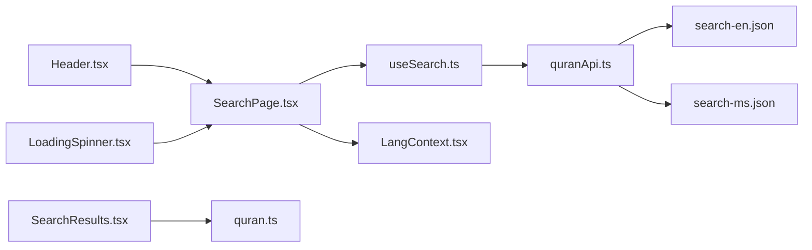

# Search & Discovery

<cite>
**Referenced Files in This Document**
- [SearchPage.tsx](file://src/pages/SearchPage.tsx)
- [SearchResults.tsx](file://src/components/SearchResults.tsx)
- [useSearch.ts](file://src/hooks/useSearch.ts)
- [quranApi.ts](file://src/api/quranApi.ts)
- [LangContext.tsx](file://src/context/LangContext.tsx)
- [Header.tsx](file://src/components/Header.tsx)
- [LoadingSpinner.tsx](file://src/components/LoadingSpinner.tsx)
- [quran.ts](file://src/types/quran.ts)
- [search-en.json](file://public/data/search-en.json)
- [search-ms.json](file://public/data/search-ms.json)
</cite>

## Table of Contents
1. [Introduction](#introduction)
2. [Project Structure](#project-structure)
3. [Core Components](#core-components)
4. [Architecture Overview](#architecture-overview)
5. [Detailed Component Analysis](#detailed-component-analysis)
6. [Dependency Analysis](#dependency-analysis)
7. [Performance Considerations](#performance-considerations)
8. [Troubleshooting Guide](#troubleshooting-guide)
9. [Conclusion](#conclusion)

## Introduction
This document explains the search and discovery functionality for the Quran Reader application. It focuses on the multi-language search implementation across Arabic, Malay, and English content, the search API integration, indexed data loading, and search result presentation. It documents the SearchResults component, search algorithms, performance optimizations, examples of search query processing, result ranking, navigation to specific Ayahs, search index management, caching strategies, and user experience patterns for quick content discovery.

## Project Structure
The search feature spans several layers:
- UI Pages: SearchPage renders the search interface and results.
- Hooks: useSearch manages debounced search, loading, and error states.
- API Layer: quranApi.ts loads prebuilt search indexes and executes client-side filtering.
- Types: quran.ts defines the data structures used by the search pipeline.
- Data: public/data contains prebuilt JSON indexes for Malay and English search.
- Context: LangContext.tsx provides language preference for search indexing.
- Components: SearchResults renders highlighted matches and navigates to specific Ayahs.

**Diagram sources**
- [SearchPage.tsx:1-47](file://src/pages/SearchPage.tsx#L1-L47)
- [SearchResults.tsx:1-55](file://src/components/SearchResults.tsx#L1-L55)
- [useSearch.ts:1-37](file://src/hooks/useSearch.ts#L1-L37)
- [quranApi.ts:1-51](file://src/api/quranApi.ts#L1-L51)
- [LangContext.tsx:1-32](file://src/context/LangContext.tsx#L1-L32)
- [Header.tsx:1-68](file://src/components/Header.tsx#L1-L68)
- [LoadingSpinner.tsx:1-8](file://src/components/LoadingSpinner.tsx#L1-L8)
- [quran.ts:1-64](file://src/types/quran.ts#L1-L64)
- [search-en.json:1-1](file://public/data/search-en.json#L1-L1)
- [search-ms.json:1-1](file://public/data/search-ms.json#L1-L1)

**Section sources**
- [SearchPage.tsx:1-47](file://src/pages/SearchPage.tsx#L1-L47)
- [useSearch.ts:1-37](file://src/hooks/useSearch.ts#L1-L37)
- [quranApi.ts:1-51](file://src/api/quranApi.ts#L1-L51)
- [quran.ts:1-64](file://src/types/quran.ts#L1-L64)

## Core Components
- SearchPage: Orchestrates search UI, displays counts, handles loading/error states, and renders SearchResults.
- useSearch: Implements debounced search, tracks loading and error states, and calls the search API.
- quranApi.searchQuran: Loads prebuilt search indexes by language and filters matches client-side.
- SearchResults: Renders matches with keyword highlighting and navigates to specific Ayahs.
- LangContext: Provides language preference ('ms' or 'en') used to select the appropriate index.
- Header: Provides global search input and navigates to the search route with query parameters.
- LoadingSpinner: Visual feedback during search requests.

**Section sources**
- [SearchPage.tsx:1-47](file://src/pages/SearchPage.tsx#L1-L47)
- [useSearch.ts:1-37](file://src/hooks/useSearch.ts#L1-L37)
- [quranApi.ts:16-51](file://src/api/quranApi.ts#L16-L51)
- [SearchResults.tsx:1-55](file://src/components/SearchResults.tsx#L1-L55)
- [LangContext.tsx:1-32](file://src/context/LangContext.tsx#L1-L32)
- [Header.tsx:1-68](file://src/components/Header.tsx#L1-L68)
- [LoadingSpinner.tsx:1-8](file://src/components/LoadingSpinner.tsx#L1-L8)

## Architecture Overview
The search architecture is client-side and offline-first:
- Data is prebuilt into JSON indexes for Malay and English.
- The API layer lazily loads the appropriate index based on language.
- Filtering is performed client-side using a simple substring match.
- Results are presented with keyword highlighting and deep links to specific Ayahs.

**Diagram sources**
- [Header.tsx:11-16](file://src/components/Header.tsx#L11-L16)
- [SearchPage.tsx:7-11](file://src/pages/SearchPage.tsx#L7-L11)
- [useSearch.ts:6-36](file://src/hooks/useSearch.ts#L6-L36)
- [quranApi.ts:43-50](file://src/api/quranApi.ts#L43-L50)
- [search-en.json:1-1](file://public/data/search-en.json#L1-L1)
- [search-ms.json:1-1](file://public/data/search-ms.json#L1-L1)
- [SearchResults.tsx:19-54](file://src/components/SearchResults.tsx#L19-L54)

## Detailed Component Analysis

### SearchPage
- Purpose: Hosts the search UI, displays counts, and renders results.
- Behavior:
  - Reads the 'q' query parameter from the URL.
  - Uses LangContext to determine language.
  - Delegates search execution to useSearch.
  - Shows LoadingSpinner while loading, error messages on failure, and SearchResults when ready.
  - Displays empty-state guidance when no query is entered.

**Section sources**
- [SearchPage.tsx:7-46](file://src/pages/SearchPage.tsx#L7-L46)

### useSearch Hook
- Purpose: Centralizes search logic with debouncing and state management.
- Behavior:
  - Clears results and stops loading when keyword is empty.
  - Debounces search execution with a 400ms timer.
  - Calls quranApi.searchQuran(keyword, lang).
  - Sets loading state, captures errors, and updates results.
  - Cleans up timers on unmount.

**Section sources**
- [useSearch.ts:6-36](file://src/hooks/useSearch.ts#L6-L36)

### quranApi.searchQuran
- Purpose: Client-side search using prebuilt indexes.
- Index Management:
  - Maintains in-memory caches for Malay and English indexes.
  - Lazily loads indexes on first use via loadSearchIndex.
  - Prevents concurrent loads with a shared loadingIndex promise.
- Search Algorithm:
  - Filters index entries where item.text includes the lowercase keyword.
  - Returns count and matches.

**Diagram sources**
- [quranApi.ts:43-50](file://src/api/quranApi.ts#L43-L50)
- [quranApi.ts:21-41](file://src/api/quranApi.ts#L21-L41)

**Section sources**
- [quranApi.ts:16-51](file://src/api/quranApi.ts#L16-L51)

### SearchResults Component
- Purpose: Renders search results with keyword highlighting and navigation.
- Behavior:
  - Highlights matched keywords in results using a case-insensitive regex.
  - Links each result to the specific Ayah via /surah/{surahNumber}#ayah-{numberInSurah}.
  - Displays a message when no results are found.
  - Shows Surah name and Ayah number for context.

**Section sources**
- [SearchResults.tsx:4-17](file://src/components/SearchResults.tsx#L4-L17)
- [SearchResults.tsx:19-54](file://src/components/SearchResults.tsx#L19-L54)

### LangContext
- Purpose: Manages language preference and persists it to localStorage.
- Behavior:
  - Initializes language from localStorage or defaults to Malay.
  - Persists changes to localStorage.
  - Provides setLang to switch languages.

**Section sources**
- [LangContext.tsx:12-31](file://src/context/LangContext.tsx#L12-L31)

### Header Integration
- Purpose: Provides global search input and navigates to the search route.
- Behavior:
  - Submits form to construct /search?q=encodedQuery.
  - Integrates with LangContext to reflect current language.

**Section sources**
- [Header.tsx:11-16](file://src/components/Header.tsx#L11-L16)
- [Header.tsx:42-63](file://src/components/Header.tsx#L42-L63)

### Data Model for Search
- SearchMatch: Represents a single match with number, text, numberInSurah, and surah metadata.
- SearchResultsData: Wraps count and matches for rendering.

**Section sources**
- [quran.ts:47-57](file://src/types/quran.ts#L47-L57)

## Dependency Analysis
- SearchPage depends on useSearch and LangContext.
- useSearch depends on quranApi.searchQuran and LangContext.
- quranApi depends on public data indexes and maintains internal cache.
- SearchResults depends on quran.ts types and react-router-dom for navigation.
- Header depends on LangContext and react-router-dom for navigation.

**Diagram sources**
- [SearchPage.tsx:1-47](file://src/pages/SearchPage.tsx#L1-L47)
- [useSearch.ts:1-37](file://src/hooks/useSearch.ts#L1-L37)
- [quranApi.ts:1-51](file://src/api/quranApi.ts#L1-L51)
- [LangContext.tsx:1-32](file://src/context/LangContext.tsx#L1-L32)
- [SearchResults.tsx:1-55](file://src/components/SearchResults.tsx#L1-L55)
- [Header.tsx:1-68](file://src/components/Header.tsx#L1-L68)
- [LoadingSpinner.tsx:1-8](file://src/components/LoadingSpinner.tsx#L1-L8)
- [quran.ts:1-64](file://src/types/quran.ts#L1-L64)
- [search-en.json:1-1](file://public/data/search-en.json#L1-L1)
- [search-ms.json:1-1](file://public/data/search-ms.json#L1-L1)

**Section sources**
- [SearchPage.tsx:1-47](file://src/pages/SearchPage.tsx#L1-L47)
- [useSearch.ts:1-37](file://src/hooks/useSearch.ts#L1-L37)
- [quranApi.ts:1-51](file://src/api/quranApi.ts#L1-L51)
- [SearchResults.tsx:1-55](file://src/components/SearchResults.tsx#L1-L55)
- [LangContext.tsx:1-32](file://src/context/LangContext.tsx#L1-L32)
- [Header.tsx:1-68](file://src/components/Header.tsx#L1-L68)
- [LoadingSpinner.tsx:1-8](file://src/components/LoadingSpinner.tsx#L1-L8)
- [quran.ts:1-64](file://src/types/quran.ts#L1-L64)

## Performance Considerations
- Client-side filtering: The current implementation filters the entire index client-side. For large indexes, consider:
  - Preprocessing indexes with normalized lowercase keys and prefix trees for faster substring searches.
  - Implementing pagination or result truncation to reduce DOM rendering overhead.
- Debouncing: The 400ms debounce reduces network-like calls and improves responsiveness.
- Caching: The API caches indexes in memory and prevents concurrent loads, minimizing repeated fetches.
- Rendering: Highlighting uses regex splitting; for very large result sets, consider virtualized lists or lazy rendering of result items.

[No sources needed since this section provides general guidance]

## Troubleshooting Guide
- No results appear:
  - Verify the keyword is not empty; empty queries clear results.
  - Confirm the language setting matches the intended index ('ms' or 'en').
  - Check that the search indexes are present in public/data.
- Slow search:
  - Ensure debouncing is functioning (400ms delay).
  - Consider reducing result count or implementing pagination.
- Navigation to Ayah fails:
  - Confirm the link format: /surah/{surahNumber}#ayah-{numberInSurah}.
  - Verify that surah data is available for the target number.

**Section sources**
- [useSearch.ts:11-32](file://src/hooks/useSearch.ts#L11-L32)
- [quranApi.ts:16-41](file://src/api/quranApi.ts#L16-L41)
- [SearchResults.tsx:37-40](file://src/components/SearchResults.tsx#L37-L40)

## Conclusion
The search and discovery feature is designed for simplicity, speed, and offline usability. It leverages prebuilt indexes, client-side filtering, and a lightweight UI to deliver responsive search across Malay and English content. The architecture cleanly separates concerns between UI, state, and data, enabling straightforward enhancements such as improved indexing, virtualization, and advanced ranking in future iterations.