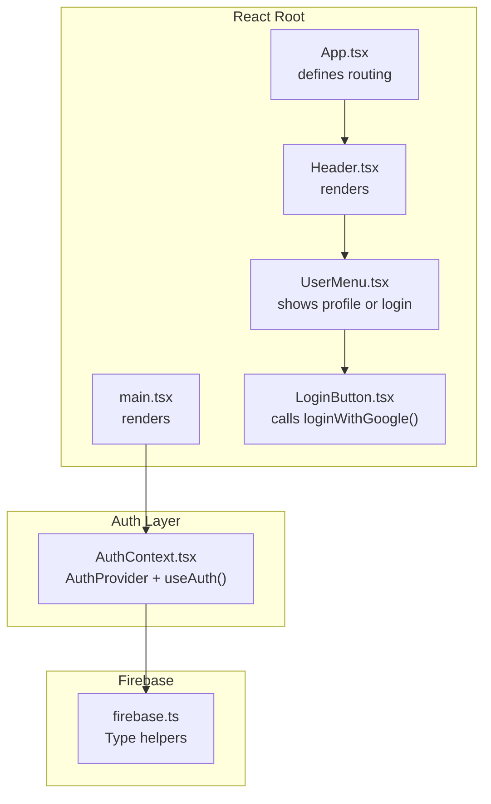
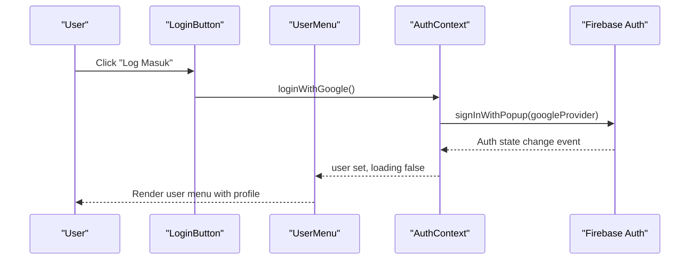
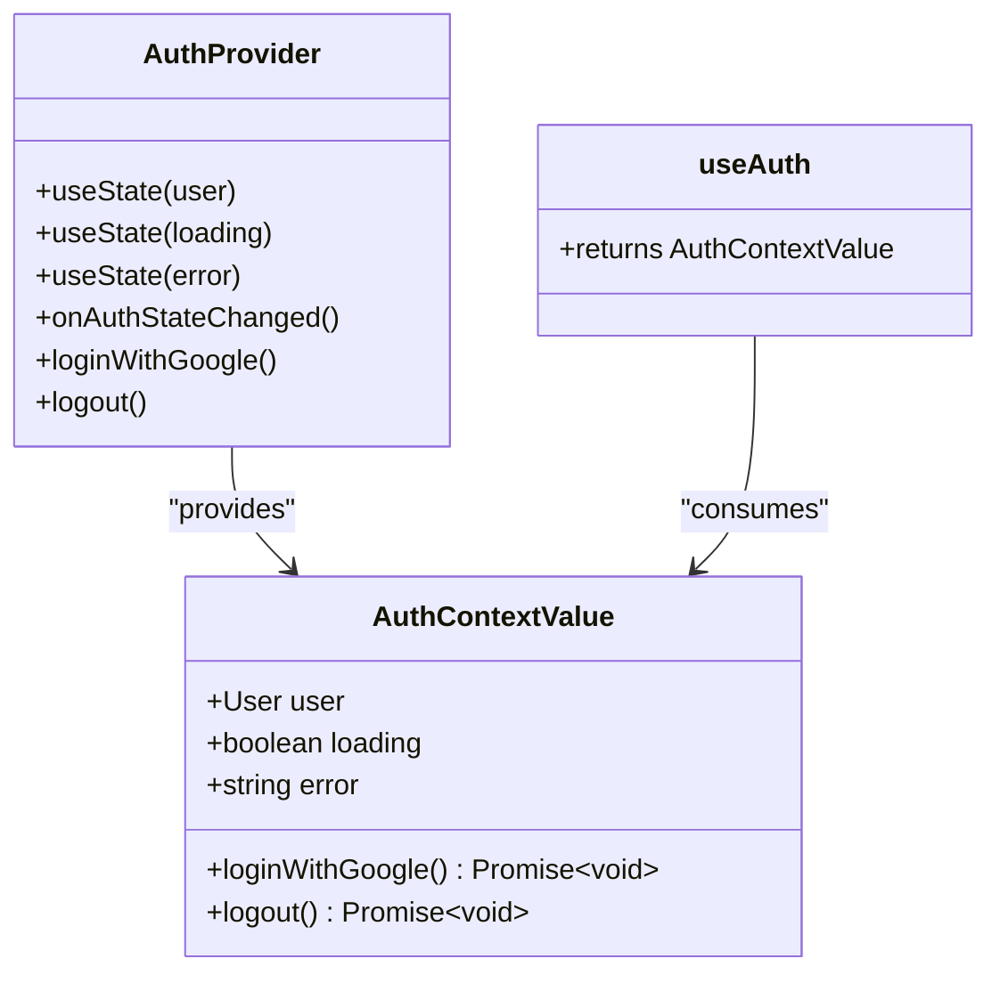
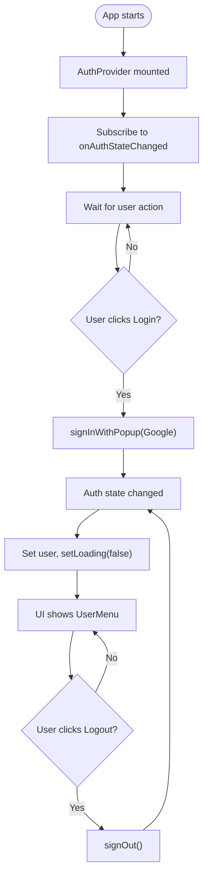
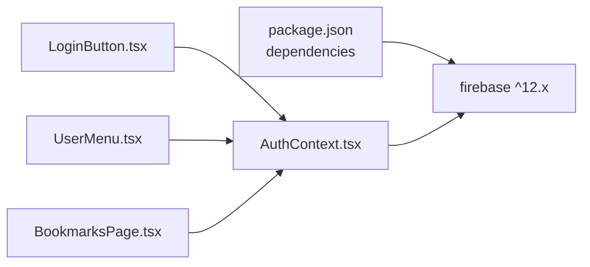

# User Management System

<cite>
**Referenced Files in This Document**
- [AuthContext.tsx](file://src/context/AuthContext.tsx)
- [LoginButton.tsx](file://src/components/LoginButton.tsx)
- [UserMenu.tsx](file://src/components/UserMenu.tsx)
- [Header.tsx](file://src/components/Header.tsx)
- [BookmarksPage.tsx](file://src/pages/BookmarksPage.tsx)
- [main.tsx](file://src/main.tsx)
- [App.tsx](file://src/App.tsx)
- [useAuth.ts](file://src/hooks/useAuth.ts)
- [firebase.ts](file://src/types/firebase.ts)
- [package.json](file://package.json)
</cite>

## Table of Contents
1. [Introduction](#introduction)
2. [Project Structure](#project-structure)
3. [Core Components](#core-components)
4. [Architecture Overview](#architecture-overview)
5. [Detailed Component Analysis](#detailed-component-analysis)
6. [Dependency Analysis](#dependency-analysis)
7. [Performance Considerations](#performance-considerations)
8. [Security Considerations](#security-considerations)
9. [Protected Routes and Personalized Features](#protected-routes-and-personalized-features)
10. [Troubleshooting Guide](#troubleshooting-guide)
11. [Conclusion](#conclusion)

## Introduction
This document explains the user management system built with Firebase Authentication and React. It covers the AuthContext provider, Google login integration, user session lifecycle, profile rendering, and how authentication state drives personalized features like bookmarks. It also documents the authentication flow, state management, security considerations, session persistence, and error handling.

## Project Structure
The user management system is organized around a small set of focused modules:
- Provider and hooks: AuthContext manages authentication state and exposes login/logout actions.
- UI components: LoginButton triggers Google sign-in; UserMenu displays profile and logout.
- Pages: BookmarksPage conditionally renders personalized content based on authentication state.
- Integration: App wraps the app tree with AuthProvider so all components can consume authentication state.

**Diagram sources**
- [main.tsx:1-14](file://src/main.tsx#L1-L14)
- [App.tsx:1-56](file://src/App.tsx#L1-L56)
- [Header.tsx:1-68](file://src/components/Header.tsx#L1-L68)
- [UserMenu.tsx:1-79](file://src/components/UserMenu.tsx#L1-L79)
- [LoginButton.tsx:1-38](file://src/components/LoginButton.tsx#L1-L38)
- [AuthContext.tsx:1-63](file://src/context/AuthContext.tsx#L1-L63)
- [firebase.ts:1-20](file://src/types/firebase.ts#L1-L20)

**Section sources**
- [main.tsx:1-14](file://src/main.tsx#L1-L14)
- [App.tsx:1-56](file://src/App.tsx#L1-L56)
- [Header.tsx:1-68](file://src/components/Header.tsx#L1-L68)
- [UserMenu.tsx:1-79](file://src/components/UserMenu.tsx#L1-L79)
- [LoginButton.tsx:1-38](file://src/components/LoginButton.tsx#L1-L38)
- [AuthContext.tsx:1-63](file://src/context/AuthContext.tsx#L1-L63)
- [firebase.ts:1-20](file://src/types/firebase.ts#L1-L20)

## Core Components
- AuthProvider: Subscribes to Firebase Authentication state, exposes user, loading, error, loginWithGoogle, and logout.
- useAuth hook: Thin re-export of the context consumer for convenience.
- LoginButton: Renders a Google login button and displays authentication errors.
- UserMenu: Shows either LoginButton (when unauthenticated) or a dropdown menu with profile info and logout.
- BookmarksPage: Demonstrates conditional rendering based on authentication state.

Key responsibilities:
- Centralized authentication state management
- Google OAuth via popup
- Session persistence handled by Firebase SDK
- Error propagation to UI components

**Section sources**
- [AuthContext.tsx:10-62](file://src/context/AuthContext.tsx#L10-L62)
- [useAuth.ts:1-2](file://src/hooks/useAuth.ts#L1-L2)
- [LoginButton.tsx:1-38](file://src/components/LoginButton.tsx#L1-L38)
- [UserMenu.tsx:1-79](file://src/components/UserMenu.tsx#L1-L79)
- [BookmarksPage.tsx:1-96](file://src/pages/BookmarksPage.tsx#L1-L96)

## Architecture Overview
The system follows a provider pattern:
- main.tsx mounts AuthProvider at the root.
- App.tsx defines routes; Header.tsx places UserMenu in the header.
- UserMenu decides whether to render LoginButton or the authenticated menu.
- AuthContext integrates with Firebase Authentication to manage user sessions.

**Diagram sources**
- [LoginButton.tsx:1-38](file://src/components/LoginButton.tsx#L1-L38)
- [AuthContext.tsx:20-49](file://src/context/AuthContext.tsx#L20-L49)
- [UserMenu.tsx:1-79](file://src/components/UserMenu.tsx#L1-L79)

## Detailed Component Analysis

### AuthContext Provider
AuthContext manages:
- user: Current authenticated user or null
- loading: Indicates initial sync with Firebase
- error: Last authentication error message
- loginWithGoogle: Triggers Google OAuth popup
- logout: Signs out current user

Implementation highlights:
- Subscribes to onAuthStateChanged during mount
- Uses signInWithPopup for Google login
- Catches and surfaces errors to consumers
- Exposes a strict useAuth hook that throws if used outside provider

**Diagram sources**
- [AuthContext.tsx:10-62](file://src/context/AuthContext.tsx#L10-L62)

**Section sources**
- [AuthContext.tsx:10-62](file://src/context/AuthContext.tsx#L10-L62)

### LoginButton Component
Responsibilities:
- Calls loginWithGoogle from useAuth
- Disables itself while logging in
- Displays authentication error messages

Integration:
- Used by UserMenu when user is null
- Provides immediate feedback on login attempts

**Section sources**
- [LoginButton.tsx:1-38](file://src/components/LoginButton.tsx#L1-L38)

### UserMenu Functionality
Behavior:
- If user is null: renders LoginButton
- If user exists: shows avatar or initials, opens a dropdown menu
- Dropdown includes profile summary and a logout action
- Clicking outside closes the menu

Interaction flow:
- Click avatar toggles menu open/close
- Logout invokes auth.logout and resets menu state

**Section sources**
- [UserMenu.tsx:1-79](file://src/components/UserMenu.tsx#L1-L79)

### Protected Routes and Personalized Features
BookmarksPage demonstrates:
- Conditional rendering: if user is null, prompts login with LoginButton
- When authenticated, loads and displays user-specific bookmarks
- Uses useBookmarks hook to fetch and update bookmarks

Routing context:
- App.tsx defines routes; BookmarksPage is mounted under /bookmarks
- Navigation to /bookmarks is available in UserMenu

**Section sources**
- [BookmarksPage.tsx:1-96](file://src/pages/BookmarksPage.tsx#L1-L96)
- [App.tsx:22-39](file://src/App.tsx#L22-L39)

### Authentication Flow Details
High-level steps:
1. App initializes with AuthProvider
2. AuthContext subscribes to onAuthStateChanged
3. User clicks LoginButton
4. loginWithGoogle calls signInWithPopup with Google provider
5. Firebase completes OAuth and emits auth state change
6. AuthContext updates user and loading state
7. UI reflects logged-in state (UserMenu shows profile)
8. User selects logout to trigger signOut

**Diagram sources**
- [AuthContext.tsx:20-49](file://src/context/AuthContext.tsx#L20-L49)
- [LoginButton.tsx:1-38](file://src/components/LoginButton.tsx#L1-L38)
- [UserMenu.tsx:1-79](file://src/components/UserMenu.tsx#L1-L79)

## Dependency Analysis
External dependencies relevant to authentication:
- firebase SDK version is declared in package.json
- AuthContext imports Firebase auth APIs and provider instances
- No explicit runtime dependency on admin SDK in client code

**Diagram sources**
- [package.json:20-27](file://package.json#L20-L27)
- [AuthContext.tsx:1-8](file://src/context/AuthContext.tsx#L1-L8)
- [LoginButton.tsx:1](file://src/components/LoginButton.tsx#L1)
- [UserMenu.tsx:1-4](file://src/components/UserMenu.tsx#L1-L4)
- [BookmarksPage.tsx:1-5](file://src/pages/BookmarksPage.tsx#L1-L5)

**Section sources**
- [package.json:20-27](file://package.json#L20-L27)
- [AuthContext.tsx:1-8](file://src/context/AuthContext.tsx#L1-L8)

## Performance Considerations
- Initial load: onAuthStateChanged listener runs once; loading flag prevents unnecessary re-renders until state is ready.
- Login/Logout: Both are async operations; disabling the button during these operations avoids redundant calls.
- Profile rendering: UserMenu computes initials and conditionally renders avatar or initials; keep DOM updates minimal.

## Security Considerations
- Authentication state is managed client-side; never store secrets in the browser.
- Google OAuth is handled by Firebase; ensure proper Firebase project configuration and OAuth consent screen settings.
- Error messages are surfaced to the UI; avoid exposing sensitive internal errors to users.
- Session persistence: Firebase handles persistence automatically; do not manually cache tokens.
- Personalized features (e.g., bookmarks) should be validated server-side in Firestore rules; client-side checks prevent accidental misuse but do not replace backend enforcement.

## Protected Routes and Personalized Features
- Unauthenticated users see a login prompt on the bookmarks page and cannot access personal data.
- Authenticated users can browse bookmarks and perform bookmark operations.
- Navigation to /bookmarks is exposed via UserMenu.

Examples:
- Accessing bookmarks without login: redirects to login prompt.
- Accessing bookmarks after login: loads and displays user-specific bookmarks.
- Navigating to /bookmarks from the header menu.

**Section sources**
- [BookmarksPage.tsx:7-21](file://src/pages/BookmarksPage.tsx#L7-L21)
- [UserMenu.tsx:54-72](file://src/components/UserMenu.tsx#L54-L72)
- [App.tsx:30-35](file://src/App.tsx#L30-L35)

## Troubleshooting Guide
Common issues and resolutions:
- Login fails silently: Check error propagation in LoginButton and AuthContext error handling.
- Stuck on loading: Verify onAuthStateChanged subscription and that the provider is mounted at root.
- Logout does nothing: Confirm signOut is called and AuthContext sets user to null.
- Profile image missing: UserMenu falls back to initials when photoURL is unavailable.
- Session not persisting: Ensure Firebase SDK persistence settings align with expectations; avoid manual token caching.

**Section sources**
- [AuthContext.tsx:20-49](file://src/context/AuthContext.tsx#L20-L49)
- [LoginButton.tsx:34](file://src/components/LoginButton.tsx#L34)
- [UserMenu.tsx:34-44](file://src/components/UserMenu.tsx#L34-L44)

## Conclusion
The user management system leverages Firebase Authentication with a clean React provider pattern. AuthContext centralizes authentication state, LoginButton triggers Google sign-in, and UserMenu provides profile access and logout. Personalized features like bookmarks are gated on authentication state. The design emphasizes simplicity, clear error handling, and separation of concerns, while relying on Firebase for secure session management.