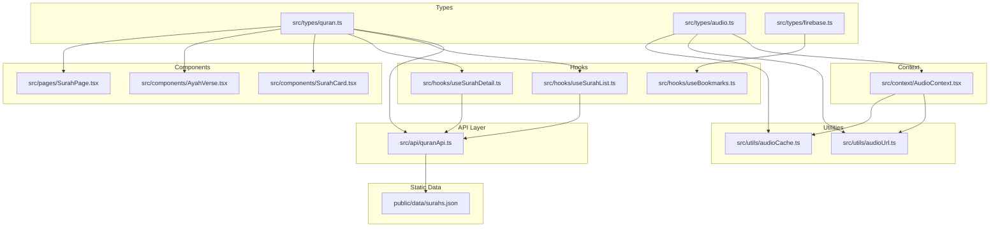
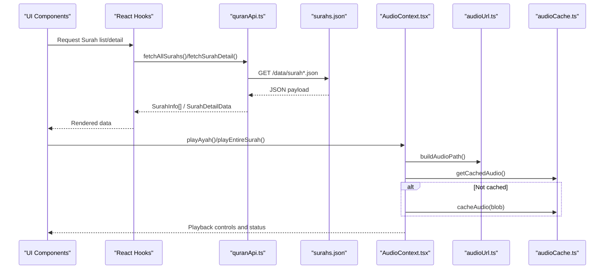
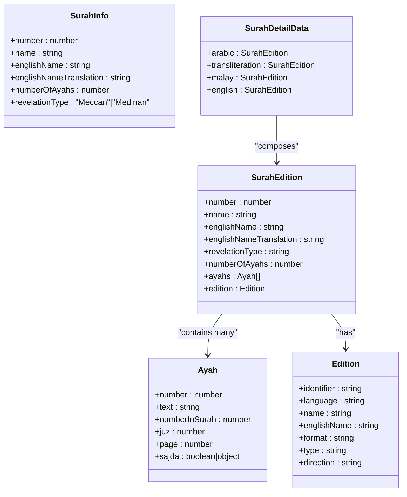
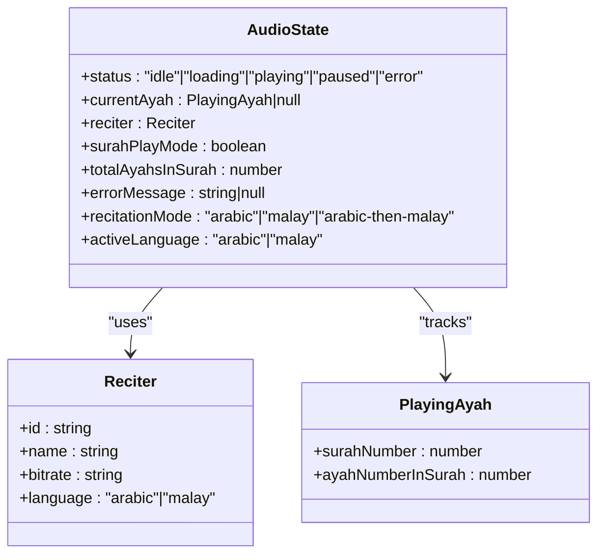
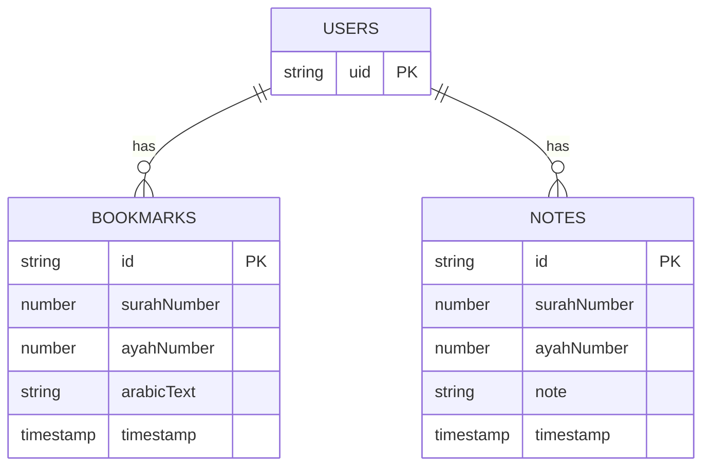
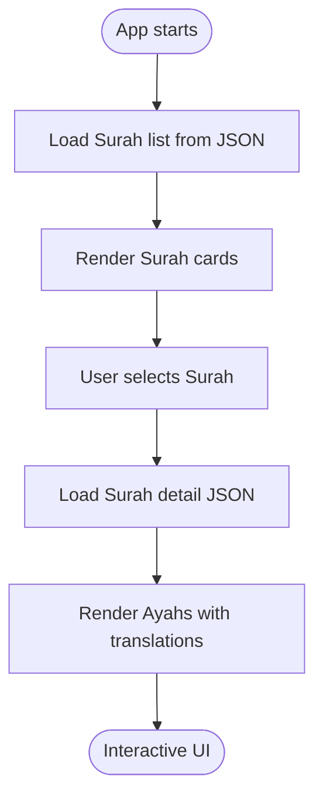
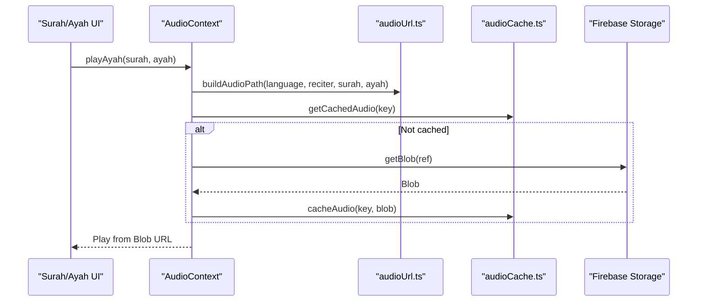
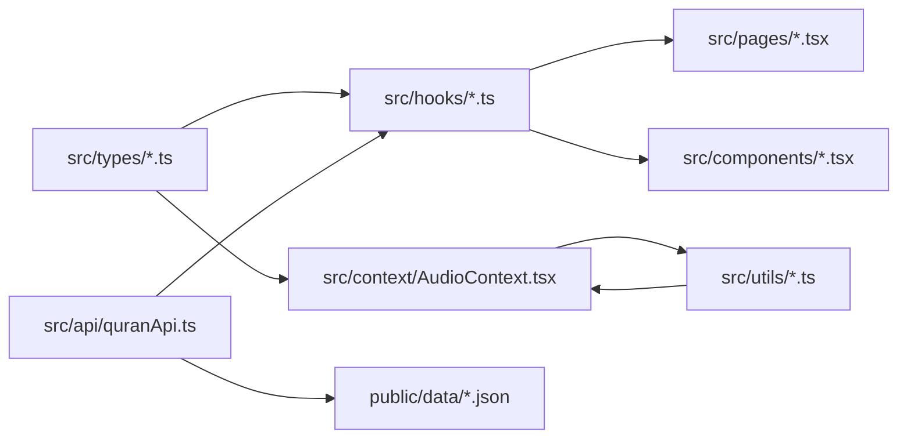

# Data Models & Types

<cite>
**Referenced Files in This Document**
- [quran.ts](file://src/types/quran.ts)
- [audio.ts](file://src/types/audio.ts)
- [firebase.ts](file://src/types/firebase.ts)
- [quranApi.ts](file://src/api/quranApi.ts)
- [AudioContext.tsx](file://src/context/AudioContext.tsx)
- [audioCache.ts](file://src/utils/audioCache.ts)
- [audioUrl.ts](file://src/utils/audioUrl.ts)
- [useSurahList.ts](file://src/hooks/useSurahList.ts)
- [useSurahDetail.ts](file://src/hooks/useSurahDetail.ts)
- [useBookmarks.ts](file://src/hooks/useBookmarks.ts)
- [SurahCard.tsx](file://src/components/SurahCard.tsx)
- [AyahVerse.tsx](file://src/components/AyahVerse.tsx)
- [SurahPage.tsx](file://src/pages/SurahPage.tsx)
- [surahs.json](file://public/data/surahs.json)
</cite>

## Table of Contents
1. [Introduction](#introduction)
2. [Project Structure](#project-structure)
3. [Core Components](#core-components)
4. [Architecture Overview](#architecture-overview)
5. [Detailed Component Analysis](#detailed-component-analysis)
6. [Dependency Analysis](#dependency-analysis)
7. [Performance Considerations](#performance-considerations)
8. [Troubleshooting Guide](#troubleshooting-guide)
9. [Conclusion](#conclusion)
10. [Appendices](#appendices)

## Introduction
This document describes the data models and types used in the Quran Reader application. It focuses on TypeScript interfaces and type definitions for Surah metadata, Ayah content, audio playback state, reciters, and user data. It also documents data validation rules, entity relationships, data flow patterns, offline storage formats, caching strategies, and lifecycle management. The goal is to provide a clear understanding of how data is structured, transformed, normalized, and consumed across the application.

## Project Structure
The data model layer is primarily defined in dedicated TypeScript type files and used by React components, hooks, and contexts. APIs and utilities handle data fetching and caching.

**Diagram sources**
- [quran.ts:1-64](file://src/types/quran.ts#L1-L64)
- [audio.ts:1-41](file://src/types/audio.ts#L1-L41)
- [firebase.ts:1-20](file://src/types/firebase.ts#L1-L20)
- [quranApi.ts:1-51](file://src/api/quranApi.ts#L1-L51)
- [audioUrl.ts:1-37](file://src/utils/audioUrl.ts#L1-L37)
- [audioCache.ts:1-153](file://src/utils/audioCache.ts#L1-L153)
- [useSurahList.ts:1-47](file://src/hooks/useSurahList.ts#L1-L47)
- [useSurahDetail.ts:1-37](file://src/hooks/useSurahDetail.ts#L1-L37)
- [useBookmarks.ts:1-88](file://src/hooks/useBookmarks.ts#L1-L88)
- [SurahCard.tsx:1-42](file://src/components/SurahCard.tsx#L1-L42)
- [AyahVerse.tsx:1-63](file://src/components/AyahVerse.tsx#L1-L63)
- [SurahPage.tsx:1-120](file://src/pages/SurahPage.tsx#L1-L120)
- [surahs.json:1-1](file://public/data/surahs.json#L1-L1)

**Section sources**
- [quran.ts:1-64](file://src/types/quran.ts#L1-L64)
- [audio.ts:1-41](file://src/types/audio.ts#L1-L41)
- [firebase.ts:1-20](file://src/types/firebase.ts#L1-L20)
- [quranApi.ts:1-51](file://src/api/quranApi.ts#L1-L51)
- [audioUrl.ts:1-37](file://src/utils/audioUrl.ts#L1-L37)
- [audioCache.ts:1-153](file://src/utils/audioCache.ts#L1-L153)
- [useSurahList.ts:1-47](file://src/hooks/useSurahList.ts#L1-L47)
- [useSurahDetail.ts:1-37](file://src/hooks/useSurahDetail.ts#L1-L37)
- [useBookmarks.ts:1-88](file://src/hooks/useBookmarks.ts#L1-L88)
- [SurahCard.tsx:1-42](file://src/components/SurahCard.tsx#L1-L42)
- [AyahVerse.tsx:1-63](file://src/components/AyahVerse.tsx#L1-L63)
- [SurahPage.tsx:1-120](file://src/pages/SurahPage.tsx#L1-L120)
- [surahs.json:1-1](file://public/data/surahs.json#L1-L1)

## Core Components
This section defines the primary data models and their roles.

- SurahInfo
  - Purpose: Lightweight metadata for each Surah used in lists and summaries.
  - Fields: number, name, englishName, englishNameTranslation, numberOfAyahs, revelationType.
  - Validation: number is positive integer; numberOfAyahs is positive integer; revelationType is literal union of Meccan or Medinan.

- Ayah
  - Purpose: Represents a single verse with metadata and content.
  - Fields: number, text, numberInSurah, juz, page, sajda.
  - Validation: number and numberInSurah are positive integers; juz and page are positive integers; sajda is boolean or nested object with boolean flags.

- Edition
  - Purpose: Describes a text edition (language, script, direction).
  - Fields: identifier, language, name, englishName, format, type, direction.

- SurahEdition
  - Purpose: A Surah in a specific edition, including ayahs and edition metadata.
  - Fields: number, name, englishName, englishNameTranslation, revelationType, numberOfAyahs, ayahs[], edition.

- SurahDetailData
  - Purpose: Aggregates multiple editions for a Surah (Arabic, transliteration, Malay, English).
  - Fields: arabic: SurahEdition, transliteration: SurahEdition, malay: SurahEdition, english: SurahEdition.

- SearchMatch
  - Purpose: Search result item linking an Ayah to its Surah.
  - Fields: number, text, numberInSurah, surah: SurahInfo.

- SearchResultsData
  - Purpose: Container for search results count and matches.
  - Fields: count: number, matches: SearchMatch[].

- AudioState
  - Purpose: Centralized audio playback state managed by the AudioContext.
  - Fields: status, currentAyah, reciter, surahPlayMode, totalAyahsInSurah, errorMessage, recitationMode, activeLanguage.

- Reciter
  - Purpose: Defines audio reciter metadata.
  - Fields: id, name, bitrate, language.

- BookmarkData and NoteData
  - Purpose: Persistent user data stored in Firestore.
  - Fields: BookmarkData includes surahNumber, ayahNumber, arabicText, timestamp; NoteData includes surahNumber, ayahNumber, note, timestamp.

Validation rules summary:
- Numeric fields are positive integers.
- Enum-like fields use literal unions (e.g., revelationType, language, status).
- Nested objects (e.g., sajda) may be booleans or objects with boolean flags.

**Section sources**
- [quran.ts:1-64](file://src/types/quran.ts#L1-L64)
- [audio.ts:1-41](file://src/types/audio.ts#L1-L41)
- [firebase.ts:1-20](file://src/types/firebase.ts#L1-L20)

## Architecture Overview
The application separates concerns across types, API utilities, hooks, and context. Data flows from static JSON files to UI components via hooks and contexts, while audio data is fetched from Firebase Storage and cached locally.

**Diagram sources**
- [quranApi.ts:1-51](file://src/api/quranApi.ts#L1-L51)
- [surahs.json:1-1](file://public/data/surahs.json#L1-L1)
- [AudioContext.tsx:1-396](file://src/context/AudioContext.tsx#L1-L396)
- [audioUrl.ts:1-37](file://src/utils/audioUrl.ts#L1-L37)
- [audioCache.ts:1-153](file://src/utils/audioCache.ts#L1-L153)

## Detailed Component Analysis

### Surah and Ayah Data Model
Surah metadata and Ayah content are defined in the quran types. SurahDetailData aggregates multiple editions for rendering.

**Diagram sources**
- [quran.ts:1-64](file://src/types/quran.ts#L1-L64)

**Section sources**
- [quran.ts:1-64](file://src/types/quran.ts#L1-L64)

### Audio Playback State and Reciters
AudioState encapsulates playback status, current Ayah, reciter selection, and recitation mode. Reciters are predefined with language and bitrate.

**Diagram sources**
- [audio.ts:1-41](file://src/types/audio.ts#L1-L41)

**Section sources**
- [audio.ts:1-41](file://src/types/audio.ts#L1-L41)

### User Data Models (Bookmarks and Notes)
Bookmarks and Notes are stored in Firestore under the authenticated user’s document path. Document IDs are constructed from Surah and Ayah numbers.

**Diagram sources**
- [firebase.ts:1-20](file://src/types/firebase.ts#L1-L20)
- [useBookmarks.ts:1-88](file://src/hooks/useBookmarks.ts#L1-L88)

**Section sources**
- [firebase.ts:1-20](file://src/types/firebase.ts#L1-L20)
- [useBookmarks.ts:1-88](file://src/hooks/useBookmarks.ts#L1-L88)

### Data Flow and Transformations
- Surah list and detail data are loaded from static JSON files and transformed into SurahInfo and SurahDetailData respectively.
- Components render Surah cards and Ayah verses using these typed models.
- Search results are built from pre-indexed JSON arrays and returned as SearchResultsData.

**Diagram sources**
- [quranApi.ts:1-51](file://src/api/quranApi.ts#L1-L51)
- [SurahCard.tsx:1-42](file://src/components/SurahCard.tsx#L1-L42)
- [AyahVerse.tsx:1-63](file://src/components/AyahVerse.tsx#L1-L63)
- [SurahPage.tsx:1-120](file://src/pages/SurahPage.tsx#L1-L120)
- [surahs.json:1-1](file://public/data/surahs.json#L1-L1)

**Section sources**
- [quranApi.ts:1-51](file://src/api/quranApi.ts#L1-L51)
- [SurahCard.tsx:1-42](file://src/components/SurahCard.tsx#L1-L42)
- [AyahVerse.tsx:1-63](file://src/components/AyahVerse.tsx#L1-L63)
- [SurahPage.tsx:1-120](file://src/pages/SurahPage.tsx#L1-L120)
- [surahs.json:1-1](file://public/data/surahs.json#L1-L1)

### Audio Playback Lifecycle and Offline Storage
Audio playback integrates Firebase Storage, local IndexedDB caching, and dynamic mode switching.

**Diagram sources**
- [AudioContext.tsx:1-396](file://src/context/AudioContext.tsx#L1-L396)
- [audioUrl.ts:1-37](file://src/utils/audioUrl.ts#L1-L37)
- [audioCache.ts:1-153](file://src/utils/audioCache.ts#L1-L153)

**Section sources**
- [AudioContext.tsx:1-396](file://src/context/AudioContext.tsx#L1-L396)
- [audioUrl.ts:1-37](file://src/utils/audioUrl.ts#L1-L37)
- [audioCache.ts:1-153](file://src/utils/audioCache.ts#L1-L153)

## Dependency Analysis
The following diagram shows how types, hooks, and utilities depend on each other.

**Diagram sources**
- [quran.ts:1-64](file://src/types/quran.ts#L1-L64)
- [audio.ts:1-41](file://src/types/audio.ts#L1-L41)
- [firebase.ts:1-20](file://src/types/firebase.ts#L1-L20)
- [useSurahList.ts:1-47](file://src/hooks/useSurahList.ts#L1-L47)
- [useSurahDetail.ts:1-37](file://src/hooks/useSurahDetail.ts#L1-L37)
- [useBookmarks.ts:1-88](file://src/hooks/useBookmarks.ts#L1-L88)
- [AudioContext.tsx:1-396](file://src/context/AudioContext.tsx#L1-L396)
- [quranApi.ts:1-51](file://src/api/quranApi.ts#L1-L51)
- [audioUrl.ts:1-37](file://src/utils/audioUrl.ts#L1-L37)
- [audioCache.ts:1-153](file://src/utils/audioCache.ts#L1-L153)
- [SurahPage.tsx:1-120](file://src/pages/SurahPage.tsx#L1-L120)
- [SurahCard.tsx:1-42](file://src/components/SurahCard.tsx#L1-L42)
- [AyahVerse.tsx:1-63](file://src/components/AyahVerse.tsx#L1-L63)
- [surahs.json:1-1](file://public/data/surahs.json#L1-L1)

**Section sources**
- [quran.ts:1-64](file://src/types/quran.ts#L1-L64)
- [audio.ts:1-41](file://src/types/audio.ts#L1-L41)
- [firebase.ts:1-20](file://src/types/firebase.ts#L1-L20)
- [useSurahList.ts:1-47](file://src/hooks/useSurahList.ts#L1-L47)
- [useSurahDetail.ts:1-37](file://src/hooks/useSurahDetail.ts#L1-L37)
- [useBookmarks.ts:1-88](file://src/hooks/useBookmarks.ts#L1-L88)
- [AudioContext.tsx:1-396](file://src/context/AudioContext.tsx#L1-L396)
- [quranApi.ts:1-51](file://src/api/quranApi.ts#L1-L51)
- [audioUrl.ts:1-37](file://src/utils/audioUrl.ts#L1-L37)
- [audioCache.ts:1-153](file://src/utils/audioCache.ts#L1-L153)
- [SurahPage.tsx:1-120](file://src/pages/SurahPage.tsx#L1-L120)
- [SurahCard.tsx:1-42](file://src/components/SurahCard.tsx#L1-L42)
- [AyahVerse.tsx:1-63](file://src/components/AyahVerse.tsx#L1-L63)
- [surahs.json:1-1](file://public/data/surahs.json#L1-L1)

## Performance Considerations
- Static JSON loading: Surah lists and details are served as static JSON files, reducing server overhead and enabling fast client-side rendering.
- Client-side search: Pre-built indices reduce server load and improve responsiveness.
- IndexedDB caching: Audio blobs are cached locally to minimize repeated downloads and bandwidth usage.
- Memoization: Filtering Surah lists uses memoization to avoid unnecessary re-computation.
- Mode-driven downloads: Surah play mode can trigger bulk downloads for seamless playback, balancing UX and data usage.

[No sources needed since this section provides general guidance]

## Troubleshooting Guide
Common issues and resolutions:
- Surah list fails to load: Verify static JSON availability and network connectivity.
- Surah detail missing: Confirm the presence of per-surah JSON files and correct numeric IDs.
- Audio playback errors: Check Firebase Storage permissions, user authentication, and cache health.
- Cache size and cleanup: Use cache inspection utilities to diagnose storage usage and clear when necessary.
- Search results empty: Ensure pre-indexed JSON files are present and properly formatted.

**Section sources**
- [quranApi.ts:1-51](file://src/api/quranApi.ts#L1-L51)
- [AudioContext.tsx:1-396](file://src/context/AudioContext.tsx#L1-L396)
- [audioCache.ts:1-153](file://src/utils/audioCache.ts#L1-L153)
- [useSurahList.ts:1-47](file://src/hooks/useSurahList.ts#L1-L47)
- [useSurahDetail.ts:1-37](file://src/hooks/useSurahDetail.ts#L1-L37)

## Conclusion
The Quran Reader application employs a clean separation of data models, API utilities, and UI logic. Typed interfaces ensure predictable data shapes, while static JSON and IndexedDB caching deliver efficient offline-first experiences. The audio pipeline integrates seamlessly with Firebase Storage and local caching to support flexible playback modes.

[No sources needed since this section summarizes without analyzing specific files]

## Appendices

### JSON Data Formats and Sample Structures
- Surah list JSON
  - Structure: Array of SurahInfo objects.
  - Example fields: number, name, englishName, englishNameTranslation, numberOfAyahs, revelationType.
  - Reference: [surahs.json:1-1](file://public/data/surahs.json#L1-L1)

- Surah detail JSON
  - Structure: Per-surah JSON containing SurahDetailData with editions (arabic, transliteration, malay, english).
  - Reference: [quranApi.ts:10-14](file://src/api/quranApi.ts#L10-L14)

- Search index JSON
  - Structure: Arrays of SearchMatch objects for Malay and English indices.
  - Reference: [quranApi.ts:21-41](file://src/api/quranApi.ts#L21-L41)

- Audio cache keys
  - Format: Composite key derived from language, reciterId, surahNumber, ayahNumberInSurah.
  - Reference: [AudioContext.tsx:74-74](file://src/context/AudioContext.tsx#L74-L74), [audioUrl.ts:13-22](file://src/utils/audioUrl.ts#L13-L22)

**Section sources**
- [surahs.json:1-1](file://public/data/surahs.json#L1-L1)
- [quranApi.ts:1-51](file://src/api/quranApi.ts#L1-L51)
- [AudioContext.tsx:1-396](file://src/context/AudioContext.tsx#L1-L396)
- [audioUrl.ts:1-37](file://src/utils/audioUrl.ts#L1-L37)