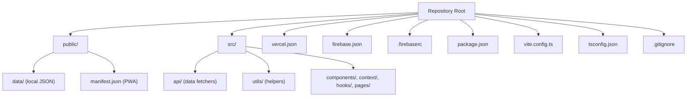
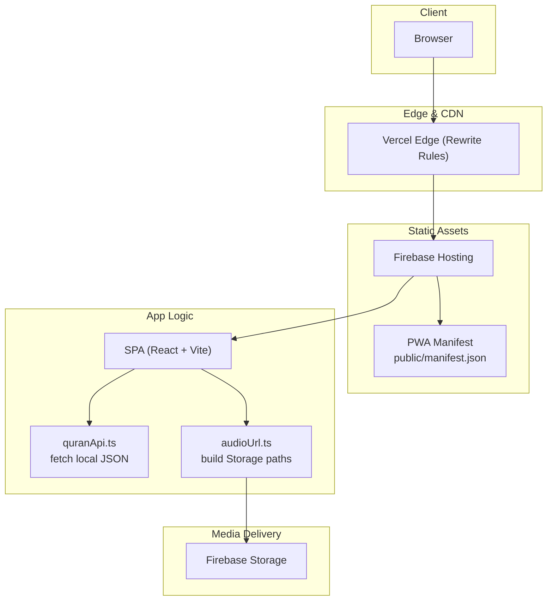
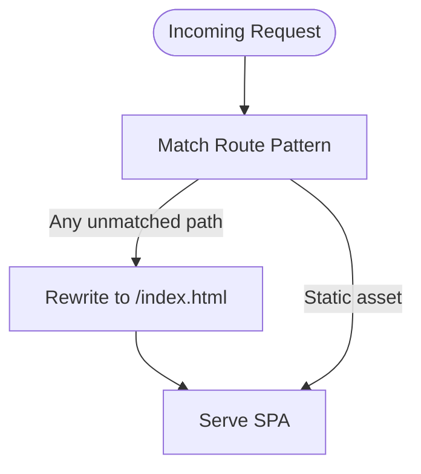
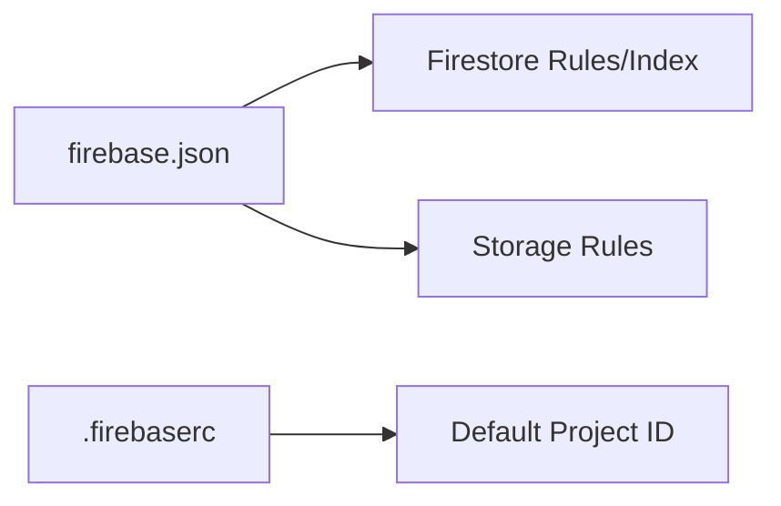
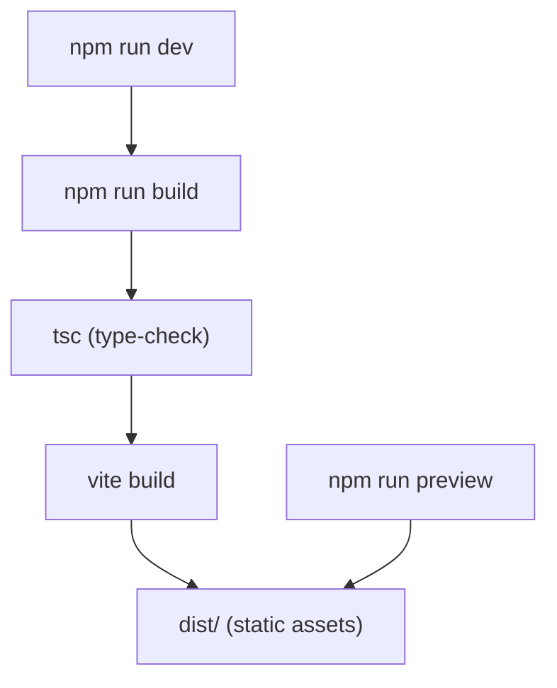
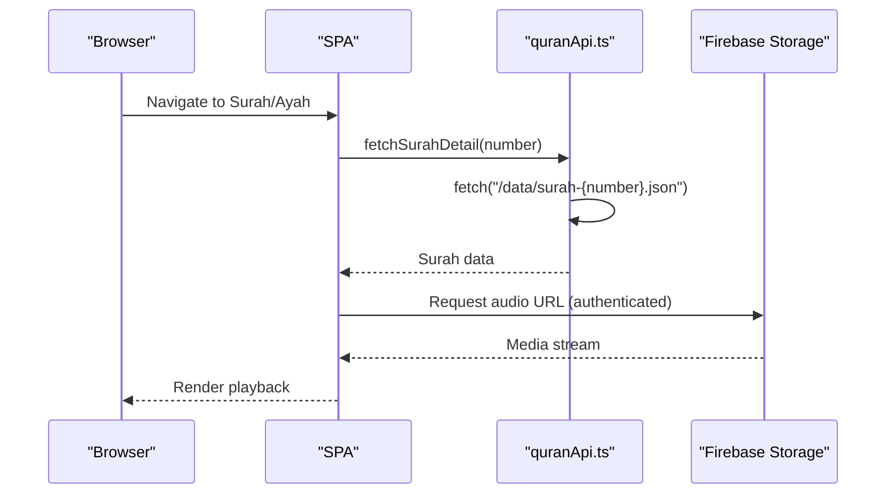
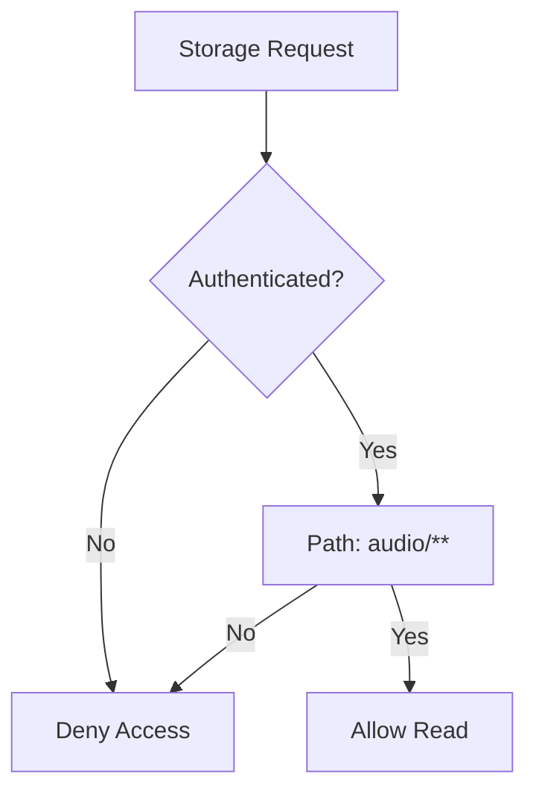
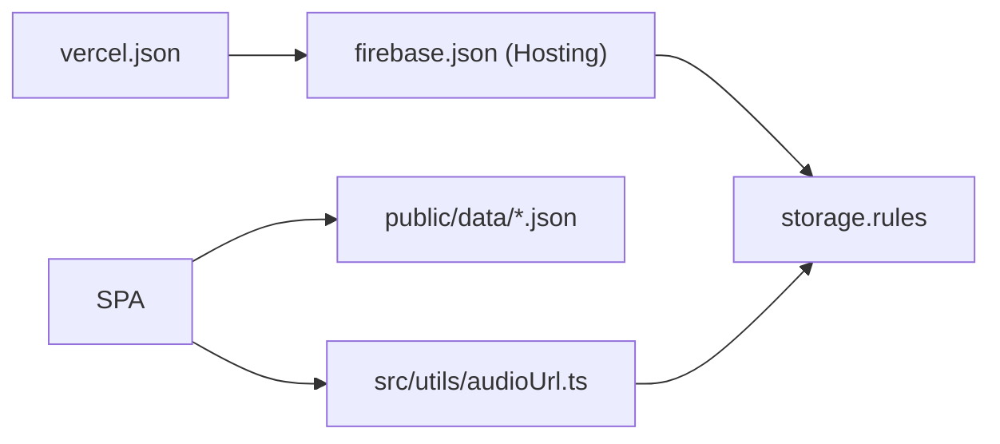

# Deployment & DevOps

<cite>
**Referenced Files in This Document**
- [vercel.json](file://vercel.json)
- [firebase.json](file://firebase.json)
- [.firebaserc](file://.firebaserc)
- [package.json](file://package.json)
- [vite.config.ts](file://vite.config.ts)
- [tsconfig.json](file://tsconfig.json)
- [.gitignore](file://.gitignore)
- [README.md](file://README.md)
- [public/manifest.json](file://public/manifest.json)
- [src/api/quranApi.ts](file://src/api/quranApi.ts)
- [src/utils/audioUrl.ts](file://src/utils/audioUrl.ts)
- [storage.rules](file://storage.rules)
</cite>

## Table of Contents
1. [Introduction](#introduction)
2. [Project Structure](#project-structure)
3. [Core Components](#core-components)
4. [Architecture Overview](#architecture-overview)
5. [Detailed Component Analysis](#detailed-component-analysis)
6. [Dependency Analysis](#dependency-analysis)
7. [Performance Considerations](#performance-considerations)
8. [Troubleshooting Guide](#troubleshooting-guide)
9. [Conclusion](#conclusion)
10. [Appendices](#appendices)

## Introduction
This document explains the deployment and DevOps processes for the Quran Reader application. It covers Vercel deployment configuration, Firebase Hosting setup, build pipeline, environment variable management, security controls, CDN configuration, monitoring, rollback procedures, performance tuning, and operational maintenance. The application is a static React + TypeScript SPA built with Vite and deployed via Vercel, with Firebase Storage serving audio assets and Firestore/Storage rules controlling access.

## Project Structure
The repository is organized around a frontend-first structure:
- Static assets and local data reside under public/.
- Application code lives under src/.
- Build and deployment configurations are defined in top-level config files.
- Firebase-related configuration and rules live alongside the app code.

**Diagram sources**
- [vercel.json](file://vercel.json)
- [firebase.json](file://firebase.json)
- [.firebaserc](file://.firebaserc)
- [package.json](file://package.json)
- [vite.config.ts](file://vite.config.ts)
- [tsconfig.json](file://tsconfig.json)
- [.gitignore](file://.gitignore)
- [public/manifest.json](file://public/manifest.json)
- [src/api/quranApi.ts](file://src/api/quranApi.ts)
- [src/utils/audioUrl.ts](file://src/utils/audioUrl.ts)

**Section sources**
- [README.md](file://README.md)
- [package.json](file://package.json)
- [vite.config.ts](file://vite.config.ts)
- [tsconfig.json](file://tsconfig.json)
- [vercel.json](file://vercel.json)
- [firebase.json](file://firebase.json)
- [.firebaserc](file://.firebaserc)
- [.gitignore](file://.gitignore)
- [public/manifest.json](file://public/manifest.json)

## Core Components
- Vercel configuration: Single-page application routing rewrite to index.html ensures deep links resolve correctly in client-side routing.
- Firebase Hosting: Hosts static assets and PWA manifests; Firebase Storage serves audio files; Firestore rules and indexes are configured centrally.
- Build pipeline: Vite-based build with React and Tailwind plugins; TypeScript compilation precedes Vite bundling.
- Data access: Local JSON data loaded via fetch; Firebase Storage URLs constructed for audio playback.
- Security: Firebase Storage rules restrict reads to authenticated users; service accounts used for controlled uploads.

**Section sources**
- [vercel.json](file://vercel.json)
- [firebase.json](file://firebase.json)
- [.firebaserc](file://.firebaserc)
- [package.json](file://package.json)
- [vite.config.ts](file://vite.config.ts)
- [src/api/quranApi.ts](file://src/api/quranApi.ts)
- [src/utils/audioUrl.ts](file://src/utils/audioUrl.ts)
- [storage.rules](file://storage.rules)

## Architecture Overview
The deployment architecture combines Vercel-hosted static assets with Firebase Storage for media delivery and Firebase Authentication for access control.

**Diagram sources**
- [vercel.json](file://vercel.json)
- [firebase.json](file://firebase.json)
- [public/manifest.json](file://public/manifest.json)
- [src/api/quranApi.ts](file://src/api/quranApi.ts)
- [src/utils/audioUrl.ts](file://src/utils/audioUrl.ts)

## Detailed Component Analysis

### Vercel Deployment Configuration
- Purpose: Enable SPA routing by rewriting all routes to index.html so client-side routing works correctly.
- Behavior: All unmatched paths route to index.html, allowing React Router to handle navigation.
- Integration: No serverless functions are used; deployment is purely static.

**Diagram sources**
- [vercel.json](file://vercel.json)

**Section sources**
- [vercel.json](file://vercel.json)

### Firebase Hosting Setup
- Hosting scope: Static files served from the project root; PWA manifest is included.
- Project association: Default project ID configured for Firebase CLI operations.
- Firestore and Storage: Separate configuration for Firestore rules/indexes and Storage rules.

**Diagram sources**
- [firebase.json](file://firebase.json)
- [.firebaserc](file://.firebaserc)

**Section sources**
- [firebase.json](file://firebase.json)
- [.firebaserc](file://.firebaserc)

### Build Pipeline and Optimization
- Build commands:
  - Type checking followed by Vite production build.
  - Preview command for local verification of production bundle.
- Plugins:
  - React plugin for JSX transform and Fast Refresh.
  - Tailwind plugin for utility-first CSS.
- TypeScript configuration:
  - Bundler-mode resolution for Vite compatibility.
  - ES2023 target and DOM libraries for modern browser support.
- Optimization opportunities:
  - Enable Vite’s built-in minification and chunk splitting.
  - Consider dynamic imports for non-critical routes/pages.
  - Add long-term caching headers via Vercel or CDN.
  - Analyze bundle size and remove unused dependencies.

**Diagram sources**
- [package.json](file://package.json)
- [vite.config.ts](file://vite.config.ts)
- [tsconfig.json](file://tsconfig.json)

**Section sources**
- [package.json](file://package.json)
- [vite.config.ts](file://vite.config.ts)
- [tsconfig.json](file://tsconfig.json)

### Data Fetching and CDN Delivery
- Local data: Surah lists and search indices are fetched from public/data as static JSON.
- Audio delivery: Public URLs are constructed for Firebase Storage; access requires authentication.
- CDN: Vercel serves static assets; Firebase Storage delivers audio with global reach.

**Diagram sources**
- [src/api/quranApi.ts](file://src/api/quranApi.ts)
- [src/utils/audioUrl.ts](file://src/utils/audioUrl.ts)

**Section sources**
- [src/api/quranApi.ts](file://src/api/quranApi.ts)
- [src/utils/audioUrl.ts](file://src/utils/audioUrl.ts)

### Security Controls and Access Management
- Firebase Storage rules:
  - Audio paths restricted to authenticated users.
  - Writes disabled for general users; intended for service-account-only uploads.
- Environment variables:
  - Explicitly ignored by Git to prevent credential leaks.
  - Service account keys are excluded from source control.
- Recommendations:
  - Enforce HTTPS-only access.
  - Limit Storage bucket exposure; avoid public writes.
  - Use short-lived tokens and scoped permissions.

**Diagram sources**
- [storage.rules](file://storage.rules)

**Section sources**
- [storage.rules](file://storage.rules)
- [.gitignore](file://.gitignore)

### Monitoring and Observability
- Built-in metrics:
  - Vercel dashboard provides analytics and performance insights.
  - Firebase Console offers Storage usage and latency metrics.
- Recommended additions:
  - Add error logging (e.g., Sentry) for client-side errors.
  - Track audio playback events and engagement metrics.
  - Monitor CDN hit rates and cache effectiveness.

[No sources needed since this section provides general guidance]

### Rollback Procedures
- Vercel:
  - Use the dashboard to revert to a previous deployment.
  - Tag releases and promote stable builds to production.
- Firebase:
  - Keep a backup of current rules and indexes.
  - Revert to prior versions if configuration changes cause issues.

[No sources needed since this section provides general guidance]

### Maintenance Tasks
- Data refresh:
  - Use the provided script to re-download data and rebuild search indexes.
- Dependency updates:
  - Regularly update Vite, React, and supporting libraries.
- Security hygiene:
  - Rotate service account keys periodically.
  - Review and tighten Storage rules as features evolve.

**Section sources**
- [package.json](file://package.json)

## Dependency Analysis
The deployment stack depends on:
- Vercel for static hosting and SPA routing.
- Firebase Hosting for PWA assets and CDN distribution.
- Firebase Storage for audio delivery with enforced authentication.
- Local JSON data for content and search indices.

**Diagram sources**
- [vercel.json](file://vercel.json)
- [firebase.json](file://firebase.json)
- [storage.rules](file://storage.rules)
- [src/utils/audioUrl.ts](file://src/utils/audioUrl.ts)

**Section sources**
- [vercel.json](file://vercel.json)
- [firebase.json](file://firebase.json)
- [storage.rules](file://storage.rules)
- [src/utils/audioUrl.ts](file://src/utils/audioUrl.ts)

## Performance Considerations
- Bundle optimization:
  - Split vendor and app bundles; enable code splitting for routes.
  - Minimize payload by removing unused polyfills and legacy targets.
- Asset delivery:
  - Leverage Vercel’s global CDN; ensure cache headers are set appropriately.
  - Compress images and audio; consider adaptive bitrate streaming for audio.
- Data fetching:
  - Lazy-load non-critical routes and components.
  - Cache search indices and surah data in memory to reduce repeated fetches.
- Storage:
  - Pre-warm hot paths; monitor Storage bandwidth costs.
  - Consider regional buckets if targeting specific geographic regions.

[No sources needed since this section provides general guidance]

## Troubleshooting Guide
- SPA routing issues:
  - Symptom: Refreshing a deep link returns 404.
  - Resolution: Confirm Vercel rewrites are enabled and correctly configured.
  - Section sources
    - [vercel.json](file://vercel.json)
- Static asset not found:
  - Symptom: PWA manifest or images fail to load.
  - Resolution: Verify build output and deploy artifacts; confirm Hosting configuration.
  - Section sources
    - [firebase.json](file://firebase.json)
    - [public/manifest.json](file://public/manifest.json)
- Audio playback fails:
  - Symptom: Cannot play audio despite being logged in.
  - Resolution: Check Firebase Storage rules and authentication state; verify URL construction.
  - Section sources
    - [storage.rules](file://storage.rules)
    - [src/utils/audioUrl.ts](file://src/utils/audioUrl.ts)
- Data not loading:
  - Symptom: Surah list or search results empty.
  - Resolution: Ensure local JSON files are present and reachable; verify fetch paths.
  - Section sources
    - [src/api/quranApi.ts](file://src/api/quranApi.ts)
- Build failures:
  - Symptom: Type errors or Vite build errors.
  - Resolution: Run type checks and fix reported issues; update Vite/Tailwind plugins.
  - Section sources
    - [package.json](file://package.json)
    - [vite.config.ts](file://vite.config.ts)
    - [tsconfig.json](file://tsconfig.json)

## Conclusion
The Quran Reader application follows a robust, static-first deployment model using Vercel for hosting and Firebase for media and data infrastructure. By leveraging SPA routing rewrites, strict Storage access controls, and a streamlined build pipeline, the system achieves reliable performance and strong security. Adopting the recommended monitoring, rollback, and maintenance practices will further enhance reliability and operability in production.

## Appendices

### Environment Variables and Secrets
- Environment variables are intentionally ignored by Git to prevent accidental commits.
- Service account keys are excluded from source control and should remain secret.

**Section sources**
- [.gitignore](file://.gitignore)

### PWA Manifest and Offline Behavior
- The PWA manifest defines app metadata, display mode, and icons.
- Offline capability relies on cached static assets and local JSON data.

**Section sources**
- [public/manifest.json](file://public/manifest.json)