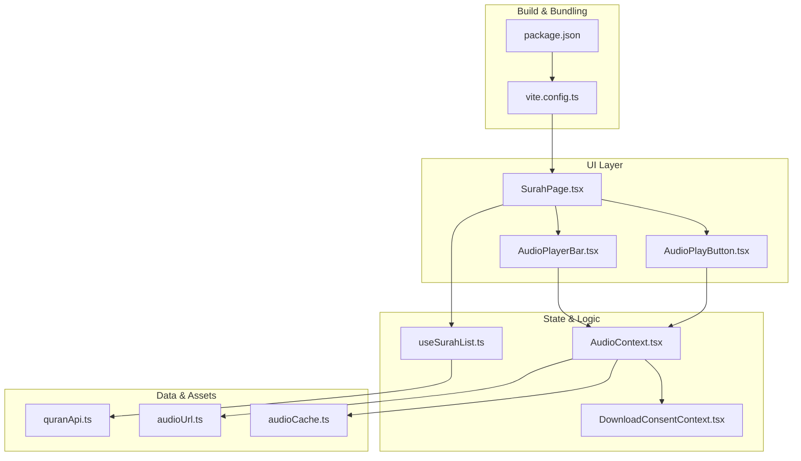
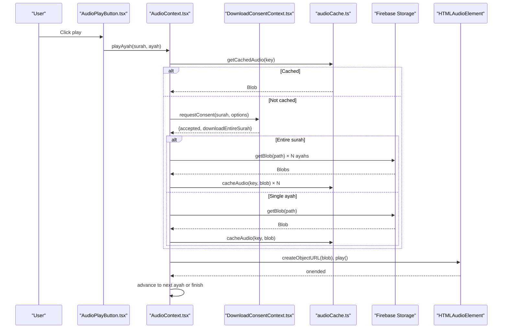
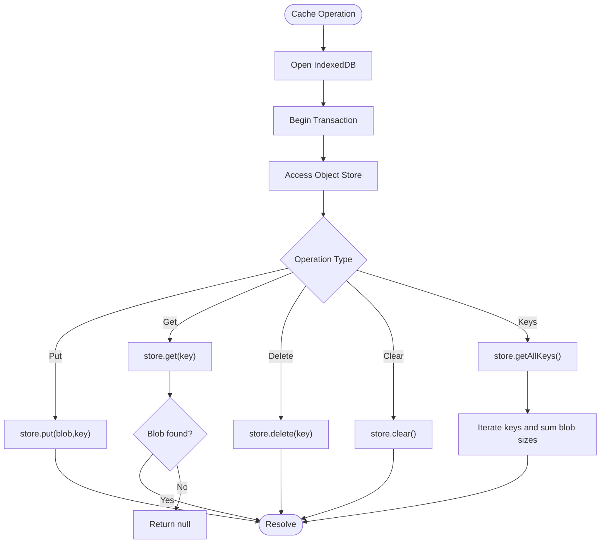
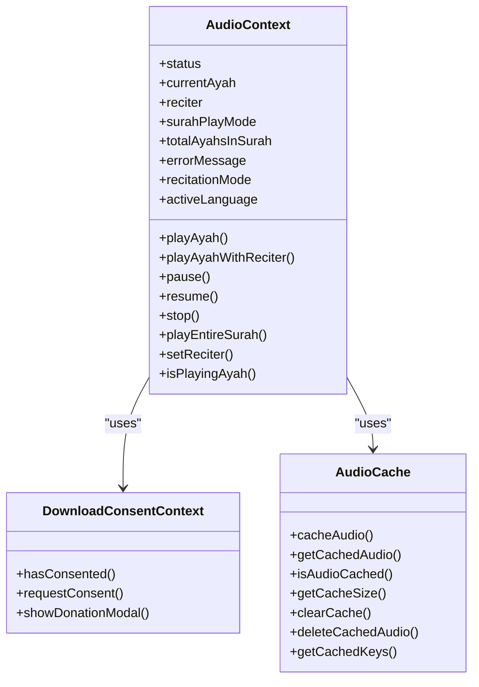
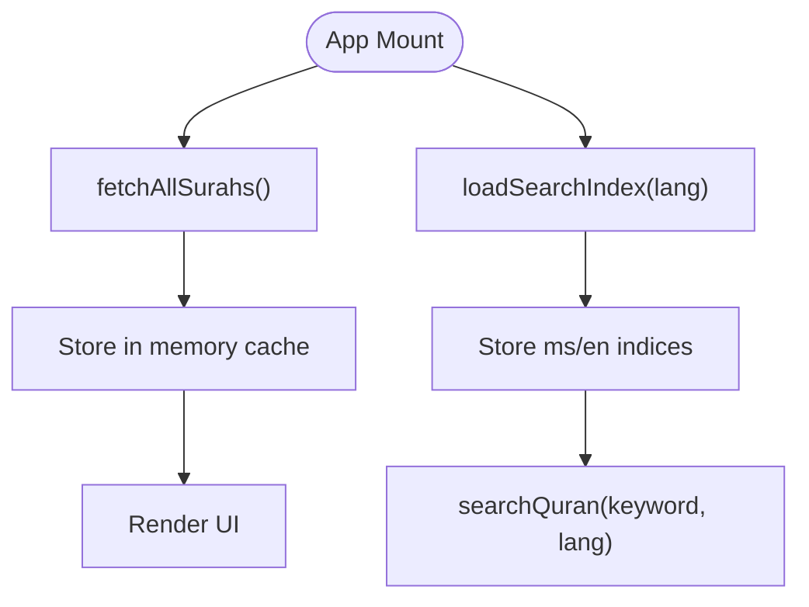
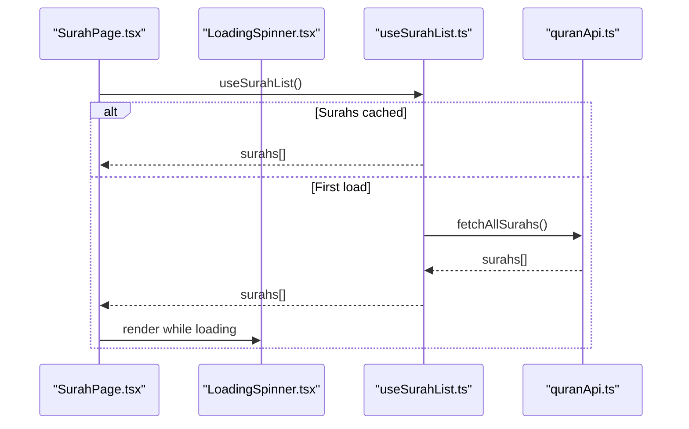
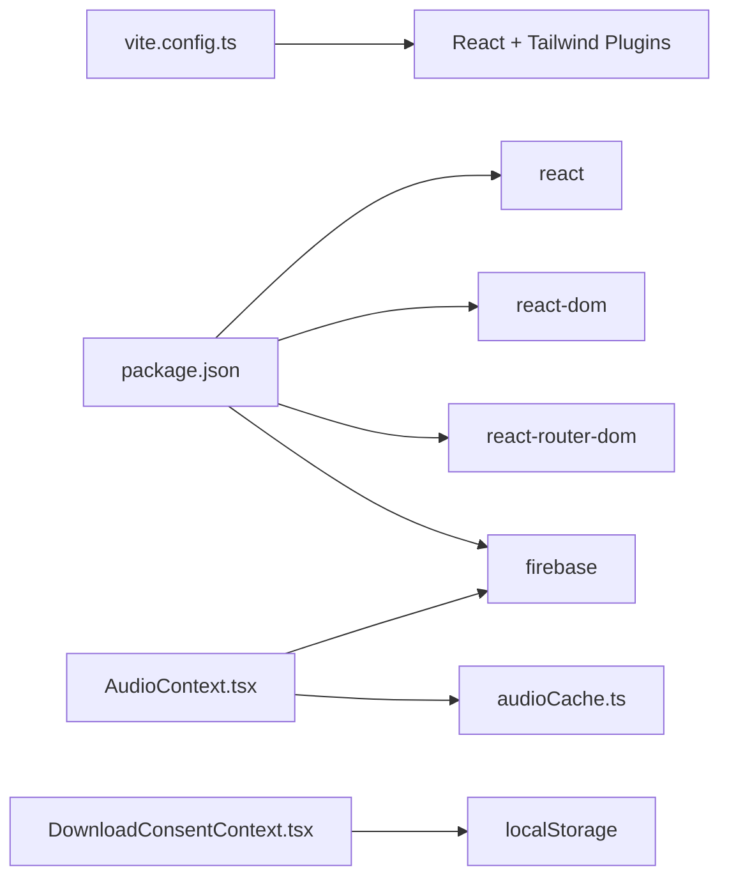

# Performance & Optimization

<cite>
**Referenced Files in This Document**
- [vite.config.ts](file://vite.config.ts)
- [package.json](file://package.json)
- [src/utils/audioCache.ts](file://src/utils/audioCache.ts)
- [src/utils/audioUrl.ts](file://src/utils/audioUrl.ts)
- [src/context/AudioContext.tsx](file://src/context/AudioContext.tsx)
- [src/context/DownloadConsentContext.tsx](file://src/context/DownloadConsentContext.tsx)
- [src/components/AudioPlayerBar.tsx](file://src/components/AudioPlayerBar.tsx)
- [src/components/AudioPlayButton.tsx](file://src/components/AudioPlayButton.tsx)
- [src/hooks/useSurahList.ts](file://src/hooks/useSurahList.ts)
- [src/api/quranApi.ts](file://src/api/quranApi.ts)
- [src/pages/SurahPage.tsx](file://src/pages/SurahPage.tsx)
</cite>

## Table of Contents
1. [Introduction](#introduction)
2. [Project Structure](#project-structure)
3. [Core Components](#core-components)
4. [Architecture Overview](#architecture-overview)
5. [Detailed Component Analysis](#detailed-component-analysis)
6. [Dependency Analysis](#dependency-analysis)
7. [Performance Considerations](#performance-considerations)
8. [Troubleshooting Guide](#troubleshooting-guide)
9. [Conclusion](#conclusion)
10. [Appendices](#appendices)

## Introduction
This document focuses on performance optimization strategies in the Quran Reader application. It explains how lazy loading, bundle size optimization, and caching policies are implemented for data and audio resources. It also covers the audio caching architecture, progressive enhancement, offline readiness, performance monitoring approaches, profiling techniques, memory management, rendering performance, and user experience optimizations. Concrete examples and measurement methodologies are included to help quantify and validate improvements.

## Project Structure
The application follows a React + Vite setup with Firebase Storage for audio assets and local IndexedDB caching for offline reuse. Key performance-relevant areas include:
- Build and bundling via Vite
- Lazy data loading for surah lists and search indices
- Audio caching and consent-driven downloads
- Progressive audio playback with surah-mode enhancements
- Minimal UI overlays during loading and errors

**Diagram sources**
- [vite.config.ts:1-8](file://vite.config.ts#L1-L8)
- [package.json:1-29](file://package.json#L1-L29)
- [src/pages/SurahPage.tsx:1-120](file://src/pages/SurahPage.tsx#L1-L120)
- [src/components/AudioPlayButton.tsx:1-69](file://src/components/AudioPlayButton.tsx#L1-L69)
- [src/components/AudioPlayerBar.tsx:1-86](file://src/components/AudioPlayerBar.tsx#L1-L86)
- [src/context/AudioContext.tsx:1-396](file://src/context/AudioContext.tsx#L1-L396)
- [src/context/DownloadConsentContext.tsx:1-256](file://src/context/DownloadConsentContext.tsx#L1-L256)
- [src/hooks/useSurahList.ts:1-47](file://src/hooks/useSurahList.ts#L1-L47)
- [src/api/quranApi.ts:1-51](file://src/api/quranApi.ts#L1-L51)
- [src/utils/audioUrl.ts:1-37](file://src/utils/audioUrl.ts#L1-L37)
- [src/utils/audioCache.ts:1-153](file://src/utils/audioCache.ts#L1-L153)

**Section sources**
- [vite.config.ts:1-8](file://vite.config.ts#L1-L8)
- [package.json:1-29](file://package.json#L1-L29)

## Core Components
- Audio caching and playback orchestration: Centralized in the audio context provider, which manages IndexedDB caching, Firebase Storage retrieval, and progressive playback modes.
- Consent-driven downloads: A dedicated provider coordinates user consent and optional donation prompts to align downloads with user intent.
- Lazy data loading: Surah lists and search indices are fetched once and cached in memory to avoid repeated network overhead.
- UI feedback: Minimal, non-blocking loaders and error messaging improve perceived performance and UX.

**Section sources**
- [src/context/AudioContext.tsx:1-396](file://src/context/AudioContext.tsx#L1-L396)
- [src/context/DownloadConsentContext.tsx:1-256](file://src/context/DownloadConsentContext.tsx#L1-L256)
- [src/hooks/useSurahList.ts:1-47](file://src/hooks/useSurahList.ts#L1-L47)
- [src/components/AudioPlayerBar.tsx:1-86](file://src/components/AudioPlayerBar.tsx#L1-L86)
- [src/components/AudioPlayButton.tsx:1-69](file://src/components/AudioPlayButton.tsx#L1-L69)

## Architecture Overview
The audio playback pipeline integrates user actions, consent, caching, and streaming. It supports single ayah playback, surah-wide playback, and multi-language progression with minimal latency after the first download.

**Diagram sources**
- [src/components/AudioPlayButton.tsx:1-69](file://src/components/AudioPlayButton.tsx#L1-L69)
- [src/context/AudioContext.tsx:68-305](file://src/context/AudioContext.tsx#L68-L305)
- [src/context/DownloadConsentContext.tsx:28-77](file://src/context/DownloadConsentContext.tsx#L28-L77)
- [src/utils/audioCache.ts:46-68](file://src/utils/audioCache.ts#L46-L68)
- [src/utils/audioUrl.ts:13-22](file://src/utils/audioUrl.ts#L13-L22)

## Detailed Component Analysis

### Audio Caching Architecture
- IndexedDB-backed cache stores audio blobs keyed by reciter, language, surah, and ayah number.
- Operations include save, retrieve, existence check, cache size estimation, clear, delete, and enumerate keys.
- Cache size calculation iterates stored entries and sums sizes asynchronously; a small delay ensures completion before resolving.

**Diagram sources**
- [src/utils/audioCache.ts:11-25](file://src/utils/audioCache.ts#L11-L25)
- [src/utils/audioCache.ts:30-40](file://src/utils/audioCache.ts#L30-L40)
- [src/utils/audioCache.ts:46-68](file://src/utils/audioCache.ts#L46-L68)
- [src/utils/audioCache.ts:73-103](file://src/utils/audioCache.ts#L73-L103)
- [src/utils/audioCache.ts:108-133](file://src/utils/audioCache.ts#L108-L133)
- [src/utils/audioCache.ts:138-152](file://src/utils/audioCache.ts#L138-L152)

**Section sources**
- [src/utils/audioCache.ts:1-153](file://src/utils/audioCache.ts#L1-L153)

### Audio Playback Orchestration
- Manages state transitions (idle, loading, playing, paused, error) and audio element lifecycle.
- Implements surah-wide playback with language progression modes and automatic advancement.
- Integrates consent and donation flows for surah-mode downloads and user authentication gating.

**Diagram sources**
- [src/context/AudioContext.tsx:16-38](file://src/context/AudioContext.tsx#L16-L38)
- [src/context/AudioContext.tsx:40-396](file://src/context/AudioContext.tsx#L40-L396)
- [src/context/DownloadConsentContext.tsx:3-10](file://src/context/DownloadConsentContext.tsx#L3-L10)
- [src/context/DownloadConsentContext.tsx:16-256](file://src/context/DownloadConsentContext.tsx#L16-L256)
- [src/utils/audioCache.ts:30-152](file://src/utils/audioCache.ts#L30-L152)

**Section sources**
- [src/context/AudioContext.tsx:1-396](file://src/context/AudioContext.tsx#L1-L396)
- [src/context/DownloadConsentContext.tsx:1-256](file://src/context/DownloadConsentContext.tsx#L1-L256)
- [src/utils/audioCache.ts:1-153](file://src/utils/audioCache.ts#L1-L153)

### Lazy Data Loading and Search Indexing
- Surah list is fetched once and memoized in memory to avoid redundant network calls.
- Search indices are loaded on demand and cached globally to support fast client-side search.

**Diagram sources**
- [src/hooks/useSurahList.ts:8-31](file://src/hooks/useSurahList.ts#L8-L31)
- [src/api/quranApi.ts:4-8](file://src/api/quranApi.ts#L4-L8)
- [src/api/quranApi.ts:21-41](file://src/api/quranApi.ts#L21-L41)
- [src/api/quranApi.ts:43-50](file://src/api/quranApi.ts#L43-L50)

**Section sources**
- [src/hooks/useSurahList.ts:1-47](file://src/hooks/useSurahList.ts#L1-L47)
- [src/api/quranApi.ts:1-51](file://src/api/quranApi.ts#L1-L51)

### UI Feedback and Rendering Performance
- Minimal loader and error messaging avoid layout shifts and maintain perceived responsiveness.
- Surah page renders ayah blocks efficiently and provides navigation controls.

**Diagram sources**
- [src/pages/SurahPage.tsx:11-31](file://src/pages/SurahPage.tsx#L11-L31)
- [src/components/LoadingSpinner.tsx:1-8](file://src/components/LoadingSpinner.tsx#L1-L8)
- [src/hooks/useSurahList.ts:8-31](file://src/hooks/useSurahList.ts#L8-L31)
- [src/api/quranApi.ts:4-8](file://src/api/quranApi.ts#L4-L8)

**Section sources**
- [src/pages/SurahPage.tsx:1-120](file://src/pages/SurahPage.tsx#L1-L120)
- [src/components/LoadingSpinner.tsx:1-8](file://src/components/LoadingSpinner.tsx#L1-L8)
- [src/hooks/useSurahList.ts:1-47](file://src/hooks/useSurahList.ts#L1-L47)
- [src/api/quranApi.ts:1-51](file://src/api/quranApi.ts#L1-L51)

## Dependency Analysis
- Build-time: Vite plugin stack for React and Tailwind CSS.
- Runtime: React, React DOM, React Router, and Firebase SDKs for storage and auth.
- Local persistence: IndexedDB for audio cache; localStorage for consent flags.

**Diagram sources**
- [vite.config.ts:5-7](file://vite.config.ts#L5-L7)
- [package.json:20-27](file://package.json#L20-L27)
- [src/context/AudioContext.tsx:9-14](file://src/context/AudioContext.tsx#L9-L14)
- [src/utils/audioCache.ts:1-10](file://src/utils/audioCache.ts#L1-L10)
- [src/context/DownloadConsentContext.tsx:14-26](file://src/context/DownloadConsentContext.tsx#L14-L26)

**Section sources**
- [vite.config.ts:1-8](file://vite.config.ts#L1-L8)
- [package.json:1-29](file://package.json#L1-L29)

## Performance Considerations

### Lazy Loading
- Surah list and search indices are fetched once and cached in memory to minimize repeated network requests.
- Surah detail pages lazily load per-surah JSON assets on route entry.

Practical tips:
- Keep cache keys granular (surah + ayah) to enable targeted invalidation.
- Preload adjacent surahs when navigating to reduce latency.

**Section sources**
- [src/hooks/useSurahList.ts:8-31](file://src/hooks/useSurahList.ts#L8-L31)
- [src/api/quranApi.ts:4-14](file://src/api/quranApi.ts#L4-L14)

### Bundle Size Optimization
- Vite’s React plugin enables tree-shaking and modern builds.
- Tailwind CSS purges unused styles in production builds.

Recommendations:
- Prefer dynamic imports for non-critical routes and components.
- Audit dependencies regularly and remove unused ones.
- Monitor bundle composition using Vite’s built-in analyzer.

**Section sources**
- [vite.config.ts:1-8](file://vite.config.ts#L1-L8)
- [package.json:12-27](file://package.json#L12-L27)

### Audio Caching Policies
- IndexedDB cache persists audio blobs after first download.
- Cache keys encode language, reciter, surah, and ayah to prevent collisions.
- Surah-mode downloads can prefetch and cache entire surahs for seamless playback.

Guidelines:
- Implement periodic cache size checks and eviction strategies if needed.
- Use cache existence checks to avoid redundant downloads.
- Provide user controls to clear cache selectively or globally.

**Section sources**
- [src/utils/audioCache.ts:30-68](file://src/utils/audioCache.ts#L30-L68)
- [src/context/AudioContext.tsx:74-200](file://src/context/AudioContext.tsx#L74-L200)

### Progressive Enhancement Strategies
- Single ayah vs entire surah modes allow users to choose bandwidth vs latency trade-offs.
- Arabic-first, Malay-second mode provides multilingual enhancement without blocking core flow.
- Authentication gating ensures downloads are permitted only for logged-in users.

**Section sources**
- [src/context/AudioContext.tsx:138-198](file://src/context/AudioContext.tsx#L138-L198)
- [src/context/AudioContext.tsx:239-283](file://src/context/AudioContext.tsx#L239-L283)

### Offline Functionality Performance Considerations
- Once cached, audio plays from local IndexedDB URLs, eliminating network latency and bandwidth usage.
- Surah-mode playback advances automatically, maintaining continuity even without connectivity.

Measurement ideas:
- Track cache hit rate by counting successful cache retrievals.
- Measure time-to-play for cached vs. uncached ayahs.

**Section sources**
- [src/utils/audioCache.ts:46-68](file://src/utils/audioCache.ts#L46-L68)
- [src/context/AudioContext.tsx:201-230](file://src/context/AudioContext.tsx#L201-L230)

### Memory Management
- Audio element is reused; handlers are cleared before reassignment to prevent leaks.
- Blob URLs are created per ayah; ensure to revoke URLs after playback completes if needed.
- State refs capture current values inside event handlers to avoid stale closures.

Best practices:
- Revoke object URLs when switching ayahs or stopping playback.
- Avoid retaining large arrays of cached blobs unnecessarily.

**Section sources**
- [src/context/AudioContext.tsx:61-66](file://src/context/AudioContext.tsx#L61-L66)
- [src/context/AudioContext.tsx:202-203](file://src/context/AudioContext.tsx#L202-L203)

### Rendering Performance
- Surah page renders ayah blocks efficiently; avoid unnecessary re-renders by passing memoized props.
- Use minimal overlays (spinner, error messages) to reduce layout thrashing.

**Section sources**
- [src/pages/SurahPage.tsx:82-92](file://src/pages/SurahPage.tsx#L82-L92)
- [src/components/AudioPlayerBar.tsx:14-84](file://src/components/AudioPlayerBar.tsx#L14-L84)

### User Experience Optimizations
- Immediate feedback during loading and error states improves perceived performance.
- Donation prompt appears strategically to encourage consent for surah-mode downloads.

**Section sources**
- [src/components/AudioPlayerBar.tsx:44-50](file://src/components/AudioPlayerBar.tsx#L44-L50)
- [src/context/DownloadConsentContext.tsx:74-77](file://src/context/DownloadConsentContext.tsx#L74-L77)

## Troubleshooting Guide
Common issues and remedies:
- Playback fails with “failed to load”: Verify network connectivity and Firebase Storage permissions; check error state propagation.
- Surah-mode stalls: Confirm user authentication and that entire surah was prefetched; inspect cache keys.
- Cache grows too large: Implement cache size monitoring and selective eviction; expose user-triggered cache clearing.

**Section sources**
- [src/context/AudioContext.tsx:216-229](file://src/context/AudioContext.tsx#L216-L229)
- [src/context/AudioContext.tsx:294-300](file://src/context/AudioContext.tsx#L294-L300)
- [src/utils/audioCache.ts:73-103](file://src/utils/audioCache.ts#L73-L103)

## Conclusion
The Quran Reader applies practical performance strategies: lazy data loading, IndexedDB-based audio caching, consent-driven downloads, and progressive enhancement. These combine to deliver responsive playback, reduced bandwidth usage, and robust offline readiness. Continued monitoring of cache metrics, bundle composition, and user feedback will sustain and improve performance over time.

## Appendices

### Measurement Methodologies
- Cache hit ratio: Count successful cache retrievals divided by total playback attempts.
- Time-to-play: Measure from user action to audio.canplay event for cached vs. uncached ayahs.
- Bandwidth savings: Compare data usage before and after enabling caching.
- Bundle size: Use Vite analyzer to track changes across iterations.

[No sources needed since this section provides general guidance]