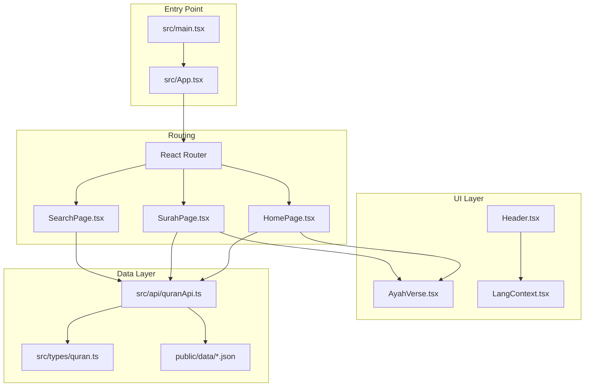
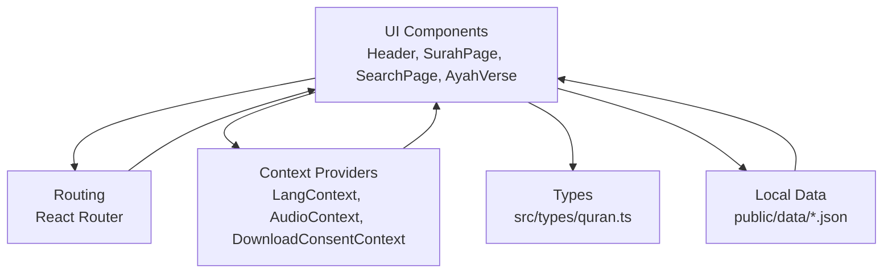
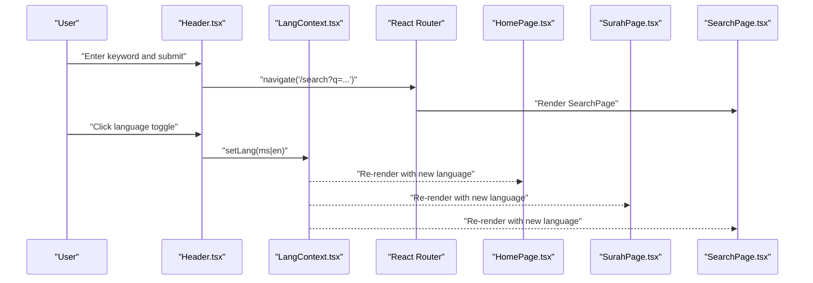
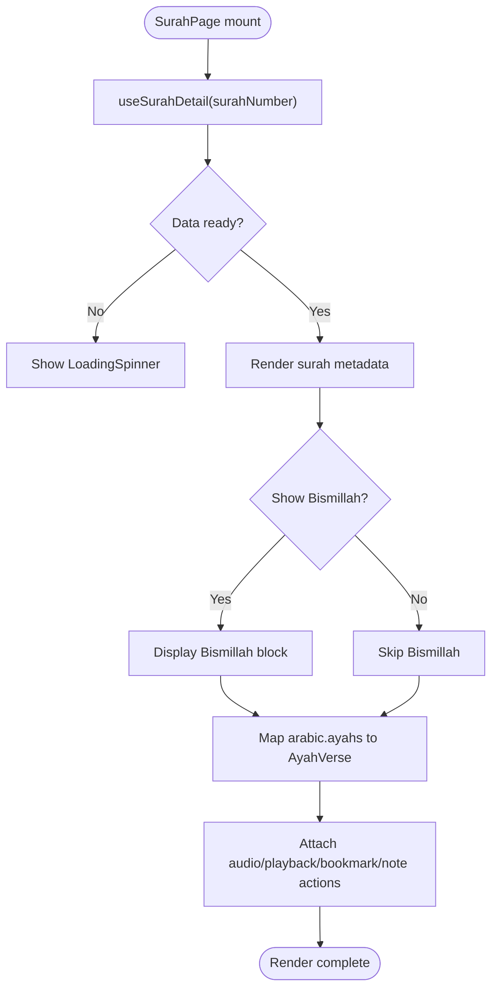
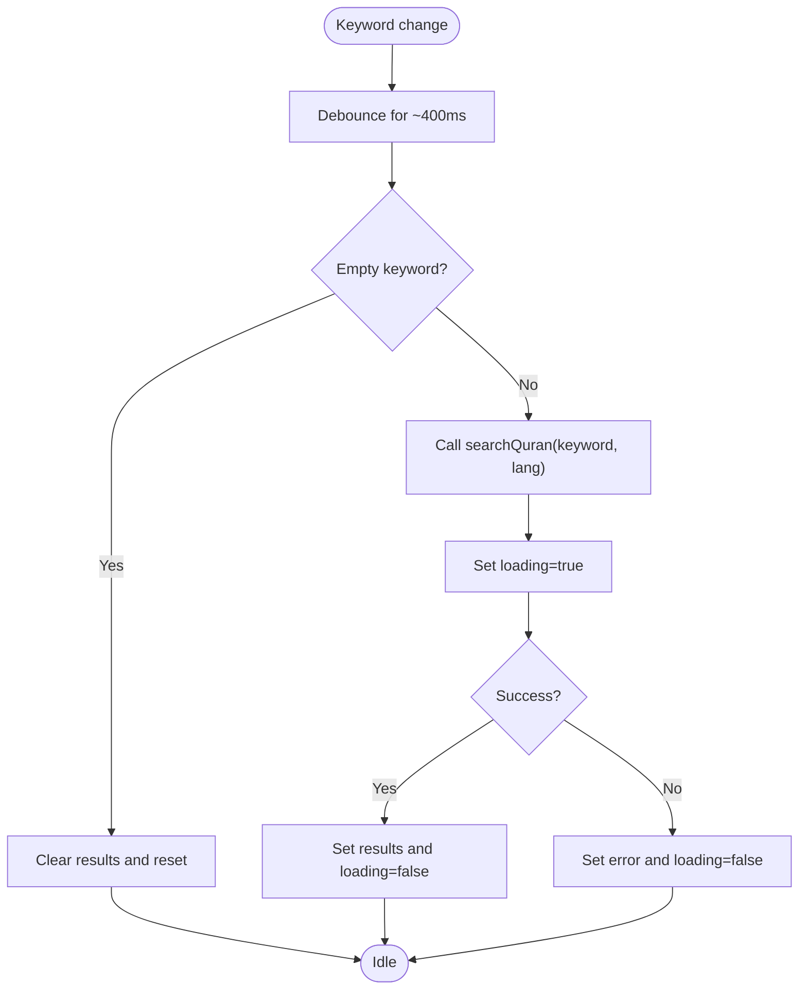
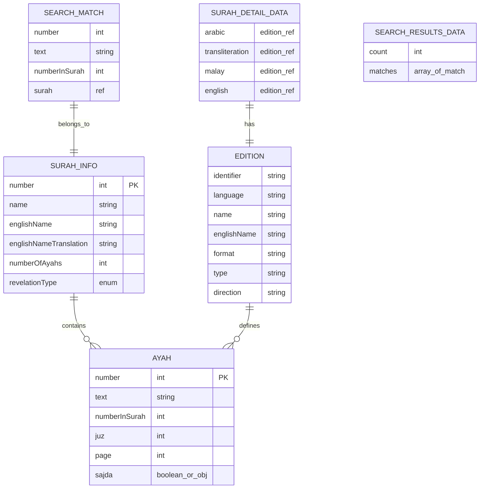
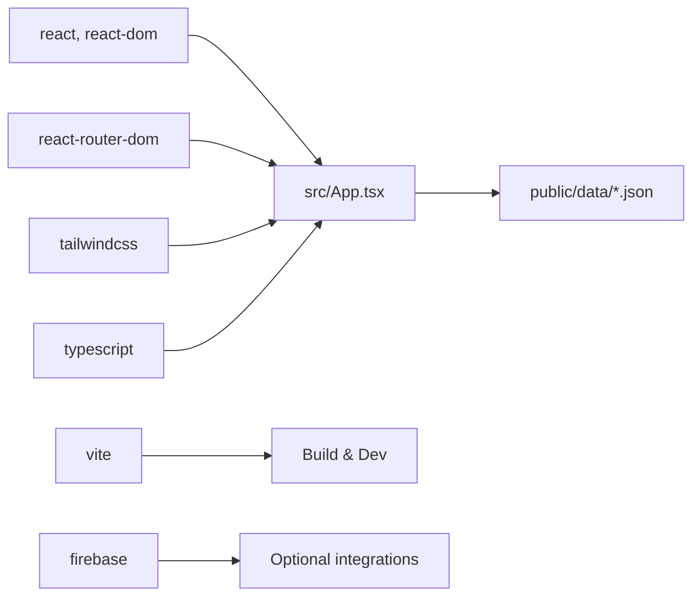

# Project Overview

<cite>
**Referenced Files in This Document**
- [README.md](file://README.md)
- [package.json](file://package.json)
- [src/App.tsx](file://src/App.tsx)
- [src/main.tsx](file://src/main.tsx)
- [public/manifest.json](file://public/manifest.json)
- [src/components/Header.tsx](file://src/components/Header.tsx)
- [src/context/LangContext.tsx](file://src/context/LangContext.tsx)
- [src/pages/HomePage.tsx](file://src/pages/HomePage.tsx)
- [src/pages/SurahPage.tsx](file://src/pages/SurahPage.tsx)
- [src/pages/SearchPage.tsx](file://src/pages/SearchPage.tsx)
- [src/components/AyahVerse.tsx](file://src/components/AyahVerse.tsx)
- [src/hooks/useSurahList.ts](file://src/hooks/useSurahList.ts)
- [src/hooks/useSurahDetail.ts](file://src/hooks/useSurahDetail.ts)
- [src/hooks/useSearch.ts](file://src/hooks/useSearch.ts)
- [src/types/quran.ts](file://src/types/quran.ts)
</cite>

## Table of Contents
1. [Introduction](#introduction)
2. [Project Structure](#project-structure)
3. [Core Components](#core-components)
4. [Architecture Overview](#architecture-overview)
5. [Detailed Component Analysis](#detailed-component-analysis)
6. [Dependency Analysis](#dependency-analysis)
7. [Performance Considerations](#performance-considerations)
8. [Troubleshooting Guide](#troubleshooting-guide)
9. [Conclusion](#conclusion)
10. [Appendices](#appendices)

## Introduction
Quran Reader is a clean, modern web application designed for reading the Quran with Arabic text, Rumi transliteration, and bilingual translations (Malay and English). It emphasizes accessibility and offline-first operation, delivering a seamless reading experience without requiring network connectivity after initial load. The app supports searching across translations, navigating between surahs, and toggling language preferences. It is built with contemporary web technologies and structured for maintainability and extensibility.

Key capabilities:
- Arabic script presentation with Amiri Quran font for authentic rendering
- Rumi transliteration for phonetic guidance
- Bilingual translations (Malay and English) with language switching
- Full-text search across Malay and English translations
- Surah browsing and navigation with previous/next controls
- Fully offline-capable data model with local JSON resources
- Progressive Web App (PWA) metadata for installability and native-like behavior

Target audience and use cases:
- Devout readers seeking a distraction-free, offline-friendly Quran app
- Learners who benefit from transliteration and dual-language support
- Users preferring a lightweight, fast-loading reader without cloud dependencies
- Educators and students exploring specific verses or topics via search

## Project Structure
The project follows a component-driven React architecture with TypeScript, organized into logical layers:
- Pages: route-level views (Home, Surah detail, Search, Bookmarks)
- Components: reusable UI elements (Header, AyahVerse, SearchResults, etc.)
- Hooks: custom React hooks encapsulating data fetching and state logic
- Context: global providers for language, audio, and consent
- Types: shared TypeScript interfaces for data contracts
- Public data: local JSON datasets enabling offline operation
- Build and deployment: Vite-based toolchain with PWA manifest

**Diagram sources**
- [src/main.tsx:1-14](file://src/main.tsx#L1-L14)
- [src/App.tsx:1-56](file://src/App.tsx#L1-L56)
- [src/pages/HomePage.tsx:1-44](file://src/pages/HomePage.tsx#L1-L44)
- [src/pages/SurahPage.tsx:1-120](file://src/pages/SurahPage.tsx#L1-L120)
- [src/pages/SearchPage.tsx:1-47](file://src/pages/SearchPage.tsx#L1-L47)
- [src/components/Header.tsx:1-68](file://src/components/Header.tsx#L1-L68)
- [src/components/AyahVerse.tsx:1-63](file://src/components/AyahVerse.tsx#L1-L63)
- [src/context/LangContext.tsx:1-32](file://src/context/LangContext.tsx#L1-L32)
- [src/types/quran.ts:1-64](file://src/types/quran.ts#L1-L64)

**Section sources**
- [README.md:38-66](file://README.md#L38-L66)
- [src/App.tsx:1-56](file://src/App.tsx#L1-L56)
- [src/main.tsx:1-14](file://src/main.tsx#L1-L14)

## Core Components
This section highlights the primary building blocks that deliver Quran Reader’s functionality.

- Language context and provider
  - Centralized language preference (Malay or English) persisted in local storage and exposed via a React context.
  - Enables dynamic translation switching across pages and components.

- Header and navigation
  - Provides site branding, global search form, language toggle, and user menu.
  - Integrates with routing to navigate to search results.

- Surah list and detail pages
  - Surah list page offers filtering and grid layout for quick access to all 114 surahs.
  - Surah detail page renders Arabic text, Rumi transliteration, and selected translation, with navigation controls and optional “Bismillah” display.

- AyahVerse component
  - Renders a single verse with Arabic text, transliteration, and translation.
  - Includes action buttons for audio playback, bookmarking, and note-taking.

- Search page and hook
  - Debounced search against localized indices for Malay and English.
  - Presents results with counts and match highlights.

- Data types and contracts
  - Strongly typed interfaces define surah metadata, ayah structures, editions, and search results.

Practical examples:
- Switch language: Click the language toggle in the header to switch between Malay and English translations.
- Browse surahs: Use the home page to filter by name, English name, translation, or surah number.
- Read a surah: Open a surah detail page to read Arabic text, transliteration, and translation side-by-side.
- Search: Enter keywords in the header search box to find relevant verses in Malay or English.
- Navigate: Use previous/next buttons on the surah detail page to move between surahs.

**Section sources**
- [src/context/LangContext.tsx:1-32](file://src/context/LangContext.tsx#L1-L32)
- [src/components/Header.tsx:1-68](file://src/components/Header.tsx#L1-L68)
- [src/pages/HomePage.tsx:1-44](file://src/pages/HomePage.tsx#L1-L44)
- [src/pages/SurahPage.tsx:1-120](file://src/pages/SurahPage.tsx#L1-L120)
- [src/components/AyahVerse.tsx:1-63](file://src/components/AyahVerse.tsx#L1-L63)
- [src/pages/SearchPage.tsx:1-47](file://src/pages/SearchPage.tsx#L1-L47)
- [src/hooks/useSearch.ts:1-37](file://src/hooks/useSearch.ts#L1-L37)
- [src/types/quran.ts:1-64](file://src/types/quran.ts#L1-L64)

## Architecture Overview
Quran Reader employs a layered architecture:
- Presentation layer: React components and pages
- State and context: Global providers for language and audio
- Data access: Local JSON datasets and client-side search
- Routing: React Router for navigation
- Build and deployment: Vite with PWA manifest for offline-first delivery

**Diagram sources**
- [src/App.tsx:1-56](file://src/App.tsx#L1-L56)
- [src/components/Header.tsx:1-68](file://src/components/Header.tsx#L1-L68)
- [src/pages/SurahPage.tsx:1-120](file://src/pages/SurahPage.tsx#L1-L120)
- [src/pages/SearchPage.tsx:1-47](file://src/pages/SearchPage.tsx#L1-L47)
- [src/components/AyahVerse.tsx:1-63](file://src/components/AyahVerse.tsx#L1-L63)
- [src/context/LangContext.tsx:1-32](file://src/context/LangContext.tsx#L1-L32)
- [src/types/quran.ts:1-64](file://src/types/quran.ts#L1-L64)

## Detailed Component Analysis

### Language and Navigation Flow
This sequence illustrates how the header triggers navigation and language switching, and how the app routes to pages.

**Diagram sources**
- [src/components/Header.tsx:1-68](file://src/components/Header.tsx#L1-L68)
- [src/context/LangContext.tsx:1-32](file://src/context/LangContext.tsx#L1-L32)
- [src/pages/HomePage.tsx:1-44](file://src/pages/HomePage.tsx#L1-L44)
- [src/pages/SurahPage.tsx:1-120](file://src/pages/SurahPage.tsx#L1-L120)
- [src/pages/SearchPage.tsx:1-47](file://src/pages/SearchPage.tsx#L1-L47)

### Surah Detail Rendering Pipeline
This flow shows how a surah detail page loads, displays metadata, conditionally renders “Bismillah,” and iterates through ayahs.

**Diagram sources**
- [src/pages/SurahPage.tsx:1-120](file://src/pages/SurahPage.tsx#L1-L120)
- [src/components/AyahVerse.tsx:1-63](file://src/components/AyahVerse.tsx#L1-L63)
- [src/hooks/useSurahDetail.ts:1-37](file://src/hooks/useSurahDetail.ts#L1-L37)

### Search Hook Behavior
This flow demonstrates debounced search behavior and result rendering.

**Diagram sources**
- [src/hooks/useSearch.ts:1-37](file://src/hooks/useSearch.ts#L1-L37)
- [src/pages/SearchPage.tsx:1-47](file://src/pages/SearchPage.tsx#L1-L47)

### Data Model Overview
The following ER-style diagram outlines the core data structures used across the app.

**Diagram sources**
- [src/types/quran.ts:1-64](file://src/types/quran.ts#L1-L64)

**Section sources**
- [src/components/Header.tsx:1-68](file://src/components/Header.tsx#L1-L68)
- [src/pages/SurahPage.tsx:1-120](file://src/pages/SurahPage.tsx#L1-L120)
- [src/pages/SearchPage.tsx:1-47](file://src/pages/SearchPage.tsx#L1-L47)
- [src/hooks/useSearch.ts:1-37](file://src/hooks/useSearch.ts#L1-L37)
- [src/types/quran.ts:1-64](file://src/types/quran.ts#L1-L64)

## Dependency Analysis
High-level dependencies and their roles:
- React and React Router: UI rendering and routing
- Tailwind CSS: Utility-first styling
- TypeScript: Type safety across components and hooks
- Firebase: Optional integration points (as indicated by dependencies)
- Vite: Build toolchain and dev server
- Local JSON data: Offline-first dataset for surahs, translations, and search indices

**Diagram sources**
- [package.json:1-29](file://package.json#L1-L29)
- [src/App.tsx:1-56](file://src/App.tsx#L1-L56)

**Section sources**
- [package.json:1-29](file://package.json#L1-L29)
- [src/App.tsx:1-56](file://src/App.tsx#L1-L56)

## Performance Considerations
- Client-side search debounce: The search hook introduces a short debounce to reduce unnecessary requests and improve responsiveness during typing.
- Local data caching: Surah lists are cached in memory to avoid repeated reads and to speed up navigation.
- Minimal re-renders: Components leverage memoization and selective updates to keep the UI snappy.
- Lightweight routing: React Router manages navigation efficiently without heavy overhead.
- PWA readiness: The manifest enables offline installation and improved loading behavior.

## Troubleshooting Guide
Common issues and resolutions:
- Surah list fails to load: Verify local data availability under public/data and check console errors for failed fetches.
- Search returns no results: Confirm keyword length and language selection; ensure localized search indices exist.
- Language toggle not persisting: Check browser local storage permissions and confirm the language context provider is mounted at the root.
- Audio playback issues: Ensure audio URLs resolve correctly and that the audio context provider is initialized.

**Section sources**
- [src/hooks/useSurahList.ts:1-47](file://src/hooks/useSurahList.ts#L1-L47)
- [src/hooks/useSearch.ts:1-37](file://src/hooks/useSearch.ts#L1-L37)
- [src/context/LangContext.tsx:1-32](file://src/context/LangContext.tsx#L1-L32)

## Conclusion
Quran Reader delivers a focused, offline-first reading experience with Arabic text, Rumi transliteration, and bilingual translations. Its modular architecture, strong typing, and thoughtful UX enable both casual readers and developers to engage with the Quran effectively. The app’s emphasis on simplicity, performance, and accessibility aligns with modern web standards while honoring the sacred text it presents.

## Appendices
- Progressive Web App metadata: The manifest defines app identity, display mode, categories, and screenshots for installability.

**Section sources**
- [public/manifest.json:1-27](file://public/manifest.json#L1-L27)