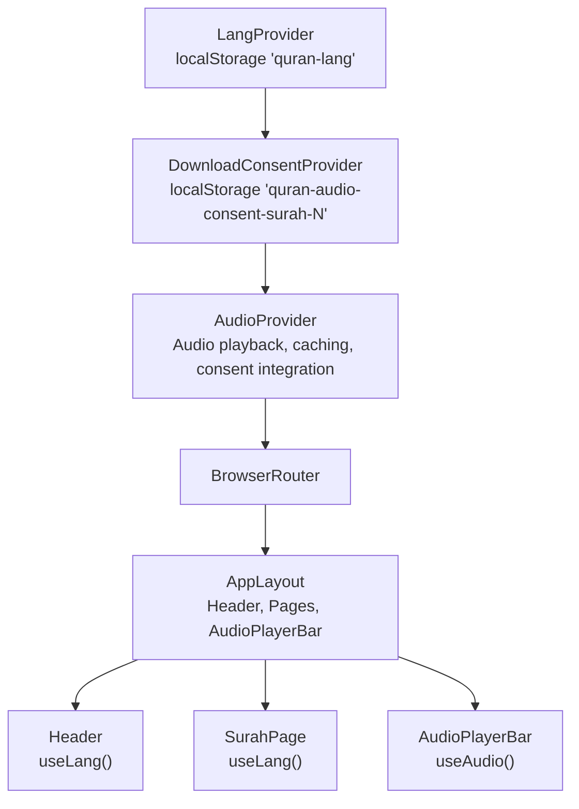
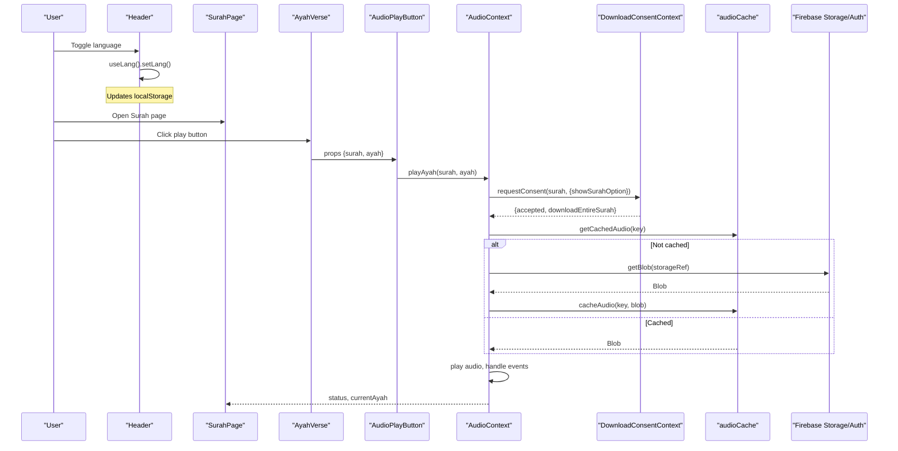
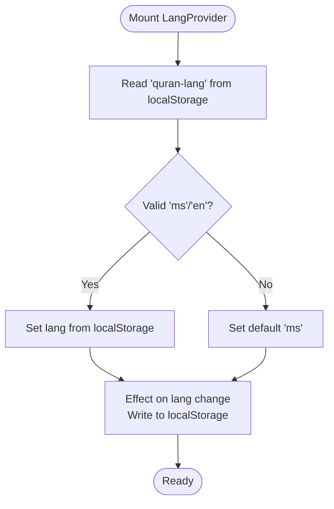
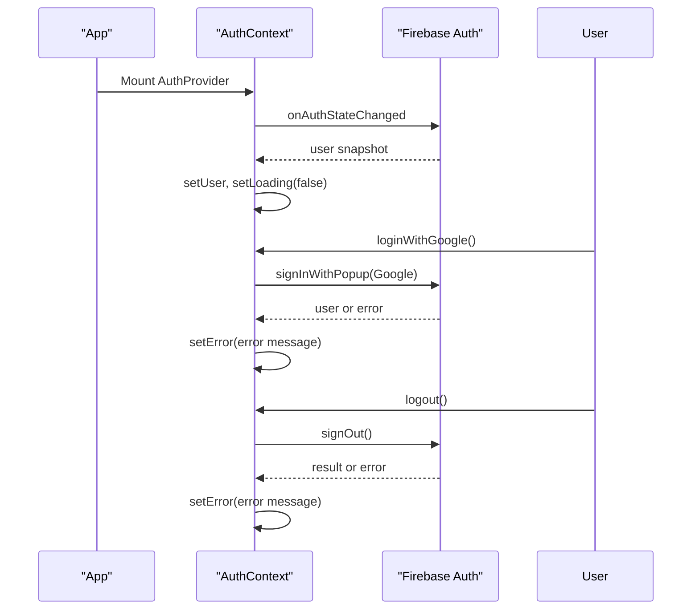
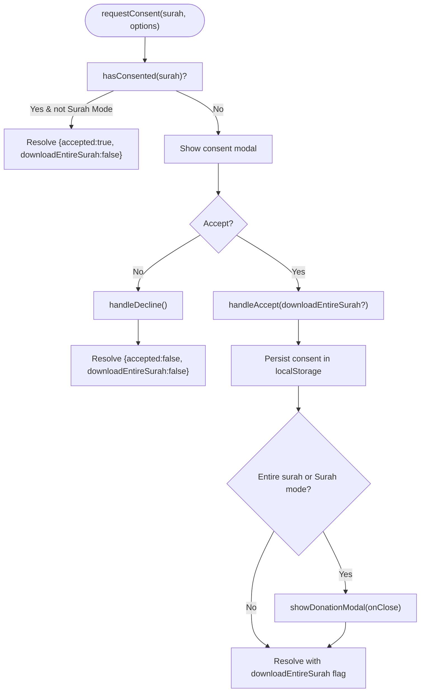
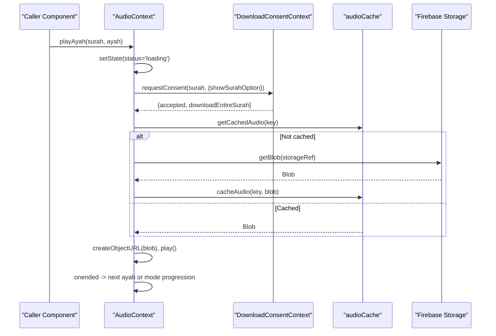
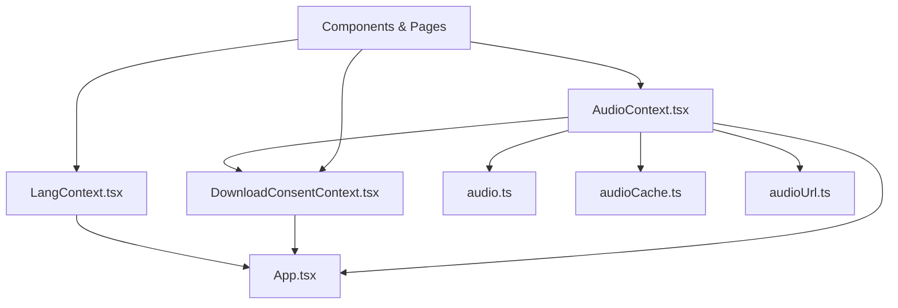

# Context Providers

<cite>
**Referenced Files in This Document**
- [App.tsx](file://src/App.tsx)
- [LangContext.tsx](file://src/context/LangContext.tsx)
- [AuthContext.tsx](file://src/context/AuthContext.tsx)
- [AudioContext.tsx](file://src/context/AudioContext.tsx)
- [DownloadConsentContext.tsx](file://src/context/DownloadConsentContext.tsx)
- [audio.ts](file://src/types/audio.ts)
- [audioCache.ts](file://src/utils/audioCache.ts)
- [audioUrl.ts](file://src/utils/audioUrl.ts)
- [Header.tsx](file://src/components/Header.tsx)
- [UserMenu.tsx](file://src/components/UserMenu.tsx)
- [LoginButton.tsx](file://src/components/LoginButton.tsx)
- [AudioPlayerBar.tsx](file://src/components/AudioPlayerBar.tsx)
- [ReciterSelector.tsx](file://src/components/ReciterSelector.tsx)
- [SurahPage.tsx](file://src/pages/SurahPage.tsx)
- [AyahVerse.tsx](file://src/components/AyahVerse.tsx)
</cite>

## Table of Contents
1. [Introduction](#introduction)
2. [Project Structure](#project-structure)
3. [Core Components](#core-components)
4. [Architecture Overview](#architecture-overview)
5. [Detailed Component Analysis](#detailed-component-analysis)
6. [Dependency Analysis](#dependency-analysis)
7. [Performance Considerations](#performance-considerations)
8. [Troubleshooting Guide](#troubleshooting-guide)
9. [Conclusion](#conclusion)

## Introduction
This document provides comprehensive documentation for the context providers in the Quran Reader application. It covers:
- LangContext: Managing language preferences with localStorage persistence
- AuthContext: User authentication state management via Firebase
- AudioContext: Complex audio playback state with caching and playback logic
- DownloadConsentContext: User consent handling for audio downloads

It explains initialization, state structure, update mechanisms, integration patterns, provider hierarchy, component wrapping strategies, and performance considerations for each context.

## Project Structure
The application wraps the UI tree with context providers in App.tsx. The provider hierarchy ensures that lower-level components can consume state and actions without prop drilling.

**Diagram sources**
- [App.tsx:42-55](file://src/App.tsx#L42-L55)
- [LangContext.tsx:12-27](file://src/context/LangContext.tsx#L12-L27)
- [DownloadConsentContext.tsx:16-48](file://src/context/DownloadConsentContext.tsx#L16-L48)
- [AudioContext.tsx:40-389](file://src/context/AudioContext.tsx#L40-L389)

**Section sources**
- [App.tsx:42-55](file://src/App.tsx#L42-L55)

## Core Components
This section documents each context provider’s initialization, state structure, update mechanisms, and integration patterns.

### LangContext
- Purpose: Manage language preference with automatic persistence to localStorage.
- Initialization:
  - Reads saved language from localStorage during mount; defaults to Malay ('ms') if invalid.
  - Persists updates to localStorage whenever the language changes.
- State structure:
  - lang: 'ms' | 'en'
  - setLang: function to update language
- Update mechanisms:
  - Direct state setter updates both in-memory state and localStorage.
- Integration patterns:
  - Consumed by Header to switch UI language.
  - Used in SurahPage to select translation language.
- Provider hierarchy:
  - Wrapped at the top level in App.tsx.

**Section sources**
- [LangContext.tsx:1-32](file://src/context/LangContext.tsx#L1-L32)
- [Header.tsx:9](file://src/components/Header.tsx#L9)
- [SurahPage.tsx:14](file://src/pages/SurahPage.tsx#L14)
- [App.tsx:44-53](file://src/App.tsx#L44-L53)

### AuthContext
- Purpose: Provide authentication state and actions using Firebase Auth.
- Initialization:
  - Subscribes to onAuthStateChanged to hydrate user state on app load.
  - Sets loading state until hydration completes.
- State structure:
  - user: Firebase User | null
  - loading: boolean
  - error: string | null
  - loginWithGoogle(): Promise<void>
  - logout(): Promise<void>
- Update mechanisms:
  - loginWithGoogle: triggers popup-based Google sign-in; captures errors into state.
  - logout: invokes Firebase sign-out; captures errors into state.
- Integration patterns:
  - Consumed by UserMenu and LoginButton to render user UI and trigger auth actions.
- Provider hierarchy:
  - Wrapped below LangProvider in App.tsx.

**Section sources**
- [AuthContext.tsx:1-63](file://src/context/AuthContext.tsx#L1-L63)
- [UserMenu.tsx:7](file://src/components/UserMenu.tsx#L7)
- [LoginButton.tsx:4](file://src/components/LoginButton.tsx#L4)
- [App.tsx:44-53](file://src/App.tsx#L44-L53)

### DownloadConsentContext
- Purpose: Handle user consent for audio downloads and optionally trigger a donation modal.
- Initialization:
  - Manages internal modal visibility and promise resolution for consent decisions.
  - Persists consent per surah in localStorage.
- State structure:
  - hasConsented(surahNumber): boolean
  - requestConsent(surahNumber, options?): Promise resolving to { accepted, downloadEntireSurah }
  - showDonationModal(onClose?): void
- Update mechanisms:
  - requestConsent: opens modal, resolves promise when user accepts/declines.
  - handleAccept/handleDecline: persist consent and optionally show donation modal.
  - showDonationModal: displays donation overlay and invokes onClose callback.
- Integration patterns:
  - Consumed by AudioContext to gate downloads and orchestrate surah-wide downloads.
  - Provides modal UI inline within the provider for user interaction.
- Provider hierarchy:
  - Wrapped below LangProvider and above AudioProvider in App.tsx.

**Section sources**
- [DownloadConsentContext.tsx:1-256](file://src/context/DownloadConsentContext.tsx#L1-L256)
- [AudioContext.tsx:47](file://src/context/AudioContext.tsx#L47)
- [App.tsx:44-53](file://src/App.tsx#L44-L53)

### AudioContext
- Purpose: Centralized audio playback state with caching, consent gating, and multi-language recitation modes.
- Initialization:
  - Initializes default AudioState and maintains refs for stable event handler access.
  - Integrates with DownloadConsentContext for consent and donation flows.
- State structure (from types):
  - status: 'idle' | 'loading' | 'playing' | 'paused' | 'error'
  - currentAyah: PlayingAyah | null
  - reciter: Reciter
  - surahPlayMode: boolean
  - totalAyahsInSurah: number
  - errorMessage: string | null
  - recitationMode: 'arabic' | 'malay' | 'arabic-then-malay'
  - activeLanguage: 'arabic' | 'malay'
- Public actions:
  - playAyah(surahNumber, ayahNumberInSurah)
  - playAyahWithReciter(surahNumber, ayahNumberInSurah, reciter)
  - pause(), resume(), stop()
  - playEntireSurah(surahNumber, totalAyahs, mode?)
  - setReciter(reciter)
  - isPlayingAyah(surahNumber, ayahNumberInSurah): boolean
- Update mechanisms:
  - Uses refs to capture current state inside event handlers to avoid stale closures.
  - Orchestrates consent, caching, and Firebase Storage retrieval.
  - Handles multi-language progression (Arabic-first, Malay-second) and surah-wide playback.
- Integration patterns:
  - Consumed by AudioPlayerBar for controls and status display.
  - Consumed by ReciterSelector for reciter switching.
  - Consumed by SurahPage and AyahVerse components to trigger playback.
- Provider hierarchy:
  - Wrapped below DownloadConsentProvider in App.tsx.

**Section sources**
- [AudioContext.tsx:1-396](file://src/context/AudioContext.tsx#L1-L396)
- [audio.ts:1-41](file://src/types/audio.ts#L1-L41)
- [audioCache.ts:1-153](file://src/utils/audioCache.ts#L1-L153)
- [audioUrl.ts:1-37](file://src/utils/audioUrl.ts#L1-L37)
- [AudioPlayerBar.tsx:5](file://src/components/AudioPlayerBar.tsx#L5)
- [ReciterSelector.tsx:5](file://src/components/ReciterSelector.tsx#L5)
- [SurahPage.tsx:67](file://src/pages/SurahPage.tsx#L67)
- [AyahVerse.tsx:23-30](file://src/components/AyahVerse.tsx#L23-L30)
- [App.tsx:44-53](file://src/App.tsx#L44-L53)

## Architecture Overview
The provider hierarchy and component interactions form a cohesive state management layer. The sequence below illustrates how a user initiates playback and how consent and caching integrate.

**Diagram sources**
- [Header.tsx:9](file://src/components/Header.tsx#L9)
- [SurahPage.tsx:67](file://src/pages/SurahPage.tsx#L67)
- [AyahVerse.tsx:23-30](file://src/components/AyahVerse.tsx#L23-L30)
- [AudioContext.tsx:68-305](file://src/context/AudioContext.tsx#L68-L305)
- [DownloadConsentContext.tsx:28-48](file://src/context/DownloadConsentContext.tsx#L28-L48)
- [audioCache.ts:46-60](file://src/utils/audioCache.ts#L46-L60)
- [audioUrl.ts:13-22](file://src/utils/audioUrl.ts#L13-L22)

## Detailed Component Analysis

### LangContext Analysis
- Initialization pattern:
  - Reads localStorage on mount and normalizes to valid language values.
  - Persists updates via a useEffect dependency on lang.
- State and actions:
  - Exposes lang and setLang; consumers call setLang to update.
- Integration:
  - Header toggles lang; SurahPage uses lang to choose translation.

**Diagram sources**
- [LangContext.tsx:13-20](file://src/context/LangContext.tsx#L13-L20)

**Section sources**
- [LangContext.tsx:12-31](file://src/context/LangContext.tsx#L12-L31)
- [Header.tsx:9](file://src/components/Header.tsx#L9)
- [SurahPage.tsx:14](file://src/pages/SurahPage.tsx#L14)

### AuthContext Analysis
- Initialization pattern:
  - Subscribes to onAuthStateChanged; sets user and clears loading on hydration.
- State and actions:
  - loginWithGoogle: handles popup auth and error propagation.
  - logout: handles sign-out and error propagation.
- Integration:
  - UserMenu renders based on user presence; LoginButton triggers login.

**Diagram sources**
- [AuthContext.tsx:25-31](file://src/context/AuthContext.tsx#L25-L31)
- [AuthContext.tsx:33-49](file://src/context/AuthContext.tsx#L33-L49)

**Section sources**
- [AuthContext.tsx:20-62](file://src/context/AuthContext.tsx#L20-L62)
- [UserMenu.tsx:7](file://src/components/UserMenu.tsx#L7)
- [LoginButton.tsx:4](file://src/components/LoginButton.tsx#L4)

### DownloadConsentContext Analysis
- Initialization pattern:
  - Manages modal visibility and promise resolution for consent decisions.
  - Persists consent per surah in localStorage.
- State and actions:
  - hasConsented: checks persisted consent.
  - requestConsent: opens modal and returns a Promise resolved by user choice.
  - showDonationModal: displays donation overlay and invokes onClose callback.
- Integration:
  - AudioContext calls requestConsent and showDonationModal to manage downloads.

**Diagram sources**
- [DownloadConsentContext.tsx:28-77](file://src/context/DownloadConsentContext.tsx#L28-L77)

**Section sources**
- [DownloadConsentContext.tsx:16-256](file://src/context/DownloadConsentContext.tsx#L16-L256)
- [AudioContext.tsx:104-199](file://src/context/AudioContext.tsx#L104-L199)

### AudioContext Analysis
- Initialization pattern:
  - Initializes default AudioState and maintains refs for stable event handler access.
  - Integrates with DownloadConsentContext for consent and donation flows.
- State and actions:
  - Public actions include play/pause/resume/stop and surah-wide playback.
  - Internal playAyahInternal orchestrates consent, caching, and playback.
- Playback logic:
  - Caches audio via IndexedDB using audioCache utilities.
  - Builds Firebase Storage paths using audioUrl utilities.
  - Supports recitation modes and Arabic-Melay alternation.
- Integration:
  - AudioPlayerBar consumes status and controls.
  - ReciterSelector consumes reciter and setReciter.
  - SurahPage and AyahVerse trigger playback.

**Diagram sources**
- [AudioContext.tsx:68-305](file://src/context/AudioContext.tsx#L68-L305)
- [audioCache.ts:30-60](file://src/utils/audioCache.ts#L30-L60)
- [audioUrl.ts:13-22](file://src/utils/audioUrl.ts#L13-L22)
- [DownloadConsentContext.tsx:28-48](file://src/context/DownloadConsentContext.tsx#L28-L48)

**Section sources**
- [AudioContext.tsx:40-396](file://src/context/AudioContext.tsx#L40-L396)
- [audio.ts:23-32](file://src/types/audio.ts#L23-L32)
- [audioCache.ts:1-153](file://src/utils/audioCache.ts#L1-L153)
- [audioUrl.ts:1-37](file://src/utils/audioUrl.ts#L1-L37)
- [AudioPlayerBar.tsx:5](file://src/components/AudioPlayerBar.tsx#L5)
- [ReciterSelector.tsx:5](file://src/components/ReciterSelector.tsx#L5)
- [SurahPage.tsx:67](file://src/pages/SurahPage.tsx#L67)
- [AyahVerse.tsx:23-30](file://src/components/AyahVerse.tsx#L23-L30)

## Dependency Analysis
The provider hierarchy and cross-provider dependencies are summarized below.

**Diagram sources**
- [App.tsx:42-55](file://src/App.tsx#L42-L55)
- [AudioContext.tsx:13-14](file://src/context/AudioContext.tsx#L13-L14)
- [audio.ts:1-41](file://src/types/audio.ts#L1-L41)
- [audioCache.ts:1-153](file://src/utils/audioCache.ts#L1-L153)
- [audioUrl.ts:1-37](file://src/utils/audioUrl.ts#L1-L37)

**Section sources**
- [App.tsx:42-55](file://src/App.tsx#L42-L55)
- [AudioContext.tsx:13-14](file://src/context/AudioContext.tsx#L13-L14)

## Performance Considerations
- IndexedDB caching:
  - Audio files are cached locally to minimize bandwidth and enable offline playback after first load. Use cache inspection utilities to monitor size and manage cleanup when necessary.
- Event handler stability:
  - AudioContext uses refs to maintain current state inside event handlers, preventing stale closure issues and unnecessary re-renders.
- Consent gating:
  - DownloadConsentContext avoids redundant prompts by checking localStorage and supports surah-wide downloads to reduce repeated consent prompts.
- UI responsiveness:
  - AppLayout conditionally adds padding based on audio status to prevent overlap with the fixed player bar.
- Reciter switching:
  - ReciterSelector disables selection during surah play to prevent conflicts with ongoing playback.

[No sources needed since this section provides general guidance]

## Troubleshooting Guide
- Language not persisting:
  - Verify localStorage key 'quran-lang' exists and contains 'ms' or 'en'. Ensure LangProvider is mounted at the top level.
- Authentication errors:
  - Check error messages returned by loginWithGoogle and logout. Confirm Firebase Auth configuration and network connectivity.
- Audio fails to play:
  - Inspect status transitions and error messages from AudioContext. Verify IndexedDB availability and cache entries. Confirm Firebase Storage permissions and user authentication for downloads.
- Consent modal not appearing:
  - Ensure DownloadConsentProvider is mounted above AudioProvider. Check hasConsented and requestConsent flows.

**Section sources**
- [LangContext.tsx:18-20](file://src/context/LangContext.tsx#L18-L20)
- [AuthContext.tsx:33-49](file://src/context/AuthContext.tsx#L33-L49)
- [AudioContext.tsx:223-229](file://src/context/AudioContext.tsx#L223-L229)
- [DownloadConsentContext.tsx:24-26](file://src/context/DownloadConsentContext.tsx#L24-L26)

## Conclusion
The context providers in the Quran Reader application provide a robust, layered state management solution:
- LangContext offers simple, persistent language preferences.
- AuthContext integrates Firebase for secure, hydrated authentication state.
- DownloadConsentContext manages user consent and optional donation prompts.
- AudioContext unifies complex playback logic, caching, and consent flows.

Their hierarchical composition in App.tsx enables seamless consumption across components, while careful use of refs, localStorage, and IndexedDB ensures reliable performance and user experience.