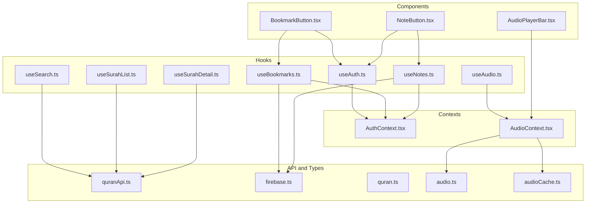
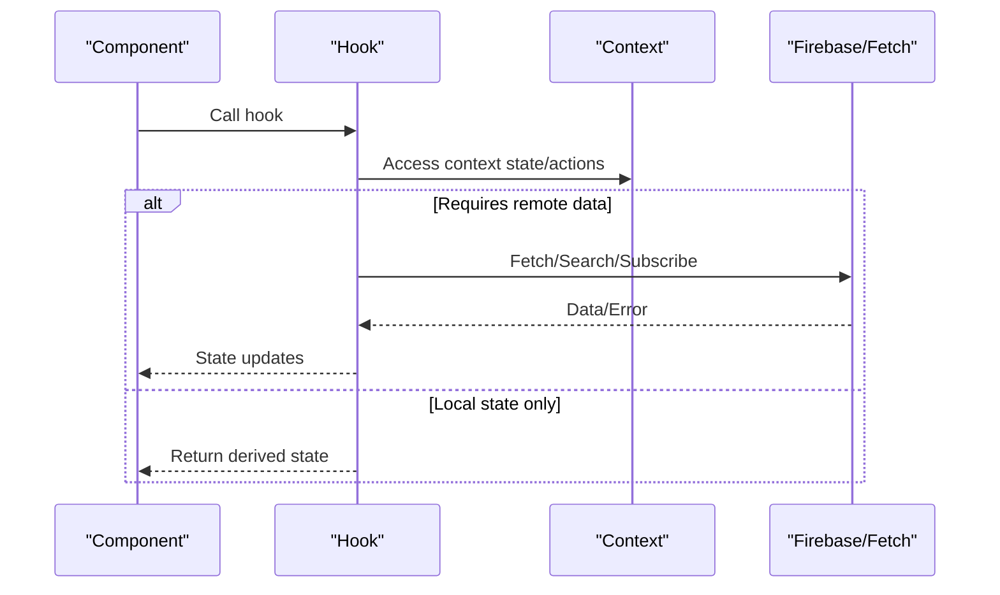
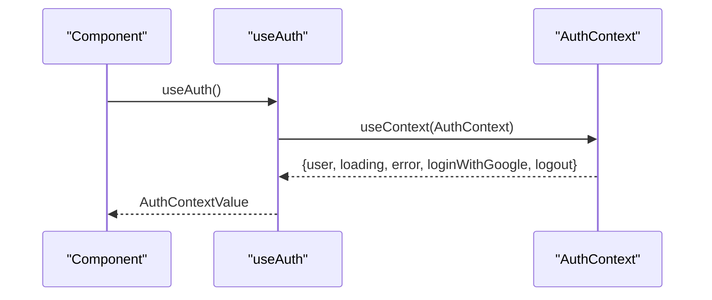
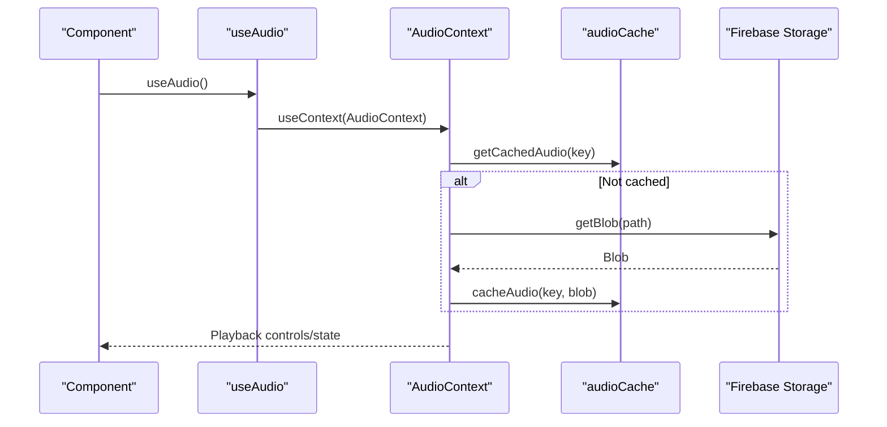
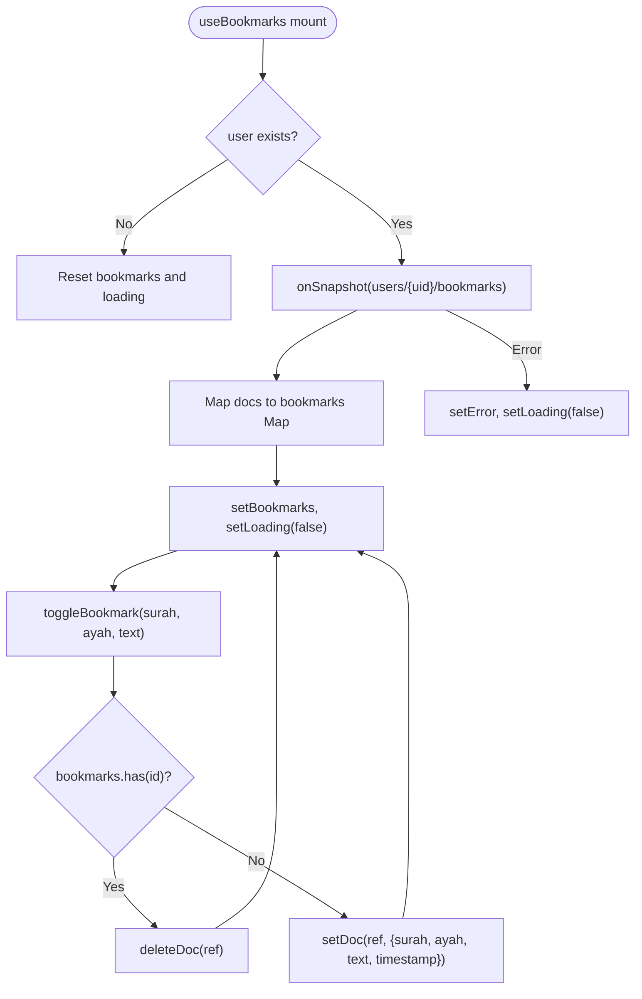
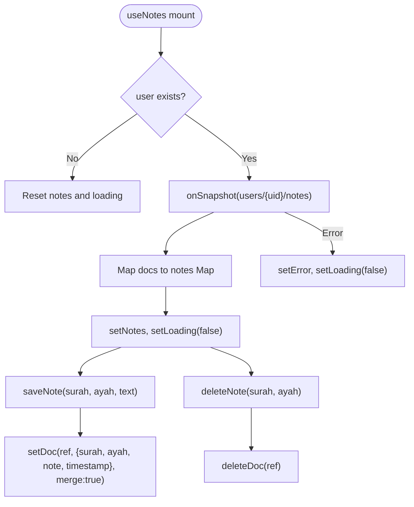
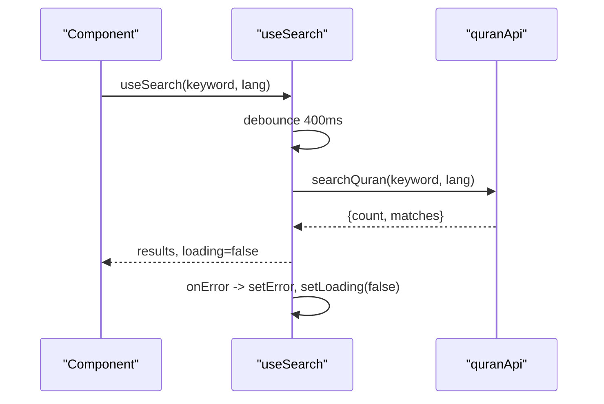
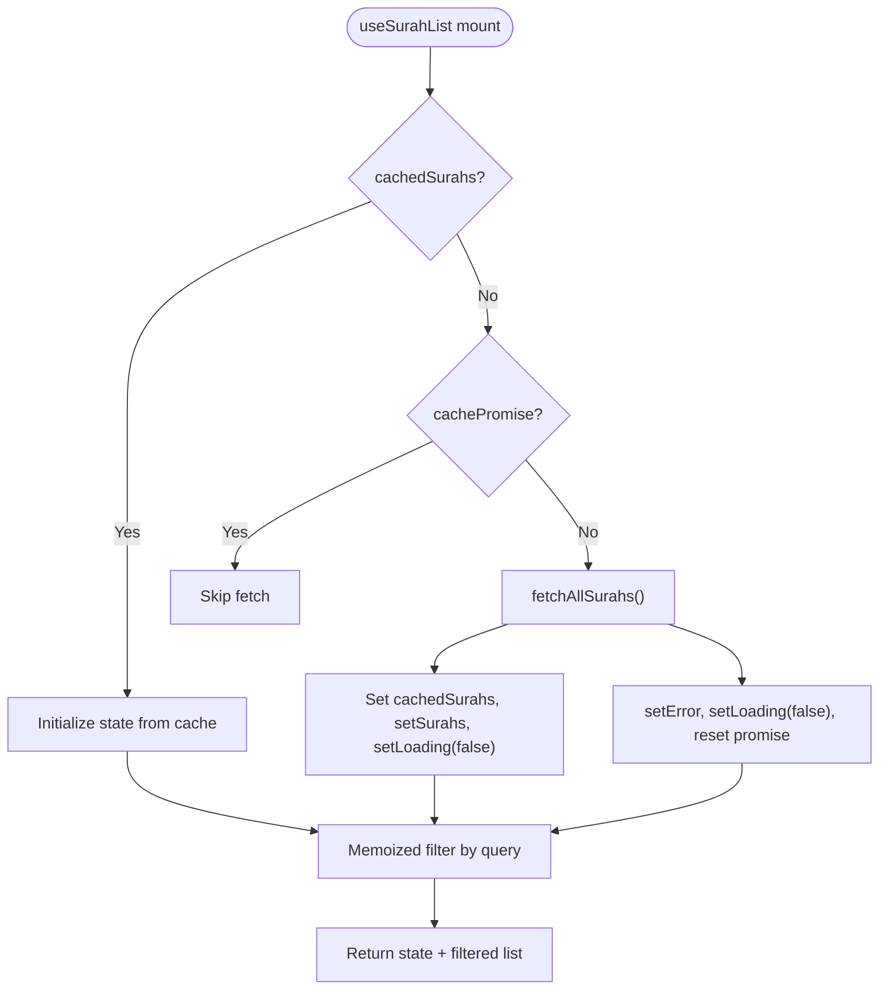
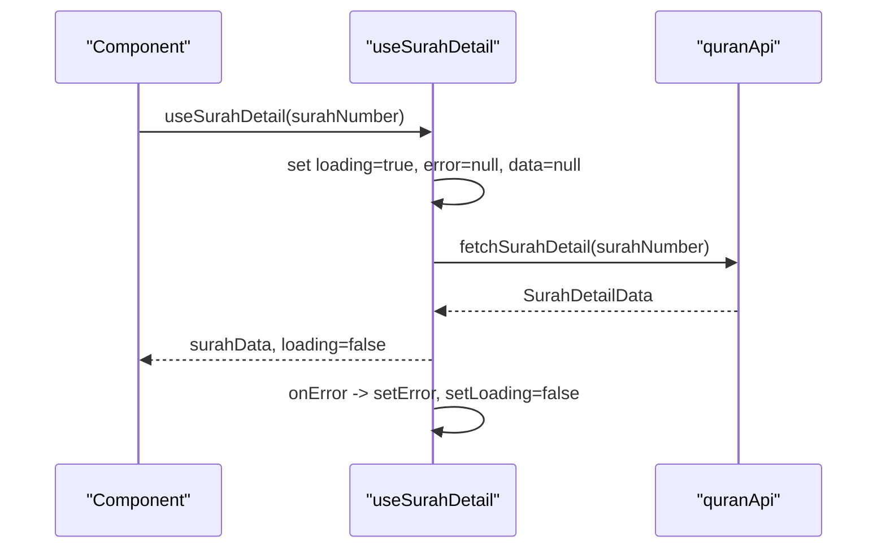
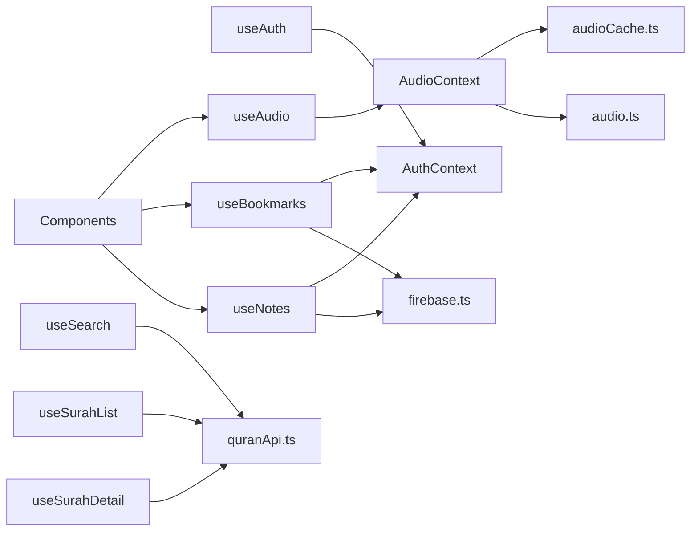

# Custom Hooks

<cite>
**Referenced Files in This Document**
- [useAuth.ts](file://src/hooks/useAuth.ts)
- [AuthContext.tsx](file://src/context/AuthContext.tsx)
- [useAudio.ts](file://src/hooks/useAudio.ts)
- [AudioContext.tsx](file://src/context/AudioContext.tsx)
- [useBookmarks.ts](file://src/hooks/useBookmarks.ts)
- [firebase.ts](file://src/types/firebase.ts)
- [useNotes.ts](file://src/hooks/useNotes.ts)
- [useSearch.ts](file://src/hooks/useSearch.ts)
- [quranApi.ts](file://src/api/quranApi.ts)
- [useSurahList.ts](file://src/hooks/useSurahList.ts)
- [useSurahDetail.ts](file://src/hooks/useSurahDetail.ts)
- [quran.ts](file://src/types/quran.ts)
- [audioCache.ts](file://src/utils/audioCache.ts)
- [audio.ts](file://src/types/audio.ts)
- [AudioPlayerBar.tsx](file://src/components/AudioPlayerBar.tsx)
- [BookmarkButton.tsx](file://src/components/BookmarkButton.tsx)
- [NoteButton.tsx](file://src/components/NoteButton.tsx)
</cite>

## Table of Contents
1. [Introduction](#introduction)
2. [Project Structure](#project-structure)
3. [Core Components](#core-components)
4. [Architecture Overview](#architecture-overview)
5. [Detailed Component Analysis](#detailed-component-analysis)
6. [Dependency Analysis](#dependency-analysis)
7. [Performance Considerations](#performance-considerations)
8. [Troubleshooting Guide](#troubleshooting-guide)
9. [Conclusion](#conclusion)

## Introduction
This document provides comprehensive documentation for the custom hooks in the Quran application. It covers useAuth for authentication state and user management, useAudio for audio playback control and caching, useBookmarks for bookmark operations, useNotes for note-taking functionality, useSearch for search queries, and useSurahList/useSurahDetail for Quran data fetching. For each hook, we describe signatures, return values, internal logic, dependencies, error handling, loading states, and integration with their respective contexts. Usage patterns and practical examples are included to help developers integrate these hooks effectively.

## Project Structure
The hooks are located under src/hooks and integrate with React contexts, Firebase, and local APIs. Supporting types and utilities reside under src/types and src/utils. Components demonstrate usage patterns for audio playback, bookmarks, and notes.

**Diagram sources**
- [useAuth.ts:1-2](file://src/hooks/useAuth.ts#L1-L2)
- [AuthContext.tsx:1-63](file://src/context/AuthContext.tsx#L1-L63)
- [useAudio.ts:1-2](file://src/hooks/useAudio.ts#L1-L2)
- [AudioContext.tsx:1-396](file://src/context/AudioContext.tsx#L1-L396)
- [useBookmarks.ts:1-88](file://src/hooks/useBookmarks.ts#L1-L88)
- [firebase.ts:1-20](file://src/types/firebase.ts#L1-L20)
- [useNotes.ts:1-92](file://src/hooks/useNotes.ts#L1-L92)
- [useSearch.ts:1-37](file://src/hooks/useSearch.ts#L1-L37)
- [quranApi.ts:1-51](file://src/api/quranApi.ts#L1-L51)
- [useSurahList.ts:1-47](file://src/hooks/useSurahList.ts#L1-L47)
- [useSurahDetail.ts:1-37](file://src/hooks/useSurahDetail.ts#L1-L37)
- [quran.ts:1-64](file://src/types/quran.ts#L1-L64)
- [audioCache.ts:1-153](file://src/utils/audioCache.ts#L1-L153)
- [audio.ts:1-41](file://src/types/audio.ts#L1-L41)
- [AudioPlayerBar.tsx:1-86](file://src/components/AudioPlayerBar.tsx#L1-L86)
- [BookmarkButton.tsx:1-49](file://src/components/BookmarkButton.tsx#L1-L49)
- [NoteButton.tsx:1-114](file://src/components/NoteButton.tsx#L1-L114)

**Section sources**
- [useAuth.ts:1-2](file://src/hooks/useAuth.ts#L1-L2)
- [AuthContext.tsx:1-63](file://src/context/AuthContext.tsx#L1-L63)
- [useAudio.ts:1-2](file://src/hooks/useAudio.ts#L1-L2)
- [AudioContext.tsx:1-396](file://src/context/AudioContext.tsx#L1-L396)
- [useBookmarks.ts:1-88](file://src/hooks/useBookmarks.ts#L1-L88)
- [firebase.ts:1-20](file://src/types/firebase.ts#L1-L20)
- [useNotes.ts:1-92](file://src/hooks/useNotes.ts#L1-L92)
- [useSearch.ts:1-37](file://src/hooks/useSearch.ts#L1-L37)
- [quranApi.ts:1-51](file://src/api/quranApi.ts#L1-L51)
- [useSurahList.ts:1-47](file://src/hooks/useSurahList.ts#L1-L47)
- [useSurahDetail.ts:1-37](file://src/hooks/useSurahDetail.ts#L1-L37)
- [quran.ts:1-64](file://src/types/quran.ts#L1-L64)
- [audioCache.ts:1-153](file://src/utils/audioCache.ts#L1-L153)
- [audio.ts:1-41](file://src/types/audio.ts#L1-L41)
- [AudioPlayerBar.tsx:1-86](file://src/components/AudioPlayerBar.tsx#L1-L86)
- [BookmarkButton.tsx:1-49](file://src/components/BookmarkButton.tsx#L1-L49)
- [NoteButton.tsx:1-114](file://src/components/NoteButton.tsx#L1-L114)

## Core Components
This section summarizes the primary hooks and their roles:
- useAuth: Provides authentication state and actions via AuthContext.
- useAudio: Exposes audio playback controls and state from AudioContext.
- useBookmarks: Manages Firestore bookmarks for signed-in users with real-time sync.
- useNotes: Manages Firestore notes for signed-in users with real-time sync.
- useSearch: Performs client-side search using prebuilt indices.
- useSurahList: Fetches and caches Surah metadata with filtering.
- useSurahDetail: Loads Surah details for a given Surah number.

**Section sources**
- [useAuth.ts:1-2](file://src/hooks/useAuth.ts#L1-L2)
- [AuthContext.tsx:58-62](file://src/context/AuthContext.tsx#L58-L62)
- [useAudio.ts:1-2](file://src/hooks/useAudio.ts#L1-L2)
- [AudioContext.tsx:391-395](file://src/context/AudioContext.tsx#L391-L395)
- [useBookmarks.ts:23-87](file://src/hooks/useBookmarks.ts#L23-L87)
- [useNotes.ts:24-91](file://src/hooks/useNotes.ts#L24-L91)
- [useSearch.ts:6-36](file://src/hooks/useSearch.ts#L6-L36)
- [useSurahList.ts:8-46](file://src/hooks/useSurahList.ts#L8-L46)
- [useSurahDetail.ts:5-36](file://src/hooks/useSurahDetail.ts#L5-L36)

## Architecture Overview
The hooks integrate with React contexts and external systems:
- Authentication: useAuth delegates to AuthContext for user state and actions.
- Audio: useAudio delegates to AudioContext for playback, caching, and state.
- Data: useBookmarks and useNotes manage Firestore collections for bookmarks and notes.
- Search and Surah data: useSearch and useSurahList/useSurahDetail consume quranApi.

**Diagram sources**
- [useAuth.ts:1-2](file://src/hooks/useAuth.ts#L1-L2)
- [AuthContext.tsx:58-62](file://src/context/AuthContext.tsx#L58-L62)
- [useAudio.ts:1-2](file://src/hooks/useAudio.ts#L1-L2)
- [AudioContext.tsx:391-395](file://src/context/AudioContext.tsx#L391-L395)
- [useBookmarks.ts:29-55](file://src/hooks/useBookmarks.ts#L29-L55)
- [useNotes.ts:30-56](file://src/hooks/useNotes.ts#L30-L56)
- [useSearch.ts:11-33](file://src/hooks/useSearch.ts#L11-L33)
- [useSurahList.ts:14-31](file://src/hooks/useSurahList.ts#L14-L31)
- [useSurahDetail.ts:10-33](file://src/hooks/useSurahDetail.ts#L10-L33)
- [quranApi.ts:4-14](file://src/api/quranApi.ts#L4-L14)

## Detailed Component Analysis

### useAuth
- Purpose: Provide authentication state and actions to components.
- Signature: None (re-export of context hook).
- Return value: AuthContextValue containing user, loading, error, loginWithGoogle, logout.
- Internal logic:
  - Delegates to AuthContext for state and actions.
  - Throws if used outside AuthProvider.
- Dependencies: AuthContext.
- Usage pattern: Import useAuth and destructure user, loading, error, loginWithGoogle, logout.
- Integration: Used by BookmarkButton and NoteButton to gate UI actions.

**Diagram sources**
- [useAuth.ts:1-2](file://src/hooks/useAuth.ts#L1-L2)
- [AuthContext.tsx:58-62](file://src/context/AuthContext.tsx#L58-L62)

**Section sources**
- [useAuth.ts:1-2](file://src/hooks/useAuth.ts#L1-L2)
- [AuthContext.tsx:58-62](file://src/context/AuthContext.tsx#L58-L62)
- [BookmarkButton.tsx:10-14](file://src/components/BookmarkButton.tsx#L10-L14)
- [NoteButton.tsx:10-18](file://src/components/NoteButton.tsx#L10-L18)

### useAudio
- Purpose: Provide audio playback controls and state from AudioContext.
- Signature: None (re-export of context hook).
- Return value: AudioContextValue with state and actions (playAyah, playAyahWithReciter, pause, resume, stop, playEntireSurah, setReciter, isPlayingAyah).
- Internal logic:
  - Delegates to AudioContext for playback orchestration, caching, and state.
  - Uses IndexedDB cache via audioCache utility.
- Dependencies: AudioContext, audioCache, audio types.
- Usage pattern: Import useAudio and call actions; render AudioPlayerBar for UI.
- Integration: AudioPlayerBar consumes useAudio for playback controls.

**Diagram sources**
- [useAudio.ts:1-2](file://src/hooks/useAudio.ts#L1-L2)
- [AudioContext.tsx:391-395](file://src/context/AudioContext.tsx#L391-L395)
- [audioCache.ts:46-60](file://src/utils/audioCache.ts#L46-L60)

**Section sources**
- [useAudio.ts:1-2](file://src/hooks/useAudio.ts#L1-L2)
- [AudioContext.tsx:391-395](file://src/context/AudioContext.tsx#L391-L395)
- [AudioPlayerBar.tsx:4-12](file://src/components/AudioPlayerBar.tsx#L4-L12)
- [audioCache.ts:1-153](file://src/utils/audioCache.ts#L1-L153)
- [audio.ts:1-41](file://src/types/audio.ts#L1-L41)

### useBookmarks
- Purpose: Manage bookmarks for signed-in users with real-time sync.
- Signature: useBookmarks(): UseBookmarksReturn.
- Return value:
  - bookmarks: Map of bookmarkId to BookmarkData.
  - isBookmarked(surahNumber, ayahNumber): boolean.
  - toggleBookmark(surahNumber, ayahNumber, arabicText): Promise<void>.
  - loading: boolean.
  - error: string | null.
- Internal logic:
  - Subscribes to Firestore collection under users/{uid}/bookmarks.
  - Converts snapshots to a Map keyed by bookmarkDocId.
  - toggleBookmark creates/deletes documents with serverTimestamp.
- Dependencies: AuthContext, firebase/firestore, firebase.ts bookmarkDocId.
- Usage pattern: Destructure isBookmarked and toggleBookmark; conditionally render BookmarkButton.
- Integration: BookmarkButton uses useBookmarks and useAuth.

**Diagram sources**
- [useBookmarks.ts:29-55](file://src/hooks/useBookmarks.ts#L29-L55)
- [useBookmarks.ts:61-84](file://src/hooks/useBookmarks.ts#L61-L84)
- [firebase.ts:15-20](file://src/types/firebase.ts#L15-L20)

**Section sources**
- [useBookmarks.ts:15-87](file://src/hooks/useBookmarks.ts#L15-L87)
- [firebase.ts:1-20](file://src/types/firebase.ts#L1-L20)
- [BookmarkButton.tsx:10-47](file://src/components/BookmarkButton.tsx#L10-L47)

### useNotes
- Purpose: Manage notes for signed-in users with real-time sync.
- Signature: useNotes(): UseNotesReturn.
- Return value:
  - notes: Map of bookmarkId to NoteData.
  - getNote(surahNumber, ayahNumber): string | undefined.
  - saveNote(surahNumber, ayahNumber, text): Promise<void>.
  - deleteNote(surahNumber, ayahNumber): Promise<void>.
  - loading: boolean.
  - error: string | null.
- Internal logic:
  - Subscribes to Firestore collection under users/{uid}/notes.
  - Converts snapshots to a Map keyed by bookmarkDocId.
  - saveNote merges timestamp and note text; deleteNote removes document.
- Dependencies: AuthContext, firebase/firestore, firebase.ts bookmarkDocId.
- Usage pattern: Destructure getNote, saveNote, deleteNote; render NoteButton.
- Integration: NoteButton uses useNotes and useAuth.

**Diagram sources**
- [useNotes.ts:30-56](file://src/hooks/useNotes.ts#L30-L56)
- [useNotes.ts:62-88](file://src/hooks/useNotes.ts#L62-L88)
- [firebase.ts:15-20](file://src/types/firebase.ts#L15-L20)

**Section sources**
- [useNotes.ts:15-91](file://src/hooks/useNotes.ts#L15-L91)
- [firebase.ts:1-20](file://src/types/firebase.ts#L1-L20)
- [NoteButton.tsx:10-113](file://src/components/NoteButton.tsx#L10-L113)

### useSearch
- Purpose: Client-side search over prebuilt indices.
- Signature: useSearch(keyword: string, lang: Lang).
- Return value:
  - results: SearchResultsData | null.
  - loading: boolean.
  - error: string | null.
- Internal logic:
  - Debounces search with a timer.
  - Loads search indices once per language.
  - Filters matches by lowercase keyword inclusion.
- Dependencies: quranApi.searchQuran, quran.ts types, Lang context.
- Usage pattern: Pass keyword and language; render SearchResults with results/loading/error.
- Integration: Demonstrates hook consumption in UI.

**Diagram sources**
- [useSearch.ts:11-33](file://src/hooks/useSearch.ts#L11-L33)
- [quranApi.ts:43-50](file://src/api/quranApi.ts#L43-L50)

**Section sources**
- [useSearch.ts:6-36](file://src/hooks/useSearch.ts#L6-L36)
- [quranApi.ts:16-50](file://src/api/quranApi.ts#L16-L50)
- [quran.ts:47-57](file://src/types/quran.ts#L47-L57)

### useSurahList
- Purpose: Fetch and filter Surah metadata with caching.
- Signature: useSurahList().
- Return value:
  - surahs: SurahInfo[].
  - filteredSurahs: SurahInfo[] (filtered by searchQuery).
  - searchQuery: string.
  - setSearchQuery: (q: string) => void.
  - loading: boolean.
  - error: string | null.
- Internal logic:
  - Caches data globally and avoids duplicate fetches.
  - Memoized filtering across englishName, englishNameTranslation, name, and number.
- Dependencies: quranApi.fetchAllSurahs, quran.ts types.
- Usage pattern: Destructure filteredSurahs and searchQuery; bind setSearchQuery to input.
- Integration: Surah cards and lists consume this hook.

**Diagram sources**
- [useSurahList.ts:8-46](file://src/hooks/useSurahList.ts#L8-L46)
- [quranApi.ts:4-8](file://src/api/quranApi.ts#L4-L8)

**Section sources**
- [useSurahList.ts:8-46](file://src/hooks/useSurahList.ts#L8-L46)
- [quranApi.ts:4-8](file://src/api/quranApi.ts#L4-L8)
- [quran.ts:1-8](file://src/types/quran.ts#L1-L8)

### useSurahDetail
- Purpose: Load Surah detail data for a given Surah number.
- Signature: useSurahDetail(surahNumber: number).
- Return value:
  - surahData: SurahDetailData | null.
  - loading: boolean.
  - error: string | null.
- Internal logic:
  - Clears state on mount, sets loading, cancels on unmount.
  - Fetches data via quranApi.fetchSurahDetail.
- Dependencies: quranApi.fetchSurahDetail, quran.ts types.
- Usage pattern: Destructure surahData, loading, error; render Surah content accordingly.
- Integration: SurahPage consumes this hook.

**Diagram sources**
- [useSurahDetail.ts:10-33](file://src/hooks/useSurahDetail.ts#L10-L33)
- [quranApi.ts:10-14](file://src/api/quranApi.ts#L10-L14)

**Section sources**
- [useSurahDetail.ts:5-36](file://src/hooks/useSurahDetail.ts#L5-L36)
- [quranApi.ts:10-14](file://src/api/quranApi.ts#L10-L14)
- [quran.ts:40-45](file://src/types/quran.ts#L40-L45)

## Dependency Analysis
The hooks depend on contexts, Firebase, and local APIs. The diagram below highlights key dependencies and coupling.

**Diagram sources**
- [useAuth.ts:1-2](file://src/hooks/useAuth.ts#L1-L2)
- [AuthContext.tsx:58-62](file://src/context/AuthContext.tsx#L58-L62)
- [useAudio.ts:1-2](file://src/hooks/useAudio.ts#L1-L2)
- [AudioContext.tsx:391-395](file://src/context/AudioContext.tsx#L391-L395)
- [useBookmarks.ts:12-13](file://src/hooks/useBookmarks.ts#L12-L13)
- [firebase.ts:1-20](file://src/types/firebase.ts#L1-L20)
- [useNotes.ts:12-13](file://src/hooks/useNotes.ts#L12-L13)
- [useSearch.ts:2-4](file://src/hooks/useSearch.ts#L2-L4)
- [quranApi.ts:1-51](file://src/api/quranApi.ts#L1-L51)
- [useSurahList.ts:2-3](file://src/hooks/useSurahList.ts#L2-L3)
- [useSurahDetail.ts:2-3](file://src/hooks/useSurahDetail.ts#L2-L3)
- [audioCache.ts:1-153](file://src/utils/audioCache.ts#L1-L153)
- [audio.ts:1-41](file://src/types/audio.ts#L1-L41)

**Section sources**
- [useBookmarks.ts:1-13](file://src/hooks/useBookmarks.ts#L1-L13)
- [useNotes.ts:1-13](file://src/hooks/useNotes.ts#L1-L13)
- [useSearch.ts:1-4](file://src/hooks/useSearch.ts#L1-L4)
- [useSurahList.ts:1-3](file://src/hooks/useSurahList.ts#L1-L3)
- [useSurahDetail.ts:1-3](file://src/hooks/useSurahDetail.ts#L1-L3)
- [AudioContext.tsx:1-396](file://src/context/AudioContext.tsx#L1-L396)
- [audioCache.ts:1-153](file://src/utils/audioCache.ts#L1-L153)
- [audio.ts:1-41](file://src/types/audio.ts#L1-L41)

## Performance Considerations
- useSurahList caches fetched data globally and prevents duplicate fetches, reducing network overhead.
- useBookmarks and useNotes rely on Firestore onSnapshot for real-time updates; ensure proper cleanup by returning unsubscribe in effects.
- useSearch debounces requests to avoid excessive API calls; adjust debounce timing based on UX needs.
- useAudio leverages IndexedDB caching to minimize bandwidth and latency; consider cache size monitoring and maintenance.
- Prefer memoization for derived data (e.g., useMemo for filtered lists) to avoid unnecessary re-renders.

[No sources needed since this section provides general guidance]

## Troubleshooting Guide
- Authentication errors:
  - Ensure components using useAuth are wrapped in AuthProvider.
  - Check AuthContext error propagation for login/logout failures.
- Firestore errors:
  - useBookmarks and useNotes set error messages on subscription or mutation failures; display user-friendly messages.
  - Verify Firestore rules permit read/write for authenticated users.
- Search errors:
  - useSearch sets error on failed search; confirm indices are loaded for requested language.
- Surah data errors:
  - useSurahList and useSurahDetail set error on fetch failure; verify static JSON availability.
- Audio playback errors:
  - useAudio sets error messages for network or cache failures; prompt users to check connectivity.
  - Confirm IndexedDB support and permissions for audioCache operations.

**Section sources**
- [AuthContext.tsx:33-49](file://src/context/AuthContext.tsx#L33-L49)
- [useBookmarks.ts:48-52](file://src/hooks/useBookmarks.ts#L48-L52)
- [useNotes.ts:49-53](file://src/hooks/useNotes.ts#L49-L53)
- [useSearch.ts:26-29](file://src/hooks/useSearch.ts#L26-L29)
- [useSurahList.ts:25-30](file://src/hooks/useSurahList.ts#L25-L30)
- [useSurahDetail.ts:23-28](file://src/hooks/useSurahDetail.ts#L23-L28)
- [AudioContext.tsx:223-229](file://src/context/AudioContext.tsx#L223-L229)
- [audioCache.ts:11-25](file://src/utils/audioCache.ts#L11-L25)

## Conclusion
These custom hooks encapsulate cross-cutting concerns for authentication, audio playback, bookmarks, notes, search, and Surah data. They integrate tightly with React contexts and Firebase while providing robust error handling and loading states. By following the documented usage patterns and considering the performance and troubleshooting guidance, developers can reliably implement Quran-related features with minimal boilerplate.

[No sources needed since this section summarizes without analyzing specific files]