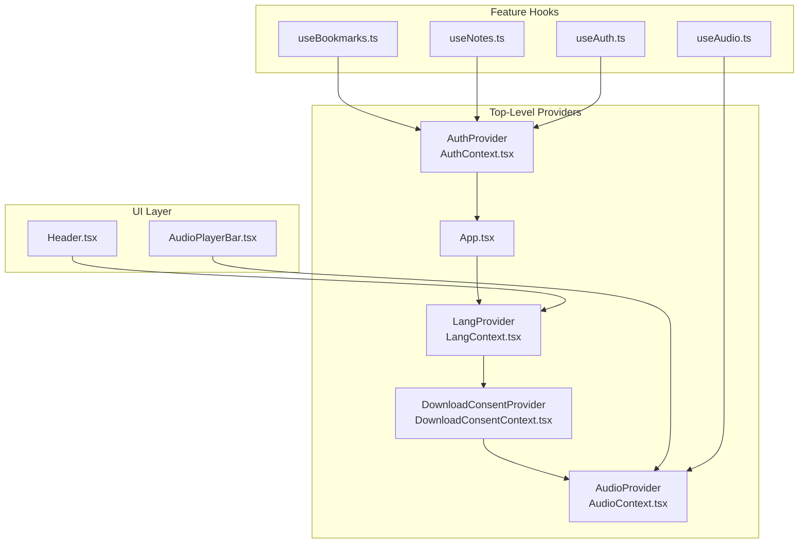
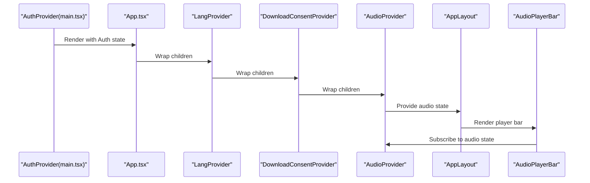
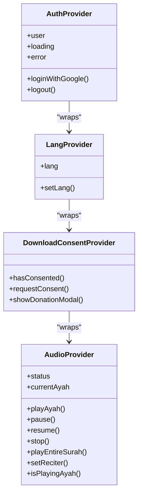
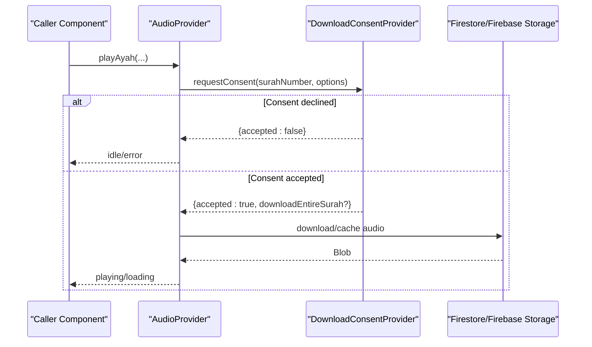
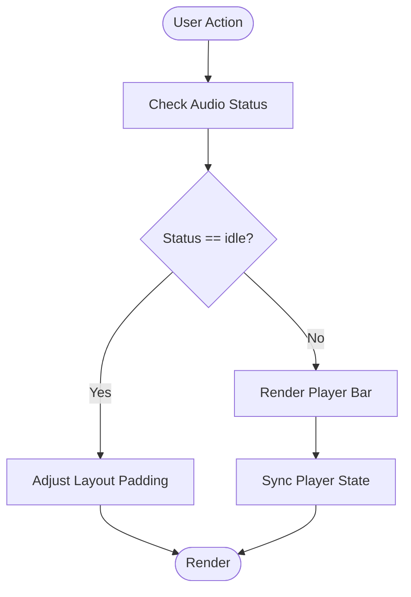
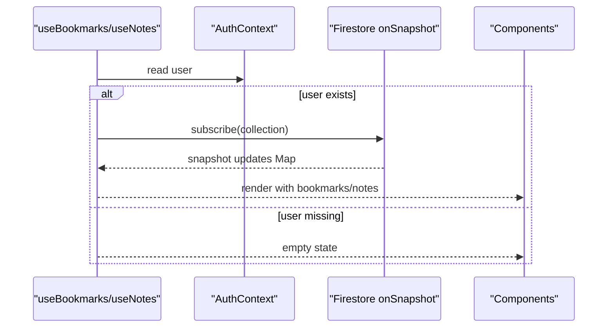
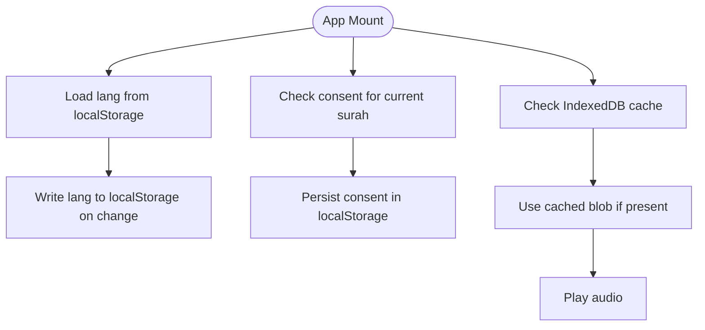
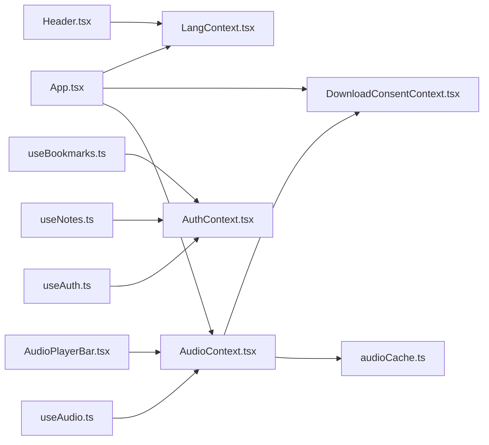

# State Integration & Patterns

<cite>
**Referenced Files in This Document**
- [App.tsx](file://src/App.tsx)
- [main.tsx](file://src/main.tsx)
- [LangContext.tsx](file://src/context/LangContext.tsx)
- [AudioContext.tsx](file://src/context/AudioContext.tsx)
- [DownloadConsentContext.tsx](file://src/context/DownloadConsentContext.tsx)
- [AuthContext.tsx](file://src/context/AuthContext.tsx)
- [AudioPlayerBar.tsx](file://src/components/AudioPlayerBar.tsx)
- [Header.tsx](file://src/components/Header.tsx)
- [useAudio.ts](file://src/hooks/useAudio.ts)
- [useAuth.ts](file://src/hooks/useAuth.ts)
- [useBookmarks.ts](file://src/hooks/useBookmarks.ts)
- [useNotes.ts](file://src/hooks/useNotes.ts)
- [audio.ts](file://src/types/audio.ts)
- [audioCache.ts](file://src/utils/audioCache.ts)
</cite>

## Table of Contents
1. [Introduction](#introduction)
2. [Project Structure](#project-structure)
3. [Core Components](#core-components)
4. [Architecture Overview](#architecture-overview)
5. [Detailed Component Analysis](#detailed-component-analysis)
6. [Dependency Analysis](#dependency-analysis)
7. [Performance Considerations](#performance-considerations)
8. [Troubleshooting Guide](#troubleshooting-guide)
9. [Conclusion](#conclusion)
10. [Appendices](#appendices)

## Introduction
This document explains state management integration patterns and best practices across the application. It focuses on the provider hierarchy in App.tsx, how component state is shared via React Context, cross-context communication patterns, and state synchronization across contexts. It also covers performance optimization, debugging state-related issues, memory management, avoiding unnecessary re-renders, handling asynchronous state updates, error boundaries, and state persistence across browser refreshes.

## Project Structure
The application uses a layered structure with providers at the top level and feature-specific hooks/utilities below. Providers encapsulate global state and expose it via React Context. Hooks consume these contexts and Firestore to manage derived state for features like bookmarks and notes.

**Diagram sources**
- [App.tsx:42-55](file://src/App.tsx#L42-L55)
- [LangContext.tsx:12-27](file://src/context/LangContext.tsx#L12-L27)
- [DownloadConsentContext.tsx:16-81](file://src/context/DownloadConsentContext.tsx#L16-L81)
- [AudioContext.tsx:40-389](file://src/context/AudioContext.tsx#L40-L389)
- [Header.tsx:6-67](file://src/components/Header.tsx#L6-L67)
- [AudioPlayerBar.tsx:4-85](file://src/components/AudioPlayerBar.tsx#L4-L85)
- [useBookmarks.ts:23-87](file://src/hooks/useBookmarks.ts#L23-L87)
- [useNotes.ts:24-91](file://src/hooks/useNotes.ts#L24-L91)
- [useAudio.ts:1-2](file://src/hooks/useAudio.ts#L1-L2)
- [useAuth.ts:1-2](file://src/hooks/useAuth.ts#L1-L2)

**Section sources**
- [App.tsx:1-56](file://src/App.tsx#L1-L56)
- [main.tsx:7-13](file://src/main.tsx#L7-L13)

## Core Components
- Provider hierarchy and composition:
  - Authentication state is provided at the root via AuthProvider.
  - Application-wide language selection is provided via LangProvider.
  - Download consent and donation modal orchestration is provided via DownloadConsentProvider.
  - Audio playback state and controls are provided via AudioProvider.
- Cross-context communication:
  - AudioContext consumes DownloadConsentProvider to request user consent and optionally trigger a donation modal.
  - Feature hooks (useBookmarks, useNotes) depend on AuthContext to scope data to the signed-in user.
- State persistence:
  - LangContext persists language preference to localStorage.
  - AudioContext persists consent decisions to localStorage and caches audio via IndexedDB.

**Section sources**
- [App.tsx:42-55](file://src/App.tsx#L42-L55)
- [main.tsx:7-13](file://src/main.tsx#L7-L13)
- [LangContext.tsx:12-27](file://src/context/LangContext.tsx#L12-L27)
- [DownloadConsentContext.tsx:16-81](file://src/context/DownloadConsentContext.tsx#L16-L81)
- [AudioContext.tsx:40-389](file://src/context/AudioContext.tsx#L40-L389)
- [useBookmarks.ts:23-87](file://src/hooks/useBookmarks.ts#L23-L87)
- [useNotes.ts:24-91](file://src/hooks/useNotes.ts#L24-L91)

## Architecture Overview
The provider hierarchy composes contexts from outermost to innermost. AppLayout reads audio status to adjust layout spacing. Components render conditionally based on context-provided state, and hooks derive feature-specific state from Firestore while respecting authentication state.

**Diagram sources**
- [main.tsx:7-13](file://src/main.tsx#L7-L13)
- [App.tsx:42-55](file://src/App.tsx#L42-L55)
- [AudioPlayerBar.tsx:4-85](file://src/components/AudioPlayerBar.tsx#L4-L85)
- [AudioContext.tsx:40-389](file://src/context/AudioContext.tsx#L40-L389)

## Detailed Component Analysis

### Provider Hierarchy and Composition
- AuthProvider wraps the entire app to initialize and maintain Firebase authentication state. It exposes user, loading, error, login, and logout to descendants.
- LangProvider initializes language from localStorage and writes back on change, enabling persistence across refreshes.
- DownloadConsentProvider manages consent modals and donation prompts, exposing hasConsented, requestConsent, and showDonationModal.
- AudioProvider centralizes audio playback state, event handling, caching, and cross-language recitation modes.

**Diagram sources**
- [AuthContext.tsx:20-56](file://src/context/AuthContext.tsx#L20-L56)
- [LangContext.tsx:12-27](file://src/context/LangContext.tsx#L12-L27)
- [DownloadConsentContext.tsx:16-81](file://src/context/DownloadConsentContext.tsx#L16-L81)
- [AudioContext.tsx:40-389](file://src/context/AudioContext.tsx#L40-L389)

**Section sources**
- [main.tsx:7-13](file://src/main.tsx#L7-L13)
- [App.tsx:42-55](file://src/App.tsx#L42-L55)
- [AuthContext.tsx:20-56](file://src/context/AuthContext.tsx#L20-L56)
- [LangContext.tsx:12-27](file://src/context/LangContext.tsx#L12-L27)
- [DownloadConsentContext.tsx:16-81](file://src/context/DownloadConsentContext.tsx#L16-L81)
- [AudioContext.tsx:40-389](file://src/context/AudioContext.tsx#L40-L389)

### Cross-Context Communication Patterns
- AudioContext depends on DownloadConsentProvider:
  - requestConsent decides whether to download a single ayah or an entire surah.
  - showDonationModal triggers a donation prompt before proceeding with downloads in surah mode.
- Feature hooks depend on AuthContext:
  - useBookmarks and useNotes subscribe to Firestore snapshots scoped to the authenticated user’s document path.
- UI components react to state:
  - AudioPlayerBar renders conditionally based on audio status and current ayah.
  - Header toggles language and navigates to search results.

**Diagram sources**
- [AudioContext.tsx:126-199](file://src/context/AudioContext.tsx#L126-L199)
- [DownloadConsentContext.tsx:28-72](file://src/context/DownloadConsentContext.tsx#L28-L72)

**Section sources**
- [AudioContext.tsx:47-48](file://src/context/AudioContext.tsx#L47-L48)
- [AudioContext.tsx:126-199](file://src/context/AudioContext.tsx#L126-L199)
- [DownloadConsentContext.tsx:28-72](file://src/context/DownloadConsentContext.tsx#L28-L72)
- [useBookmarks.ts:23-55](file://src/hooks/useBookmarks.ts#L23-L55)
- [useNotes.ts:24-56](file://src/hooks/useNotes.ts#L24-L56)
- [AudioPlayerBar.tsx:4-85](file://src/components/AudioPlayerBar.tsx#L4-L85)
- [Header.tsx:6-67](file://src/components/Header.tsx#L6-L67)

### State Synchronization Between Contexts
- Audio state drives UI visibility and controls:
  - AppLayout checks audio status to adjust padding so the player bar does not overlap content.
  - AudioPlayerBar reflects current ayah, status, and recitation mode.
- Language state influences UI text and navigation behavior:
  - Header displays localized labels and toggles language, persisting the choice to localStorage.
- Consent state influences audio downloads:
  - DownloadConsentProvider stores consent per surah in localStorage, preventing repeated prompts.

**Diagram sources**
- [App.tsx:22-40](file://src/App.tsx#L22-L40)
- [AudioPlayerBar.tsx:4-85](file://src/components/AudioPlayerBar.tsx#L4-L85)
- [LangContext.tsx:12-27](file://src/context/LangContext.tsx#L12-L27)

**Section sources**
- [App.tsx:22-40](file://src/App.tsx#L22-L40)
- [AudioPlayerBar.tsx:4-85](file://src/components/AudioPlayerBar.tsx#L4-L85)
- [LangContext.tsx:12-27](file://src/context/LangContext.tsx#L12-L27)

### Asynchronous State Updates and Error Handling
- Async flows:
  - Audio downloads and caching use IndexedDB via audioCache utilities.
  - Firestore onSnapshot subscriptions update bookmarks and notes maps.
- Error boundaries and user feedback:
  - AudioProvider sets error messages and status on failures.
  - Components render error messages conditionally based on state.
- Best practices observed:
  - Handlers clear previous listeners before attaching new ones.
  - State updates are batched using functional setState forms.
  - Promises are awaited to ensure proper sequencing of consent and downloads.

**Diagram sources**
- [useBookmarks.ts:23-55](file://src/hooks/useBookmarks.ts#L23-L55)
- [useNotes.ts:24-56](file://src/hooks/useNotes.ts#L24-L56)
- [AuthContext.tsx:20-56](file://src/context/AuthContext.tsx#L20-L56)

**Section sources**
- [AudioContext.tsx:216-229](file://src/context/AudioContext.tsx#L216-L229)
- [AudioContext.tsx:325-347](file://src/context/AudioContext.tsx#L325-L347)
- [useBookmarks.ts:38-52](file://src/hooks/useBookmarks.ts#L38-L52)
- [useNotes.ts:39-53](file://src/hooks/useNotes.ts#L39-L53)

### State Persistence Across Browser Refreshes
- Language preference:
  - LangProvider reads and writes to localStorage, ensuring persistence across reloads.
- Consent decisions:
  - DownloadConsentProvider stores per-surah consent in localStorage to avoid repeated prompts.
- Audio cache:
  - audioCache uses IndexedDB to persist downloaded audio blobs, eliminating bandwidth usage after first load.

**Diagram sources**
- [LangContext.tsx:13-20](file://src/context/LangContext.tsx#L13-L20)
- [DownloadConsentContext.tsx:24-26](file://src/context/DownloadConsentContext.tsx#L24-L26)
- [audioCache.ts:46-60](file://src/utils/audioCache.ts#L46-L60)

**Section sources**
- [LangContext.tsx:13-20](file://src/context/LangContext.tsx#L13-L20)
- [DownloadConsentContext.tsx:24-26](file://src/context/DownloadConsentContext.tsx#L24-L26)
- [audioCache.ts:46-60](file://src/utils/audioCache.ts#L46-L60)

## Dependency Analysis
- Direct dependencies:
  - App.tsx composes LangProvider → DownloadConsentProvider → AudioProvider around the router and layout.
  - AudioContext depends on DownloadConsentProvider for consent and donation flows.
  - Feature hooks depend on AuthContext for user scoping.
- Indirect dependencies:
  - AudioContext uses audioCache utilities for IndexedDB operations.
  - UI components depend on context consumers to render state-driven views.

**Diagram sources**
- [App.tsx:42-55](file://src/App.tsx#L42-L55)
- [AudioContext.tsx:47-48](file://src/context/AudioContext.tsx#L47-L48)
- [audioCache.ts:11-25](file://src/utils/audioCache.ts#L11-L25)
- [Header.tsx:6-67](file://src/components/Header.tsx#L6-L67)
- [AudioPlayerBar.tsx:4-85](file://src/components/AudioPlayerBar.tsx#L4-L85)
- [useBookmarks.ts:23-87](file://src/hooks/useBookmarks.ts#L23-L87)
- [useNotes.ts:24-91](file://src/hooks/useNotes.ts#L24-L91)
- [useAudio.ts:1-2](file://src/hooks/useAudio.ts#L1-L2)
- [useAuth.ts:1-2](file://src/hooks/useAuth.ts#L1-L2)

**Section sources**
- [App.tsx:42-55](file://src/App.tsx#L42-L55)
- [AudioContext.tsx:47-48](file://src/context/AudioContext.tsx#L47-L48)
- [audioCache.ts:11-25](file://src/utils/audioCache.ts#L11-L25)
- [useBookmarks.ts:23-87](file://src/hooks/useBookmarks.ts#L23-L87)
- [useNotes.ts:24-91](file://src/hooks/useNotes.ts#L24-L91)

## Performance Considerations
- Minimizing re-renders:
  - Use callbacks and refs to avoid recreating event handler closures on every render in AudioProvider.
  - Keep state granular; split concerns across contexts to reduce unnecessary propagation.
- Efficient data fetching:
  - Firestore onSnapshot subscriptions are scoped per user and cleaned up on unmount.
- Caching and bandwidth:
  - IndexedDB cache eliminates repeated network requests after first playback.
  - Consent decisions prevent redundant prompts and reduce repeated downloads.
- Memory management:
  - AudioProvider clears event handlers before reassigning audio sources.
  - Audio URLs created via Object URLs are revoked implicitly when replaced; ensure cleanup on stop/pause.
- Rendering:
  - Conditional rendering of the player bar prevents layout thrashing during route changes.

[No sources needed since this section provides general guidance]

## Troubleshooting Guide
- Symptom: Audio fails to play or shows error
  - Check status transitions and error messages emitted by AudioProvider.
  - Verify network connectivity and Firebase Storage permissions.
  - Confirm user authentication state for downloads requiring a logged-in user.
- Symptom: Consent modal keeps appearing
  - Ensure consent is persisted in localStorage for the current surah.
  - Verify requestConsent logic respects existing consent and surah mode.
- Symptom: Bookmarks/notes not updating
  - Confirm user is signed in; hooks reset state when user is null.
  - Check Firestore rules and collection paths.
- Symptom: Language toggle not persisting
  - Verify localStorage key and write-on-change effect in LangProvider.

**Section sources**
- [AudioContext.tsx:216-229](file://src/context/AudioContext.tsx#L216-L229)
- [AudioContext.tsx:325-347](file://src/context/AudioContext.tsx#L325-L347)
- [DownloadConsentContext.tsx:24-26](file://src/context/DownloadConsentContext.tsx#L24-L26)
- [useBookmarks.ts:30-34](file://src/hooks/useBookmarks.ts#L30-L34)
- [useNotes.ts:30-34](file://src/hooks/useNotes.ts#L30-L34)
- [LangContext.tsx:13-20](file://src/context/LangContext.tsx#L13-L20)

## Conclusion
The application employs a clean provider hierarchy with clear separation of concerns. Global state is centralized in dedicated contexts, while feature-specific hooks manage Firestore-backed state. Cross-context communication is explicit and testable, with consent and authentication gating sensitive operations. Persistence is achieved through localStorage and IndexedDB, and performance is optimized via caching and careful event handling. These patterns provide a robust foundation for scalable state management.

[No sources needed since this section summarizes without analyzing specific files]

## Appendices

### Data Types and Modes
- Recitation modes and reciters define playback behavior and language-specific tracks.
- Audio state includes status, current ayah, reciter, play mode, and language switching.

**Section sources**
- [audio.ts:1-41](file://src/types/audio.ts#L1-L41)