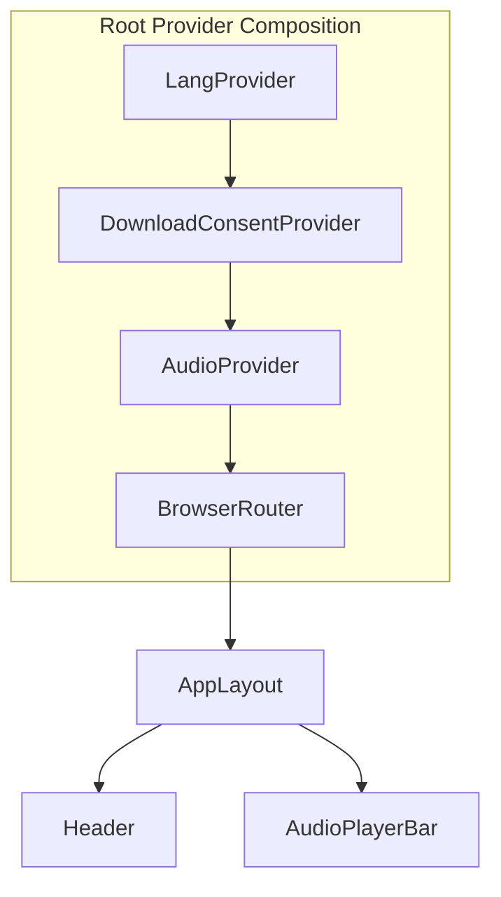
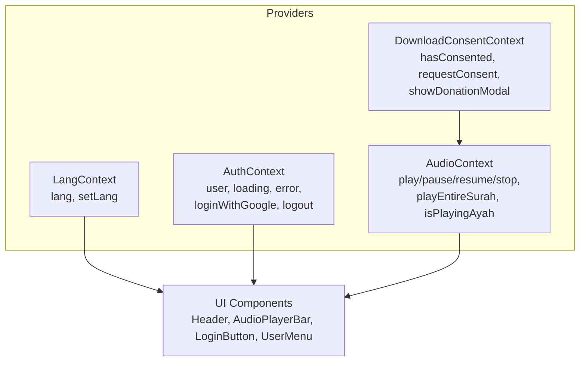
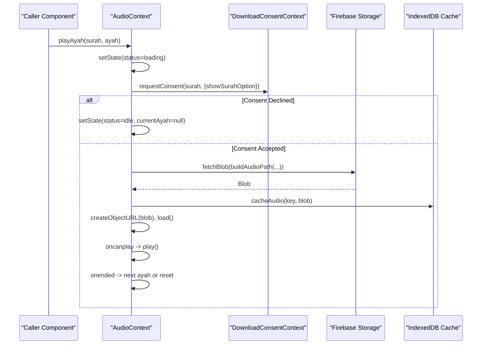
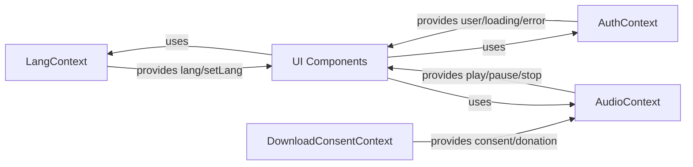
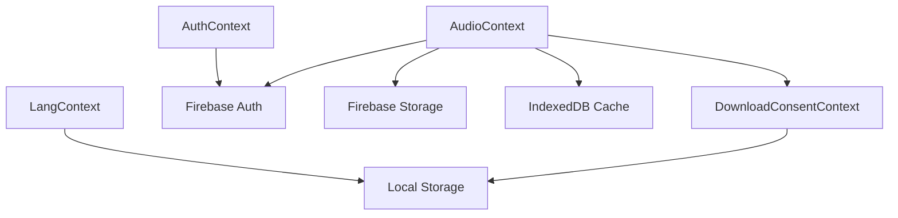

# State Management

<cite>
**Referenced Files in This Document**
- [App.tsx](file://src/App.tsx)
- [LangContext.tsx](file://src/context/LangContext.tsx)
- [AuthContext.tsx](file://src/context/AuthContext.tsx)
- [AudioContext.tsx](file://src/context/AudioContext.tsx)
- [DownloadConsentContext.tsx](file://src/context/DownloadConsentContext.tsx)
- [audio.ts](file://src/types/audio.ts)
- [audioCache.ts](file://src/utils/audioCache.ts)
- [audioUrl.ts](file://src/utils/audioUrl.ts)
- [AudioPlayerBar.tsx](file://src/components/AudioPlayerBar.tsx)
- [Header.tsx](file://src/components/Header.tsx)
- [LoginButton.tsx](file://src/components/LoginButton.tsx)
- [UserMenu.tsx](file://src/components/UserMenu.tsx)
- [useAudio.ts](file://src/hooks/useAudio.ts)
- [useAuth.ts](file://src/hooks/useAuth.ts)
</cite>

## Table of Contents
1. [Introduction](#introduction)
2. [Project Structure](#project-structure)
3. [Core Components](#core-components)
4. [Architecture Overview](#architecture-overview)
5. [Detailed Component Analysis](#detailed-component-analysis)
6. [Dependency Analysis](#dependency-analysis)
7. [Performance Considerations](#performance-considerations)
8. [Troubleshooting Guide](#troubleshooting-guide)
9. [Conclusion](#conclusion)

## Introduction
This document explains the state management architecture of the Quran Reader application. It focuses on four React Context providers and their responsibilities:
- LangContext: Language preference persistence and updates
- AuthContext: Authentication state via Firebase Auth
- AudioContext: Audio playback lifecycle, caching, and consent-driven downloads
- DownloadConsentContext: Consent prompts and donation modals for audio downloads

It documents state update patterns, hook implementations, cross-cutting concerns, provider hierarchy, performance optimizations, debugging strategies, and best practices for maintaining consistent state across components.

## Project Structure
The application initializes providers at the root level and composes them to serve global state to the rest of the app. Providers wrap routing and layout components so that state is available anywhere in the UI tree.

**Diagram sources**
- [App.tsx:42-54](file://src/App.tsx#L42-L54)

**Section sources**
- [App.tsx:1-56](file://src/App.tsx#L1-L56)

## Core Components
This section summarizes each provider’s role, state shape, and primary actions.

- LangContext
  - Purpose: Persist and expose the current language selection across sessions.
  - State: lang (type: 'ms' | 'en')
  - Actions: setLang(lang)
  - Persistence: Local storage key "quran-lang"

- AuthContext
  - Purpose: Manage Firebase Auth user session, loading, and errors.
  - State: user (User | null), loading (boolean), error (string | null)
  - Actions: loginWithGoogle(), logout()

- DownloadConsentContext
  - Purpose: Gate audio downloads with user consent and optionally trigger a donation modal.
  - State: Internal modal visibility and promise resolution
  - Actions: hasConsented(surahNumber), requestConsent(surahNumber, options), showDonationModal(onClose?)

- AudioContext
  - Purpose: Centralized audio playback orchestration with caching, consent flows, and surah-play sequencing.
  - State: Derived from AudioState (status, currentAyah, reciter, surahPlayMode, totalAyahsInSurah, errorMessage, recitationMode, activeLanguage)
  - Actions: playAyah, playAyahWithReciter, pause, resume, stop, playEntireSurah, setReciter, isPlayingAyah

**Section sources**
- [LangContext.tsx:1-32](file://src/context/LangContext.tsx#L1-L32)
- [AuthContext.tsx:1-63](file://src/context/AuthContext.tsx#L1-L63)
- [DownloadConsentContext.tsx:1-256](file://src/context/DownloadConsentContext.tsx#L1-L256)
- [AudioContext.tsx:16-396](file://src/context/AudioContext.tsx#L16-L396)
- [audio.ts:21-32](file://src/types/audio.ts#L21-L32)

## Architecture Overview
The provider hierarchy ensures that consent and audio logic are available wherever audio playback occurs, while language and auth states are globally accessible to UI and page components.

**Diagram sources**
- [App.tsx:3-6](file://src/App.tsx#L3-L6)
- [AudioContext.tsx:40-396](file://src/context/AudioContext.tsx#L40-L396)
- [DownloadConsentContext.tsx:16-256](file://src/context/DownloadConsentContext.tsx#L16-L256)
- [LangContext.tsx:12-32](file://src/context/LangContext.tsx#L12-L32)
- [AuthContext.tsx:20-63](file://src/context/AuthContext.tsx#L20-L63)

## Detailed Component Analysis

### LangContext
- Responsibilities
  - Initialize language from local storage or default to Malay ('ms')
  - Persist language changes to local storage
  - Expose lang and setLang to consumers

- State update pattern
  - useState initializes from persisted value
  - useEffect writes back to local storage on change

- Hook implementation
  - useLang returns the context value

- Cross-cutting concerns
  - Ensures language preference survives reloads
  - Used by Header to switch UI language labels

**Section sources**
- [LangContext.tsx:12-32](file://src/context/LangContext.tsx#L12-L32)
- [Header.tsx:9-67](file://src/components/Header.tsx#L9-L67)

### AuthContext
- Responsibilities
  - Subscribe to Firebase Auth state changes
  - Provide login/logout actions with error capture
  - Expose loading state during auth initialization

- State update pattern
  - onAuthStateChanged sets user and ends loading
  - loginWithGoogle and logout manage auth operations and errors

- Hook implementation
  - useAuth validates provider presence and returns context

- Cross-cutting concerns
  - Required for audio downloads (Firebase Auth checks)
  - Integrated into UserMenu and LoginButton

**Section sources**
- [AuthContext.tsx:20-63](file://src/context/AuthContext.tsx#L20-L63)
- [LoginButton.tsx:3-38](file://src/components/LoginButton.tsx#L3-L38)
- [UserMenu.tsx:6-79](file://src/components/UserMenu.tsx#L6-L79)

### DownloadConsentContext
- Responsibilities
  - Track per-surah consent in local storage
  - Present a modal to request consent for single ayah vs entire surah
  - Optionally present a donation modal for surah-wide downloads

- State update pattern
  - Modal visibility toggled internally
  - Promise resolves when user accepts/declines
  - Donation modal triggers via callback

- Hook implementation
  - useDownloadConsent returns the context value

- Cross-cutting concerns
  - Consumed by AudioContext to gate downloads
  - Persists consent decisions per surah

**Section sources**
- [DownloadConsentContext.tsx:16-256](file://src/context/DownloadConsentContext.tsx#L16-L256)
- [AudioContext.tsx:47](file://src/context/AudioContext.tsx#L47)

### AudioContext
- Responsibilities
  - Manage HTMLAudioElement lifecycle and events
  - Orchestrate playback of individual ayahs and entire surahs
  - Integrate consent and caching flows
  - Support reciter switching and recitation modes

- State shape and defaults
  - Status transitions: idle → loading → playing → paused → error
  - Tracks current ayah, reciter, surah mode, total ayahs, error message, recitation mode, active language

- State update patterns
  - Uses refs to capture current state inside event handlers (stateRef, activeLanguageRef, surahDownloadModeRef)
  - Updates state immutably via setState
  - Clears audio handlers before reassignment to prevent leaks

- Consent and download flow
  - For surah play mode: shows donation modal first, then proceeds to download entire surah
  - For single ayah: requests consent; if declined, returns to idle
  - Downloads require Firebase Auth user; otherwise sets error state

- Caching and URLs
  - IndexedDB-backed cache via cacheAudio and getCachedAudio
  - Builds Firebase Storage paths via buildAudioPath

- Hooks and consumers
  - useAudio exposes the full context value
  - AudioPlayerBar renders controls and status
  - AppLayout conditionally adjusts layout when audio is active

**Diagram sources**
- [AudioContext.tsx:68-305](file://src/context/AudioContext.tsx#L68-L305)
- [DownloadConsentContext.tsx:28-72](file://src/context/DownloadConsentContext.tsx#L28-L72)
- [audioCache.ts:30-60](file://src/utils/audioCache.ts#L30-L60)
- [audioUrl.ts:13-22](file://src/utils/audioUrl.ts#L13-L22)

**Section sources**
- [AudioContext.tsx:16-396](file://src/context/AudioContext.tsx#L16-L396)
- [audio.ts:21-32](file://src/types/audio.ts#L21-L32)
- [audioCache.ts:1-153](file://src/utils/audioCache.ts#L1-L153)
- [audioUrl.ts:1-37](file://src/utils/audioUrl.ts#L1-L37)
- [AudioPlayerBar.tsx:4-86](file://src/components/AudioPlayerBar.tsx#L4-L86)
- [App.tsx:22-40](file://src/App.tsx#L22-L40)

### Provider Composition and Component Relationships
- Provider order matters: LangProvider wraps DownloadConsentProvider, which wraps AudioProvider, ensuring consent and audio logic are available to the entire app.
- AppLayout uses AudioContext status to adjust layout spacing when audio is active.
- Header reads and updates LangContext; LoginButton and UserMenu consume AuthContext.
- AudioPlayerBar consumes AudioContext for playback controls and status.

**Diagram sources**
- [App.tsx:3-6](file://src/App.tsx#L3-L6)
- [AudioContext.tsx:40-396](file://src/context/AudioContext.tsx#L40-L396)
- [AuthContext.tsx:20-63](file://src/context/AuthContext.tsx#L20-L63)
- [LangContext.tsx:12-32](file://src/context/LangContext.tsx#L12-L32)

**Section sources**
- [App.tsx:22-40](file://src/App.tsx#L22-L40)
- [Header.tsx:9-67](file://src/components/Header.tsx#L9-L67)
- [AudioPlayerBar.tsx:4-86](file://src/components/AudioPlayerBar.tsx#L4-L86)
- [LoginButton.tsx:3-38](file://src/components/LoginButton.tsx#L3-L38)
- [UserMenu.tsx:6-79](file://src/components/UserMenu.tsx#L6-L79)

## Dependency Analysis
- AudioContext depends on:
  - DownloadConsentContext for consent gating
  - Firebase Auth for user checks
  - Firebase Storage for audio blobs
  - IndexedDB cache for zero-bandwidth playback
- DownloadConsentContext depends on:
  - Local storage for persisted consent
  - AudioContext for triggering donation modal during surah play
- AuthContext integrates with Firebase Auth SDK
- LangContext integrates with Local Storage

**Diagram sources**
- [AudioContext.tsx:47](file://src/context/AudioContext.tsx#L47)
- [DownloadConsentContext.tsx:24-26](file://src/context/DownloadConsentContext.tsx#L24-L26)
- [audioCache.ts:7-25](file://src/utils/audioCache.ts#L7-L25)
- [audioUrl.ts:13-22](file://src/utils/audioUrl.ts#L13-L22)
- [AuthContext.tsx:2-8](file://src/context/AuthContext.tsx#L2-L8)
- [LangContext.tsx:14](file://src/context/LangContext.tsx#L14)

**Section sources**
- [AudioContext.tsx:40-396](file://src/context/AudioContext.tsx#L40-L396)
- [DownloadConsentContext.tsx:16-256](file://src/context/DownloadConsentContext.tsx#L16-L256)
- [audioCache.ts:1-153](file://src/utils/audioCache.ts#L1-L153)
- [audioUrl.ts:1-37](file://src/utils/audioUrl.ts#L1-L37)
- [AuthContext.tsx:1-63](file://src/context/AuthContext.tsx#L1-L63)
- [LangContext.tsx:1-32](file://src/context/LangContext.tsx#L1-L32)

## Performance Considerations
- Event handler cleanup
  - AudioContext clears previous handlers before assigning new ones to avoid memory leaks and redundant callbacks.
- Ref-based state capture
  - stateRef, activeLanguageRef, and surahDownloadModeRef ensure event handlers observe the latest state without stale closures.
- Caching strategy
  - IndexedDB cache eliminates repeated network usage after first playback.
  - getCachedAudio returns null if missing; AudioContext falls back to consent and download flow.
- Conditional rendering
  - AudioPlayerBar hides itself when idle, reducing DOM overhead.
- Lazy audio element creation
  - Audio element is instantiated only when needed.

Best practices
- Keep state updates immutable and granular to minimize re-renders.
- Avoid unnecessary re-renders by extracting stable callbacks with useCallback where appropriate.
- Use refs for values accessed inside event handlers to prevent stale closure issues.
- Persist user preferences (language, consent) to local storage to reduce initialization work.

**Section sources**
- [AudioContext.tsx:61-66](file://src/context/AudioContext.tsx#L61-L66)
- [AudioContext.tsx:43-48](file://src/context/AudioContext.tsx#L43-L48)
- [AudioContext.tsx:307-305](file://src/context/AudioContext.tsx#L307-L305)
- [AudioPlayerBar.tsx:7](file://src/components/AudioPlayerBar.tsx#L7)
- [audioCache.ts:46-60](file://src/utils/audioCache.ts#L46-L60)

## Troubleshooting Guide
Common issues and resolutions
- Audio fails to play
  - Check status transitions and error messages from AudioContext state.
  - Verify network connectivity and Firebase Storage accessibility.
  - Confirm user is logged in for downloads requiring authentication.
- Consent modal does not appear
  - Ensure DownloadConsentContext.requestConsent is invoked with correct surah number.
  - Verify hasConsented returns false for the target surah.
- Donation modal appears unexpectedly
  - Surah play mode bypasses the consent choice and triggers donation modal automatically.
- Stale state in event handlers
  - AudioContext uses refs to capture current state inside onended/onerror handlers.
- Layout overlaps with audio bar
  - AppLayout conditionally adds padding when audio is active; confirm AudioContext status is not stuck in non-idle.

Debugging tips
- Inspect console logs in AudioContext and DownloadConsentContext for flow tracing.
- Use browser devtools to inspect IndexedDB entries and verify cache keys.
- Monitor Firebase Storage bucket paths built by audioUrl utility.

**Section sources**
- [AudioContext.tsx:223-229](file://src/context/AudioContext.tsx#L223-L229)
- [AudioContext.tsx:294-300](file://src/context/AudioContext.tsx#L294-L300)
- [AudioContext.tsx:88-98](file://src/context/AudioContext.tsx#L88-L98)
- [DownloadConsentContext.tsx:32-47](file://src/context/DownloadConsentContext.tsx#L32-L47)
- [AudioPlayerBar.tsx:22-36](file://src/components/AudioPlayerBar.tsx#L22-L36)
- [App.tsx:23-24](file://src/App.tsx#L23-L24)

## Conclusion
The Quran Reader employs a layered provider architecture to deliver cohesive state across language preferences, authentication, audio playback, and consent flows. By centralizing audio orchestration in AudioContext and gating downloads with DownloadConsentContext, the app balances user experience with resource efficiency. Using refs, immutable state updates, and IndexedDB caching helps maintain performance and reliability. Following the outlined patterns and best practices ensures consistent state across components and predictable behavior for users.