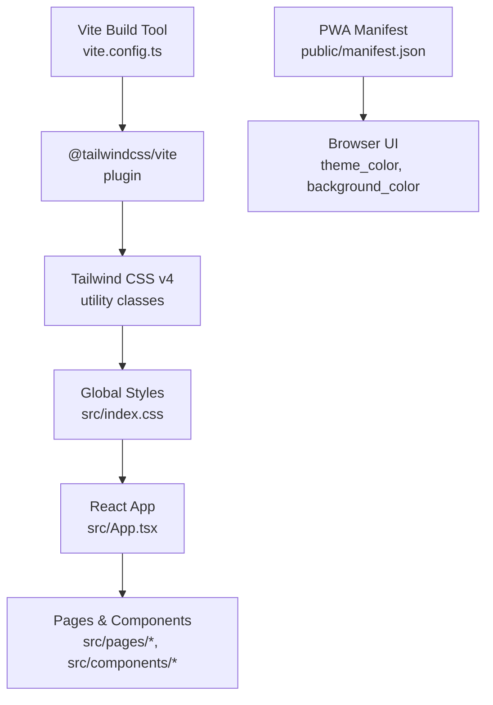
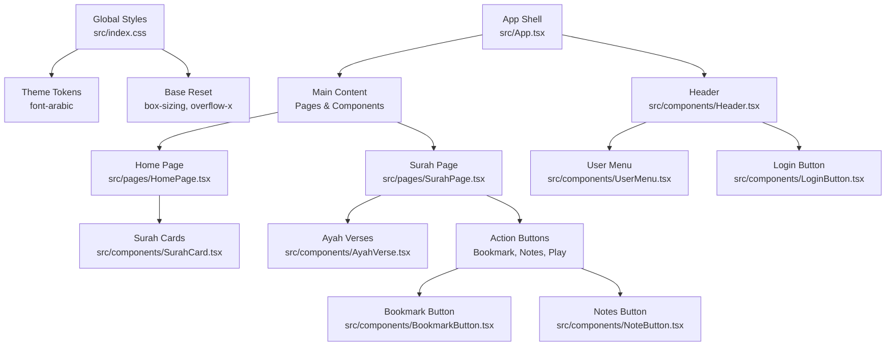
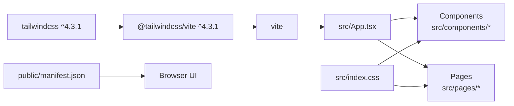

# Styling & User Interface

<cite>
**Referenced Files in This Document**
- [src/index.css](file://src/index.css)
- [vite.config.ts](file://vite.config.ts)
- [package.json](file://package.json)
- [public/manifest.json](file://public/manifest.json)
- [src/App.tsx](file://src/App.tsx)
- [src/components/Header.tsx](file://src/components/Header.tsx)
- [src/components/AyahVerse.tsx](file://src/components/AyahVerse.tsx)
- [src/components/SurahCard.tsx](file://src/components/SurahCard.tsx)
- [src/components/UserMenu.tsx](file://src/components/UserMenu.tsx)
- [src/components/LoginButton.tsx](file://src/components/LoginButton.tsx)
- [src/components/BookmarkButton.tsx](file://src/components/BookmarkButton.tsx)
- [src/components/NoteButton.tsx](file://src/components/NoteButton.tsx)
- [src/pages/HomePage.tsx](file://src/pages/HomePage.tsx)
- [src/pages/SurahPage.tsx](file://src/pages/SurahPage.tsx)
</cite>

## Table of Contents
1. [Introduction](#introduction)
2. [Project Structure](#project-structure)
3. [Core Components](#core-components)
4. [Architecture Overview](#architecture-overview)
5. [Detailed Component Analysis](#detailed-component-analysis)
6. [Dependency Analysis](#dependency-analysis)
7. [Performance Considerations](#performance-considerations)
8. [Troubleshooting Guide](#troubleshooting-guide)
9. [Conclusion](#conclusion)
10. [Appendices](#appendices)

## Introduction
This document describes the styling and user interface implementation of the Quran Reader application. It explains the Tailwind CSS configuration, design system principles, responsive design patterns, color schemes, typography, spacing, and component styling approaches. It also covers accessibility considerations, cross-browser compatibility, performance optimization, CSS architecture, utility class usage, customization options, mobile-first design, and PWA-specific UI considerations.

## Project Structure
The styling pipeline integrates Tailwind CSS via Vite and the Tailwind plugin. Global styles and theme tokens are defined in a single stylesheet, while components apply utility classes directly. The PWA manifest defines theme and background colors used by the browser during installation and runtime.

**Diagram sources**
- [vite.config.ts:1-8](file://vite.config.ts#L1-L8)
- [package.json:20-27](file://package.json#L20-L27)
- [src/index.css:1-18](file://src/index.css#L1-L18)
- [src/App.tsx:1-56](file://src/App.tsx#L1-L56)
- [public/manifest.json:1-27](file://public/manifest.json#L1-L27)

**Section sources**
- [vite.config.ts:1-8](file://vite.config.ts#L1-L8)
- [package.json:20-27](file://package.json#L20-L27)
- [src/index.css:1-18](file://src/index.css#L1-L18)
- [public/manifest.json:1-27](file://public/manifest.json#L1-L27)

## Core Components
- Tailwind CSS integration is configured through the Vite plugin and global stylesheet.
- Theme tokens define the primary Arabic typography stack.
- Utility-first classes are applied consistently across components for layout, color, spacing, and states.
- Responsive breakpoints are used to adapt layouts for small, medium, and large screens.
- Accessibility attributes (aria-labels, roles) and semantic markup are present in interactive components.

Key implementation references:
- Tailwind plugin and React integration: [vite.config.ts:1-8](file://vite.config.ts#L1-L8)
- Global theme token and base styles: [src/index.css:1-18](file://src/index.css#L1-L18)
- PWA theme colors: [public/manifest.json:7-8](file://public/manifest.json#L7-L8)

**Section sources**
- [vite.config.ts:1-8](file://vite.config.ts#L1-L8)
- [src/index.css:1-18](file://src/index.css#L1-L18)
- [public/manifest.json:7-8](file://public/manifest.json#L7-L8)

## Architecture Overview
The UI architecture follows a utility-first, component-driven pattern:
- Global theme tokens and base styles live in the global stylesheet.
- Components encapsulate styling via Tailwind utility classes.
- Layout containers use consistent spacing and max widths.
- Interactive states (hover, focus, active) are styled with transitions.
- Responsive variants adjust layout density and component arrangement.

**Diagram sources**
- [src/index.css:1-18](file://src/index.css#L1-L18)
- [src/App.tsx:22-40](file://src/App.tsx#L22-L40)
- [src/components/Header.tsx:6-68](file://src/components/Header.tsx#L6-L68)
- [src/pages/HomePage.tsx:5-44](file://src/pages/HomePage.tsx#L5-L44)
- [src/pages/SurahPage.tsx:11-120](file://src/pages/SurahPage.tsx#L11-L120)
- [src/components/SurahCard.tsx:4-42](file://src/components/SurahCard.tsx#L4-L42)
- [src/components/AyahVerse.tsx:14-63](file://src/components/AyahVerse.tsx#L14-L63)
- [src/components/UserMenu.tsx:6-79](file://src/components/UserMenu.tsx#L6-L79)
- [src/components/LoginButton.tsx:3-38](file://src/components/LoginButton.tsx#L3-L38)
- [src/components/BookmarkButton.tsx:10-49](file://src/components/BookmarkButton.tsx#L10-L49)
- [src/components/NoteButton.tsx:10-114](file://src/components/NoteButton.tsx#L10-L114)

## Detailed Component Analysis

### Design System Principles
- Color palette
  - Primary: Emerald tones for actions and accents.
  - Secondary: Amber for highlights and badges.
  - Neutral: Stone/gray shades for backgrounds, borders, and text.
  - PWA theme: Background and theme colors defined in manifest.
- Typography
  - Arabic/Quranic typography stack defined via theme token.
  - Semantic hierarchy with consistent weights and sizes.
- Spacing
  - Consistent padding/margin scales using numeric utilities.
  - Max width containers and horizontal gutters for readability.
- States and interactions
  - Hover/focus transitions and ring/outline emphasis.
  - Disabled states with reduced opacity.
- Accessibility
  - aria-labels on interactive elements.
  - Focus-visible rings and keyboard operability.
  - Proper contrast and readable sizes.

References:
- Theme token definition: [src/index.css:4-6](file://src/index.css#L4-L6)
- PWA theme/background: [public/manifest.json:7-8](file://public/manifest.json#L7-L8)
- Component states and interactions: [src/components/Header.tsx:19-63](file://src/components/Header.tsx#L19-L63), [src/components/UserMenu.tsx:28-75](file://src/components/UserMenu.tsx#L28-L75), [src/components/LoginButton.tsx:7-35](file://src/components/LoginButton.tsx#L7-L35), [src/components/BookmarkButton.tsx:35-47](file://src/components/BookmarkButton.tsx#L35-L47), [src/components/NoteButton.tsx:59-111](file://src/components/NoteButton.tsx#L59-L111)

**Section sources**
- [src/index.css:4-6](file://src/index.css#L4-L6)
- [public/manifest.json:7-8](file://public/manifest.json#L7-L8)
- [src/components/Header.tsx:19-63](file://src/components/Header.tsx#L19-L63)
- [src/components/UserMenu.tsx:28-75](file://src/components/UserMenu.tsx#L28-L75)
- [src/components/LoginButton.tsx:7-35](file://src/components/LoginButton.tsx#L7-L35)
- [src/components/BookmarkButton.tsx:35-47](file://src/components/BookmarkButton.tsx#L35-L47)
- [src/components/NoteButton.tsx:59-111](file://src/components/NoteButton.tsx#L59-L111)

### Responsive Design Patterns
- Container constraints: max-w-5xl centering with px-4 gutters.
- Grid layouts: single column on small screens, multiple columns on larger screens.
- Flexible inputs and cards: grow/shrink behavior with overflow handling.
- Sticky header and backdrop blur for immersive reading.

References:
- App container and spacing: [src/App.tsx:27-39](file://src/App.tsx#L27-L39)
- Home page responsive grid: [src/pages/HomePage.tsx:35](file://src/pages/HomePage.tsx#L35)
- Header layout and overflow: [src/components/Header.tsx:19-40](file://src/components/Header.tsx#L19-L40)

**Section sources**
- [src/App.tsx:27-39](file://src/App.tsx#L27-L39)
- [src/pages/HomePage.tsx:35](file://src/pages/HomePage.tsx#L35)
- [src/components/Header.tsx:19-40](file://src/components/Header.tsx#L19-L40)

### Component Styling Approaches
- Header
  - Sticky positioning, backdrop blur, and border separation.
  - Language toggle with active state styling.
- Surah Card
  - Rounded corners, subtle shadows, hover elevation and tint.
  - Badge for surah number and contextual tags.
- Ayah Verse
  - RTL Arabic text with directional and language attributes.
  - Action buttons aligned with verse content.
- User Menu
  - Portal-like dropdown with border and shadow.
  - Focus ring for keyboard navigation.
- Login Button
  - Disabled state handling and inline SVG branding.
- Bookmark and Notes
  - Conditional rendering based on auth state.
  - Hover tooltips and inline form states.

References:
- Header: [src/components/Header.tsx:6-68](file://src/components/Header.tsx#L6-L68)
- Surah Card: [src/components/SurahCard.tsx:4-42](file://src/components/SurahCard.tsx#L4-L42)
- Ayah Verse: [src/components/AyahVerse.tsx:14-63](file://src/components/AyahVerse.tsx#L14-L63)
- User Menu: [src/components/UserMenu.tsx:6-79](file://src/components/UserMenu.tsx#L6-L79)
- Login Button: [src/components/LoginButton.tsx:3-38](file://src/components/LoginButton.tsx#L3-L38)
- Bookmark Button: [src/components/BookmarkButton.tsx:10-49](file://src/components/BookmarkButton.tsx#L10-L49)
- Notes Button: [src/components/NoteButton.tsx:10-114](file://src/components/NoteButton.tsx#L10-L114)

**Section sources**
- [src/components/Header.tsx:6-68](file://src/components/Header.tsx#L6-L68)
- [src/components/SurahCard.tsx:4-42](file://src/components/SurahCard.tsx#L4-L42)
- [src/components/AyahVerse.tsx:14-63](file://src/components/AyahVerse.tsx#L14-L63)
- [src/components/UserMenu.tsx:6-79](file://src/components/UserMenu.tsx#L6-L79)
- [src/components/LoginButton.tsx:3-38](file://src/components/LoginButton.tsx#L3-L38)
- [src/components/BookmarkButton.tsx:10-49](file://src/components/BookmarkButton.tsx#L10-L49)
- [src/components/NoteButton.tsx:10-114](file://src/components/NoteButton.tsx#L10-L114)

### Accessibility Considerations
- Focus management and visible focus rings on interactive elements.
- aria-labels on buttons for context-aware screen reader support.
- Semantic HTML and proper heading order.
- Sufficient color contrast for text and interactive states.
- Keyboard operability for dropdowns and forms.

References:
- Focus ring on user avatar: [src/components/UserMenu.tsx:31](file://src/components/UserMenu.tsx#L31)
- aria-labels on buttons: [src/components/UserMenu.tsx:32](file://src/components/UserMenu.tsx#L32), [src/components/BookmarkButton.tsx:41](file://src/components/BookmarkButton.tsx#L41), [src/components/NoteButton.tsx:66](file://src/components/NoteButton.tsx#L66)
- Direction and language attributes: [src/components/AyahVerse.tsx:46-48](file://src/components/AyahVerse.tsx#L46-L48)

**Section sources**
- [src/components/UserMenu.tsx:31](file://src/components/UserMenu.tsx#L31)
- [src/components/BookmarkButton.tsx:41](file://src/components/BookmarkButton.tsx#L41)
- [src/components/NoteButton.tsx:66](file://src/components/NoteButton.tsx#L66)
- [src/components/AyahVerse.tsx:46-48](file://src/components/AyahVerse.tsx#L46-L48)

### Cross-Browser Compatibility
- Tailwind v4 utility classes provide consistent baseline styling across modern browsers.
- CSS custom properties (via @theme) centralize tokens for predictable rendering.
- No vendor prefixes are used; rely on Tailwind’s normalized utilities.

References:
- Tailwind import and theme token: [src/index.css:2-6](file://src/index.css#L2-L6)
- Dependencies: [package.json:20-27](file://package.json#L20-L27)

**Section sources**
- [src/index.css:2-6](file://src/index.css#L2-L6)
- [package.json:20-27](file://package.json#L20-L27)

### Performance Optimization for Styling
- Minimal global CSS reduces parsing overhead.
- Utility-first approach avoids large custom CSS files.
- Component-level classes keep styles scoped to usage.
- Avoid expensive effects (e.g., heavy shadows) on frequently re-rendered elements.
- Prefer transform and opacity for animations; keep transitions short.

References:
- Global reset and overflow: [src/index.css:8-17](file://src/index.css#L8-L17)
- Header backdrop blur and sticky: [src/components/Header.tsx:19](file://src/components/Header.tsx#L19)

**Section sources**
- [src/index.css:8-17](file://src/index.css#L8-L17)
- [src/components/Header.tsx:19](file://src/components/Header.tsx#L19)

### CSS Architecture and Utility Class Usage
- Centralized theme tokens in global stylesheet.
- Component-level utility classes for layout, color, spacing, and states.
- Responsive modifiers for adaptive layouts.
- State utilities for hover, focus, and active states.

References:
- Theme token: [src/index.css:4-6](file://src/index.css#L4-L6)
- Component utilities: [src/components/Header.tsx:19-63](file://src/components/Header.tsx#L19-L63), [src/components/SurahCard.tsx:8](file://src/components/SurahCard.tsx#L8), [src/components/AyahVerse.tsx:44-60](file://src/components/AyahVerse.tsx#L44-L60)

**Section sources**
- [src/index.css:4-6](file://src/index.css#L4-L6)
- [src/components/Header.tsx:19-63](file://src/components/Header.tsx#L19-L63)
- [src/components/SurahCard.tsx:8](file://src/components/SurahCard.tsx#L8)
- [src/components/AyahVerse.tsx:44-60](file://src/components/AyahVerse.tsx#L44-L60)

### Mobile-First Design and PWA UI Considerations
- Mobile-first spacing and typography scales.
- Sticky header with minimal height impact.
- PWA manifest defines theme and background colors for installable experience.
- Portrait orientation preference and standalone display mode.

References:
- PWA manifest: [public/manifest.json:6-9](file://public/manifest.json#L6-L9), [public/manifest.json:7-8](file://public/manifest.json#L7-L8)
- App shell container: [src/App.tsx:27-39](file://src/App.tsx#L27-L39)
- Header sticky behavior: [src/components/Header.tsx:19](file://src/components/Header.tsx#L19)

**Section sources**
- [public/manifest.json:6-9](file://public/manifest.json#L6-L9)
- [public/manifest.json:7-8](file://public/manifest.json#L7-L8)
- [src/App.tsx:27-39](file://src/App.tsx#L27-L39)
- [src/components/Header.tsx:19](file://src/components/Header.tsx#L19)

## Dependency Analysis
Tailwind CSS and the Vite plugin are the primary styling dependencies. The global stylesheet depends on Tailwind directives and theme tokens. Components depend on Tailwind utilities and React contexts/providers.

**Diagram sources**
- [package.json:20-27](file://package.json#L20-L27)
- [vite.config.ts:1-8](file://vite.config.ts#L1-L8)
- [src/index.css:1-18](file://src/index.css#L1-L18)
- [src/App.tsx:1-56](file://src/App.tsx#L1-L56)
- [public/manifest.json:1-27](file://public/manifest.json#L1-L27)

**Section sources**
- [package.json:20-27](file://package.json#L20-L27)
- [vite.config.ts:1-8](file://vite.config.ts#L1-L8)
- [src/index.css:1-18](file://src/index.css#L1-L18)
- [src/App.tsx:1-56](file://src/App.tsx#L1-L56)
- [public/manifest.json:1-27](file://public/manifest.json#L1-L27)

## Performance Considerations
- Keep utility classes concise and avoid nesting custom CSS.
- Prefer Tailwind’s built-in responsive variants over media queries.
- Minimize DOM depth in frequently updated components.
- Use lazy loading for images and offscreen content.
- Avoid layout thrashing by batching DOM reads/writes.

## Troubleshooting Guide
- Fonts not loading
  - Verify the Google Fonts import URL and network availability.
  - Confirm the theme token is applied to Arabic text blocks.
- Colors appear incorrect
  - Ensure Tailwind plugin is loaded and compiled by Vite.
  - Check PWA manifest theme/background colors for browser UI.
- Layout breaks on small screens
  - Use responsive utilities (e.g., grid columns) and ensure container constraints.
- Focus or hover states missing
  - Add explicit focus-visible and hover utilities to interactive elements.

**Section sources**
- [src/index.css:1-6](file://src/index.css#L1-L6)
- [package.json:20-27](file://package.json#L20-L27)
- [public/manifest.json:7-8](file://public/manifest.json#L7-L8)
- [src/pages/HomePage.tsx:35](file://src/pages/HomePage.tsx#L35)

## Conclusion
The Quran Reader application employs a clean, utility-first styling approach powered by Tailwind CSS and Vite. The design system centers on a consistent color palette, a dedicated Arabic typography stack, and thoughtful spacing and responsive patterns. Accessibility and PWA integration are considered through semantic markup, focus management, and manifest-defined UI themes. The component-driven architecture ensures maintainability and scalability across pages and features.

## Appendices
- Customization options
  - Extend the theme token for additional fonts or brand colors.
  - Introduce new component variants via utility class combinations.
  - Add dark-mode variants using Tailwind’s variant system.
- Migration notes
  - When upgrading Tailwind, validate utility class usage and responsive variants.
  - Keep global CSS minimal to reduce upgrade friction.