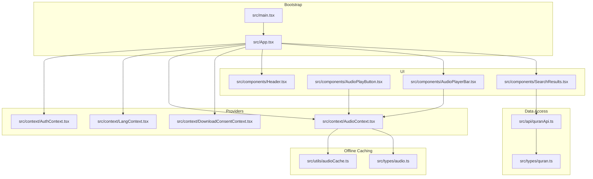
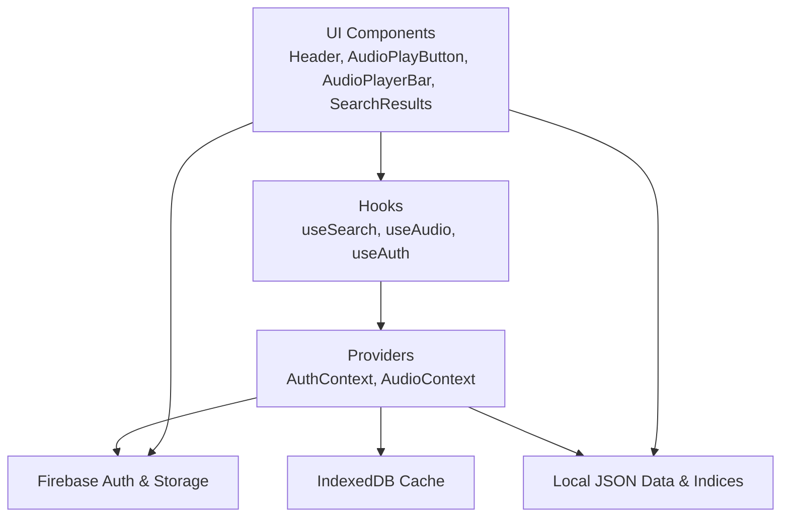
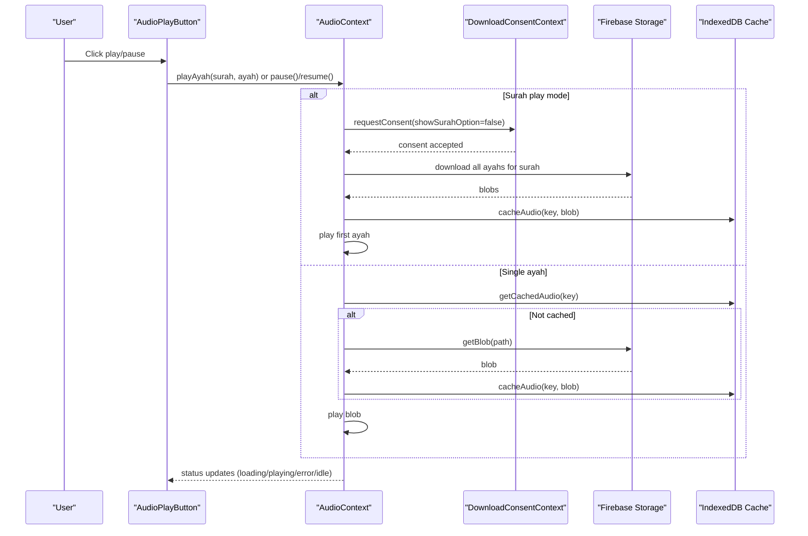
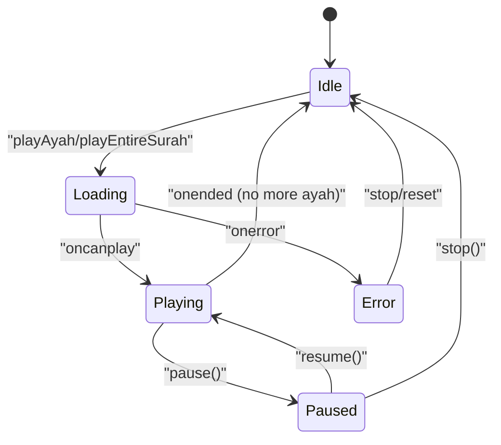
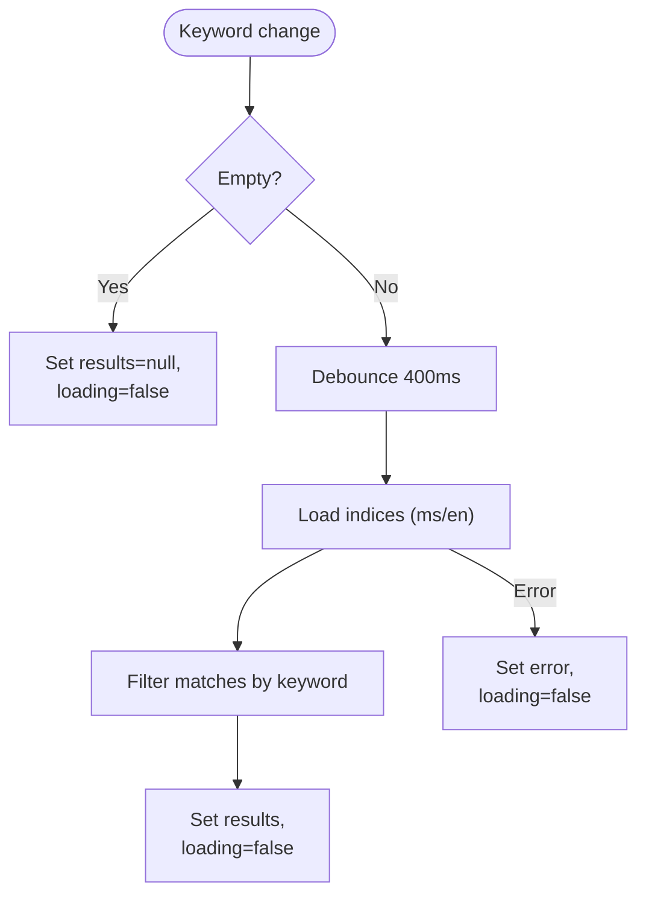
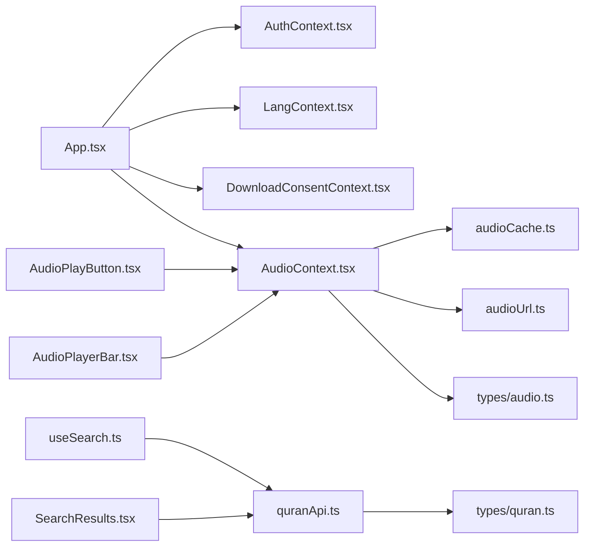

# Troubleshooting & FAQ

<cite>
**Referenced Files in This Document**
- [README.md](file://README.md)
- [src/main.tsx](file://src/main.tsx)
- [src/App.tsx](file://src/App.tsx)
- [src/context/AudioContext.tsx](file://src/context/AudioContext.tsx)
- [src/context/AuthContext.tsx](file://src/context/AuthContext.tsx)
- [src/hooks/useAudio.ts](file://src/hooks/useAudio.ts)
- [src/hooks/useAuth.ts](file://src/hooks/useAuth.ts)
- [src/hooks/useSearch.ts](file://src/hooks/useSearch.ts)
- [src/components/AudioPlayButton.tsx](file://src/components/AudioPlayButton.tsx)
- [src/components/AudioPlayerBar.tsx](file://src/components/AudioPlayerBar.tsx)
- [src/components/SearchResults.tsx](file://src/components/SearchResults.tsx)
- [src/api/quranApi.ts](file://src/api/quranApi.ts)
- [src/utils/audioCache.ts](file://src/utils/audioCache.ts)
- [src/utils/audioUrl.ts](file://src/utils/audioUrl.ts)
- [src/types/audio.ts](file://src/types/audio.ts)
- [src/types/quran.ts](file://src/types/quran.ts)
</cite>

## Table of Contents
1. [Introduction](#introduction)
2. [Project Structure](#project-structure)
3. [Core Components](#core-components)
4. [Architecture Overview](#architecture-overview)
5. [Detailed Component Analysis](#detailed-component-analysis)
6. [Dependency Analysis](#dependency-analysis)
7. [Performance Considerations](#performance-considerations)
8. [Troubleshooting Guide](#troubleshooting-guide)
9. [Conclusion](#conclusion)
10. [Appendices](#appendices)

## Introduction
This document provides comprehensive troubleshooting and frequently asked questions for the Quran Reader application. It focuses on diagnosing and resolving audio playback issues, authentication failures, search functionality problems, and performance bottlenecks. It also covers error message interpretation, debugging techniques, diagnostics, browser compatibility, offline behavior, Firebase integration, and optimization tips.

## Project Structure
The application is a React 19 + TypeScript + Vite 8 app with a clear separation of concerns:
- Application bootstrap wires providers for authentication, language, audio, and download consent.
- Offline-first data access via local JSON files and client-side search indices.
- Firebase Authentication and Firebase Storage integrate for user sessions and audio downloads.
- Hooks encapsulate reusable logic for search, audio, and auth.
- Utilities implement IndexedDB-based caching for audio blobs.

**Diagram sources**
- [src/main.tsx:1-14](file://src/main.tsx#L1-L14)
- [src/App.tsx:1-56](file://src/App.tsx#L1-L56)
- [src/context/AuthContext.tsx:1-63](file://src/context/AuthContext.tsx#L1-L63)
- [src/context/AudioContext.tsx:1-396](file://src/context/AudioContext.tsx#L1-L396)
- [src/components/AudioPlayButton.tsx:1-69](file://src/components/AudioPlayButton.tsx#L1-L69)
- [src/components/AudioPlayerBar.tsx:1-86](file://src/components/AudioPlayerBar.tsx#L1-L86)
- [src/components/SearchResults.tsx:1-55](file://src/components/SearchResults.tsx#L1-L55)
- [src/api/quranApi.ts:1-51](file://src/api/quranApi.ts#L1-L51)
- [src/utils/audioCache.ts:1-153](file://src/utils/audioCache.ts#L1-L153)
- [src/types/audio.ts:1-41](file://src/types/audio.ts#L1-L41)
- [src/types/quran.ts:1-64](file://src/types/quran.ts#L1-L64)

**Section sources**
- [README.md:1-85](file://README.md#L1-L85)
- [src/main.tsx:1-14](file://src/main.tsx#L1-L14)
- [src/App.tsx:1-56](file://src/App.tsx#L1-L56)

## Core Components
- Authentication: Firebase Authentication handles sign-in/sign-out and state observation. The provider exposes user, loading, error, and methods to the app.
- Audio Playback: Centralized provider manages audio lifecycle, reciter selection, recitation modes, surah play sequences, and downloads from Firebase Storage with IndexedDB caching.
- Search: Client-side search against prebuilt indices for Malay and English; debounced hook prevents excessive network calls.
- Offline Behavior: All static data and search indices are served from local files; audio downloads are cached for zero-bandwidth reuse.

**Section sources**
- [src/context/AuthContext.tsx:1-63](file://src/context/AuthContext.tsx#L1-L63)
- [src/context/AudioContext.tsx:1-396](file://src/context/AudioContext.tsx#L1-L396)
- [src/hooks/useSearch.ts:1-37](file://src/hooks/useSearch.ts#L1-L37)
- [src/api/quranApi.ts:1-51](file://src/api/quranApi.ts#L1-L51)

## Architecture Overview
The app follows a layered architecture:
- Presentation layer: Pages and components render UI and delegate actions to hooks/providers.
- Domain layer: Hooks encapsulate search and audio orchestration.
- Data layer: Local JSON APIs and Firebase APIs for authentication and storage.
- Persistence layer: IndexedDB-backed audio cache.

**Diagram sources**
- [src/components/AudioPlayButton.tsx:1-69](file://src/components/AudioPlayButton.tsx#L1-L69)
- [src/components/AudioPlayerBar.tsx:1-86](file://src/components/AudioPlayerBar.tsx#L1-L86)
- [src/components/SearchResults.tsx:1-55](file://src/components/SearchResults.tsx#L1-L55)
- [src/hooks/useSearch.ts:1-37](file://src/hooks/useSearch.ts#L1-L37)
- [src/context/AudioContext.tsx:1-396](file://src/context/AudioContext.tsx#L1-L396)
- [src/context/AuthContext.tsx:1-63](file://src/context/AuthContext.tsx#L1-L63)
- [src/api/quranApi.ts:1-51](file://src/api/quranApi.ts#L1-L51)
- [src/utils/audioCache.ts:1-153](file://src/utils/audioCache.ts#L1-L153)

## Detailed Component Analysis

### Audio Playback Flow
This sequence illustrates how an audio ayah is requested, cached, and played, including surah-mode downloads and language transitions.

**Diagram sources**
- [src/components/AudioPlayButton.tsx:1-69](file://src/components/AudioPlayButton.tsx#L1-L69)
- [src/context/AudioContext.tsx:68-305](file://src/context/AudioContext.tsx#L68-L305)
- [src/utils/audioCache.ts:30-60](file://src/utils/audioCache.ts#L30-L60)
- [src/utils/audioUrl.ts:13-22](file://src/utils/audioUrl.ts#L13-L22)

**Section sources**
- [src/context/AudioContext.tsx:68-305](file://src/context/AudioContext.tsx#L68-L305)
- [src/utils/audioCache.ts:1-153](file://src/utils/audioCache.ts#L1-L153)
- [src/utils/audioUrl.ts:1-37](file://src/utils/audioUrl.ts#L1-L37)
- [src/types/audio.ts:1-41](file://src/types/audio.ts#L1-L41)

### Audio State Machine
The internal state machine governs transitions during playback and surah-mode sequencing.

**Diagram sources**
- [src/context/AudioContext.tsx:29-32](file://src/context/AudioContext.tsx#L29-L32)
- [src/context/AudioContext.tsx:231-292](file://src/context/AudioContext.tsx#L231-L292)

**Section sources**
- [src/context/AudioContext.tsx:29-32](file://src/context/AudioContext.tsx#L29-L32)
- [src/context/AudioContext.tsx:231-292](file://src/context/AudioContext.tsx#L231-L292)

### Search Hook Flow
Debounced search triggers a fetch of prebuilt indices and filters matches.

**Diagram sources**
- [src/hooks/useSearch.ts:11-33](file://src/hooks/useSearch.ts#L11-L33)
- [src/api/quranApi.ts:21-41](file://src/api/quranApi.ts#L21-L41)

**Section sources**
- [src/hooks/useSearch.ts:1-37](file://src/hooks/useSearch.ts#L1-L37)
- [src/api/quranApi.ts:16-51](file://src/api/quranApi.ts#L16-L51)

## Dependency Analysis
- Provider hierarchy: App wraps children in AuthProvider → LangProvider → DownloadConsentProvider → AudioProvider.
- AudioContext depends on Firebase Auth and Storage, and IndexedDB cache; it also uses reciter/language configuration.
- UI components depend on hooks/providers for state and actions.
- Search depends on local indices loaded via quranApi.

**Diagram sources**
- [src/App.tsx:42-54](file://src/App.tsx#L42-L54)
- [src/context/AudioContext.tsx:1-15](file://src/context/AudioContext.tsx#L1-L15)
- [src/utils/audioCache.ts:1-10](file://src/utils/audioCache.ts#L1-L10)
- [src/utils/audioUrl.ts:1-2](file://src/utils/audioUrl.ts#L1-L2)
- [src/hooks/useSearch.ts:1-5](file://src/hooks/useSearch.ts#L1-L5)
- [src/api/quranApi.ts:1-3](file://src/api/quranApi.ts#L1-L3)
- [src/types/audio.ts:1-41](file://src/types/audio.ts#L1-L41)
- [src/types/quran.ts:1-64](file://src/types/quran.ts#L1-L64)

**Section sources**
- [src/App.tsx:42-54](file://src/App.tsx#L42-L54)
- [src/context/AudioContext.tsx:1-15](file://src/context/AudioContext.tsx#L1-L15)
- [src/hooks/useSearch.ts:1-5](file://src/hooks/useSearch.ts#L1-L5)
- [src/api/quranApi.ts:1-3](file://src/api/quranApi.ts#L1-L3)

## Performance Considerations
- IndexedDB caching minimizes bandwidth and latency after first play; ensure cache is healthy and not blocked by browser policies.
- Surah-mode downloads pre-fetch all ayahs; consider user consent flow and network conditions.
- Debounced search reduces redundant fetches; ensure indices are present and accessible.
- Audio URLs and storage paths are deterministic; verify bucket and path construction if downloads fail.

[No sources needed since this section provides general guidance]

## Troubleshooting Guide

### Audio Playback Problems
Symptoms:
- Cannot play a single ayah or entire surah.
- Error messages appear in the player bar or button.
- Surah mode does not advance automatically.

Common causes and resolutions:
- Not signed in:
  - Symptom: Error indicates the need to log in before playing.
  - Resolution: Sign in with Google via the header menu. Confirm user presence in the UI and provider state.
  - Section sources
    - [src/context/AudioContext.tsx:109-116](file://src/context/AudioContext.tsx#L109-L116)
    - [src/context/AudioContext.tsx:180-188](file://src/context/AudioContext.tsx#L180-L188)
    - [src/components/AudioPlayButton.tsx:23-26](file://src/components/AudioPlayButton.tsx#L23-L26)

- Network/storage issues:
  - Symptom: Error indicating failure to load audio or play.
  - Resolution: Verify internet connectivity; retry. Check Firebase Storage availability and path correctness.
  - Section sources
    - [src/context/AudioContext.tsx:216-222](file://src/context/AudioContext.tsx#L216-L222)
    - [src/context/AudioContext.tsx:294-300](file://src/context/AudioContext.tsx#L294-L300)
    - [src/utils/audioUrl.ts:13-22](file://src/utils/audioUrl.ts#L13-L22)

- Surah-mode requires consent and may prompt a donation modal:
  - Symptom: Surah play starts but pauses until modal is dismissed.
  - Resolution: Complete the donation modal flow; ensure user remains logged in for bulk downloads.
  - Section sources
    - [src/context/AudioContext.tsx:87-98](file://src/context/AudioContext.tsx#L87-L98)
    - [src/context/AudioContext.tsx:139-144](file://src/context/AudioContext.tsx#L139-L144)

- Cache corruption or quota exceeded:
  - Symptom: Playback fails despite successful download; repeated errors.
  - Resolution: Clear cache and retry. Use cache inspection utilities if available.
  - Section sources
    - [src/utils/audioCache.ts:108-118](file://src/utils/audioCache.ts#L108-L118)
    - [src/context/AudioContext.tsx:101-102](file://src/context/AudioContext.tsx#L101-L102)

- Browser autoplay restrictions:
  - Symptom: Audio loads but does not play automatically.
  - Resolution: Interact with the player (click play) to trigger playback; ensure site is unmuted.
  - Section sources
    - [src/context/AudioContext.tsx:205-213](file://src/context/AudioContext.tsx#L205-L213)

- Surah-mode language transitions:
  - Symptom: Player stays on Arabic or Malay without advancing.
  - Resolution: Verify recitation mode setting; ensure mode supports arabic-then-malay sequencing.
  - Section sources
    - [src/context/AudioContext.tsx:239-283](file://src/context/AudioContext.tsx#L239-L283)
    - [src/types/audio.ts:1-7](file://src/types/audio.ts#L1-L7)

### Authentication Failures
Symptoms:
- Login prompts error messages.
- User remains unsigned in after attempting login.
- Logout fails.

Common causes and resolutions:
- Popup blocked or redirect issues:
  - Symptom: Login fails with generic error.
  - Resolution: Allow popups; retry login; check browser privacy settings.
  - Section sources
    - [src/context/AuthContext.tsx:33-40](file://src/context/AuthContext.tsx#L33-L40)

- Firebase misconfiguration:
  - Symptom: Errors related to auth initialization or provider setup.
  - Resolution: Verify Firebase config and credentials; ensure environment is correctly set up.
  - Section sources
    - [src/context/AuthContext.tsx:8](file://src/context/AuthContext.tsx#L8)

- Session persistence:
  - Symptom: User appears logged out after refresh.
  - Resolution: Confirm auth state observer is active and not unsubscribed prematurely.
  - Section sources
    - [src/context/AuthContext.tsx:25-31](file://src/context/AuthContext.tsx#L25-L31)

### Search Functionality Issues
Symptoms:
- No results found for keywords.
- Slow search response.
- Highlighting not working.

Common causes and resolutions:
- Empty or whitespace-only query:
  - Symptom: Immediate reset to no results.
  - Resolution: Enter a non-empty keyword; debounce completes before search runs.
  - Section sources
    - [src/hooks/useSearch.ts:12-16](file://src/hooks/useSearch.ts#L12-L16)

- Missing indices:
  - Symptom: Error thrown while loading indices.
  - Resolution: Ensure search indices are built and deployed to public/data; rebuild if needed.
  - Section sources
    - [src/api/quranApi.ts:28-41](file://src/api/quranApi.ts#L28-L41)
    - [README.md:68-77](file://README.md#L68-L77)

- Debounce timing:
  - Symptom: Results flicker or appear late.
  - Resolution: Adjust debounce delay if necessary; ensure keyword is trimmed.
  - Section sources
    - [src/hooks/useSearch.ts:30-33](file://src/hooks/useSearch.ts#L30-L33)

- Highlighting:
  - Symptom: Keyword not highlighted in results.
  - Resolution: Confirm regex escaping and mark rendering logic.
  - Section sources
    - [src/components/SearchResults.tsx:4-17](file://src/components/SearchResults.tsx#L4-L17)

### Performance Bottlenecks
Symptoms:
- Slow initial load of surahs or search.
- Audio takes long to start after first play.
- Surah-mode download feels sluggish.

Common causes and resolutions:
- First-play latency:
  - Cause: Network fetch + cache write.
  - Resolution: Retry; subsequent plays will be fast due to IndexedDB cache.
  - Section sources
    - [src/context/AudioContext.tsx:100-199](file://src/context/AudioContext.tsx#L100-L199)
    - [src/utils/audioCache.ts:30-40](file://src/utils/audioCache.ts#L30-L40)

- Surah-mode bulk download:
  - Cause: Multiple downloads for all ayahs.
  - Resolution: Ensure user is logged in; avoid repeated downloads by clearing cache intentionally.
  - Section sources
    - [src/context/AudioContext.tsx:139-172](file://src/context/AudioContext.tsx#L139-L172)

- Index loading:
  - Cause: Initial fetch of search indices.
  - Resolution: Ensure indices are present; avoid rebuilding unless necessary.
  - Section sources
    - [src/api/quranApi.ts:28-41](file://src/api/quranApi.ts#L28-L41)

### Browser Compatibility and Offline Functionality
- IndexedDB support:
  - Symptom: Cache operations silently fail.
  - Resolution: Use a supported browser; enable IndexedDB; check private/incognito restrictions.
  - Section sources
    - [src/utils/audioCache.ts:11-25](file://src/utils/audioCache.ts#L11-L25)

- HTTPS and service worker:
  - Symptom: Local data not loading in some environments.
  - Resolution: Serve over HTTPS; ensure static files are accessible.
  - Section sources
    - [README.md:13](file://README.md#L13)
    - [src/api/quranApi.ts:4-14](file://src/api/quranApi.ts#L4-L14)

- Storage path expectations:
  - Symptom: Downloads fail due to wrong path.
  - Resolution: Verify storage path construction and bucket name.
  - Section sources
    - [src/utils/audioUrl.ts:13-22](file://src/utils/audioUrl.ts#L13-L22)

### Firebase Integration Challenges
- Authentication:
  - Symptom: Login/logout errors.
  - Resolution: Check provider setup and error propagation.
  - Section sources
    - [src/context/AuthContext.tsx:33-49](file://src/context/AuthContext.tsx#L33-L49)

- Storage access:
  - Symptom: Cannot download audio blobs.
  - Resolution: Confirm user is signed in; verify storage rules and path.
  - Section sources
    - [src/context/AudioContext.tsx:118-122](file://src/context/AudioContext.tsx#L118-L122)
    - [src/utils/audioUrl.ts:13-22](file://src/utils/audioUrl.ts#L13-L22)

### Error Message Interpretation
- “Please sign in to listen”:
  - Cause: Attempted to play without being authenticated.
  - Action: Log in; retry.
  - Section sources
    - [src/context/AudioContext.tsx:110-116](file://src/context/AudioContext.tsx#L110-L116)
    - [src/context/AudioContext.tsx:180-188](file://src/context/AudioContext.tsx#L180-L188)

- “Failed to play audio”:
  - Cause: Autoplay blocked or media error.
  - Action: Interact with player; check browser mute/unmute; retry.
  - Section sources
    - [src/context/AudioContext.tsx:207-213](file://src/context/AudioContext.tsx#L207-L213)

- “Failed to load audio”:
  - Cause: Network/storage error.
  - Action: Check connection; retry; inspect storage path.
  - Section sources
    - [src/context/AudioContext.tsx:216-222](file://src/context/AudioContext.tsx#L216-L222)
    - [src/context/AudioContext.tsx:294-300](file://src/context/AudioContext.tsx#L294-L300)

- “Audio could not be loaded. Please check your internet connection.”:
  - Cause: Playback error or network issue.
  - Action: Verify connectivity; retry.
  - Section sources
    - [src/components/AudioPlayerBar.tsx:34-36](file://src/components/AudioPlayerBar.tsx#L34-L36)

### Debugging Techniques and Diagnostics
- Console logs:
  - Observe logs around cache checks, consent flows, and surah-mode downloads.
  - Section sources
    - [src/context/AudioContext.tsx:88-98](file://src/context/AudioContext.tsx#L88-L98)
    - [src/context/AudioContext.tsx:102](file://src/context/AudioContext.tsx#L102)

- State inspection:
  - Use React DevTools to inspect provider state (status, currentAyah, errorMessage).
  - Section sources
    - [src/context/AudioContext.tsx:29-38](file://src/context/AudioContext.tsx#L29-L38)

- Network tab:
  - Verify fetches for surahs, indices, and audio blobs; confirm 200 responses.
  - Section sources
    - [src/api/quranApi.ts:4-14](file://src/api/quranApi.ts#L4-L14)
    - [src/api/quranApi.ts:30-36](file://src/api/quranApi.ts#L30-L36)

- IndexedDB inspection:
  - Confirm cache entries exist and sizes are reasonable.
  - Section sources
    - [src/utils/audioCache.ts:46-60](file://src/utils/audioCache.ts#L46-L60)
    - [src/utils/audioCache.ts:73-103](file://src/utils/audioCache.ts#L73-L103)

### Frequently Asked Questions (FAQ)

Q: Why do I need to sign in to play audio?
A: Authentication is required to access Firebase Storage for downloading audio files. Logging in enables secure access to recitations.

Q: How do I fix “Failed to play audio”?
A: Ensure your browser allows autoplay, click play to trigger playback, and verify your internet connection.

Q: Why does surah-mode take so long?
A: Surah-mode downloads all ayahs for the surah. Subsequent plays are instant due to caching.

Q: How do I clear cached audio?
A: Use the cache utilities to clear or delete specific entries; then re-play to re-cache.

Q: Why is search slow?
A: First-time index load may take a moment. Ensure indices are present and not blocked by CSP.

Q: Does this work offline?
A: Yes, all data and indices are local; audio downloads are cached for reuse.

Q: What browsers are supported?
A: Modern browsers with IndexedDB and ES modules support. Avoid private browsing modes that restrict storage.

Q: How do I rebuild search indices?
A: Use the provided script to re-download data and rebuild indices into public/data.

**Section sources**
- [README.md:13](file://README.md#L13)
- [README.md:68-77](file://README.md#L68-L77)
- [src/utils/audioCache.ts:108-118](file://src/utils/audioCache.ts#L108-L118)

## Conclusion
This guide consolidates actionable steps to diagnose and resolve common issues in the Quran Reader application. By understanding the provider-driven architecture, IndexedDB caching, and Firebase integrations, users and developers can efficiently troubleshoot audio playback, authentication, search, and performance concerns. For persistent issues, leverage browser developer tools, inspect provider state, and verify network and storage access.

## Appendices

### Step-by-Step Scenarios

- Scenario: Single ayah fails to play
  1. Confirm user is signed in.
  2. Click play; observe status in the player bar.
  3. If still failing, clear cache and retry.
  4. Check browser autoplay policy and network connectivity.
  - Section sources
    - [src/context/AudioContext.tsx:109-116](file://src/context/AudioContext.tsx#L109-L116)
    - [src/context/AudioContext.tsx:205-213](file://src/context/AudioContext.tsx#L205-L213)
    - [src/utils/audioCache.ts:108-118](file://src/utils/audioCache.ts#L108-L118)

- Scenario: Surah-mode does not advance
  1. Verify recitation mode is set to arabic-then-malay if expecting language switching.
  2. Ensure surah has more ayahs; otherwise, playback ends.
  3. Re-enter surah page and restart.
  - Section sources
    - [src/context/AudioContext.tsx:239-283](file://src/context/AudioContext.tsx#L239-L283)

- Scenario: Search yields no results
  1. Ensure keyword is not empty and trimmed.
  2. Confirm indices are present in public/data.
  3. Rebuild indices if missing.
  - Section sources
    - [src/hooks/useSearch.ts:12-16](file://src/hooks/useSearch.ts#L12-L16)
    - [src/api/quranApi.ts:28-41](file://src/api/quranApi.ts#L28-L41)
    - [README.md:68-77](file://README.md#L68-L77)

- Scenario: Cache appears corrupted
  1. Clear cache; re-play problematic ayahs.
  2. Inspect IndexedDB entries and sizes.
  - Section sources
    - [src/utils/audioCache.ts:108-118](file://src/utils/audioCache.ts#L108-L118)
    - [src/utils/audioCache.ts:73-103](file://src/utils/audioCache.ts#L73-L103)