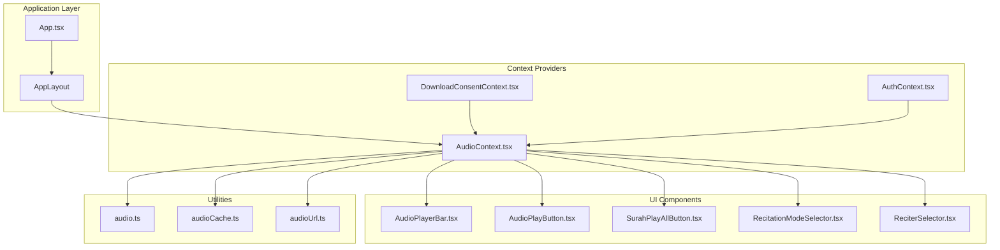
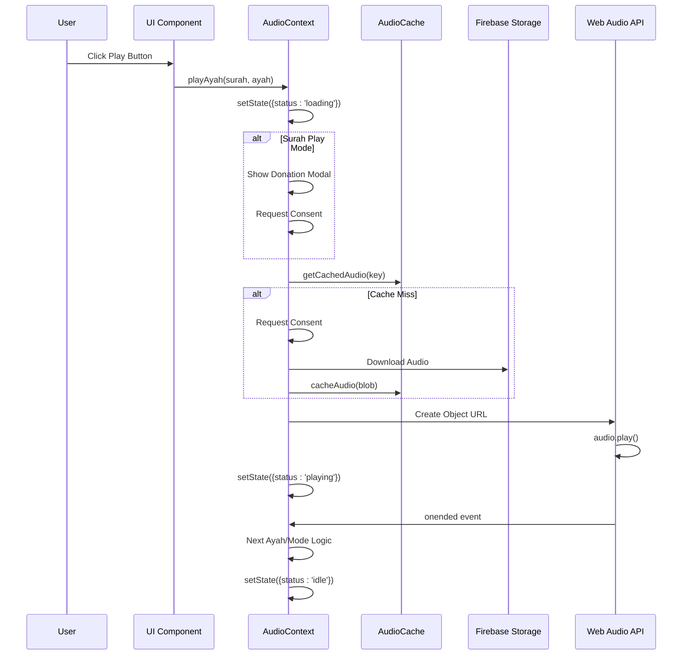
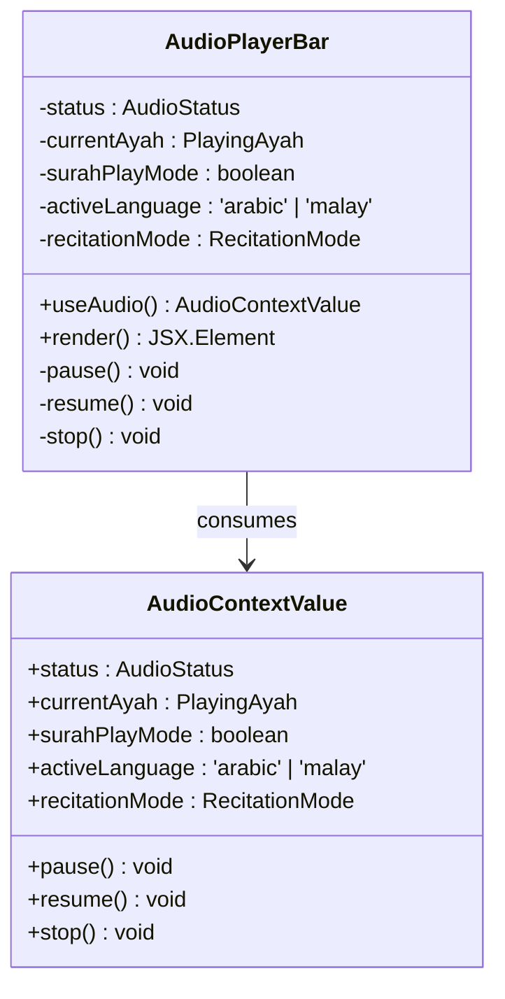
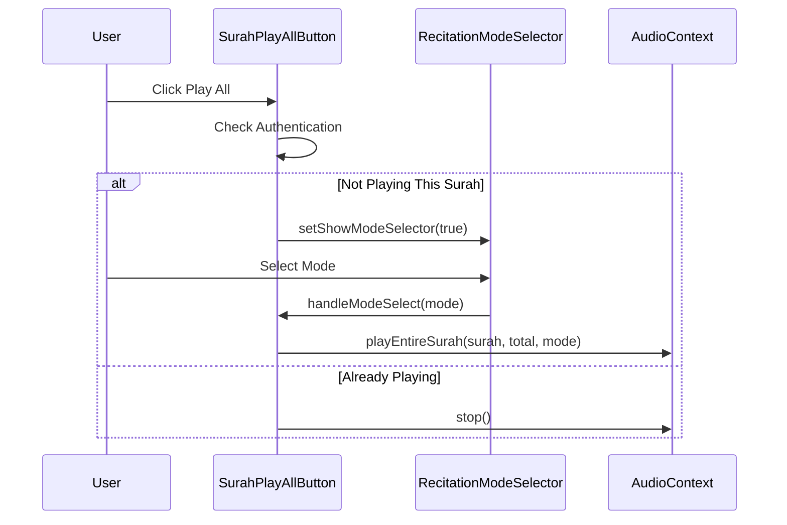
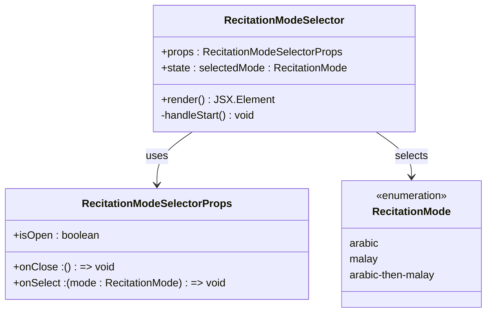
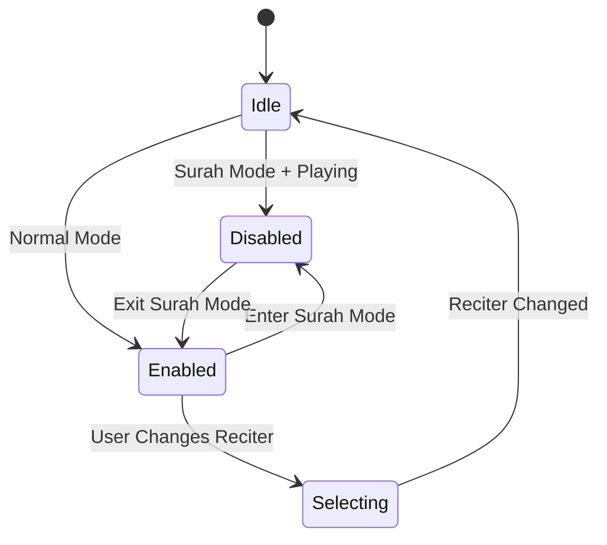
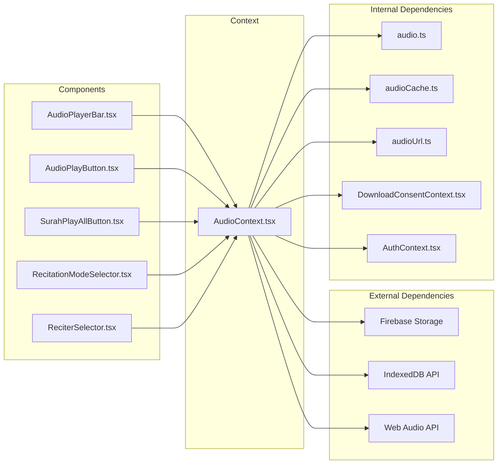
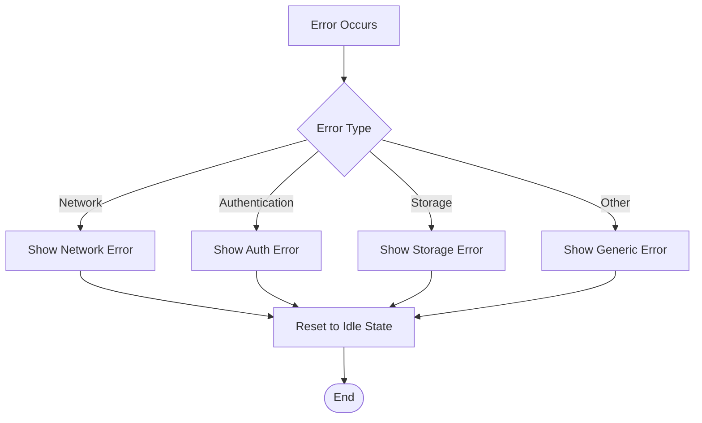

# Audio Player Components

<cite>
**Referenced Files in This Document**
- [AudioPlayerBar.tsx](file://src/components/AudioPlayerBar.tsx)
- [AudioPlayButton.tsx](file://src/components/AudioPlayButton.tsx)
- [SurahPlayAllButton.tsx](file://src/components/SurahPlayAllButton.tsx)
- [RecitationModeSelector.tsx](file://src/components/RecitationModeSelector.tsx)
- [ReciterSelector.tsx](file://src/components/ReciterSelector.tsx)
- [AudioContext.tsx](file://src/context/AudioContext.tsx)
- [AudioContext.tsx](file://src/context/AudioContext.tsx)
- [audio.ts](file://src/types/audio.ts)
- [audioCache.ts](file://src/utils/audioCache.ts)
- [audioUrl.ts](file://src/utils/audioUrl.ts)
- [DownloadConsentContext.tsx](file://src/context/DownloadConsentContext.tsx)
- [AuthContext.tsx](file://src/context/AuthContext.tsx)
- [App.tsx](file://src/App.tsx)
</cite>

## Table of Contents
1. [Introduction](#introduction)
2. [Project Structure](#project-structure)
3. [Core Components](#core-components)
4. [Architecture Overview](#architecture-overview)
5. [Detailed Component Analysis](#detailed-component-analysis)
6. [Dependency Analysis](#dependency-analysis)
7. [Performance Considerations](#performance-considerations)
8. [Troubleshooting Guide](#troubleshooting-guide)
9. [Conclusion](#conclusion)

## Introduction
This document provides comprehensive documentation for the audio player components in the Quran application. It covers the persistent audio player bar, individual ayah playback controls, bulk surah playback functionality, recitation mode selection, and reciter selection. The documentation explains audio state management, error handling mechanisms, and user experience patterns implemented across these components.

## Project Structure
The audio player system is organized around a centralized React context that manages audio state and playback logic, with several UI components that consume this context:



**Diagram sources**
- [App.tsx:42-55](file://src/App.tsx#L42-L55)
- [AudioContext.tsx:40-389](file://src/context/AudioContext.tsx#L40-L389)

**Section sources**
- [App.tsx:1-56](file://src/App.tsx#L1-L56)
- [AudioContext.tsx:1-396](file://src/context/AudioContext.tsx#L1-L396)

## Core Components
The audio player system consists of five primary components that work together to provide comprehensive audio playback functionality:

### Audio State Management
The central `AudioContext` manages all audio-related state and provides methods for controlling playback. It maintains:
- Playback status (idle, loading, playing, paused, error)
- Current ayah information
- Active reciter selection
- Surah play mode flag
- Recitation mode (Arabic, Malay, or sequential)
- Active language during sequential playback

### Persistent Audio Player Bar
The `AudioPlayerBar` component provides a fixed-position player that remains visible during navigation. It displays current playback information, shows loading states, handles play/pause/stop controls, and integrates with the reciter selector.

### Individual Ayah Playback Button
The `AudioPlayButton` enables users to play individual ayahs with contextual state management. It handles authentication requirements, loading states, and integrates with the global audio context.

### Bulk Surah Playback Button
The `SurahPlayAllButton` allows users to play entire surahs with configurable recitation modes. It includes a modal selector for choosing between Arabic-only, Malay-only, or sequential Arabic-Malay playback.

### Recitation Mode Selector
The `RecitationModeSelector` provides a modal interface for selecting playback modes, including Arabic-only, Malay-only, and Arabic-then-Malay sequential modes with detailed descriptions.

### Reciter Selector
The `ReciterSelector` allows users to change the reciter while maintaining playback continuity, with appropriate disabling during surah play mode.

**Section sources**
- [AudioContext.tsx:29-38](file://src/context/AudioContext.tsx#L29-L38)
- [AudioPlayerBar.tsx:4-85](file://src/components/AudioPlayerBar.tsx#L4-L85)
- [AudioPlayButton.tsx:9-68](file://src/components/AudioPlayButton.tsx#L9-L68)
- [SurahPlayAllButton.tsx:12-83](file://src/components/SurahPlayAllButton.tsx#L12-L83)
- [RecitationModeSelector.tsx:16-75](file://src/components/RecitationModeSelector.tsx#L16-L75)
- [ReciterSelector.tsx:4-31](file://src/components/ReciterSelector.tsx#L4-L31)

## Architecture Overview
The audio system follows a unidirectional data flow pattern with centralized state management:



**Diagram sources**
- [AudioContext.tsx:68-305](file://src/context/AudioContext.tsx#L68-L305)
- [audioCache.ts:46-60](file://src/utils/audioCache.ts#L46-L60)
- [audioUrl.ts:13-22](file://src/utils/audioUrl.ts#L13-L22)

The architecture implements several key patterns:
- **Centralized State Management**: All audio state is managed in a single context
- **Event-Driven Playback**: Uses Web Audio API events for seamless transitions
- **Progressive Enhancement**: Supports offline playback through caching
- **User Control**: Provides granular control over playback modes and reciters

## Detailed Component Analysis

### AudioPlayerBar Component
The persistent audio player bar serves as the central hub for audio playback controls:



**Diagram sources**
- [AudioPlayerBar.tsx:4-85](file://src/components/AudioPlayerBar.tsx#L4-L85)
- [AudioContext.tsx:16-25](file://src/context/AudioContext.tsx#L16-L25)

Key features:
- **Persistent Positioning**: Fixed at bottom of screen with z-index for visibility
- **Conditional Rendering**: Only renders when audio is active
- **Multi-language Badge**: Shows active language during sequential playback
- **Surah Mode Indicator**: Displays "Complete Surah" badge during bulk playback
- **Loading States**: Visual feedback during audio initialization
- **Error Handling**: Displays user-friendly error messages

**Section sources**
- [AudioPlayerBar.tsx:14-83](file://src/components/AudioPlayerBar.tsx#L14-L83)

### AudioPlayButton Component
Individual ayah playback with authentication integration:

```mermaid
flowchart TD
Start([User Click]) --> CheckAuth{User Authenticated?}
CheckAuth --> |No| ShowAlert[Show Login Alert]
CheckAuth --> |Yes| CheckState{Current Ayah Playing?}
CheckState --> |Yes & Playing| Pause[Call pause()]
CheckState --> |Yes & Paused| Resume[Call resume()]
CheckState --> |No| PlayAyah[Call playAyah(surah, ayah)]
ShowAlert --> End([End])
Pause --> End
Resume --> End
PlayAyah --> End
```

**Diagram sources**
- [AudioPlayButton.tsx:22-35](file://src/components/AudioPlayButton.tsx#L22-L35)

Implementation highlights:
- **Authentication Guard**: Prevents playback without user authentication
- **State Awareness**: Detects if the clicked ayah is currently playing
- **Visual Feedback**: Changes appearance based on playback state
- **Loading Indicators**: Shows spinner during audio preparation
- **Accessibility**: Proper ARIA labels for screen readers

**Section sources**
- [AudioPlayButton.tsx:9-68](file://src/components/AudioPlayButton.tsx#L9-L68)

### SurahPlayAllButton Component
Bulk surah playback with mode selection:



**Diagram sources**
- [SurahPlayAllButton.tsx:22-38](file://src/components/SurahPlayAllButton.tsx#L22-L38)
- [RecitationModeSelector.tsx:21-23](file://src/components/RecitationModeSelector.tsx#L21-L23)

Key functionality:
- **Mode Selection**: Integrates with recitation mode selector
- **Surah Detection**: Identifies if the same surah is already playing
- **Stop Capability**: Allows stopping current playback
- **Authentication Integration**: Requires user login for all operations
- **Visual State Management**: Changes button appearance based on playback state

**Section sources**
- [SurahPlayAllButton.tsx:12-83](file://src/components/SurahPlayAllButton.tsx#L12-L83)

### RecitationModeSelector Component
Modal interface for choosing playback modes:



**Diagram sources**
- [RecitationModeSelector.tsx:4-8](file://src/components/RecitationModeSelector.tsx#L4-L8)
- [audio.ts:1-7](file://src/types/audio.ts#L1-L7)

Supported modes:
- **Arabic-only**: Traditional Arabic recitation
- **Malay-only**: Malay translation recitation
- **Arabic-then-Malay**: Sequential playback with language switching

**Section sources**
- [RecitationModeSelector.tsx:16-75](file://src/components/RecitationModeSelector.tsx#L16-L75)

### ReciterSelector Component
Multi-reciter support with language-aware selection:



**Diagram sources**
- [ReciterSelector.tsx:7-8](file://src/components/ReciterSelector.tsx#L7-L8)

Features:
- **Language-Aware Selection**: Automatically selects reciter based on active language
- **Mode Integration**: Disables during surah play mode to prevent conflicts
- **Immediate Effect**: Changes take effect immediately without interrupting playback
- **User Control**: Allows switching between available reciters

**Section sources**
- [ReciterSelector.tsx:4-31](file://src/components/ReciterSelector.tsx#L4-L31)

## Dependency Analysis
The audio system has well-defined dependencies that support modularity and maintainability:



**Diagram sources**
- [AudioContext.tsx:1-14](file://src/context/AudioContext.tsx#L1-L14)
- [audioCache.ts:1-10](file://src/utils/audioCache.ts#L1-L10)
- [audioUrl.ts:1-3](file://src/utils/audioUrl.ts#L1-L3)

Key dependency relationships:
- **Type Safety**: Strong typing through TypeScript interfaces
- **Caching Layer**: Independent cache utility for offline support
- **Storage Integration**: Direct Firebase Storage integration
- **Consent Management**: Separate consent context for user permissions
- **Authentication**: User authentication requirement for downloads

**Section sources**
- [AudioContext.tsx:1-14](file://src/context/AudioContext.tsx#L1-L14)
- [audio.ts:1-41](file://src/types/audio.ts#L1-L41)

## Performance Considerations
The audio system implements several performance optimizations:

### Caching Strategy
- **IndexedDB Storage**: Local caching eliminates repeated downloads
- **Cache Keys**: Structured keys based on reciter, language, surah, and ayah
- **Background Downloads**: Surah downloads occur asynchronously
- **Cache Validation**: Automatic cache size monitoring and cleanup

### Network Optimization
- **Progressive Loading**: Audio streams while downloading completes
- **Bandwidth Conservation**: ~50-80KB per ayah cache size
- **Connection Resilience**: Graceful handling of network failures
- **Lazy Loading**: Audio only downloaded when needed

### Memory Management
- **Audio Element Lifecycle**: Proper cleanup of audio resources
- **Event Handler Management**: Cleanup of audio event listeners
- **State Refs**: Stable references for event handler closures
- **Resource Cleanup**: Proper disposal of object URLs

## Troubleshooting Guide

### Common Issues and Solutions

**Audio Fails to Load**
- Verify internet connection and Firebase Storage accessibility
- Check user authentication status
- Review browser console for specific error messages
- Ensure sufficient storage space for caching

**Playback Stops Unexpectedly**
- Check for audio permission restrictions
- Verify IndexedDB availability and quota
- Monitor for JavaScript errors in console
- Confirm reciter availability and language support

**Surah Download Issues**
- Verify user consent acceptance
- Check donation modal completion
- Ensure sufficient user authentication
- Monitor Firebase Storage quotas

**State Synchronization Problems**
- Verify context provider wrapping
- Check for proper hook usage
- Ensure consistent state updates
- Monitor for race conditions

### Error Handling Patterns
The system implements comprehensive error handling:



**Diagram sources**
- [AudioContext.tsx:216-229](file://src/context/AudioContext.tsx#L216-L229)

**Section sources**
- [AudioContext.tsx:216-229](file://src/context/AudioContext.tsx#L216-L229)
- [AudioContext.tsx:294-300](file://src/context/AudioContext.tsx#L294-L300)

## Conclusion
The audio player components provide a robust, user-friendly audio playback system for the Quran application. The implementation demonstrates excellent separation of concerns through the centralized context pattern, comprehensive error handling, and thoughtful user experience design. The system successfully balances functionality with performance through intelligent caching, progressive enhancement, and responsive UI patterns.

Key strengths include:
- **Modular Architecture**: Well-separated concerns with clear component boundaries
- **User Experience**: Intuitive controls with appropriate feedback
- **Performance**: Efficient caching and resource management
- **Accessibility**: Proper ARIA labels and keyboard navigation support
- **Extensibility**: Clean interfaces for adding new features

The system provides a solid foundation for future enhancements while maintaining reliability and performance across various user scenarios.