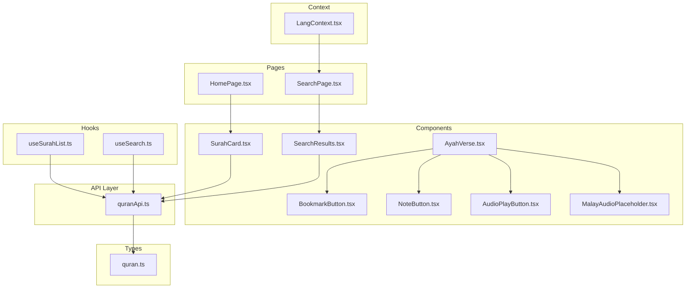
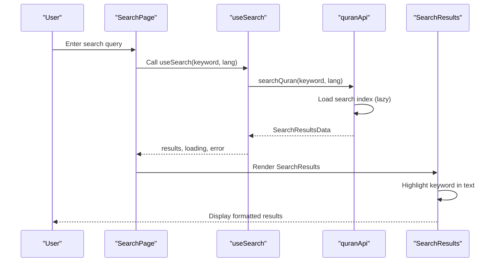
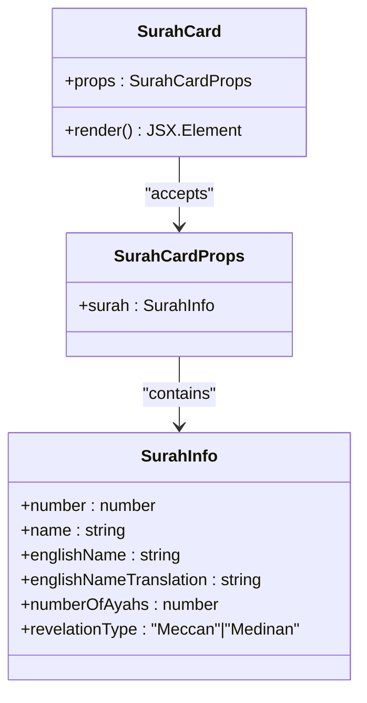
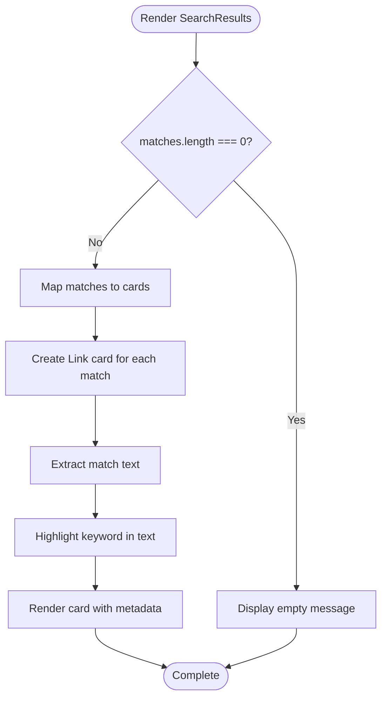
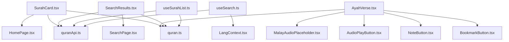

# Content Display Components

<cite>
**Referenced Files in This Document**
- [SurahCard.tsx](file://src/components/SurahCard.tsx)
- [AyahVerse.tsx](file://src/components/AyahVerse.tsx)
- [SearchResults.tsx](file://src/components/SearchResults.tsx)
- [quran.ts](file://src/types/quran.ts)
- [useSurahList.ts](file://src/hooks/useSurahList.ts)
- [useSearch.ts](file://src/hooks/useSearch.ts)
- [quranApi.ts](file://src/api/quranApi.ts)
- [HomePage.tsx](file://src/pages/HomePage.tsx)
- [SearchPage.tsx](file://src/pages/SearchPage.tsx)
- [BookmarkButton.tsx](file://src/components/BookmarkButton.tsx)
- [NoteButton.tsx](file://src/components/NoteButton.tsx)
- [AudioPlayButton.tsx](file://src/components/AudioPlayButton.tsx)
- [MalayAudioPlaceholder.tsx](file://src/components/MalayAudioPlaceholder.tsx)
- [LangContext.tsx](file://src/context/LangContext.tsx)
</cite>

## Table of Contents
1. [Introduction](#introduction)
2. [Project Structure](#project-structure)
3. [Core Components](#core-components)
4. [Architecture Overview](#architecture-overview)
5. [Detailed Component Analysis](#detailed-component-analysis)
6. [Dependency Analysis](#dependency-analysis)
7. [Performance Considerations](#performance-considerations)
8. [Troubleshooting Guide](#troubleshooting-guide)
9. [Conclusion](#conclusion)

## Introduction
This document provides comprehensive documentation for three key content display components in the Quran application: SurahCard, AyahVerse, and SearchResults. These components form the backbone of the application's user interface for displaying Quranic content, enabling users to browse Surahs, read individual verses with translations, and search through the Quran text. The documentation covers component architecture, prop interfaces, state management, visual design, interactive behaviors, and performance considerations.

## Project Structure
The content display components are organized within the components directory and integrate with hooks, APIs, and context providers to deliver a cohesive user experience. The components rely on shared types and utilities to ensure type safety and consistent behavior across the application.



**Diagram sources**
- [SurahCard.tsx:1-42](file://src/components/SurahCard.tsx#L1-L42)
- [AyahVerse.tsx:1-63](file://src/components/AyahVerse.tsx#L1-L63)
- [SearchResults.tsx:1-55](file://src/components/SearchResults.tsx#L1-L55)
- [useSurahList.ts:1-47](file://src/hooks/useSurahList.ts#L1-L47)
- [useSearch.ts:1-37](file://src/hooks/useSearch.ts#L1-L37)
- [quranApi.ts:1-51](file://src/api/quranApi.ts#L1-L51)
- [quran.ts:1-64](file://src/types/quran.ts#L1-L64)
- [HomePage.tsx:1-44](file://src/pages/HomePage.tsx#L1-L44)
- [SearchPage.tsx:1-47](file://src/pages/SearchPage.tsx#L1-L47)
- [LangContext.tsx:1-32](file://src/context/LangContext.tsx#L1-L32)

**Section sources**
- [SurahCard.tsx:1-42](file://src/components/SurahCard.tsx#L1-L42)
- [AyahVerse.tsx:1-63](file://src/components/AyahVerse.tsx#L1-L63)
- [SearchResults.tsx:1-55](file://src/components/SearchResults.tsx#L1-L55)
- [quran.ts:1-64](file://src/types/quran.ts#L1-L64)
- [useSurahList.ts:1-47](file://src/hooks/useSurahList.ts#L1-L47)
- [useSearch.ts:1-37](file://src/hooks/useSearch.ts#L1-L37)
- [quranApi.ts:1-51](file://src/api/quranApi.ts#L1-L51)
- [HomePage.tsx:1-44](file://src/pages/HomePage.tsx#L1-L44)
- [SearchPage.tsx:1-47](file://src/pages/SearchPage.tsx#L1-L47)
- [LangContext.tsx:1-32](file://src/context/LangContext.tsx#L1-L32)

## Core Components
This section introduces the three primary content display components and their roles within the application.

- SurahCard: Presents Surah information in a card layout with navigation to the Surah detail page.
- AyahVerse: Renders a single verse with Arabic text, transliteration, translation, and interactive controls.
- SearchResults: Formats and displays search results with highlighting and navigation integration.

**Section sources**
- [SurahCard.tsx:4-41](file://src/components/SurahCard.tsx#L4-L41)
- [AyahVerse.tsx:14-62](file://src/components/AyahVerse.tsx#L14-L62)
- [SearchResults.tsx:19-54](file://src/components/SearchResults.tsx#L19-L54)

## Architecture Overview
The components operate within a layered architecture:
- Presentation Layer: Components render UI and manage local state.
- Business Logic Layer: Hooks encapsulate data fetching and caching logic.
- Data Access Layer: API module handles client-side search indexing and Surah data retrieval.
- Shared Types: Type definitions ensure consistency across components and hooks.



**Diagram sources**
- [SearchPage.tsx:7-11](file://src/pages/SearchPage.tsx#L7-L11)
- [useSearch.ts:6-35](file://src/hooks/useSearch.ts#L6-L35)
- [quranApi.ts:43-50](file://src/api/quranApi.ts#L43-L50)
- [SearchResults.tsx:19-54](file://src/components/SearchResults.tsx#L19-L54)

## Detailed Component Analysis

### SurahCard Component
SurahCard renders a single Surah entry as a navigable card. It displays the Surah number, English name, English translation, revelation type, number of verses, and the Arabic name. Clicking the card navigates to the Surah detail page.

Key characteristics:
- Navigation: Uses react-router-dom Link to navigate to `/surah/{surah.number}`.
- Visual Design: Responsive layout with rounded corners, subtle shadows, hover effects, and color-coded badges for revelation type.
- Typography: Arabic text rendered with RTL direction and specialized font class.
- Props Interface: Accepts a single prop `surah` of type `SurahInfo`.



**Diagram sources**
- [SurahCard.tsx:4-41](file://src/components/SurahCard.tsx#L4-L41)
- [quran.ts:1-8](file://src/types/quran.ts#L1-L8)

Interactive behaviors:
- Hover effects: Shadow enhancement and background color change on hover.
- Overflow handling: Prevents content overflow with overflow-hidden on the container.

Responsive design considerations:
- Grid layout in HomePage adapts to different screen sizes using Tailwind classes (sm: grid-cols-2, lg: grid-cols-3).
- Typography scales appropriately with text size utilities.

State management:
- SurahCard itself is stateless; state is managed in the parent component (HomePage) via useSurahList hook.

Accessibility:
- Proper ARIA labels and semantic HTML structure for links and spans.

**Section sources**
- [SurahCard.tsx:4-41](file://src/components/SurahCard.tsx#L4-L41)
- [quran.ts:1-8](file://src/types/quran.ts#L1-L8)
- [HomePage.tsx:35-40](file://src/pages/HomePage.tsx#L35-L40)

### AyahVerse Component
AyahVerse renders a single verse with associated metadata and interactive controls. It displays the Ayah number, Arabic text, transliteration, and translation, along with action buttons for audio playback, Malay audio, bookmarks, and notes.

Key characteristics:
- Props Interface: Accepts four props: `arabicAyah`, `transliterationAyah`, `translationAyah`, and `surahNumber`.
- Action Buttons: Integrates BookmarkButton, NoteButton, AudioPlayButton, and MalayAudioPlaceholder.
- Typography: Arabic text rendered with RTL direction and specialized font class; transliteration and translation with distinct styles.

```mermaid
classDiagram
class AyahVerse {
+props : AyahVerseProps
+render() JSX.Element
}
class AyahVerseProps {
+arabicAyah : Ayah
+transliterationAyah : Ayah
+translationAyah : Ayah
+surahNumber : number
}
class Ayah {
+number : number
+text : string
+numberInSurah : number
+juz : number
+page : number
+sajda : boolean|{id, recommended, obligatory}
}
AyahVerse --> AyahVerseProps : "accepts"
AyahVerseProps --> Ayah : "contains"
```

**Diagram sources**
- [AyahVerse.tsx:7-12](file://src/components/AyahVerse.tsx#L7-L12)
- [quran.ts:10-17](file://src/types/quran.ts#L10-L17)

Rendering pipeline:
- Ayah number badge: Displays the verse number within the Surah.
- Action bar: Contains audio controls and annotation buttons.
- Arabic text: Large, right-aligned Arabic text with RTL direction.
- Transliteration: Italicized Rumi transliteration text.
- Translation: Standard translation text.

Interactive behaviors:
- AudioPlayButton: Toggles playback state for the selected Ayah.
- MalayAudioPlaceholder: Plays Malay recitation without changing global reciter.
- BookmarkButton: Adds/removes bookmarks for the current Ayah.
- NoteButton: Opens modal to create/edit/delete notes for the current Ayah.

State management:
- AyahVerse manages no internal state; all state is handled by the parent component and integrated hooks.

Accessibility:
- Proper ARIA labels for buttons and directional attributes for Arabic text.

**Section sources**
- [AyahVerse.tsx:14-62](file://src/components/AyahVerse.tsx#L14-L62)
- [quran.ts:10-17](file://src/types/quran.ts#L10-L17)
- [AudioPlayButton.tsx:9-68](file://src/components/AudioPlayButton.tsx#L9-L68)
- [MalayAudioPlaceholder.tsx:10-73](file://src/components/MalayAudioPlaceholder.tsx#L10-L73)
- [BookmarkButton.tsx:10-48](file://src/components/BookmarkButton.tsx#L10-L48)
- [NoteButton.tsx:10-113](file://src/components/NoteButton.tsx#L10-L113)

### SearchResults Component
SearchResults formats and displays search results with keyword highlighting and navigation integration. It transforms raw match data into clickable cards that link to the specific Surah and Ayah.

Key characteristics:
- Props Interface: Accepts `matches` (SearchMatch[]) and `keyword` (string).
- Highlighting: Implements client-side text highlighting using regex splitting.
- Navigation: Links to `/surah/{surah.number}#ayah-{numberInSurah}` for direct anchor navigation.
- Empty State: Displays a friendly message when no results are found.



**Diagram sources**
- [SearchResults.tsx:19-54](file://src/components/SearchResults.tsx#L19-L54)

Highlighting algorithm:
- Escapes special regex characters to prevent injection.
- Splits text by keyword occurrences.
- Wraps matched segments in mark elements with highlighting styles.

Navigation integration:
- Uses react-router-dom Link to navigate to the exact Ayah position within a Surah.
- Anchor fragments enable precise scrolling to the matched verse.

Performance considerations:
- Client-side search with pre-built indexes reduces server load.
- Debounced search via useSearch hook prevents excessive API calls.

**Section sources**
- [SearchResults.tsx:4-17](file://src/components/SearchResults.tsx#L4-L17)
- [SearchResults.tsx:19-54](file://src/components/SearchResults.tsx#L19-L54)
- [quran.ts:47-52](file://src/types/quran.ts#L47-L52)

## Dependency Analysis
The components share dependencies on shared types and integrate with hooks and APIs for data management.



**Diagram sources**
- [SurahCard.tsx:1-2](file://src/components/SurahCard.tsx#L1-L2)
- [AyahVerse.tsx:1-5](file://src/components/AyahVerse.tsx#L1-L5)
- [SearchResults.tsx:1-2](file://src/components/SearchResults.tsx#L1-L2)
- [useSurahList.ts:1-3](file://src/hooks/useSurahList.ts#L1-L3)
- [useSearch.ts:1-4](file://src/hooks/useSearch.ts#L1-L4)
- [quranApi.ts:1-2](file://src/api/quranApi.ts#L1-L2)
- [quran.ts:1-64](file://src/types/quran.ts#L1-L64)
- [HomePage.tsx:1-2](file://src/pages/HomePage.tsx#L1-L2)
- [SearchPage.tsx:1-3](file://src/pages/SearchPage.tsx#L1-L3)
- [LangContext.tsx:1-3](file://src/context/LangContext.tsx#L1-L3)

**Section sources**
- [SurahCard.tsx:1-2](file://src/components/SurahCard.tsx#L1-L2)
- [AyahVerse.tsx:1-5](file://src/components/AyahVerse.tsx#L1-L5)
- [SearchResults.tsx:1-2](file://src/components/SearchResults.tsx#L1-L2)
- [useSurahList.ts:1-3](file://src/hooks/useSurahList.ts#L1-L3)
- [useSearch.ts:1-4](file://src/hooks/useSearch.ts#L1-L4)
- [quranApi.ts:1-2](file://src/api/quranApi.ts#L1-L2)
- [quran.ts:1-64](file://src/types/quran.ts#L1-L64)
- [HomePage.tsx:1-2](file://src/pages/HomePage.tsx#L1-L2)
- [SearchPage.tsx:1-3](file://src/pages/SearchPage.tsx#L1-L3)
- [LangContext.tsx:1-3](file://src/context/LangContext.tsx#L1-L3)

## Performance Considerations
- Client-side search: Pre-built indexes reduce network requests and improve responsiveness.
- Lazy loading: Search index is loaded only when needed and cached for subsequent searches.
- Debouncing: Search requests are debounced to minimize API calls during rapid typing.
- Caching: Surah lists are cached to avoid repeated network requests.
- Minimal re-renders: Components are designed to be stateless where possible, relying on parent state management.

## Troubleshooting Guide
Common issues and resolutions:
- Empty search results: Verify that the search index is loaded and the keyword is not empty.
- Navigation failures: Ensure that Surah and Ayah numbers are valid and that the target anchor exists.
- Audio playback issues: Confirm user authentication and that the audio context is properly initialized.
- Bookmark/Note functionality: Verify user authentication and that the note/bookmark hooks are functioning correctly.

**Section sources**
- [useSearch.ts:11-33](file://src/hooks/useSearch.ts#L11-L33)
- [quranApi.ts:21-41](file://src/api/quranApi.ts#L21-L41)
- [AudioPlayButton.tsx:22-35](file://src/components/AudioPlayButton.tsx#L22-L35)
- [BookmarkButton.tsx:16-33](file://src/components/BookmarkButton.tsx#L16-L33)
- [NoteButton.tsx:40-57](file://src/components/NoteButton.tsx#L40-L57)

## Conclusion
The SurahCard, AyahVerse, and SearchResults components provide a robust foundation for displaying Quranic content. They leverage shared types, hooks, and APIs to deliver a responsive, accessible, and performant user experience. The components are designed with clear separation of concerns, minimal state management, and efficient data handling to support smooth navigation and interaction across the application.