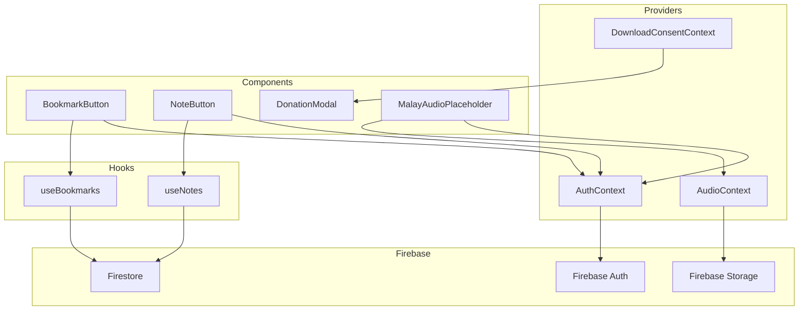
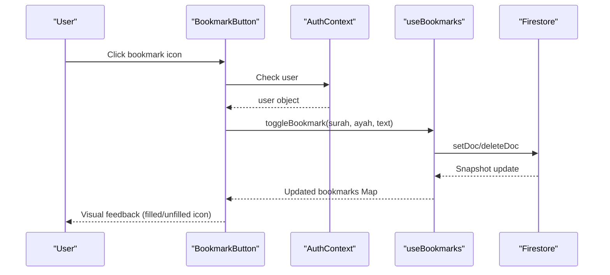
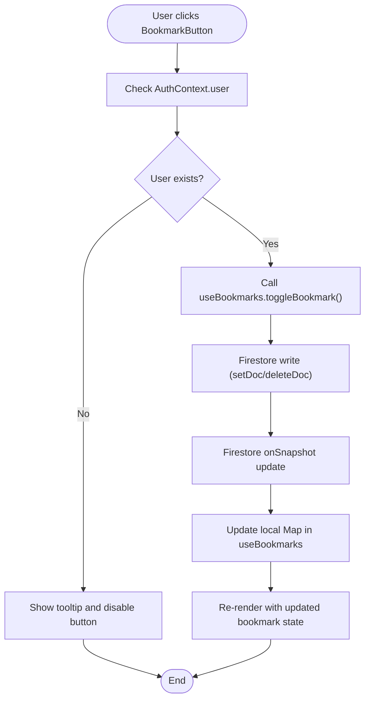
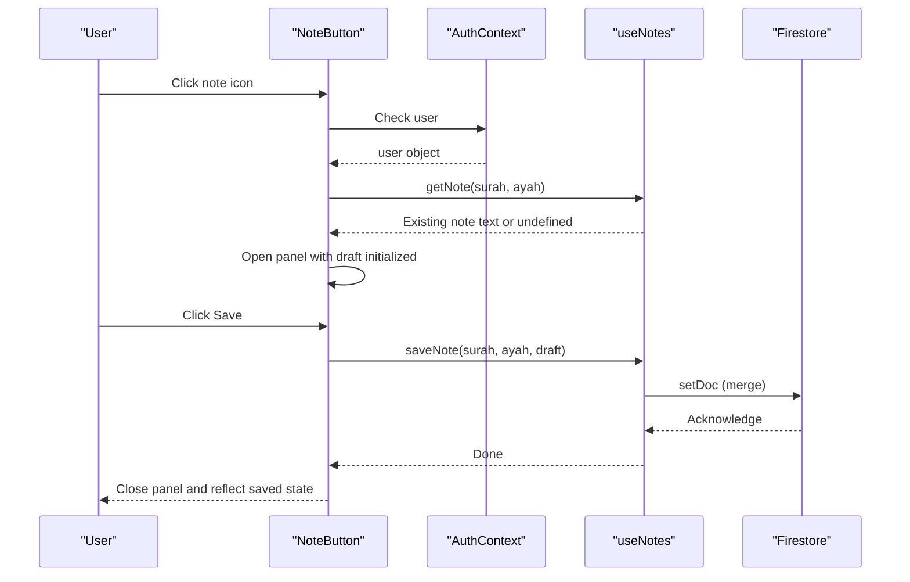
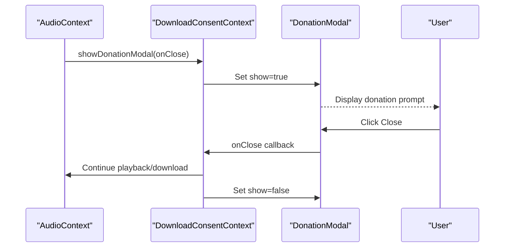
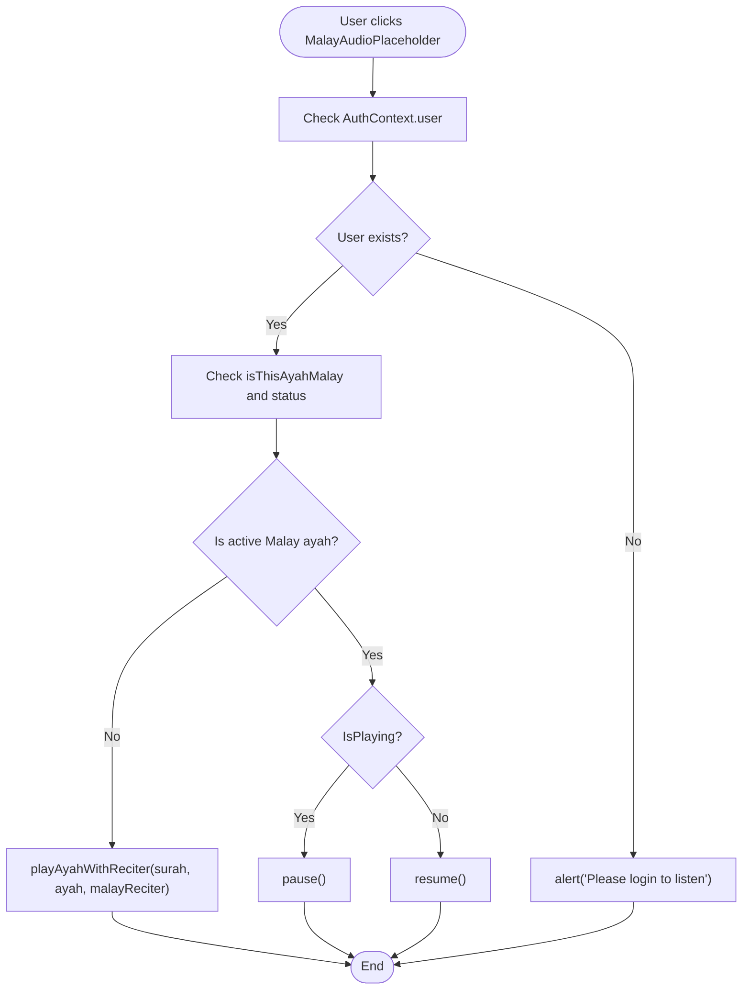
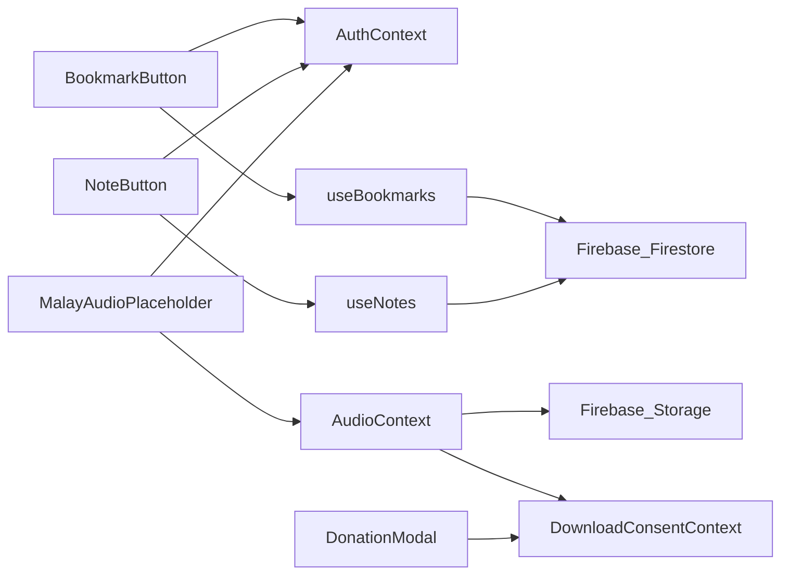

# Interactive Components

<cite>
**Referenced Files in This Document**
- [BookmarkButton.tsx](file://src/components/BookmarkButton.tsx)
- [NoteButton.tsx](file://src/components/NoteButton.tsx)
- [DonationModal.tsx](file://src/components/DonationModal.tsx)
- [MalayAudioPlaceholder.tsx](file://src/components/MalayAudioPlaceholder.tsx)
- [useBookmarks.ts](file://src/hooks/useBookmarks.ts)
- [useNotes.ts](file://src/hooks/useNotes.ts)
- [AuthContext.tsx](file://src/context/AuthContext.tsx)
- [AudioContext.tsx](file://src/context/AudioContext.tsx)
- [DownloadConsentContext.tsx](file://src/context/DownloadConsentContext.tsx)
- [firebase.ts](file://src/lib/firebase.ts)
- [firebase.ts (types)](file://src/types/firebase.ts)
- [audio.ts](file://src/types/audio.ts)
- [App.tsx](file://src/App.tsx)
- [SurahPage.tsx](file://src/pages/SurahPage.tsx)
</cite>

## Table of Contents
1. [Introduction](#introduction)
2. [Project Structure](#project-structure)
3. [Core Components](#core-components)
4. [Architecture Overview](#architecture-overview)
5. [Detailed Component Analysis](#detailed-component-analysis)
6. [Dependency Analysis](#dependency-analysis)
7. [Performance Considerations](#performance-considerations)
8. [Accessibility Considerations](#accessibility-considerations)
9. [Troubleshooting Guide](#troubleshooting-guide)
10. [Conclusion](#conclusion)

## Introduction
This document provides comprehensive documentation for four interactive components: BookmarkButton, NoteButton, DonationModal, and MalayAudioPlaceholder. It explains their functionality, user interaction patterns, state management, data persistence, and integration with the broader application architecture. Special attention is given to bookmark creation/removal, note-taking interface and persistence, donation flow and user engagement patterns, and the Malay audio fallback UI for missing audio content.

## Project Structure
The interactive components are part of a React application that integrates Firebase for authentication and Firestore for data persistence. The application uses React Context providers to manage global state for authentication, audio playback, and download consent. Components are organized by feature and responsibility, with hooks encapsulating data fetching and persistence logic.

**Diagram sources**
- [App.tsx:42-55](file://src/App.tsx#L42-L55)
- [AuthContext.tsx:20-56](file://src/context/AuthContext.tsx#L20-L56)
- [AudioContext.tsx:40-389](file://src/context/AudioContext.tsx#L40-L389)
- [DownloadConsentContext.tsx:16-248](file://src/context/DownloadConsentContext.tsx#L16-L248)
- [BookmarkButton.tsx:10-48](file://src/components/BookmarkButton.tsx#L10-L48)
- [NoteButton.tsx:10-113](file://src/components/NoteButton.tsx#L10-L113)
- [MalayAudioPlaceholder.tsx:10-73](file://src/components/MalayAudioPlaceholder.tsx#L10-L73)
- [useBookmarks.ts:23-87](file://src/hooks/useBookmarks.ts#L23-L87)
- [useNotes.ts:24-91](file://src/hooks/useNotes.ts#L24-L91)

**Section sources**
- [App.tsx:42-55](file://src/App.tsx#L42-L55)
- [SurahPage.tsx:83-92](file://src/pages/SurahPage.tsx#L83-L92)

## Core Components
This section introduces each component's purpose and primary responsibilities:
- BookmarkButton: Allows authenticated users to add or remove bookmarks for specific Quran verses.
- NoteButton: Provides a compact interface for adding, editing, saving, and deleting personal notes associated with a verse.
- DonationModal: Presents a non-intrusive donation prompt to support continued service delivery.
- MalayAudioPlaceholder: Offers a localized Malay audio playback control for the current verse when applicable.

**Section sources**
- [BookmarkButton.tsx:10-48](file://src/components/BookmarkButton.tsx#L10-L48)
- [NoteButton.tsx:10-113](file://src/components/NoteButton.tsx#L10-L113)
- [DonationModal.tsx:8-74](file://src/components/DonationModal.tsx#L8-L74)
- [MalayAudioPlaceholder.tsx:10-73](file://src/components/MalayAudioPlaceholder.tsx#L10-L73)

## Architecture Overview
The components integrate with React Context providers and Firebase services to deliver a cohesive user experience:
- Authentication state drives component visibility and enables/disables actions.
- Hooks subscribe to Firestore snapshots for real-time updates to bookmarks and notes.
- AudioContext manages audio playback, caching, and consent flows, including donation modal triggers.
- DownloadConsentContext coordinates user consent and donation prompts during downloads.

**Diagram sources**
- [BookmarkButton.tsx:10-48](file://src/components/BookmarkButton.tsx#L10-L48)
- [AuthContext.tsx:58-62](file://src/context/AuthContext.tsx#L58-L62)
- [useBookmarks.ts:29-55](file://src/hooks/useBookmarks.ts#L29-L55)
- [useBookmarks.ts:61-84](file://src/hooks/useBookmarks.ts#L61-L84)

## Detailed Component Analysis

### BookmarkButton
BookmarkButton enables authenticated users to create or remove bookmarks for specific Quran verses. It synchronizes its visual state with Firestore via a hook that subscribes to real-time updates.

Key behaviors:
- Disabled state for non-authenticated users with a tooltip prompting login.
- Conditional rendering of bookmark icon filled/unfilled based on current bookmark state.
- Toggle action writes or deletes a document in the user's bookmarks collection.

State management and persistence:
- Uses AuthContext to guard actions and derive user identity.
- Delegates bookmark checks and toggling to useBookmarks, which maintains a local Map and subscribes to Firestore snapshots.
- Document ID follows a deterministic convention combining surah and ayah numbers.

Accessibility:
- Uses aria-labels indicating current action ("Add bookmark" or "Remove bookmark").
- Disabled state communicates non-interactive state.

**Diagram sources**
- [BookmarkButton.tsx:10-48](file://src/components/BookmarkButton.tsx#L10-L48)
- [useBookmarks.ts:29-55](file://src/hooks/useBookmarks.ts#L29-L55)
- [useBookmarks.ts:61-84](file://src/hooks/useBookmarks.ts#L61-L84)

**Section sources**
- [BookmarkButton.tsx:10-48](file://src/components/BookmarkButton.tsx#L10-L48)
- [useBookmarks.ts:23-87](file://src/hooks/useBookmarks.ts#L23-L87)
- [firebase.ts:8-10](file://src/lib/firebase.ts#L8-L10)
- [firebase.ts (types):15-19](file://src/types/firebase.ts#L15-L19)

### NoteButton
NoteButton provides a compact, inline interface for managing notes associated with a specific verse. It supports opening a textarea, saving edits, canceling, and deleting existing notes.

User interaction pattern:
- Icon reflects presence of an existing note (filled vs empty).
- On click, opens a floating panel containing a textarea and action buttons.
- Save requires non-empty content; deletion removes the note document.

Data persistence:
- Uses useNotes hook to retrieve, save, and delete notes.
- Saves documents with a composite ID derived from surah and ayah numbers.
- Merges updates to avoid overwriting unrelated fields.

**Diagram sources**
- [NoteButton.tsx:10-113](file://src/components/NoteButton.tsx#L10-L113)
- [useNotes.ts:24-91](file://src/hooks/useNotes.ts#L24-L91)

**Section sources**
- [NoteButton.tsx:10-113](file://src/components/NoteButton.tsx#L10-L113)
- [useNotes.ts:24-91](file://src/hooks/useNotes.ts#L24-L91)
- [firebase.ts (types):8-13](file://src/types/firebase.ts#L8-L13)

### DonationModal
DonationModal presents a friendly, non-intrusive prompt encouraging users to support the project. It is triggered by DownloadConsentContext during download flows and can also be invoked programmatically.

User engagement patterns:
- Appears as a centered overlay with a supportive message and QR code.
- Provides a prominent close button to dismiss the modal.
- Integrated messaging emphasizes server costs and encourages voluntary support.

Integration:
- DownloadConsentContext controls visibility and timing of the modal.
- AudioContext triggers the modal when downloading entire surahs or when consent is required.

**Diagram sources**
- [AudioContext.tsx:86-98](file://src/context/AudioContext.tsx#L86-L98)
- [DownloadConsentContext.tsx:74-77](file://src/context/DownloadConsentContext.tsx#L74-L77)
- [DonationModal.tsx:8-74](file://src/components/DonationModal.tsx#L8-L74)

**Section sources**
- [DonationModal.tsx:8-74](file://src/components/DonationModal.tsx#L8-L74)
- [DownloadConsentContext.tsx:74-77](file://src/context/DownloadConsentContext.tsx#L74-L77)
- [AudioContext.tsx:86-98](file://src/context/AudioContext.tsx#L86-L98)

### MalayAudioPlaceholder
MalayAudioPlaceholder offers a localized Malay audio control for the currently playing ayah when the reciter language matches Malay. It allows users to play/pause/resume Malay audio without changing the global reciter selection.

User interaction:
- Button appearance changes based on active state (idle, loading, playing).
- Click toggles between play/pause/resume depending on current status.
- Disabled for non-authenticated users with a simple alert.

State management:
- Uses AudioContext to determine if the current ayah is the target and whether it is playing/loading/paused.
- Uses Malay reciter constant to trigger playback with a temporary language setting.
- Integrates with DownloadConsentContext to present donation prompts when downloading entire surahs.

**Diagram sources**
- [MalayAudioPlaceholder.tsx:10-73](file://src/components/MalayAudioPlaceholder.tsx#L10-L73)
- [AudioContext.tsx:307-323](file://src/context/AudioContext.tsx#L307-L323)
- [AudioContext.tsx:325-337](file://src/context/AudioContext.tsx#L325-L337)

**Section sources**
- [MalayAudioPlaceholder.tsx:10-73](file://src/components/MalayAudioPlaceholder.tsx#L10-L73)
- [AudioContext.tsx:307-337](file://src/context/AudioContext.tsx#L307-L337)
- [audio.ts:34-41](file://src/types/audio.ts#L34-L41)

## Dependency Analysis
The components rely on shared contexts and hooks for state and persistence. The diagram below illustrates key dependencies:

**Diagram sources**
- [BookmarkButton.tsx:1-2](file://src/components/BookmarkButton.tsx#L1-L2)
- [NoteButton.tsx:1-3](file://src/components/NoteButton.tsx#L1-L3)
- [MalayAudioPlaceholder.tsx:1-3](file://src/components/MalayAudioPlaceholder.tsx#L1-L3)
- [useBookmarks.ts:1-13](file://src/hooks/useBookmarks.ts#L1-L13)
- [useNotes.ts:1-13](file://src/hooks/useNotes.ts#L1-L13)
- [AudioContext.tsx:1-14](file://src/context/AudioContext.tsx#L1-L14)
- [DownloadConsentContext.tsx:1-10](file://src/context/DownloadConsentContext.tsx#L1-L10)
- [firebase.ts:1-11](file://src/lib/firebase.ts#L1-L11)

**Section sources**
- [firebase.ts:1-11](file://src/lib/firebase.ts#L1-L11)
- [useBookmarks.ts:1-13](file://src/hooks/useBookmarks.ts#L1-L13)
- [useNotes.ts:1-13](file://src/hooks/useNotes.ts#L1-L13)

## Performance Considerations
- Real-time subscriptions: useBookmarks and useNotes subscribe to Firestore snapshots. Ensure unsubscription occurs on user logout or component unmount to prevent memory leaks.
- Audio caching: AudioContext caches audio blobs locally to reduce repeated downloads and improve playback responsiveness.
- Conditional rendering: Components render disabled states for non-authenticated users to avoid unnecessary computations.
- Debounce/saving strategies: NoteButton disables save while saving to prevent concurrent writes.

[No sources needed since this section provides general guidance]

## Accessibility Considerations
- ARIA labels: BookmarkButton and NoteButton provide aria-labels reflecting current actions (add/remove bookmark, add/edit note).
- Focus management: NoteButton autofocuses the textarea upon opening to streamline keyboard navigation.
- Disabled states: Buttons for non-authenticated users are visually disabled and accompanied by tooltips.
- Keyboard navigation: Buttons use semantic markup enabling tab navigation and activation via Enter/Space.

**Section sources**
- [BookmarkButton.tsx:41](file://src/components/BookmarkButton.tsx#L41)
- [NoteButton.tsx:75-82](file://src/components/NoteButton.tsx#L75-L82)
- [MalayAudioPlaceholder.tsx:44](file://src/components/MalayAudioPlaceholder.tsx#L44)

## Troubleshooting Guide
Common issues and resolutions:
- Authentication barriers:
  - Symptom: BookmarkButton/NoteButton disabled with tooltip.
  - Cause: No user session.
  - Resolution: Trigger login via AuthContext provider.
- Firestore errors:
  - Symptom: Error messages in useBookmarks/useNotes.
  - Cause: Network issues or permission problems.
  - Resolution: Verify Firestore rules and network connectivity; check error state returned by hooks.
- Audio playback failures:
  - Symptom: AudioContext error status with messages.
  - Cause: Missing consent, invalid blob, or network issues.
  - Resolution: Accept consent prompts; ensure user is logged in; retry after connection improves.
- Donation modal not appearing:
  - Symptom: Expected donation prompt does not show.
  - Cause: Consent already granted or downloadEntireSurah not requested.
  - Resolution: Clear stored consent for the surah or trigger download entire surah flow.

**Section sources**
- [useBookmarks.ts:48-52](file://src/hooks/useBookmarks.ts#L48-L52)
- [useNotes.ts:49-53](file://src/hooks/useNotes.ts#L49-L53)
- [AudioContext.tsx:223-229](file://src/context/AudioContext.tsx#L223-L229)
- [DownloadConsentContext.tsx:24-26](file://src/context/DownloadConsentContext.tsx#L24-L26)

## Conclusion
The interactive components—BookmarkButton, NoteButton, DonationModal, and MalayAudioPlaceholder—are designed to enhance user engagement through seamless bookmarking, note-taking, and localized audio playback. Their integration with AuthContext, useBookmarks/useNotes hooks, and AudioContext ensures robust state synchronization, real-time updates, and thoughtful user experiences. By adhering to the documented patterns and accessibility guidelines, developers can maintain consistency and reliability across these features.