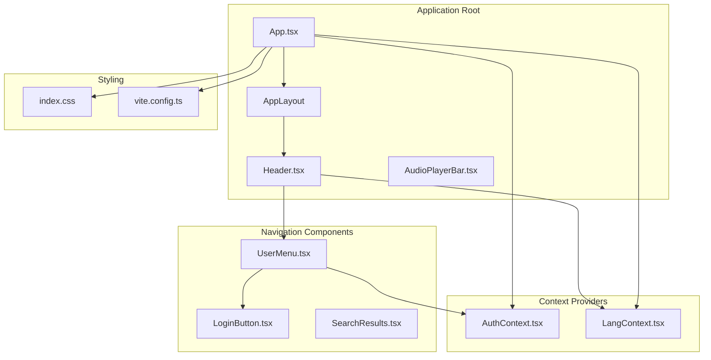
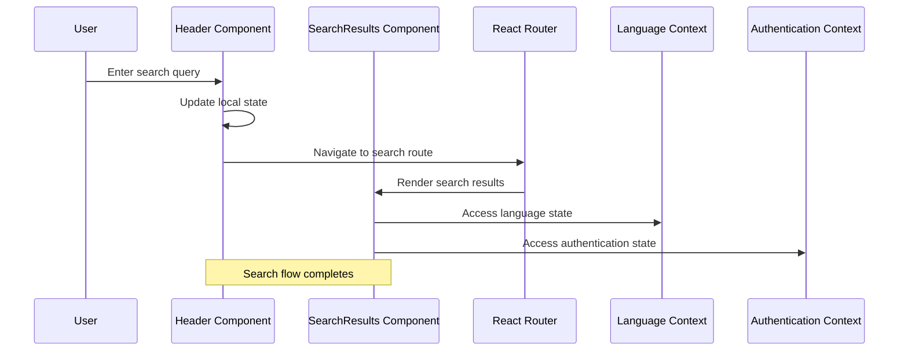
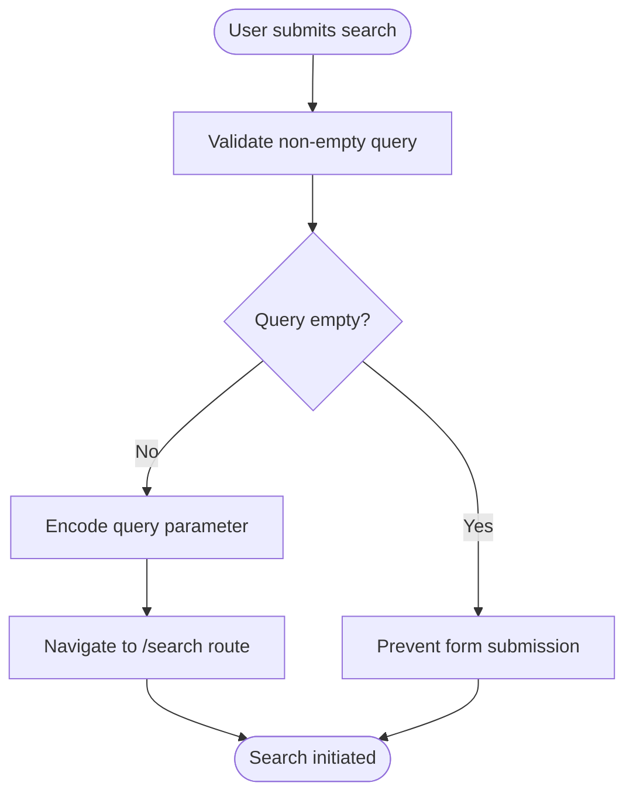
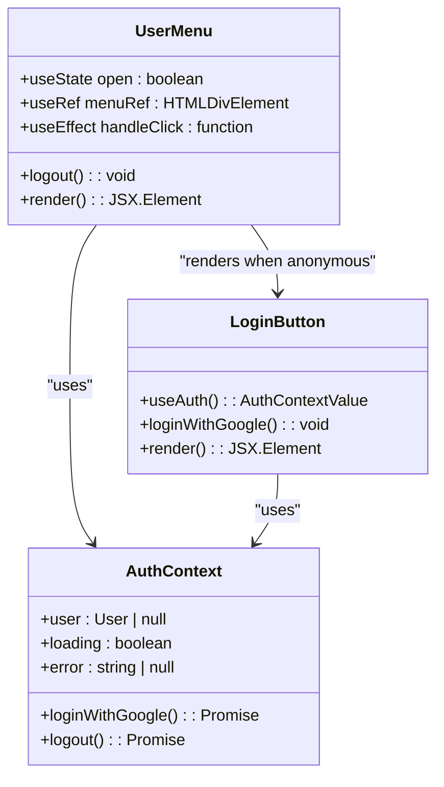
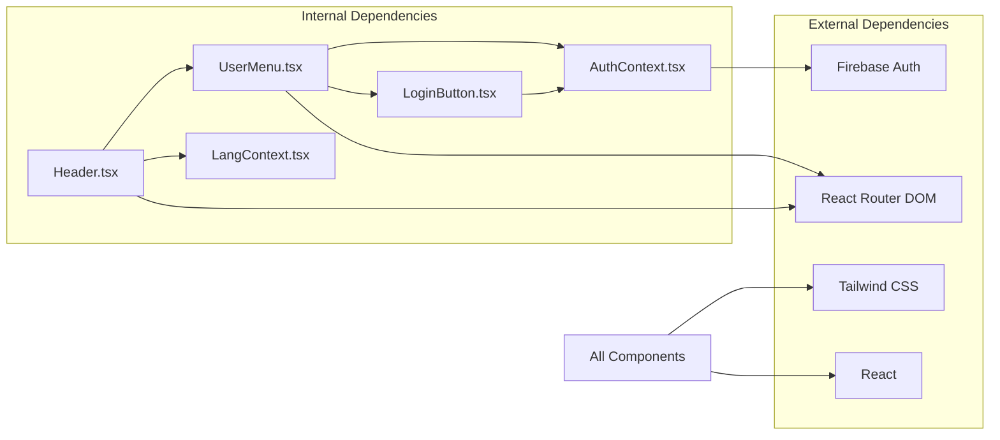

# Navigation Components

<cite>
**Referenced Files in This Document**
- [Header.tsx](file://src/components/Header.tsx)
- [UserMenu.tsx](file://src/components/UserMenu.tsx)
- [LoginButton.tsx](file://src/components/LoginButton.tsx)
- [AuthContext.tsx](file://src/context/AuthContext.tsx)
- [LangContext.tsx](file://src/context/LangContext.tsx)
- [App.tsx](file://src/App.tsx)
- [index.css](file://src/index.css)
- [vite.config.ts](file://vite.config.ts)
- [SearchResults.tsx](file://src/components/SearchResults.tsx)
</cite>

## Table of Contents
1. [Introduction](#introduction)
2. [Project Structure](#project-structure)
3. [Core Components](#core-components)
4. [Architecture Overview](#architecture-overview)
5. [Detailed Component Analysis](#detailed-component-analysis)
6. [Dependency Analysis](#dependency-analysis)
7. [Performance Considerations](#performance-considerations)
8. [Troubleshooting Guide](#troubleshooting-guide)
9. [Conclusion](#conclusion)

## Introduction
This document provides comprehensive documentation for the navigation components in the Quran Reader application, focusing on the Header, UserMenu, and LoginButton components. These components form the primary navigation interface, offering search functionality, user authentication management, and language switching capabilities. The documentation covers component architecture, prop interfaces, event handlers, styling customization, and integration patterns with the broader application ecosystem.

## Project Structure
The navigation components are organized within the components directory and integrate with context providers for authentication and language state management. The application uses React Router for navigation and Tailwind CSS for styling, with Vite serving as the build tool.

**Diagram sources**
- [App.tsx:22-40](file://src/App.tsx#L22-L40)
- [Header.tsx:1-68](file://src/components/Header.tsx#L1-L68)
- [UserMenu.tsx:1-79](file://src/components/UserMenu.tsx#L1-L79)
- [AuthContext.tsx:18-56](file://src/context/AuthContext.tsx#L18-L56)
- [LangContext.tsx:10-27](file://src/context/LangContext.tsx#L10-L27)

**Section sources**
- [App.tsx:1-56](file://src/App.tsx#L1-L56)
- [vite.config.ts:1-8](file://vite.config.ts#L1-L8)

## Core Components
The navigation system consists of three primary components that work together to provide seamless user experience:

### Header Component
The Header serves as the main navigation bar containing the application logo, search functionality, user menu, and language switching controls. It manages local state for search queries and integrates with the language context for internationalization support.

### UserMenu Component
The UserMenu handles user authentication state display and provides dropdown functionality for authenticated users. It manages click-outside detection, displays user profile information, and offers navigation links for bookmarks and logout functionality.

### LoginButton Component
The LoginButton provides Google authentication integration through Firebase, displaying loading states and error messages during authentication attempts. It integrates with the AuthContext to handle authentication flows.

**Section sources**
- [Header.tsx:6-68](file://src/components/Header.tsx#L6-L68)
- [UserMenu.tsx:6-79](file://src/components/UserMenu.tsx#L6-L79)
- [LoginButton.tsx:3-38](file://src/components/LoginButton.tsx#L3-L38)

## Architecture Overview
The navigation components follow a unidirectional data flow pattern with context providers managing global state. The architecture ensures separation of concerns while maintaining efficient communication between components.

**Diagram sources**
- [Header.tsx:11-16](file://src/components/Header.tsx#L11-L16)
- [SearchResults.tsx:19-25](file://src/components/SearchResults.tsx#L19-L25)
- [LangContext.tsx:29-31](file://src/context/LangContext.tsx#L29-L31)
- [AuthContext.tsx:58-62](file://src/context/AuthContext.tsx#L58-L62)

## Detailed Component Analysis

### Header Component Analysis
The Header component implements a sticky navigation bar with responsive design patterns and integrated search functionality.

#### Search Functionality Implementation
The search feature utilizes React Router's useNavigate hook to programmatically navigate to search results pages. The component maintains local state for the search query and prevents empty submissions.

**Diagram sources**
- [Header.tsx:11-16](file://src/components/Header.tsx#L11-L16)

#### Language Switching Mechanism
The language toggle provides bilingual support with persistent state management through localStorage integration. The component displays active language state with visual indicators.

#### Responsive Design Patterns
The Header employs Tailwind CSS utility classes for responsive behavior:
- Flexbox layout with automatic spacing distribution
- Minimum width constraints for content areas
- Overflow handling for long content
- Sticky positioning for persistent navigation

**Section sources**
- [Header.tsx:1-68](file://src/components/Header.tsx#L1-L68)
- [LangContext.tsx:12-27](file://src/context/LangContext.tsx#L12-L27)

### UserMenu Component Analysis
The UserMenu component provides comprehensive user authentication state management with sophisticated dropdown functionality.

#### Authentication State Handling
The component conditionally renders either the LoginButton for anonymous users or the authenticated user interface. It extracts user initials for display when avatar images are unavailable.

#### Dropdown Interaction Management
The component implements click-outside detection using useEffect cleanup patterns to prevent memory leaks. The dropdown menu includes user profile information and navigation options.

**Diagram sources**
- [UserMenu.tsx:6-79](file://src/components/UserMenu.tsx#L6-L79)
- [AuthContext.tsx:10-16](file://src/context/AuthContext.tsx#L10-L16)
- [LoginButton.tsx:3-38](file://src/components/LoginButton.tsx#L3-L38)

#### User Profile Display
The component generates user initials from display names and provides fallback avatar rendering. It includes navigation links for bookmarks and logout functionality.

**Section sources**
- [UserMenu.tsx:1-79](file://src/components/UserMenu.tsx#L1-L79)
- [AuthContext.tsx:18-56](file://src/context/AuthContext.tsx#L18-L56)

### LoginButton Component Analysis
The LoginButton component provides Google authentication integration through Firebase with comprehensive error handling and loading state management.

#### Google Authentication Integration
The component uses Firebase's signInWithPopup method to initiate Google OAuth flow. It handles loading states to prevent multiple simultaneous authentication attempts and displays error messages for failed authentication attempts.

#### Styling and Accessibility
The component includes accessibility attributes and follows consistent styling patterns with the application's design system. The Google branding icon is implemented as inline SVG for performance optimization.

**Section sources**
- [LoginButton.tsx:1-38](file://src/components/LoginButton.tsx#L1-L38)
- [AuthContext.tsx:33-49](file://src/context/AuthContext.tsx#L33-L49)

## Dependency Analysis
The navigation components demonstrate clean dependency relationships with clear separation of concerns and minimal coupling between components.

**Diagram sources**
- [Header.tsx:1-4](file://src/components/Header.tsx#L1-L4)
- [UserMenu.tsx:1-4](file://src/components/UserMenu.tsx#L1-L4)
- [LoginButton.tsx:1](file://src/components/LoginButton.tsx#L1)
- [AuthContext.tsx:2-8](file://src/context/AuthContext.tsx#L2-L8)
- [LangContext.tsx:1](file://src/context/LangContext.tsx#L1)

### Component Coupling Analysis
- **Header** depends on UserMenu and LangContext, maintaining loose coupling through React props
- **UserMenu** depends on AuthContext and conditionally renders LoginButton
- **LoginButton** depends solely on AuthContext for authentication functionality
- **Context Providers** are injected at the application root level, minimizing direct component dependencies

**Section sources**
- [App.tsx:42-54](file://src/App.tsx#L42-L54)
- [AuthContext.tsx:18-56](file://src/context/AuthContext.tsx#L18-L56)
- [LangContext.tsx:10-27](file://src/context/LangContext.tsx#L10-L27)

## Performance Considerations
The navigation components are designed with performance optimization in mind:

### State Management Efficiency
- Local state is scoped appropriately to minimize unnecessary re-renders
- Context providers use memoized values to prevent excessive re-renders
- Click-outside detection uses cleanup patterns to prevent memory leaks

### Rendering Optimization
- Conditional rendering prevents unnecessary component instantiation
- SVG icons are embedded inline for reduced HTTP requests
- Tailwind utility classes enable efficient styling without custom CSS overhead

### Authentication Flow Optimization
- Loading states prevent duplicate authentication attempts
- Error boundaries provide graceful degradation for authentication failures
- Persistent state management reduces authentication prompts

## Troubleshooting Guide

### Common Issues and Solutions

#### Authentication Problems
- **Issue**: Google authentication fails silently
- **Solution**: Check Firebase configuration and ensure proper OAuth redirect setup
- **Debugging**: Monitor console errors and verify AuthContext error state

#### Search Functionality Issues
- **Issue**: Search queries not being processed
- **Solution**: Verify React Router configuration and ensure SearchResults component is properly mounted
- **Debugging**: Check query parameter encoding and route handling

#### Language Switching Problems
- **Issue**: Language preference not persisting
- **Solution**: Verify localStorage availability and proper context provider setup
- **Debugging**: Check localStorage keys and context value propagation

#### Styling Issues
- **Issue**: Components not displaying correctly on mobile devices
- **Solution**: Review Tailwind CSS configuration and responsive utility classes
- **Debugging**: Inspect computed styles and verify CSS specificity

**Section sources**
- [AuthContext.tsx:33-49](file://src/context/AuthContext.tsx#L33-L49)
- [LangContext.tsx:12-27](file://src/context/LangContext.tsx#L12-L27)
- [Header.tsx:11-16](file://src/components/Header.tsx#L11-L16)

## Conclusion
The navigation components in the Quran Reader application demonstrate robust architecture patterns with clear separation of concerns, efficient state management, and comprehensive user experience features. The Header component provides essential navigation functionality with search capabilities and language switching, while the UserMenu and LoginButton components offer sophisticated authentication management. The components integrate seamlessly with React Router and Firebase, providing a solid foundation for the application's navigation system. The modular design allows for easy maintenance and future enhancements while maintaining optimal performance characteristics.