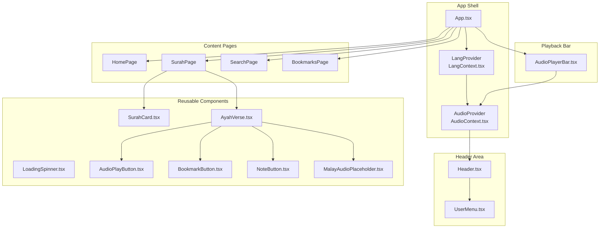
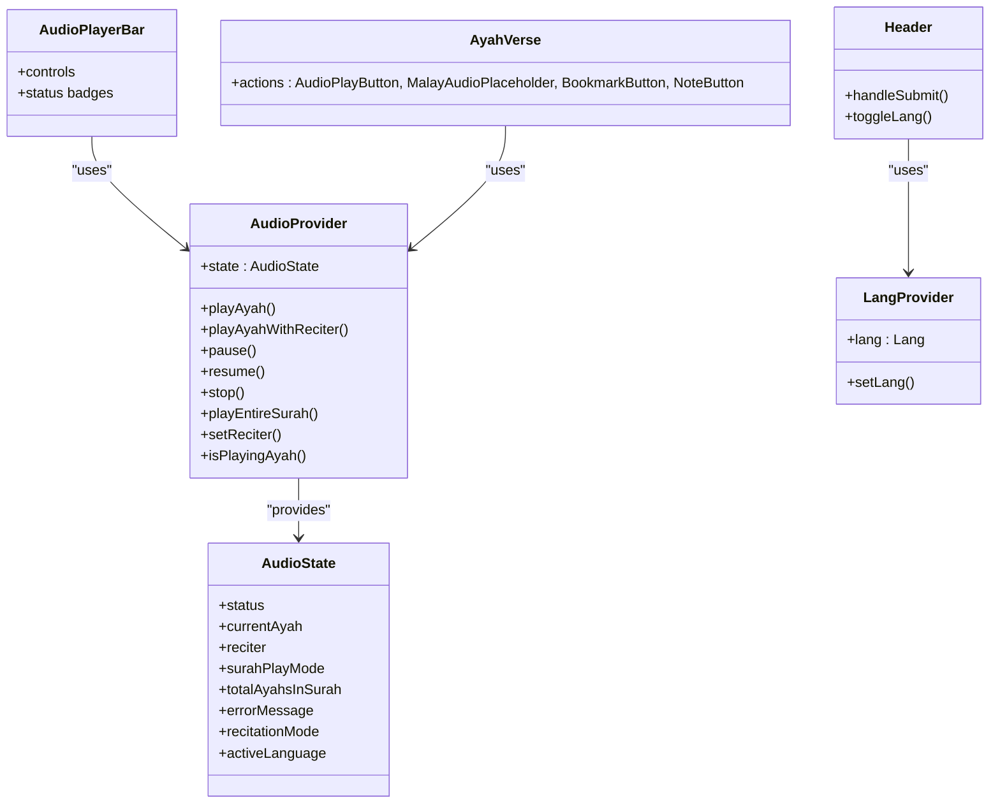
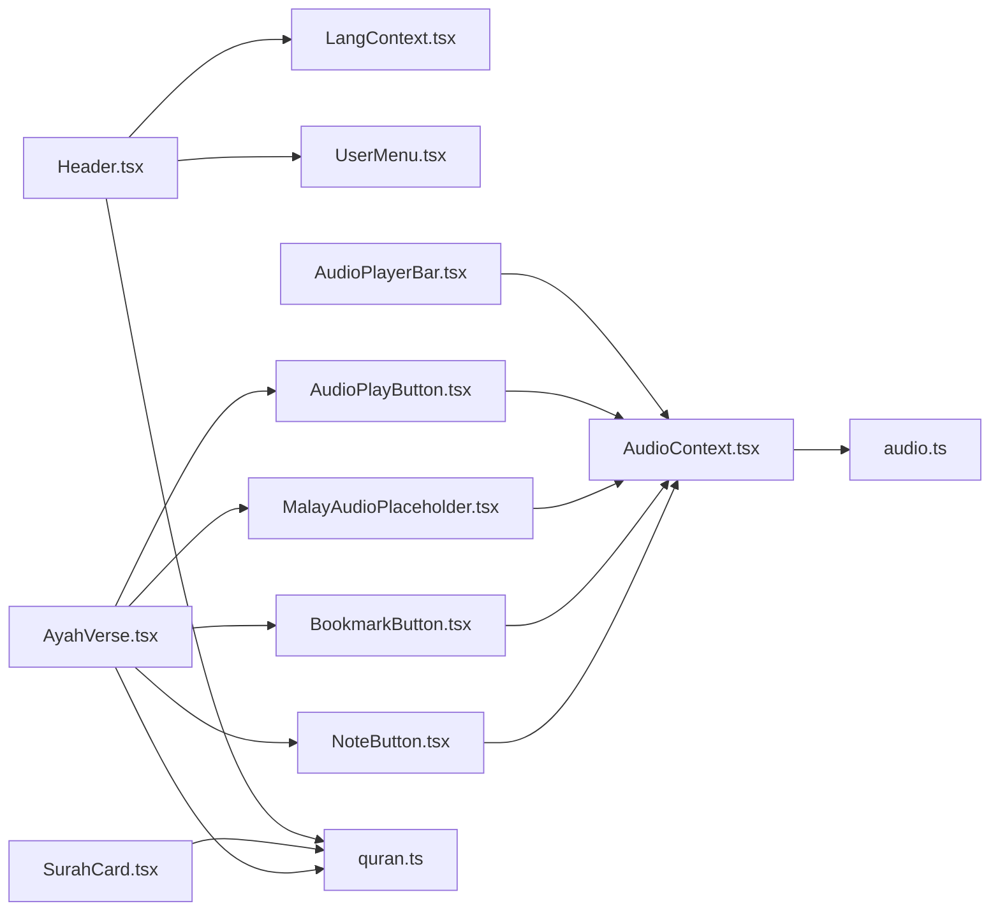

# UI Components & Library

<cite>
**Referenced Files in This Document**
- [Header.tsx](file://src/components/Header.tsx)
- [SurahCard.tsx](file://src/components/SurahCard.tsx)
- [AyahVerse.tsx](file://src/components/AyahVerse.tsx)
- [AudioPlayerBar.tsx](file://src/components/AudioPlayerBar.tsx)
- [LoadingSpinner.tsx](file://src/components/LoadingSpinner.tsx)
- [UserMenu.tsx](file://src/components/UserMenu.tsx)
- [AudioPlayButton.tsx](file://src/components/AudioPlayButton.tsx)
- [BookmarkButton.tsx](file://src/components/BookmarkButton.tsx)
- [NoteButton.tsx](file://src/components/NoteButton.tsx)
- [MalayAudioPlaceholder.tsx](file://src/components/MalayAudioPlaceholder.tsx)
- [AudioContext.tsx](file://src/context/AudioContext.tsx)
- [LangContext.tsx](file://src/context/LangContext.tsx)
- [quran.ts](file://src/types/quran.ts)
- [audio.ts](file://src/types/audio.ts)
- [App.tsx](file://src/App.tsx)
</cite>

## Table of Contents
1. [Introduction](#introduction)
2. [Project Structure](#project-structure)
3. [Core Components](#core-components)
4. [Architecture Overview](#architecture-overview)
5. [Detailed Component Analysis](#detailed-component-analysis)
6. [Dependency Analysis](#dependency-analysis)
7. [Performance Considerations](#performance-considerations)
8. [Accessibility Compliance](#accessibility-compliance)
9. [Responsive Design Guidelines](#responsive-design-guidelines)
10. [Style Customization and Theming](#style-customization-and-theming)
11. [Component Composition Patterns](#component-composition-patterns)
12. [Troubleshooting Guide](#troubleshooting-guide)
13. [Conclusion](#conclusion)

## Introduction
This document describes the reusable UI component library used in the Quran Reader application. It focuses on the visual appearance, behavior, user interaction patterns, props/events/slots/customization options, and integration of key components: Header, SurahCard, AyahVerse, AudioPlayerBar, and LoadingSpinner. It also covers component states, animations/transitions, responsive design, accessibility, and theming support.

## Project Structure
The UI components are organized under src/components and integrate with contexts for audio playback and language preferences. The main application wiring is in App.tsx, which composes providers and routes.

**Diagram sources**
- [App.tsx:42-56](file://src/App.tsx#L42-L56)
- [Header.tsx:6-68](file://src/components/Header.tsx#L6-L68)
- [UserMenu.tsx:6-79](file://src/components/UserMenu.tsx#L6-L79)
- [AudioPlayerBar.tsx:4-86](file://src/components/AudioPlayerBar.tsx#L4-L86)
- [SurahCard.tsx:4-42](file://src/components/SurahCard.tsx#L4-L42)
- [AyahVerse.tsx:14-63](file://src/components/AyahVerse.tsx#L14-L63)
- [AudioPlayButton.tsx:9-69](file://src/components/AudioPlayButton.tsx#L9-L69)
- [MalayAudioPlaceholder.tsx:10-74](file://src/components/MalayAudioPlaceholder.tsx#L10-L74)
- [BookmarkButton.tsx:10-49](file://src/components/BookmarkButton.tsx#L10-L49)
- [NoteButton.tsx:10-114](file://src/components/NoteButton.tsx#L10-L114)
- [AudioContext.tsx:40-396](file://src/context/AudioContext.tsx#L40-L396)
- [LangContext.tsx:12-32](file://src/context/LangContext.tsx#L12-L32)

**Section sources**
- [App.tsx:42-56](file://src/App.tsx#L42-L56)
- [Header.tsx:6-68](file://src/components/Header.tsx#L6-L68)
- [AudioContext.tsx:40-396](file://src/context/AudioContext.tsx#L40-L396)
- [LangContext.tsx:12-32](file://src/context/LangContext.tsx#L12-L32)

## Core Components
This section documents the five primary UI components and their roles.

- Header
  - Purpose: Application header with logo, search form, user menu, and language toggle.
  - Props: None.
  - Events: Form submission triggers navigation to search results.
  - Slots: None.
  - Interaction: Clicking language buttons toggles language state; clicking UserMenu opens dropdown; submitting the form navigates to search route.
  - Accessibility: Uses aria-labels and focus-visible affordances via Tailwind utilities.

- SurahCard
  - Purpose: Card representing a Surah with number badge, English name and translation, revelation type badge, Ayah count, and Arabic name.
  - Props: surah: SurahInfo.
  - Events: Navigation to Surah detail page on click.
  - Slots: None.
  - Interaction: Hover effects and subtle shadow transitions on hover.

- AyahVerse
  - Purpose: Renders a single Ayah with Arabic text, transliteration, and translation, plus action buttons (play, Malay audio, bookmark, note).
  - Props: arabicAyah, transliterationAyah, translationAyah, surahNumber.
  - Events: Delegated to child action components.
  - Slots: None.
  - Interaction: Action buttons reflect playback state and user authentication status.

- AudioPlayerBar
  - Purpose: Fixed bottom bar showing current Ayah, language badge, reciter selector, and playback controls.
  - Props: None.
  - Events: Play/pause/stop actions via context.
  - Slots: None.
  - Interaction: Visibility depends on audio status; displays loading indicator, play/pause button, and stop button; shows error message when applicable.

- LoadingSpinner
  - Purpose: Centered spinner for loading states.
  - Props: None.
  - Events: None.
  - Slots: None.
  - Interaction: Animated spin; centered vertically and horizontally.

**Section sources**
- [Header.tsx:6-68](file://src/components/Header.tsx#L6-L68)
- [SurahCard.tsx:4-42](file://src/components/SurahCard.tsx#L4-L42)
- [AyahVerse.tsx:14-63](file://src/components/AyahVerse.tsx#L14-L63)
- [AudioPlayerBar.tsx:4-86](file://src/components/AudioPlayerBar.tsx#L4-L86)
- [LoadingSpinner.tsx:1-8](file://src/components/LoadingSpinner.tsx#L1-L8)

## Architecture Overview
The UI components rely on two primary contexts:
- AudioContext: Manages playback state, reciter selection, recitation modes, and downloads/caching.
- LangContext: Manages language preference persisted in localStorage.

**Diagram sources**
- [AudioContext.tsx:40-396](file://src/context/AudioContext.tsx#L40-L396)
- [LangContext.tsx:12-32](file://src/context/LangContext.tsx#L12-L32)
- [Header.tsx:6-68](file://src/components/Header.tsx#L6-L68)
- [AudioPlayerBar.tsx:4-86](file://src/components/AudioPlayerBar.tsx#L4-L86)
- [AyahVerse.tsx:14-63](file://src/components/AyahVerse.tsx#L14-L63)

## Detailed Component Analysis

### Header
- Visual appearance: Sticky header with logo, centered search input, UserMenu, and language toggle.
- Behavior: Handles form submission to navigate to search results; toggles language via LangContext.
- User interactions:
  - Submitting the search form navigates to "/search?q=...".
  - Clicking language buttons switches between Malay and English.
  - Clicking UserMenu toggles dropdown; clicking outside closes it.
- Props: None.
- Events: Form submit handler.
- Accessibility: aria-labels on interactive elements; focus ring applied via Tailwind utilities.

Usage example (conceptual):
- Place Header at the top of the layout; it automatically wires to LangContext and UserMenu.

**Section sources**
- [Header.tsx:6-68](file://src/components/Header.tsx#L6-L68)
- [UserMenu.tsx:6-79](file://src/components/UserMenu.tsx#L6-L79)
- [LangContext.tsx:12-32](file://src/context/LangContext.tsx#L12-L32)

### SurahCard
- Visual appearance: Horizontal card with Surah number badge, English name and translation, revelation type badge, Ayah count, and Arabic name aligned to the right.
- Behavior: Navigates to the Surah detail page when clicked.
- User interactions: Hover effects change shadow and background tint.
- Props:
  - surah: SurahInfo (fields include number, name, englishName, englishNameTranslation, numberOfAyahs, revelationType).
- Events: Navigation on click.
- Accessibility: Uses semantic Link and appropriate text contrast.

Usage example (conceptual):
- Render a list of SurahCard components using SurahInfo data.

**Section sources**
- [SurahCard.tsx:4-42](file://src/components/SurahCard.tsx#L4-L42)
- [quran.ts:1-8](file://src/types/quran.ts#L1-L8)

### AyahVerse
- Visual appearance: Ayah number badge, action buttons row, Arabic text (RTL), transliteration, and translation paragraphs.
- Behavior: Composes child action components; reflects current playback and user state.
- User interactions:
  - AudioPlayButton toggles play/pause/resume for the Ayah.
  - MalayAudioPlaceholder plays Malay recitation with a temporary reciter.
  - BookmarkButton toggles bookmarks for authenticated users.
  - NoteButton opens a modal-like editor for notes.
- Props:
  - arabicAyah: Ayah
  - transliterationAyah: Ayah
  - translationAyah: Ayah
  - surahNumber: number
- Events: Delegated to child components.
- Accessibility: Proper aria-labels on buttons; focus management handled by child components.

Usage example (conceptual):
- Render a list of AyahVerse components for a Surah page.

**Section sources**
- [AyahVerse.tsx:14-63](file://src/components/AyahVerse.tsx#L14-L63)
- [AudioPlayButton.tsx:9-69](file://src/components/AudioPlayButton.tsx#L9-L69)
- [MalayAudioPlaceholder.tsx:10-74](file://src/components/MalayAudioPlaceholder.tsx#L10-L74)
- [BookmarkButton.tsx:10-49](file://src/components/BookmarkButton.tsx#L10-L49)
- [NoteButton.tsx:10-114](file://src/components/NoteButton.tsx#L10-L114)
- [quran.ts:10-17](file://src/types/quran.ts#L10-L17)

### AudioPlayerBar
- Visual appearance: Fixed bottom bar with current Ayah info, language badge, reciter selector, and controls (play/pause, stop).
- Behavior: Visible only when audio status is not idle; shows loading indicator during fetch; displays error messages; updates based on playback state.
- User interactions:
  - Play/Pause toggles playback.
  - Stop halts playback and resets state.
  - ReciterSelector allows selecting reciter.
- Props: None.
- Events: Control handlers call context methods.
- Accessibility: Buttons have aria-labels; focus rings visible.

Usage example (conceptual):
- Render AudioPlayerBar at the bottom of the app layout; it auto-hides when idle.

**Section sources**
- [AudioPlayerBar.tsx:4-86](file://src/components/AudioPlayerBar.tsx#L4-L86)
- [AudioContext.tsx:40-396](file://src/context/AudioContext.tsx#L40-L396)

### LoadingSpinner
- Visual appearance: Centered spinner with circular animation.
- Behavior: Provides a consistent loading indicator.
- User interactions: None.
- Props: None.
- Events: None.
- Accessibility: Animated SVG; suitable for centering in containers.

Usage example (conceptual):
- Wrap async operations with LoadingSpinner while data is being fetched.

**Section sources**
- [LoadingSpinner.tsx:1-8](file://src/components/LoadingSpinner.tsx#L1-L8)

### Supporting Components Involved in AyahVerse
- AudioPlayButton
  - Purpose: Toggle play/pause/resume for a specific Ayah; disabled when not authenticated.
  - Props: surahNumber, ayahNumberInSurah.
  - Events: Click handler invokes context methods.
  - Accessibility: aria-label reflects current state.

- MalayAudioPlaceholder
  - Purpose: Play Malay recitation for the same Ayah without changing global reciter.
  - Props: surahNumber, ayahNumberInSurah.
  - Events: Click handler invokes context method with Malay reciter.

- BookmarkButton
  - Purpose: Toggle bookmark for authenticated users.
  - Props: surahNumber, ayahNumber, arabicText.
  - Events: Click handler invokes bookmark toggle.

- NoteButton
  - Purpose: Open inline editor to save/delete notes for an Ayah.
  - Props: surahNumber, ayahNumber.
  - Events: Save/Delete handlers manage note lifecycle.

**Section sources**
- [AudioPlayButton.tsx:9-69](file://src/components/AudioPlayButton.tsx#L9-L69)
- [MalayAudioPlaceholder.tsx:10-74](file://src/components/MalayAudioPlaceholder.tsx#L10-L74)
- [BookmarkButton.tsx:10-49](file://src/components/BookmarkButton.tsx#L10-L49)
- [NoteButton.tsx:10-114](file://src/components/NoteButton.tsx#L10-L114)

## Dependency Analysis
The components depend on shared contexts and types. The diagram below shows key dependencies.

**Diagram sources**
- [Header.tsx:6-68](file://src/components/Header.tsx#L6-L68)
- [UserMenu.tsx:6-79](file://src/components/UserMenu.tsx#L6-L79)
- [AudioPlayerBar.tsx:4-86](file://src/components/AudioPlayerBar.tsx#L4-L86)
- [AyahVerse.tsx:14-63](file://src/components/AyahVerse.tsx#L14-L63)
- [AudioPlayButton.tsx:9-69](file://src/components/AudioPlayButton.tsx#L9-L69)
- [MalayAudioPlaceholder.tsx:10-74](file://src/components/MalayAudioPlaceholder.tsx#L10-L74)
- [BookmarkButton.tsx:10-49](file://src/components/BookmarkButton.tsx#L10-L49)
- [NoteButton.tsx:10-114](file://src/components/NoteButton.tsx#L10-L114)
- [AudioContext.tsx:40-396](file://src/context/AudioContext.tsx#L40-L396)
- [audio.ts:1-41](file://src/types/audio.ts#L1-L41)
- [quran.ts:1-64](file://src/types/quran.ts#L1-L64)

**Section sources**
- [AudioContext.tsx:40-396](file://src/context/AudioContext.tsx#L40-L396)
- [audio.ts:1-41](file://src/types/audio.ts#L1-L41)
- [quran.ts:1-64](file://src/types/quran.ts#L1-L64)

## Performance Considerations
- Lazy rendering: Header and AudioPlayerBar are conditionally rendered based on app state to minimize DOM overhead.
- Minimal re-renders: Child components use memoization patterns and stable callbacks where appropriate.
- Caching: AudioContext caches audio blobs to reduce network requests and improve responsiveness.
- Event cleanup: AudioContext clears event handlers before switching tracks to avoid memory leaks.

[No sources needed since this section provides general guidance]

## Accessibility Compliance
- Keyboard navigation: Interactive elements receive focus; aria-labels describe actions.
- Screen reader support: Buttons and menus include meaningful labels; RTL text is marked appropriately.
- Focus management: Dropdown menus close on outside clicks; focus remains predictable.
- Contrast and readability: Tailwind utilities ensure sufficient color contrast for text and controls.

[No sources needed since this section provides general guidance]

## Responsive Design Guidelines
- Flexible layouts: Components use flexbox and gap utilities to adapt to varying screen sizes.
- Breakpoints: Max-width constraints and padding ensure readable content on mobile and desktop.
- Typography: Relative units and line-heights maintain readability across devices.
- Touch targets: Buttons meet minimum touch target sizes for mobile usability.

[No sources needed since this section provides general guidance]

## Style Customization and Theming
- Utility-first design: Tailwind classes define colors, spacing, typography, and states.
- Semantic color roles: Emerald, stone, amber, and blue palettes are used consistently for actions, backgrounds, and accents.
- Dark mode considerations: The codebase uses light palettes; dark mode would require adding dark variants to color classes.
- Global overrides: To customize, replace or extend Tailwind classes on component wrappers.

[No sources needed since this section provides general guidance]

## Component Composition Patterns
- Provider pattern: App.tsx composes LangProvider, DownloadConsentProvider, and AudioProvider to supply context to the entire tree.
- Composition of actions: AyahVerse composes multiple action components to encapsulate related behaviors.
- Conditional rendering: AudioPlayerBar hides itself when idle; Header toggles language and user menu based on state.

**Section sources**
- [App.tsx:42-56](file://src/App.tsx#L42-L56)
- [AyahVerse.tsx:14-63](file://src/components/AyahVerse.tsx#L14-L63)

## Troubleshooting Guide
- Audio fails to load
  - Symptom: Error message displayed in AudioPlayerBar.
  - Causes: Network issues, user not authenticated, or missing cached audio.
  - Actions: Check connection, sign in, retry; verify Firebase storage permissions.

- Playback does not start
  - Symptom: Loading spinner appears but playback does not begin.
  - Causes: Browser autoplay policies, audio errors, or invalid blob.
  - Actions: Allow autoplay, retry, inspect console logs.

- Language toggle not persisting
  - Symptom: Language resets after refresh.
  - Causes: Local storage not available or cleared.
  - Actions: Verify localStorage availability; ensure LangProvider initializes from saved value.

- User menu not closing
  - Symptom: Dropdown remains open after clicking outside.
  - Causes: Event listener not attached or removed prematurely.
  - Actions: Confirm effect cleanup and event registration.

**Section sources**
- [AudioPlayerBar.tsx:34-36](file://src/components/AudioPlayerBar.tsx#L34-L36)
- [AudioContext.tsx:294-300](file://src/context/AudioContext.tsx#L294-L300)
- [LangContext.tsx:18-20](file://src/context/LangContext.tsx#L18-L20)
- [UserMenu.tsx:11-19](file://src/components/UserMenu.tsx#L11-L19)

## Conclusion
The UI component library emphasizes composability, clear state management via contexts, and consistent styling with Tailwind. Components are designed for accessibility, responsiveness, and efficient performance. Extending styles and behavior follows the established patterns of props, context usage, and provider composition.