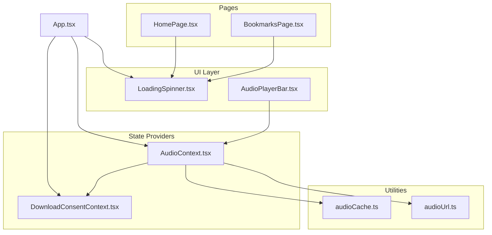
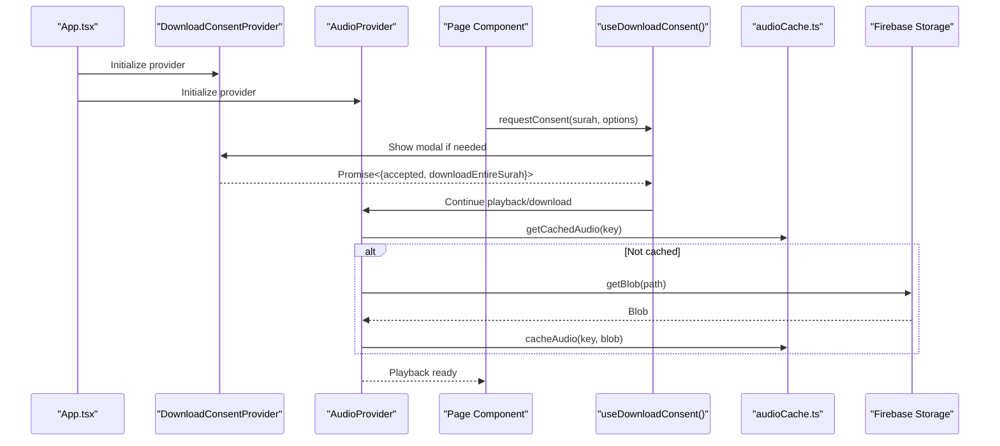
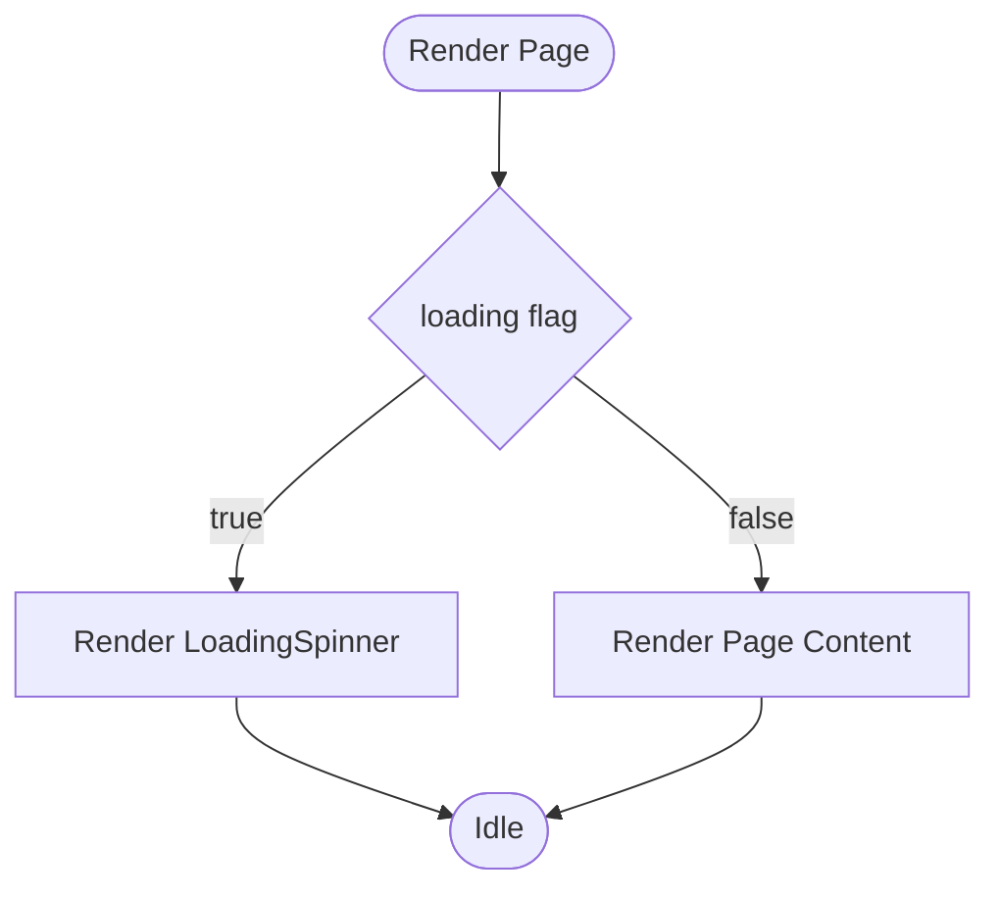
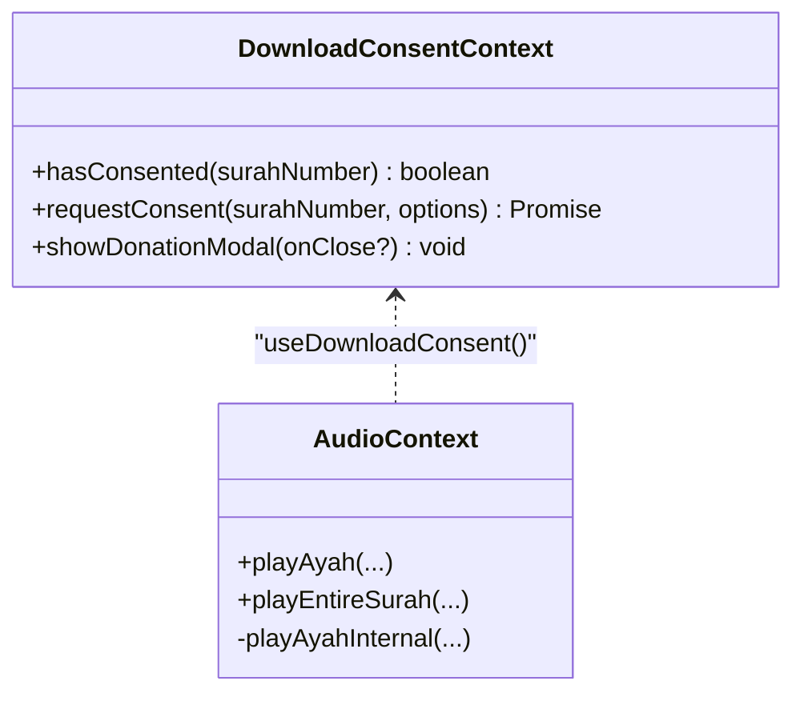
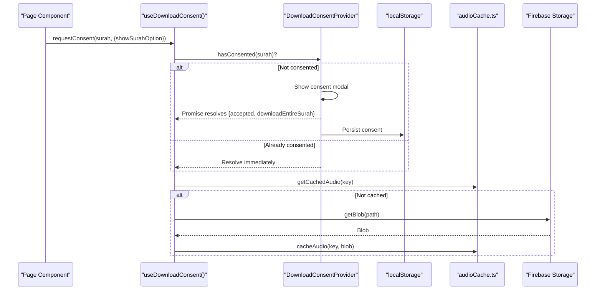
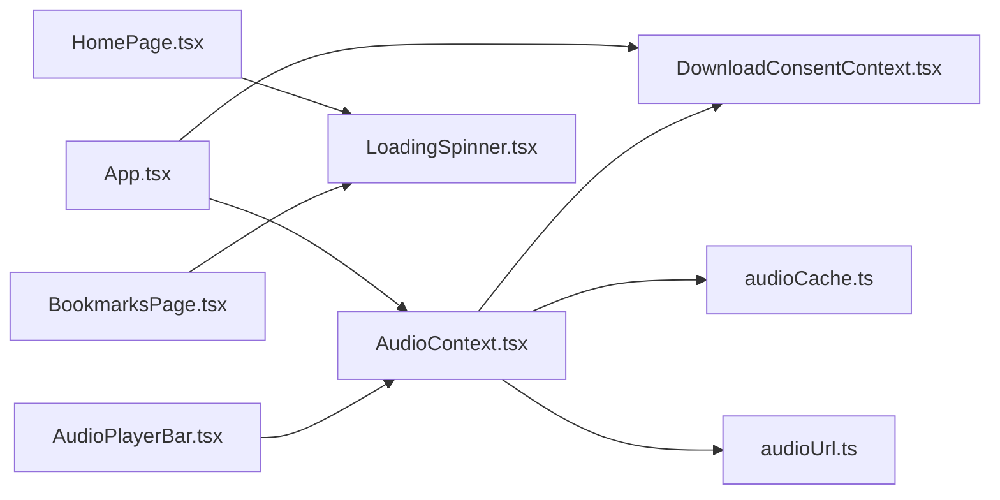

# Utility Components

<cite>
**Referenced Files in This Document**
- [LoadingSpinner.tsx](file://src/components/LoadingSpinner.tsx)
- [DownloadConsentContext.tsx](file://src/context/DownloadConsentContext.tsx)
- [AudioContext.tsx](file://src/context/AudioContext.tsx)
- [AudioPlayerBar.tsx](file://src/components/AudioPlayerBar.tsx)
- [App.tsx](file://src/App.tsx)
- [HomePage.tsx](file://src/pages/HomePage.tsx)
- [BookmarksPage.tsx](file://src/pages/BookmarksPage.tsx)
- [audioCache.ts](file://src/utils/audioCache.ts)
- [audioUrl.ts](file://src/utils/audioUrl.ts)
</cite>

## Table of Contents
1. [Introduction](#introduction)
2. [Project Structure](#project-structure)
3. [Core Components](#core-components)
4. [Architecture Overview](#architecture-overview)
5. [Detailed Component Analysis](#detailed-component-analysis)
6. [Dependency Analysis](#dependency-analysis)
7. [Performance Considerations](#performance-considerations)
8. [Troubleshooting Guide](#troubleshooting-guide)
9. [Conclusion](#conclusion)

## Introduction
This document provides comprehensive documentation for two utility components: LoadingSpinner and DownloadConsentContext. It explains their roles, visual states, animation patterns, integration with async operations, and their relationship to the broader application state management system. Special attention is given to how DownloadConsentContext manages user consent for audio downloads and privacy considerations, and how LoadingSpinner communicates loading states during asynchronous operations.

## Project Structure
The utility components are part of a React application with a clear separation of concerns:
- UI utilities live under src/components
- Global state providers live under src/context
- Page components demonstrate usage patterns
- Shared utilities for caching and URLs live under src/utils

**Diagram sources**
- [App.tsx:42-54](file://src/App.tsx#L42-L54)
- [DownloadConsentContext.tsx:16-249](file://src/context/DownloadConsentContext.tsx#L16-L249)
- [AudioContext.tsx:40-389](file://src/context/AudioContext.tsx#L40-L389)
- [LoadingSpinner.tsx:1-7](file://src/components/LoadingSpinner.tsx#L1-L7)
- [AudioPlayerBar.tsx:1-85](file://src/components/AudioPlayerBar.tsx#L1-L85)
- [HomePage.tsx:5-8](file://src/pages/HomePage.tsx#L5-L8)
- [BookmarksPage.tsx:7-23](file://src/pages/BookmarksPage.tsx#L7-L23)
- [audioCache.ts:1-153](file://src/utils/audioCache.ts#L1-L153)
- [audioUrl.ts:13-36](file://src/utils/audioUrl.ts#L13-L36)

**Section sources**
- [App.tsx:42-54](file://src/App.tsx#L42-L54)

## Core Components
This section introduces the two components and their primary responsibilities:
- LoadingSpinner: A lightweight visual indicator for asynchronous operations across pages.
- DownloadConsentContext: A provider and hook that manage user consent for audio downloads, persist consent decisions, and coordinate donation prompts.

**Section sources**
- [LoadingSpinner.tsx:1-7](file://src/components/LoadingSpinner.tsx#L1-L7)
- [DownloadConsentContext.tsx:3-10](file://src/context/DownloadConsentContext.tsx#L3-L10)

## Architecture Overview
The application initializes global providers at the root level. DownloadConsentContext wraps the app and exposes a context API for consent and donation modals. AudioContext depends on DownloadConsentContext to enforce consent policies and integrates with caching and Firebase Storage for audio delivery. LoadingSpinner appears in page components to indicate loading states.

**Diagram sources**
- [App.tsx:42-54](file://src/App.tsx#L42-L54)
- [DownloadConsentContext.tsx:28-48](file://src/context/DownloadConsentContext.tsx#L28-L48)
- [AudioContext.tsx:104-199](file://src/context/AudioContext.tsx#L104-L199)
- [audioCache.ts:46-60](file://src/utils/audioCache.ts#L46-L60)
- [audioUrl.ts:13-22](file://src/utils/audioUrl.ts#L13-L22)

## Detailed Component Analysis

### LoadingSpinner
LoadingSpinner is a minimal presentational component that renders a centered spinner. It is used across page components to communicate asynchronous operations.

- Visual states and animation:
  - Static layout with centered alignment
  - Circular spinner using Tailwind classes for sizing and border styling
  - Animation via Tailwind animate-spin utility
- Integration with async operations:
  - Pages conditionally render LoadingSpinner while data is loading
  - Typical usage pattern checks a loading flag and renders the spinner when true
- Usage patterns:
  - HomePage displays the spinner while fetching surah lists
  - BookmarksPage shows the spinner while bookmark data loads
  - Other pages (SearchPage, SurahPage) also use the spinner during async operations
- Performance implications:
  - Lightweight component with minimal re-renders
  - Ideal for transient loading states; avoid long-term persistence
- Best practices:
  - Pair with appropriate loading flags from hooks
  - Keep messages contextual if needed (not present in current implementation)

**Diagram sources**
- [HomePage.tsx:5-8](file://src/pages/HomePage.tsx#L5-L8)
- [BookmarksPage.tsx:7-23](file://src/pages/BookmarksPage.tsx#L7-L23)
- [LoadingSpinner.tsx:1-7](file://src/components/LoadingSpinner.tsx#L1-L7)

**Section sources**
- [LoadingSpinner.tsx:1-7](file://src/components/LoadingSpinner.tsx#L1-L7)
- [HomePage.tsx:5-8](file://src/pages/HomePage.tsx#L5-L8)
- [BookmarksPage.tsx:7-23](file://src/pages/BookmarksPage.tsx#L7-L23)

### DownloadConsentContext
DownloadConsentContext manages user consent for audio downloads and coordinates donation prompts. It provides three primary APIs: hasConsented, requestConsent, and showDonationModal.

- Consent model:
  - Persists consent per surah using localStorage with a prefixed key
  - requestConsent returns a Promise resolving to { accepted, downloadEntireSurah }
  - Supports optional surah-level choice (ayah vs entire surah) or surah-play mode without options
- Donation integration:
  - Triggers a donation modal after consent for entire-sura downloads or in surah-play mode
  - Donation modal supports closing callbacks for orchestration
- Modal rendering:
  - Renders a consent dialog when consent is missing or options are enabled
  - Renders a donation modal with QR code and explanatory text
- Privacy considerations:
  - Consent decisions are stored locally (localStorage)
  - No personal data is transmitted; only consent metadata is persisted
- Integration with AudioContext:
  - AudioContext calls requestConsent before downloading audio
  - Uses showDonationModal to prompt donations during surah play mode
- Error handling:
  - Handles user declines gracefully by resolving the promise with accepted=false
  - Ensures state cleanup and promise resolution on accept/decline

**Diagram sources**
- [DownloadConsentContext.tsx:3-10](file://src/context/DownloadConsentContext.tsx#L3-L10)
- [AudioContext.tsx:16-25](file://src/context/AudioContext.tsx#L16-L25)

**Diagram sources**
- [DownloadConsentContext.tsx:24-48](file://src/context/DownloadConsentContext.tsx#L24-L48)
- [AudioContext.tsx:104-199](file://src/context/AudioContext.tsx#L104-L199)
- [audioCache.ts:46-60](file://src/utils/audioCache.ts#L46-L60)
- [audioUrl.ts:13-22](file://src/utils/audioUrl.ts#L13-L22)

**Section sources**
- [DownloadConsentContext.tsx:3-10](file://src/context/DownloadConsentContext.tsx#L3-L10)
- [DownloadConsentContext.tsx:16-249](file://src/context/DownloadConsentContext.tsx#L16-L249)
- [AudioContext.tsx:104-199](file://src/context/AudioContext.tsx#L104-L199)

## Dependency Analysis
The components and providers depend on each other as follows:
- App.tsx composes DownloadConsentProvider and AudioProvider at the root
- AudioContext depends on DownloadConsentContext for consent and donation orchestration
- AudioContext integrates with audioCache.ts and audioUrl.ts for caching and storage path building
- Page components import and use LoadingSpinner for loading states
- AudioPlayerBar consumes AudioContext state and displays loading indicators

**Diagram sources**
- [App.tsx:42-54](file://src/App.tsx#L42-L54)
- [AudioContext.tsx:40-389](file://src/context/AudioContext.tsx#L40-L389)
- [DownloadConsentContext.tsx:16-249](file://src/context/DownloadConsentContext.tsx#L16-L249)
- [audioCache.ts:1-153](file://src/utils/audioCache.ts#L1-L153)
- [audioUrl.ts:13-36](file://src/utils/audioUrl.ts#L13-L36)
- [HomePage.tsx:5-8](file://src/pages/HomePage.tsx#L5-L8)
- [BookmarksPage.tsx:7-23](file://src/pages/BookmarksPage.tsx#L7-L23)
- [AudioPlayerBar.tsx:1-85](file://src/components/AudioPlayerBar.tsx#L1-L85)

**Section sources**
- [App.tsx:42-54](file://src/App.tsx#L42-L54)
- [AudioContext.tsx:40-389](file://src/context/AudioContext.tsx#L40-L389)

## Performance Considerations
- LoadingSpinner
  - Minimal DOM and no heavy computations; negligible performance impact
  - Use only during short-lived async operations to avoid user confusion
- DownloadConsentContext
  - localStorage operations are synchronous and fast; overhead is minimal
  - Avoid excessive modal rendering; reuse consent where possible
- AudioContext and caching
  - Caching reduces network usage and improves playback latency
  - IndexedDB operations are asynchronous; ensure proper error handling and fallbacks
  - Consider cache size limits and periodic maintenance to prevent unbounded growth

[No sources needed since this section provides general guidance]

## Troubleshooting Guide
- LoadingSpinner does not appear
  - Verify the loading flag is true during async operations
  - Confirm the component is rendered conditionally based on the flag
- Consent modal not appearing
  - Ensure requestConsent is called with the correct surah number and options
  - Check that hasConsented returns false for the target surah
- Donation modal not showing
  - Confirm downloadEntireSurah is true or surah-play mode is active
  - Verify showDonationModal is invoked after consent acceptance
- Audio fails to load
  - Check network connectivity and Firebase Storage permissions
  - Inspect error messages from AudioContext state
  - Verify cache integrity and IndexedDB availability

**Section sources**
- [AudioPlayerBar.tsx:34-36](file://src/components/AudioPlayerBar.tsx#L34-L36)
- [AudioContext.tsx:223-229](file://src/context/AudioContext.tsx#L223-L229)

## Conclusion
LoadingSpinner and DownloadConsentContext serve distinct but complementary roles in the application. LoadingSpinner communicates transient loading states effectively, while DownloadConsentContext enforces user consent for audio downloads and integrates donation prompts. Together with AudioContext and supporting utilities, they form a cohesive system for managing audio playback, caching, and user consent with clear privacy boundaries.